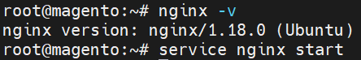
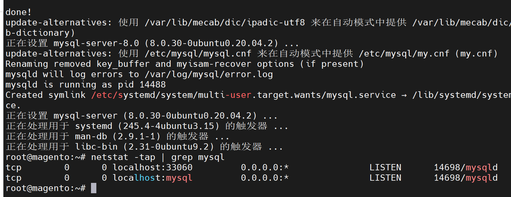
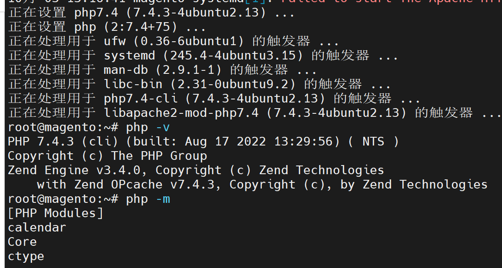
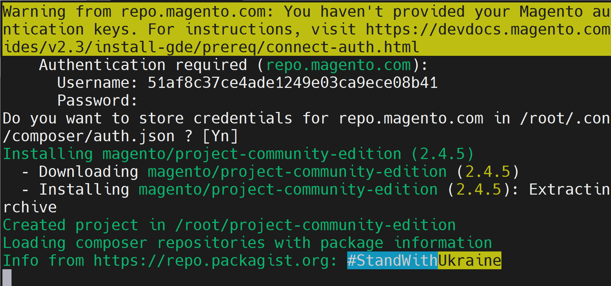
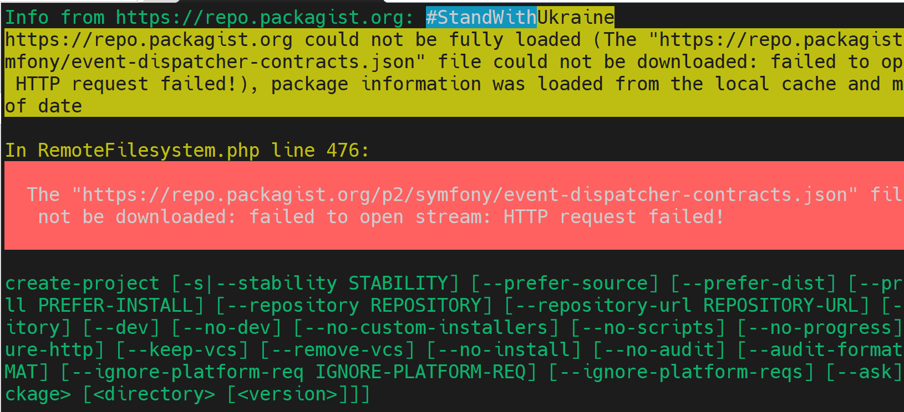

# ElasticSearch+Magento

文档：https://devdocs.magento.com/guides/v2.4/install-gde/composer.html

## 1.安装

### 1.1.搭建LNMP环境

LNMP即Linux+Nginx+Mysql+Php。

- **安装Nginx**

```shell
apt-get install nginx
nginx -v
# 启动
service nginx start
```



- **安装mysql**

```shell
apt-get install mysql-server     	# 安装Mysql
netstat -tap | grep mysql			# 检测安装成功与否
systemctl start mysql.service				# 启动
```



​	mysql首次启动的时候，会生成一个临时密码，存放在/var/log/mysqld.log，我们先把它找出来，使用它登录mysql，并修改成我们自己想要的且符合策略（至少包含一个大写字母，一个小写字母，一位数字和一个特殊字符，并且密码总长度至少为8个字符）的密码。

```shell
mysql -uroot -p
# 成功登录到mysql后，就可以修改密码了
ALTER  USER  'root'@'localhost'  IDENTIFIED  BY  'NewPassword4!';
```

密码修改完成后，输入exit，退出mysql，安装php。


- **安装PHP**

```shell
apt-get install php				# 安装
php -v							# 查看版本
php -m							# 查看启用的模块
```




### 1.2.安装ElasticSearch

```shell
# 1.安装jdk和配置PATH
sudo apt-cache search openjdk
sudo apt-get install openjdk-11-jre openjdk-11-jdk
java -version

export JAVA_HOME=/usr/lib/jvm/java-11-openjdk-amd64/
echo $JAVA_HOME

# 安装ES
curl -fsSL https://artifacts.elastic.co/GPG-KEY-elasticsearch | sudo apt-key add -

echo "deb https://artifacts.elastic.co/packages/7.x/apt stable main" | sudo tee -a /etc/apt/sources.list.d/elastic-7.x.list

sudo apt-get update

sudo apt install elasticsearch

# 配置
vim /etc/elasticsearch/elasticsearch.yml
# 放开注释并配置
cluster.name: my-application

node.name: magento

path.data: /var/lib/elasticsearch

path.logs: /var/log/elasticsearch
# 上面这行下面加下面这一行
network.publish_host: 127.0.0.1

network.host: 127.0.0.1

discovery.seed_hosts: []


http.port: 9200

cluster.initial_master_nodes: 127.0.0.1


# 启动ES
sudo systemctl start elasticsearch

#检测ES
curl -XGET 'http://localhost:9200'
curl http://localhost:9200/_cluster/health?pretty
```


### 1.3.安装Magento

需要安装的PHP扩展：

- bcmath
- **ctype**
- **curl**
- **dom**
- **gd**
- **hash**
- **iconv**
- intl
- **mbstring**
- **openssl**
- pdo_mysql
- **simplexml**
- soap
- **xsl**
- zip
- **libxml**

php -m

安装扩展包：

```shell
sudo apt-get install php-curl
sudo apt-get install php-gd
sudo apt-get install php-mbstring


php 查看 php扩展包 php -m 然后具体可以通过管道grep进行搜索了

php --ini  查看php cli 命令行的路径信息
```


```shell
# 检测配置
php -v
mysql -v

# 没有则创建，为安装magento目录
cd /var/www/html/magento240

# 全局安装composer
sudo curl -sS https://getcomposer.org/installer | php
sudo mv composer.phar /usr/local/bin/composer

# --ignore-platform-reqs参数为忽略错误，强制安装,不建议root用户安装
composer create-project --repository-url=https://repo.magento.com/ magento/project-community-edition  --ignore-platform-reqs
# 上面的下载过程很漫长，请耐心等待
# 测试账号
公钥作为用户名登录：51af8c37ce4ade1249e03ca9ece08b41
私钥作为密码登录：a0bc39e063977a2c8d9e60637430c418

# 把/var/www/html/magento240/project-community-edition的24个文件全部剪切到/var/www/html/magento240/

sudo chmod -R 777 ./

# 创建数据库
echo "CREATE DATABASE magento240" | mysql -u root -p

# 设置权限
cd /var/www/html/magento240
find var generated vendor pub/static pub/media app/etc -type f -exec chmod g+w {} +
find var generated vendor pub/static pub/media app/etc -type d -exec chmod g+ws {} +
chown -R :www-data . # Ubuntu
chmod u+x bin/magento

# 下载magento，可根据情况修改参数值
bin/magento setup:install \
--base-url=http://127.0.0.1/magento240 \
--db-host=localhost \
--db-name=magento240 \
--db-user=root \
--db-password=root \
--admin-firstname=admin \
--admin-lastname=admin \
--admin-email=admin@admin.com \
--admin-user=admin \
--admin-password=admin123 \
--language=en_US \
--currency=USD \
--timezone=America/Chicago \
--use-rewrites=1 \
--search-engine=elasticsearch7 \
--elasticsearch-host=es-host.example.com \
--elasticsearch-port=9200 \
--elasticsearch-index-prefix=magento2 \
--elasticsearch-timeout=15
```


```shell
sudo php -dmemory_limit=-1 bin/magento setup:upgrade

sudo php -dmemory_limit=-1 bin/magento setup:static-content:deploy -f

sudo php -dmemory_limit=-1 bin/magento indexer:reindex

sudo php -dmemory_limit=-1 bin/magento cache:clean

sudo php -dmemory_limit=-1 bin/magento cache:flush 

sudo chmod -R 777 ./
```


访问：http://127.0.0.1/magento240




