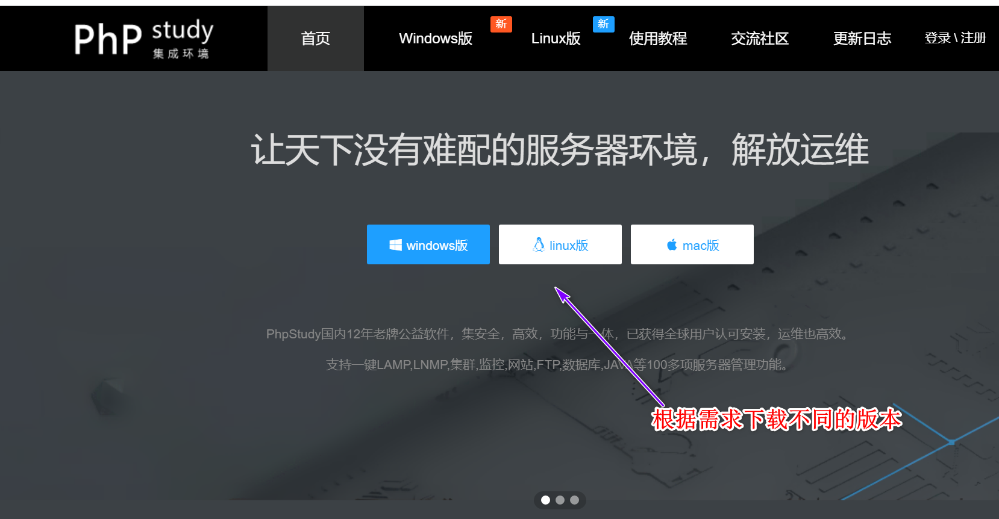
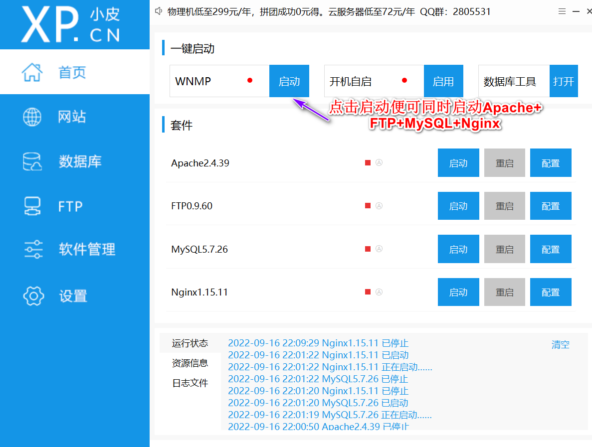
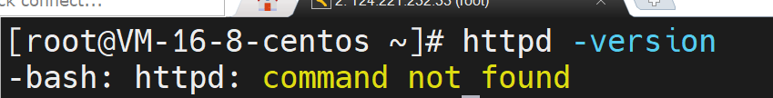
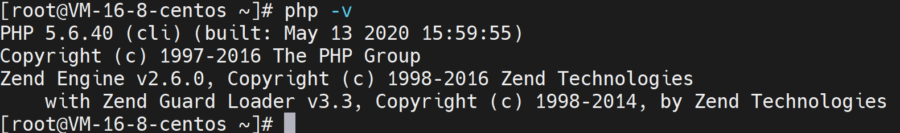
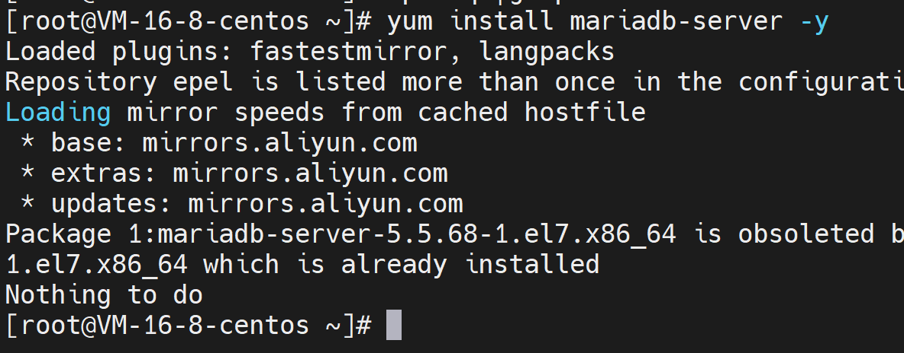

# ECshop

​	ECshop是一款专业的B2C电商商城系统，跨平台开源程序，源码支持下载。ECshop可以快速构建PC+微商城+APP+小程序等多端商城，并支持二次开发定制化商城，且官方不断升级更新无忧。系统是基于PHP和MySQL数据库构架开发的跨平台开源程序。


获取ECshop：http://www.ecshop.com/download.php


## 1.环境安装

ECshop是基于PHP开发的，因此我们需要先安装PHP的环境，在这里我们使用phpStudy作为PHP的开发环境，phpStudy是一个PHP调式环境的程序集成包，它集成了Apache+PHP+MySQL+ZendOptimizer，一次安装，无需配置即可使用，是非常方便、好用的PHP调试环境。下载地址为：https://www.xp.cn/






- 检查系统是否已经安装了Apache HTTP Server，即httpd，如果返回如下内容，说明没有安装：

```shell
httpd -version
```




- 如果没有安装，执行下面命令安装和启动服务:

```shell
yum install httpd -y
```


- 检查系统是否已经安装了PHP和插件，如出现下图提示，表示已安装好PHP5.6版本:

```shell
php -v
```



```shell
rpm -qa | grep php-gd
rpm -qa|grep php-mysql
```


- 如果没有安装以上两个插件，执行下面命令安装

```shell
yum install php php-gd php-mysql -y
```


- 检查系统是否已经安装了MySQL或MariaDB，如果返回如下内容，说明已经安装MariaDB：

```shell
[root@localhost ~]# rpm -qa|grep mariadb
mariadb-libs-5.5.64-1.el7.x86_64
mariadb-5.5.64-1.el7.x86_64
mariadb-server-5.5.64-1.el7.x86_64
```


- 如果没有安装，执行下面命令安装和配置，按照提示输入root用户新密码:

```shell
[root@localhost ~]# yum install mariadb-server -y
[root@localhost ~]# systemctl start mariadb
[root@localhost ~]# systemctl enable mariadb
[root@localhost ~]# systemctl status mariadb
[root@localhost ~]# mysql_secure_installation
```



- 修改PHP配置文件设置时区，搜索timezone，把date.timezone前的注释符#去掉，值设为PRC：

```shell
[root@localhost ~]# vim /etc/php.ini
date.timezone = PRC
```


- 下载解压ECshop3.6源码：

```shell
[root@localhost ~]# wget http://zj.mycodes.net/201708/ECShop_3.6.0_UTF8_release.zip
[root@localhost ~]# unzip ECShop_3.6.0_UTF8_release.zip
[root@localhost ~]# mv ECShop_3.6.0_UTF8_release/source/* /var/www/html/
```


- 设置源码目录可写:

```shell
[root@localhost ~]# mv ECShop_3.6.0_UTF8_release/source/* /var/www/html/
[root@localhost ~]# cd /var/www/html
[root@localhost ~]# ls
appserver  ecshop
[root@localhost ~]# chmod 777 -R appserver ecshop
```


- 关闭selinux，修改selinux的配置文件，把SELINUX的值改为disabled：

```shell
[root@localhost conf]# vim /etc/selinux/config
SELINUX=disabled
SELINUXTYPE=targeted
[root@localhost conf]# setenforce 0
setenforce: SELinux is disabled
```


- 启动Apache服务，查询服务状态并设置开机启动服务:

```shell
[root@localhost ~]# systemctl start httpd
[root@localhost ~]# systemctl enable httpd
[root@localhost ~]# systemctl status httpd
```


- 防火墙允许Apache服务的80端口:

```shell
[root@localhost conf]# firewall-cmd --add-port=80/tcp --zone=public --permanent
success
[root@localhost conf]# firewall-cmd --reload
success
```

