# Magento安装

# 1.安装宝塔面板和LNMP环境


### 1.1.安装宝塔面板和LAMP

```shell
wget -O install.sh http://download.bt.cn/install/install-ubuntu_6.0.sh && sudo bash install.sh
```

或：

```shell
apt-get install -y wget && wget -O install.sh http://download.bt.cn/install/install_6.0.sh && sh install.sh
```


安装成功后的界面如下：


下载后保存的目录：

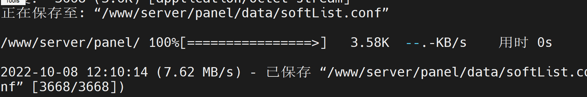

安装完成后会给你以下信息，用以下信息完成宝塔面板的登录：

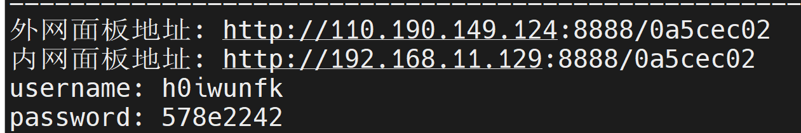

```shell
外网面板地址: http://110.190.149.124:8888/0a5cec02
内网面板地址: http://192.168.11.129:8888/0a5cec02
username: h0iwunfk
password: 578e2242
```

打开本地浏览器，复制内网面板地址到地址栏回车。输入账号密码登录：

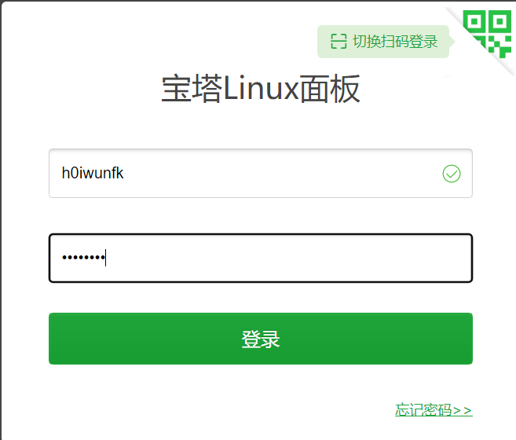

然后查看用户协议并同意。点击进入面板。

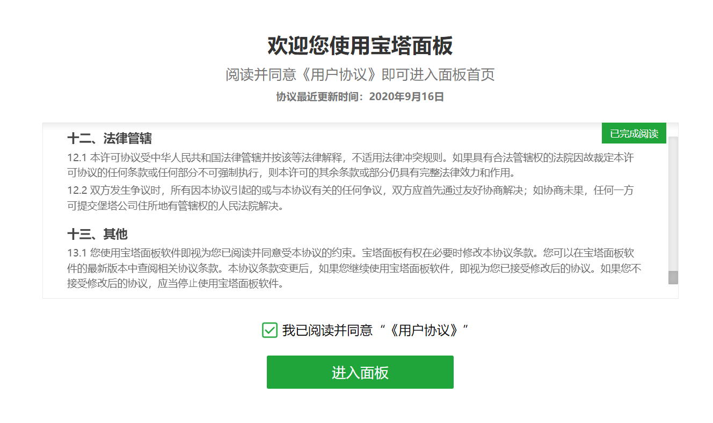

进入后有个弹窗会让你选安装LNMP或LAMP，这个根据自身情况选择。我这里选的是LAMP。这里要选择合适的版本。点击 一键安装。

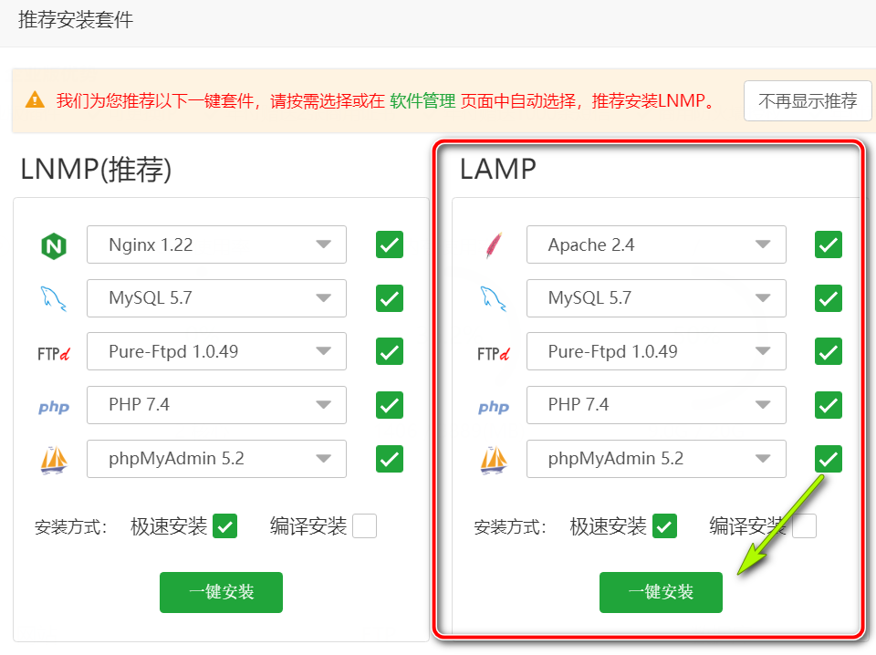

等待安装：

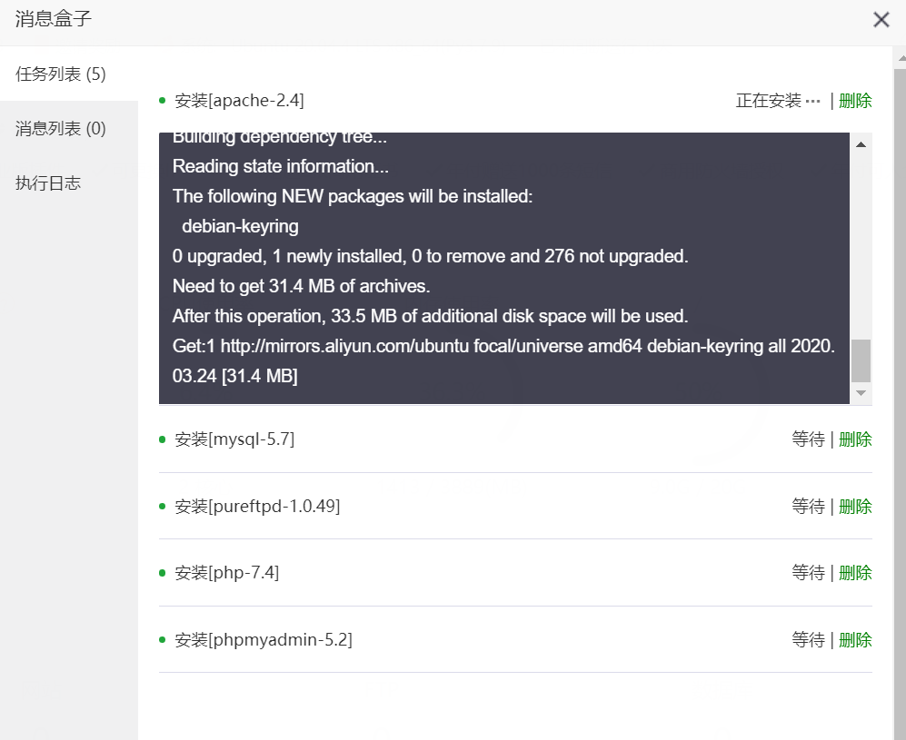


大概半个小时后，安装成功！

新安装的宝塔面板要删除以下几个被禁用的函数：

```shell
putenv
proc_open
shell_exec
exec
proc_get_status
```

具体禁用流程为：左侧软件商店--上面运行环境--找到PHP安装的对应版本，点击设置--禁用函数：

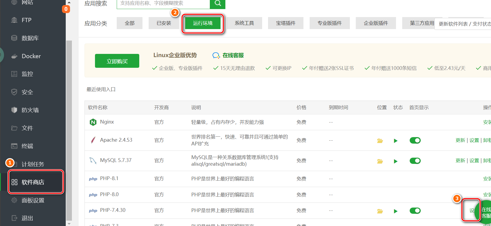

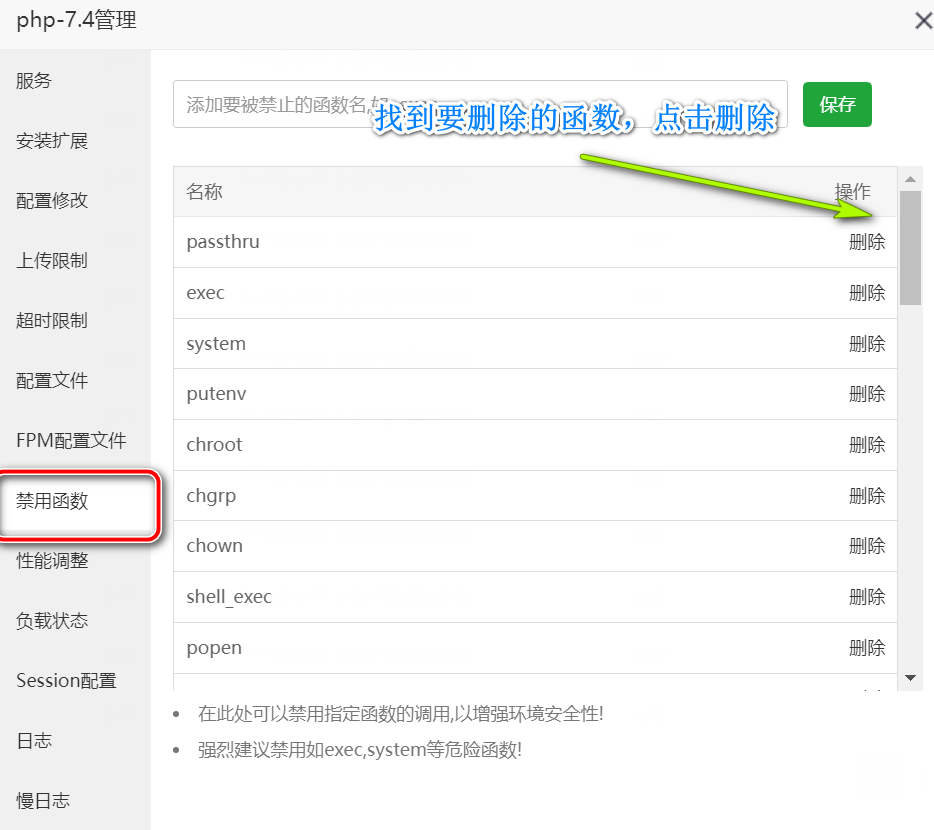

重启PHP后再进行下一步。

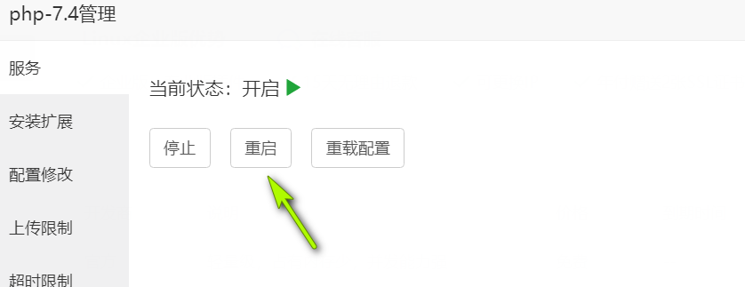

### 1.2.安装OpenJDK JAVA 11

现在Magento 2.4的安装的首要条件就是要安装Elasticsearch，而Elasticsearch的安装又需要配置Java环境。所有下面我们来安装Java 11。

- **OpenJDK Packages**

```shell
sudo apt-cache search openjdk
```

- **安装Java（OpenJDK）**

```shell
sudo apt-get install openjdk-11-jre openjdk-11-jdk
```

- **查看版本**

```shell
java -version
```

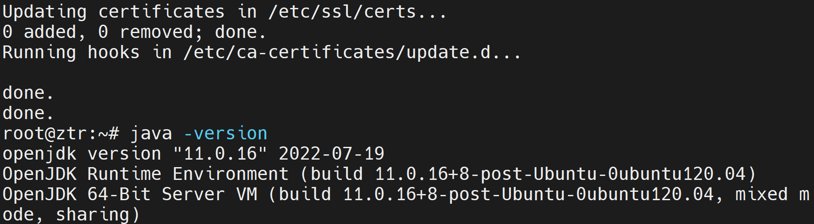

- **配置Java环境**

在宝塔面板的文件管理里面打开 /etc/environment ，然后增加以下代码：

```shell
sudo gedit /etc/environment 
JAVA_HOME=/usr/lib/jvm/java-11-openjdk-amd64/
或者命令行执行：export JAVA_HOME=/usr/lib/jvm/java-11-openjdk-amd64/
```

- **查看JAVA_HOME**

```shell
echo $JAVA_HOME
```

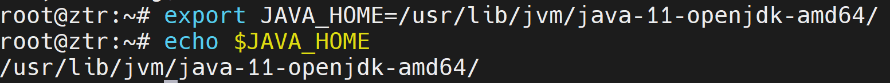

如果输出正确，继续下一步。


### 1.3.安装和配置ElasticSearch

- **安装ES**

```shell
curl -fsSL https://artifacts.elastic.co/GPG-KEY-elasticsearch | sudo apt-key add -

echo "deb https://artifacts.elastic.co/packages/7.x/apt stable main" | sudo tee -a /etc/apt/sources.list.d/elastic-7.x.list

sudo apt-get update

sudo apt install elasticsearch
```

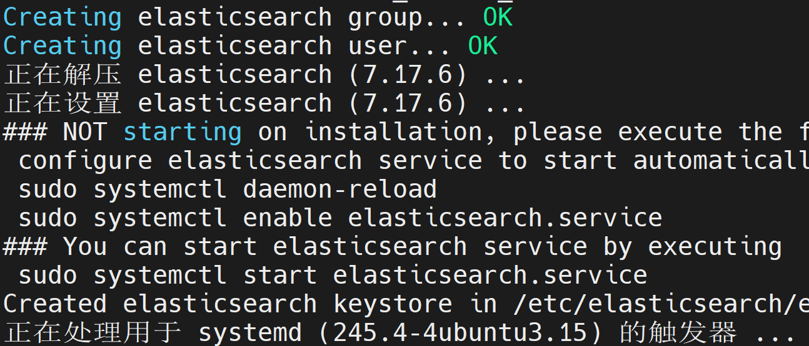

- **配置ES**

宝塔面板文件管理打开 /etc/elasticsearch/elasticsearch.yml，修改以下地方并取消注释：

```shell
cluster.name: my-application

node.name: magecomp4

path.data: /var/lib/elasticsearch

path.logs: /var/log/elasticsearch

network.host: 127.0.0.1

http.port: 9200

cluster.initial_master_nodes: 127.0.0.1
```

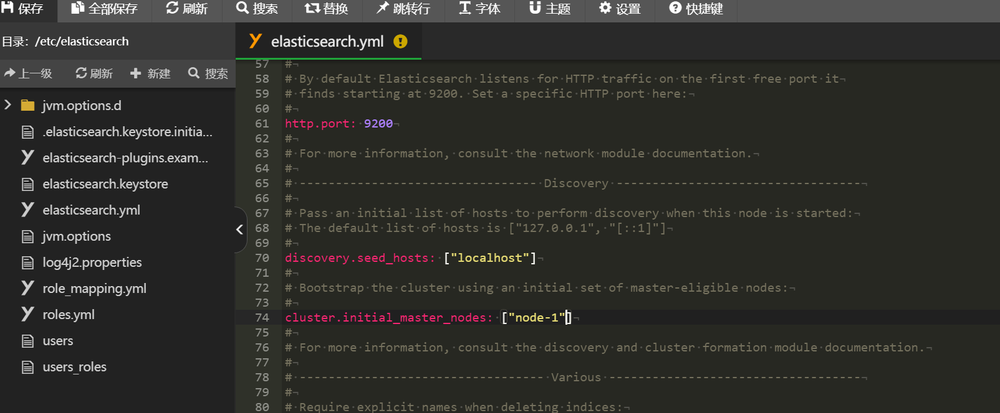


- **启动ES**

```shell
sudo systemctl start elasticsearch
```

附其他Elasticsearch命令：

```shell
-停止Elasticsearch：sudo systemctl stop elasticsearch

-重启Elasticsearch：sudo systemctl restart elasticsearch

-查看状态：sudo systemctl status elasticsearch
```


- **检查ES**

```shell
 -版本配置检查:curl -XGET 'http://localhost:9200'
```

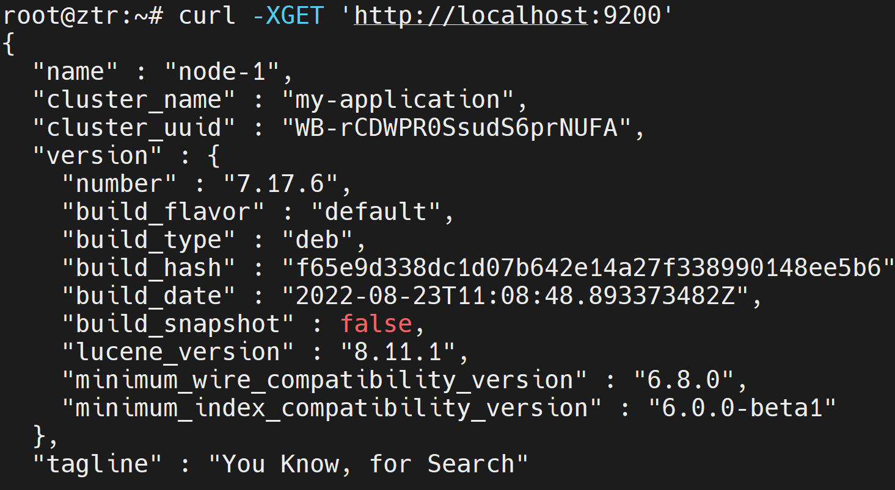

**这里一定要记得重启一下ES，然后配测检测**

```shell
sudo systemctl stop elasticsearch 		#停止ES

sudo systemctl start elasticsearch 		#启动ES

curl -X GET -H "Content-Type: application/json" 'http://127.0.0.1:9200/tutorial/helloworld/1?pretty'			# 检测配置
```


### 1.4.安装Magento2

官方安装教程：https://devdocs.magento.com/guides/v2.4/install-gde/composer.html

安装Magento2需要的配置：

- 内存：2GBRAM

- Composer：2.*.*

- 服务器：Apache 2.4 / Nginx 1.x

- 数据库：mysql8.0 / mariaDB 10.4

- Elasticsearch：7.6.x及以上

- PHP：7.4以上

- 需要安装的PHP扩展：

  - bcmath
  - ctype
  - curl
  - dom
  - gd
  - hash
  - iconv
  - intl
  - mbstring
  - openssl
  - pdo_mysql
  - simplexml
  - soap
  - xsl
  - zip
  - libxml

  这几个函数可以在宝塔面板的PHP管理里面安装上，然后重启PHP 。

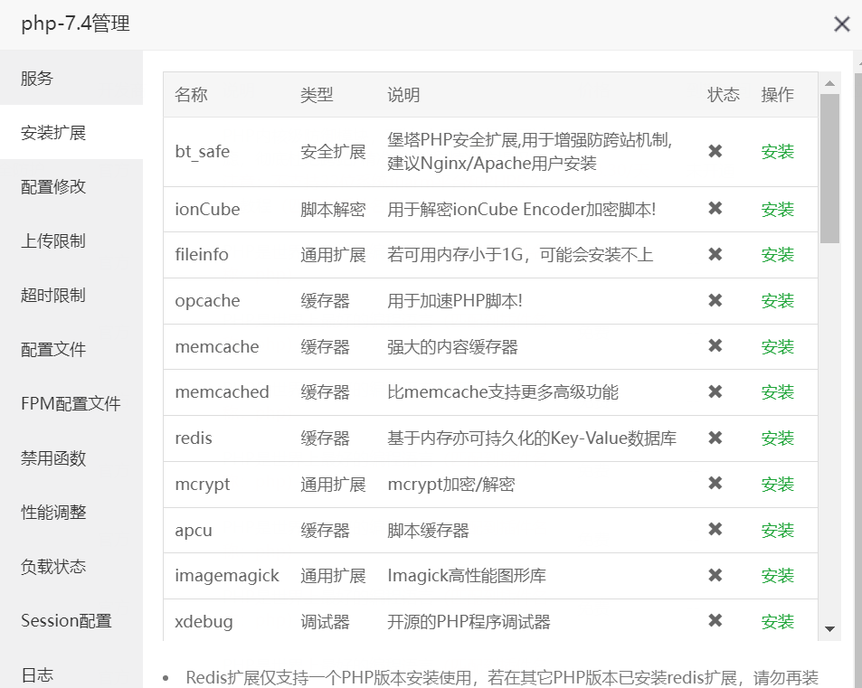


- **满足以上条件后，使用Composer安装Magento**

```shell
cd /www/wwwroot/				# 进入安装路径
composer selfupdate				# 更新Composer
composer create-project --repository-url=https://repo.magento.com/ magento/project-community-edition /var/www/html/magento 		# 安装到/var/www/html/magento 
# 以上安装可能会报Your requirements could not be resolved to an installable set of packages
# 可能是相关版本不符合，执行如下命令忽略，再执行上面的命令
composer install --ignore-platform-reqs
```

Access Key获得方式：
1.打开https://marketplace.magento.com
2.注册账号这里就不说明了
3.打开My Profile
4.打开Access Keys
5.点击Create A New Access Key 创建key
6.输入名称
这里的Public Key 是Username, Private Key 是 Password
直接回车开始下载。

测试账号：

```shell
公钥作为用户名登录：51af8c37ce4ade1249e03ca9ece08b41
私钥作为密码登录：a0bc39e063977a2c8d9e60637430c418
```

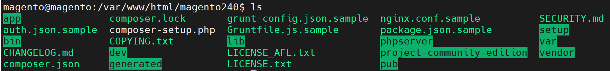

- 下载完成之后，进入Magento 2的目录，修改权限（如果不行就在命令前面加上sudo）:

```shell
cd /var/www/html/magento
find var generated vendor pub/satic pub/media app/etc -type f -exec chmod g+w {} +
find var generated vendor pub/satic pub/media app/etc -type d -exec chmod g+ws {} +
chown -R :www .
chmod u+x bin/magento
```


- **使用宝塔面板创建数据库magento240**
- **用命令安装Magento 2 :**

```shell
bin/magento setup:install \
--base-url=http://127.0.0.1/magento240 \
--db-host=localhost \
--db-name=magento240 \
--db-user=root \
--db-password=root \
--admin-firstname=admin \
--admin-lastname=admin \
--admin-email=admin@admin.com \
--admin-user=admin \
--admin-password=admin123 \
--language=en_US \
--currency=USD \
--timezone=America/Chicago \
--use-rewrites=1 \
--search-engine=elasticsearch7 \
--elasticsearch-host=es-host.example.com \
--elasticsearch-port=9200 \
--elasticsearch-index-prefix=magento2 \
--elasticsearch-timeout=15
```

可根据需要修改上面的配置。

- 然后运行以下命令：

```shell
sudo php -dmemory_limit=-1 bin/magento setup:upgrade

sudo php -dmemory_limit=-1 bin/magento setup:static-content:deploy -f

sudo php -dmemory_limit=-1 bin/magento indexer:reindex

sudo php -dmemory_limit=-1 bin/magento cache:clean

sudo php -dmemory_limit=-1 bin/magento cache:flush
```

最后，在宝塔面板设置网站目录。

将网站目录设置为/var/www/html/magento,然后运行目录设置为/pub. 

至此，Magento 2已经成功安装完成，你现在可以访问的网站前台http://127.0.0.1/magento240 和网站后台http://127.0.0.1/magento240/admin_test_root查看了。