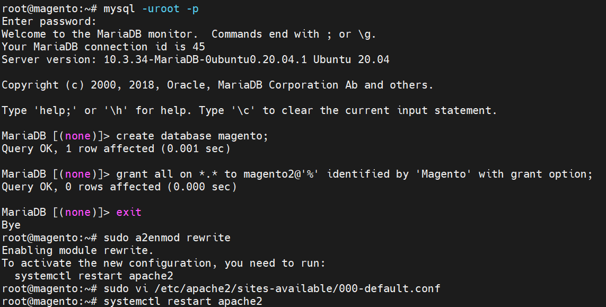
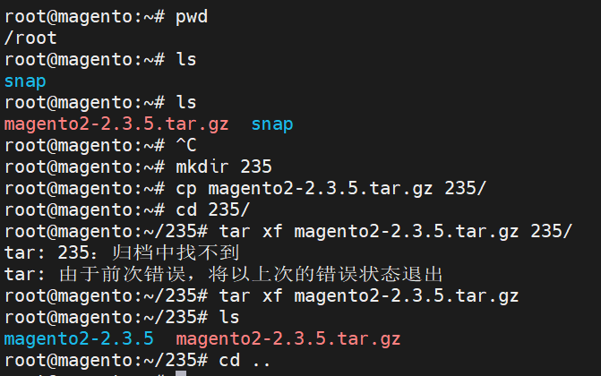

查询Ubuntu版本：

```shell
lsb_release -a
```


因Ubuntu20.04是官方源7.4，Magento2.3.5不支持，添加PPA源：

```shell
sudo add-apt-repository ppa:ondrej/php
```


PPA源添加后更新源信息：

```shell
sudo apt update
```


安装LAMP-apache2，MariaDB，PHP7.3及组件:

```shell
sudo apt install apache2 mariadb-server php7.3 php7.3-bcmath php7.3-curl php7.3-gd php7.3-intl php7.3-mbstring php7.3-soap php7.3-zip php7.3-xml php7.3-mysql php7.3-xsl
```


MariaDB初始化设置-设置root密码外其他 全部回车：

```shell
sudo mysql_secure_installation
```

设置MariaDB权限调整：

```shell
sudo mysql
use mysql
\g update mysql.user set plugin='mysql_native_password' where User='root';
\g flush privileges;						# 刷新权限
\q
```


为Magento创建数据库：

```shell
mysql -uroot -p
create database magento;
# 建立用户magento2,密码Magento
grant all on *.* to magento2@'%' identified by 'Magento' with grant option;
# 数据库名： magento
# 用户名：magento2 用户密码：Magento
# 赋予数据库所有权限-学习环境下使用
exit
```


设置Apache2重写规则：

```shell
sudo a2enmod rewrite
```

编辑站点配置文件：

```shell
sudo vi /etc/apache2/sites-available/000-default.conf
# 在行末添加以下内容
<Directory "/var/www/html">
AllowOverride all
</Directory>
# 重启Apache2服务
systemctl restart apache2
```



Magento2.3.5的安装包下载到用户目录里，在用户家目录创建一个目录235，复制源文件到目录里：

```shell
mkdir 235
cp magento2-2.3.5.tar.gz 235/
cd 235/
tar xf magento2-2.3.5.tar.gz
cd ..
```



创建硬链接放置到Apache2默认网站目录：

```shell
sudo ln -Fs /root/235/ /var/www/html/235
```

批量变更所属www-data是Apache2默认用户：

```shell
sudo chown -R www-data:www-data 235/
```

批量变更文件权限：

```shell
sudo chown -R 775 235/
cd 235/
```

执行安装命名安装：

```shell
sudo -u www-data php bin/magento setup:install --backend-frontname="admin" \
--db-host="localhost" \
--db-name="magento" \
--db-user="magento2" \
--db-password="Magento" \
--language="zh_Hans_CN" \
--currency="CNY" \
--timezone="Asia/Shanghai" \
--use-rewrites=1 \
--use-secure=1 \
--use-secure-admin=1 \
--base-url="http://192.168.101.128/235" \
--base-url-secure="http://192.168.101.128/235" \
--admin-user=Admin \
--admin-password="admin-123" \
--admin-email=admin@domain.com \
--admin-firstname=Firstname \
--admin-lastname=Lastname \
--cleanup-database
```

