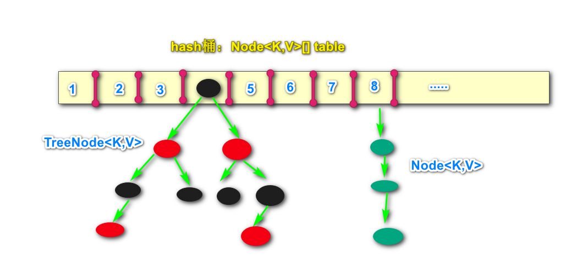
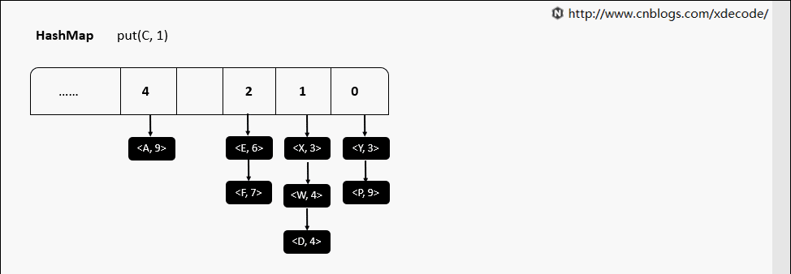
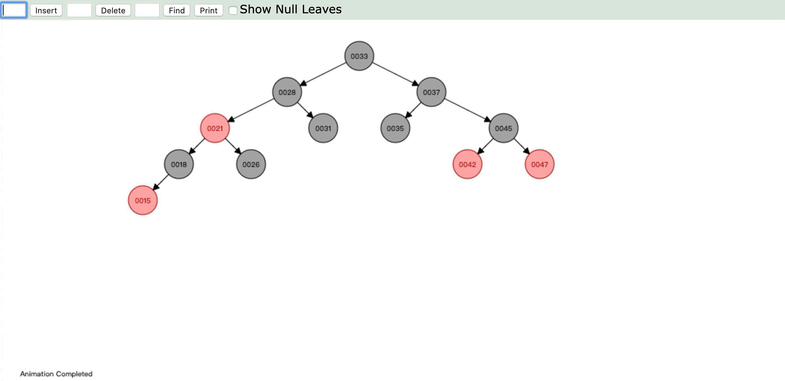
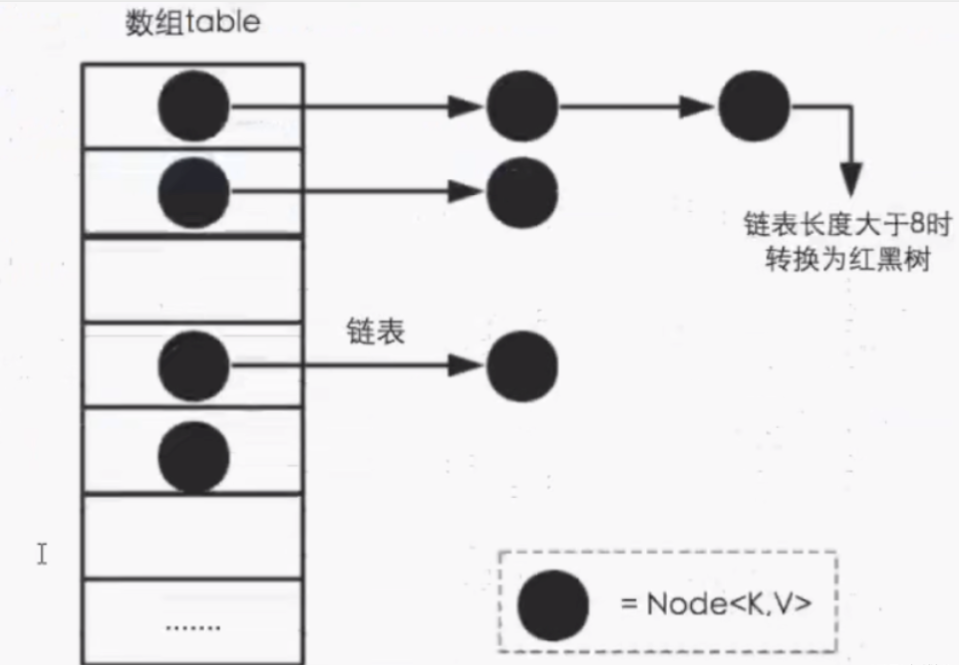

# Java面试-HashMap


HashMap作为项目开发中最常使用的容器之一，也自然而然成为面试的常问技术点之一，我们来梳理下关于HashMap面试中常问到的几个问题：


## 1.HashMap在jdk1.7和1.8中有什么区别？

- 在jdk1.7中，HashMap由**数组+链表**组成，数组是HashMap的主体，而链表主要是为了解决哈希冲突而存在的；

- 在jdk1.8中，HashMap由**数组+链表+红黑树**组成。当链表过长，则会严重影响HashMap的性能，红黑树的时间复杂度为O(logn)，而链表是O(n)。因此jdk1.8对数据结构进行了进一步的优化，引入了红黑树，链表和红黑树在达到一定条件时就会进行转换：

  拓展：时间复杂度O(1)<O(log2n)<O(n)<O(nlog2n)<O(n2)<O(n3)<O(2n)

  - 当链表超过8且数组长度（数据总量）超过64才会转为红黑树；
  - 将链表转换为红黑树前会判断如果当前数组长度小于64，那么会选择先进行数组扩容，而不是转为红黑树，以节约搜索时间。

  

HashMap存放过程：




HashMap中红黑树的结构：



## 2.HashMap有哪些关键属性？它们的值有什么含义？

以下源码可以看出：

```java
transient Entry[] table;//存储元素的实体数组
  
transient int size;//存放元素的个数
  
int threshold; //临界值   当实际大小超过临界值时，会进行扩容threshold = 加载因子*容量
 
final float loadFactor; //加载因子，表示Hsah表中元素的填满的程度
  
transient int modCount;//被修改的次数

```

加载因子越大,填满的元素越多,好处是,空间利用率高了,但:冲突的机会加大了.链表长度会越来越长,查找效率降低。

反之,加载因子越小,填满的元素越少,好处是:冲突的机会减小了,但:空间浪费多了.表中的数据将过于稀疏（很多空间还没用，就开始扩容了）

冲突的机会越大,则查找的成本越高.

因此,必须在 "冲突的机会"与"空间利用率"之间寻找一种平衡与折衷. 这种平衡与折衷本质上是数据结构中有名的"时-空"矛盾的平衡与折衷.

**默认初始化值：**采用无参构造实例化HashMap时，默认采用16作为初始化容量，**在第一次put时使用16来创建数组**。

```java
/**
 * The default initial capacity - MUST be a power of two.
 * 默认初始化容量，必须是2的次方
 */
static final int DEFAULT_INITIAL_CAPACITY = 1 << 4; // aka 16
```


**最大容量：**2的30次方。

```java
/**
 * The maximum capacity, used if a higher value is implicitly specified
 * by either of the constructors with arguments.
 * MUST be a power of two <= 1<<30.
 * 最大容量。即HashMap的数组容量必须小于等于 1 << 30
 */
static final int MAXIMUM_CAPACITY = 1 << 30;
```

在指定容量进行初始化时，会先判断这个初始化容量是否大于最大容量，超过则使用最大容量来进行初始化。

```java
public HashMap(int initialCapacity, float loadFactor) {
    if (initialCapacity < 0)
        throw new IllegalArgumentException("Illegal initial capacity: " +
                                           initialCapacity);
    if (initialCapacity > MAXIMUM_CAPACITY)
        //如果初始化容量大于最大容量，则仅初始化为最大容量。
        initialCapacity = MAXIMUM_CAPACITY;
    if (loadFactor <= 0 || Float.isNaN(loadFactor))
        throw new IllegalArgumentException("Illegal load factor: " +
                                           loadFactor);
    this.loadFactor = loadFactor;
    this.threshold = tableSizeFor(initialCapacity);
}
```


**默认负载因子：**默认值为0.75，但可通过构造参数来指定，一般不建议修改。

```java
/**
 * The load factor used when none specified in constructor.
 * 默认的负载因子
 */
static final float DEFAULT_LOAD_FACTOR = 0.75f;
```


**树形化阈值：**当链表的长度大于8的时候，会将链表转为红黑树，优化查询效率。

```java
/**
 * The bin count threshold for using a tree rather than list for a
 * bin.  Bins are converted to trees when adding an element to a
 * bin with at least this many nodes. The value must be greater
 * than 2 and should be at least 8 to mesh with assumptions in
 * tree removal about conversion back to plain bins upon
 * shrinkage.
 */
static final int TREEIFY_THRESHOLD = 8;
```


**解树形化阈值：**当红黑树的节点个数小于等于6时，会将红黑树的结构转为链表。

```java
/**
 * The bin count threshold for untreeifying a (split) bin during a
 * resize operation. Should be less than TREEIFY_THRESHOLD, and at
 * most 6 to mesh with shrinkage detection under removal.
 */
static final int UNTREEIFY_THRESHOLD = 6;
```


**树形化最小容量：**转为红黑树的两个条件：链表长度大于8；数组容量大于等于64。当这两个条件都满足时链表才能转换为红黑树。

```java
/**
 * The smallest table capacity for which bins may be treeified.
 * (Otherwise the table is resized if too many nodes in a bin.)
 * Should be at least 4 * TREEIFY_THRESHOLD to avoid conflicts
 * between resizing and treeification thresholds.
 */
static final int MIN_TREEIFY_CAPACITY = 64;
```


## 3.HashMap有哪些特点？

1. HashMap存取是无序的；
2. 键和值的位置都可以是null，但键的位置只能是一个null；
3. 底层的数据结构是由键来控制的，键是唯一的；
4. jdk1.8之前的数据结构是数组+链表，jdk1.8后引入了红黑树的数据结构；
5. 阈值大于8且数组长度大于64时才会转为红黑树，转为红黑树的目得是提高搜索。


## 4.什么是哈希冲突？

​	通过哈希函数产生的哈希值是有限的，而数据可能比较多，导致经过哈希函数处理后仍然有不同的数据对应相同的哈希值。这时候就产生了哈希冲突。


## 5.怎么解决哈希冲突？

​	解决哈希冲突的方法有：开放地址法、再哈希法、链地址法（HashMap常见）、建立公共溢出区。

- **开放地址法：**也称为再散列法。如果p=H(key)出现冲突时，则以p为基础，再次哈希，p1=H(p)，如果p1再次出现冲突，则以p1为基础再次哈希，依次类推，直到找到一个不冲突的哈希地址p(i)。因此开放地址法所需要的哈希表的长度等于所需存放的元素，而且因为存在再次哈希，所以只能在删除的节点上做标记，而不能真正删除节点；
- **再哈希法：**也称为双重散列、多重散列。提供多个不同的hash函数，r1=H1(key)发生冲突时，再计算r2=H2(key1)，直到没有冲突为止，这样做虽然不会产生堆积，但增加了计算的时间；
- **链地址法：**也称为拉链法。将哈希值相同的元素构成一个同义词的单链表，并将单链表的头指针存放在哈希表的第i个单元中，查找、插入和删除主要在同义词链表中进行，链表法适用于经常进行插入和删除的情况；
- **建立公共溢出区：**将哈希表分为公共表和溢出表，当溢出发生时，将所有溢出数据统一存放在溢出区。

开放地址法和再哈希法的区别是：开放地址法只能使用同一种hash函数进行再次哈希，再哈希法调用多个不同的hash函数进行再次hash。


## 6.为什么数组长度大于64时才会转为红黑树？

在数组比较小时如果出现红黑树结构，反而会降低效率，而红黑树需要进行左旋右旋，变色，这些操作来保持平衡，同时数组长度小于64时，搜索时间相对要快些，总之是为了加快搜索速度，提高性能。

JDK1.8以前HashMap的实现是数组+链表，即使哈希函数取得再好，也很难达到元素百分百均匀分布。当HashMap中有大量的元素都存放在同一个桶中时，这个桶下有一条长长的链表，此时HashMap就相当于单链表，假如单链表有n个元素，遍历的时间复杂度就从O（1）退化成O（n），完全失去了它的优势，为了解决此种情况，JDK1.8中引入了红黑树（查找的时间复杂度为O（logn））来优化这种问题。


## 7.为什么加载因子是0.75？初始化临界值是12？

HashMap中的threshold是HashMap所能容纳键值对的最大值。计算公式为length*LoadFactory。也就是说，在数组定义好长度之后，负载因子越大，所能容纳的键值对个数也越大

loadFactory越趋近于1，那么数组中存放的数据（entry也就越来越多），数据也就越密集，也就会有更多的链表长度处于更长的数值，我们的查询效率就会越低，当我们添加数据，产生hash冲突的概率也会更高

默认的loadFactory是0.75，loadFactory越小，越趋近于0，数组中个存放的数据(entry)也就越少，表现得更加稀疏




0.75是对空间和时间效率的一种平衡选择

如果负载因子小一些比如是0.4，那么初始长度16*0.4=6，数组占满6个空间就进行扩容，很多空间可能元素很少甚至没有元素，会造成大量的空间被浪费

如果负载因子大一些比如是0.9，这样会导致扩容之前查找元素的效率非常低

loadfactory设置为0.75是经过多重计算检验得到的可靠值，可以最大程度的减少rehash的次数，避免过多的性能消耗


参考：https://www.xiaohongshu.com/discovery/item/61487e1700000000010038e7

​			https://www.bilibili.com/video/av208169082?vd_source=decee64fc347c1311c077fecf31444c8

​			公众号：Java学习者社区

​			

