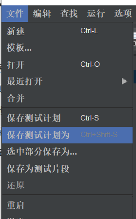

# Jmeter的使用

## 1.Jmeter简介

以下内容来自Jmeter中文网http://www.jmeter.com.cn/jieshao，很好的解释了Jmeter的作用：

Apache JMeter是Apache组织开发的基于Java的压力测试工具。用于对软件做压力测试，它最初被设计用于Web应用测试，但后来扩展到其他测试领域。 它可以用于测试静态和动态资源，例如静态文件、Java [小服务程序](https://baike.baidu.com/item/小服务程序)、CGI 脚本、Java 对象、数据库、FTP 服务器， 等等。JMeter 可以用于对服务器、网络或对象模拟巨大的负载，来自不同压力类别下测试它们的强度和分析整体性能。另外，JMeter能够对应用程序做功能/[回归测试](https://baike.baidu.com/item/回归测试)，通过创建带有断言的脚本来验证你的程序返回了你期望的结果。为了最大限度的灵活性，JMeter允许[使用正则表达式](https://baike.baidu.com/item/使用正则表达式)创建断言。

Apache jmeter 可以用于对静态的和动态的资源（文件，Servlet，Perl脚本，java 对象，数据库和查询，[FTP服务器](https://baike.baidu.com/item/FTP服务器)等等）的性能进行测试。它可以用于对服务器、网络或对象模拟繁重的负载来测试它们的强度或分析不同压力类型下的整体性能。你可以使用它做性能的图形分析或在大并发[负载测试](https://baike.baidu.com/item/负载测试)你的服务器/脚本/对象。

**JMeter的作用**

1.能够对HTTP和FTP服务器进行压力和[性能测试](https://baike.baidu.com/item/性能测试)， 也可以对任何数据库进行同样的测试（通过JDBC）。

2.完全的可移植性和100% 纯java。

3.完全 Swing 和轻量组件支持（[预编译](https://baike.baidu.com/item/预编译)的JAR使用 javax.swing.*)包。

4.完全多线程 框架允许通过多个线程并发取样和 通过单独的[线程组](https://baike.baidu.com/item/线程组)对不同的功能同时取样。

5.精心的GUI设计允许快速操作和更精确的计时。

6.缓存和离线分析/回放测试结果。

**JMeter的高可扩展性**

1.可链接的取样器允许无限制的测试能力。

2.各种负载统计表和可链接的[计时器](https://baike.baidu.com/item/计时器)可供选择。

3.数据分析和可视化[插件](https://baike.baidu.com/item/插件)提供了很好的可扩展性以及个性化。

4.具有提供动态输入到测试的功能（包括Javascript）。

5.支持脚本编程的取样器（在1.9.2及以上版本支持BeanShell）。

在设计阶段，JMeter能够充当HTTP PROXY（代理）来记录IE/NETSCAPE的[HTTP请求](https://baike.baidu.com/item/HTTP请求)，也可以记录apache等WebServer的log文件来重现HTTP流量。当这些HTTP客户端请求被记录以后，测试运行时可以方便的设置重复次数和并发度（[线程数](https://baike.baidu.com/item/线程数)）来产生巨大的流量。JMeter还提供可视化组件以及[报表工具](https://baike.baidu.com/item/报表工具)把量服务器在不同压力下的性能展现出来。

相比其他HTTP测试工具,JMeter最主要的特点在于扩展性强。JMeter能够自动扫描其lib/ext子目录下.jar文件中的[插件](https://baike.baidu.com/item/插件)，并且将其装载到内存，让用户通过不同的菜单调用。


## 2.Jmeter的安装

进入官网https://jmeter.apache.org/，找到下载入口，下载对应的版本：


下载安装好后点击jmeter安装目录下的bin/jmeter.bat就可以运行了，运行界面如下：


按如下方式可以设置中文：


如上方式设置重启后还是变成英文，如果想要设置永久有效，可以找到安装目录下的/bin/jmeter.propertise文件做如下设置：

```propertise
language=zh-CN
```


## 3.创建Jmeter测试计划

​	测试计划定义如何测试，并定义一个布局。例如，web应用程序以及客户端服务器应用程序，它可以被看作容器运行测试，一个完整的测试包括一个或多个元素，如线程组、逻辑控制器、样品产生控制器、监听器、定时器、断言和配置元素。测试计划必须至少有一个线程组。


### 3.1.添加和删除元素

​	通过鼠标右键点击测试计划Test Plan节点，并从"add"列表中选择一个新的元素就可以添加一个测试计划。另外，元素可以从文件中加载，并通过选择"merge"或"open"选项添加。例如：添加一个线程组原件测试计划：


要删除一个元素，确保元素被选中，右键单击该元素，然后选择"remove"删除选项：


### 3.2.加载和保存元素

从文件加载一个元素，右键单击您要添加的加载元件对现有树元素，并选择“merge”合并选项。选择文件保存元素。 JMeter会合并的元素，放到树上。


为了保存树元素，元素上点击右键并选择选择另存为…选项。 JMeter会保存选定的元素，再加上它下面的所有子元素。默认情况下，不保存JMeter 的元素，需要明确地保存它，如前面提到的。


### 3.3.保存测试计划

可以保存整个测试计划到本地，方便随时使用。点击菜单栏"File"文件选项，选择保存"Save"或"Save Test Plan as"：




### 3.4.运行/停止测试计划

从Run菜单项中选择运行-启动“Start ”（控制+ R）。当运行JMeter是，它显示了一个绿色的小盒子，右手端的部分，只是在菜单栏下。


停止测试方法有两种：

- 使用stop（Control + '.'）。这立即停止线程如果可能的话。
- 使用shutdown（Control + ','）。这就要求线程停止在任何当前工作的结束。


## 4.Jmeter的主要元素

### 4.1.主要元件

通过上面的创建，可能你还不了解什么是测试计划，什么是线程组，那么我们就来了解下Jmeter的元素组件吧：

- **测试计划：**	是使用Jmeter测试的起点，为其他测试元件提供一个容器，影响其作用范围内的所有组件；
- **线程组：**代表一定数量的用户，它可以用来模拟用户并发送请求，实际的请求内容在Sampler中定义，它被线程组包含；
- **配置原件：**维护Sampler需要的配置信息，并根据实际的需要修改请求的内容；
- **前置处理器：**负责在请求之前工作，常用来修改请求设置，在其作用范围内的每一个sampler元件之前执行；
- **定时器：**负责定义请求之间的延迟间隔，在其作用范围内的每一个sampler有效；
- **取样器(Sampler)：**是性能测试中向服务器发送请求，记录响应信息、响应时间的最小单元，如：HTTP Request、Sampler、FTP Request Sampler、TCP  Request Sampler、JDBC Request Sampler等。每一种不同类型的Sampler可以根据设置的参数向服务器发送不同类型的请求；
- **后置处理器：**负责请求之后的工作，常用获取返回的值，在其作用范围内的每一个sampler元件之后执行；
- **断言：**用来判断请求响应的结果是否如用户所期望的，在其作用范围内的对每一个sampler元件执行后的结果进行校验；
- **监听器：**负责收集测试结果，同时确定结果显示的方式，在其作用范围内对每一个sampler元件的信息收集并呈现；
- **逻辑控制器：**可以定义Jmeter发送请求的行为逻辑，它与Sampler结合使用可以模拟复杂的请求序列。


### 4.2.执行顺序和接口测试流程

**它们的执行顺序为：**

**配置元件->前置处理器->定时器->取样器->后置处理程序->断言->监听器**。

注意事项：

1.前置处理器、后置处理器和断言等组件只能对取样器起作用，因此，如果在它们的作用域内没有任何取样器，则不会被执行。

2.如果在同一作用域内有多个同一类型的元件，则这些元件按照它们在测试计划中的上下顺序依次执行。


**使用Jmeter进行接口测试的基本步骤如下：**

1. 测试计划
2. 线程组
3. HTTP Cookie管理器
4. HTTP请求默认值
5. HTTP请求(Sampler)
6. 断言
7. 监听(查看结果树，图形结果，聚合报告等。)

