# Docker

## 1.安装Docker

通过Docker官网下载离线包：

```shell
https://download.docker.com/linux/static/stable/x86_64/docker-20.10.6.tgz
也可以在下面这个网址选择你想要安装的版本
https://download.docker.com/linux/static/stable/
```

因教学使用此次安装采用的是离线安装的方式，所以需要下载离线安装工具到本地，下载地址如下：

```shell
https://github.com/Jrohy/docker-install/
```


安装：

1.将之前下载的以下文件放到服务器/root/docker-install下：

```shell
- [docker-install]
	- docker-20.10.6.tgz
	- install.sh
	- docker.bash
```

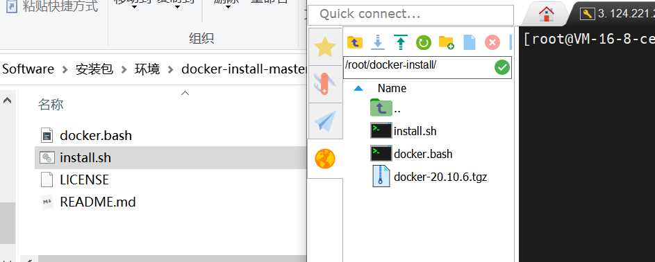

2.执行安装：

```shell
cd docker-install 							# 进入到docker-install文件夹中
chmod +x install.sh							# 为intall.sh文件添加执行权限
./install.sh -f docker-20.10.6.tgz			# 执行安装
```

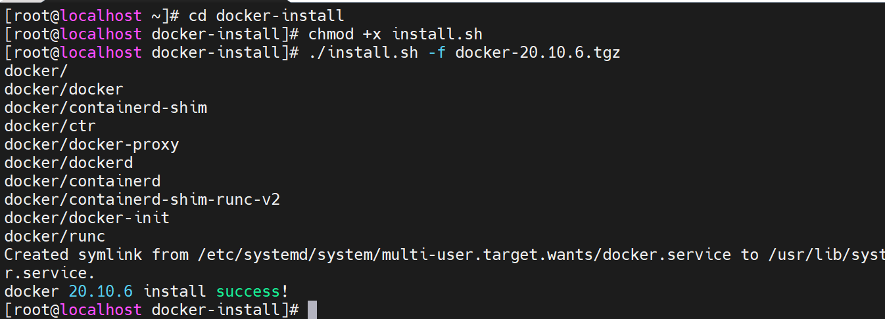


3.由于国内访问镜像网速的问题，所以需要配置加速器来加速，修改/etc/docker/daemon.json。如下命令可以直接生成文件daemon.json：

```shell
cat <<EOF > /etc/docker/daemon.json
{
  "registry-mirrors": [
    "https://docker.mirrors.ustc.edu.cn",
    "http://hub-mirror.c.163.com"
  ],
  "max-concurrent-downloads": 10,
  "log-driver": "json-file",
  "log-level": "warn",
  "log-opts": {
    "max-size": "10m",
    "max-file": "3"
    },
  "data-root": "/var/lib/docker"
}
EOF
```

如果执行不成，可以创建该文件，并用vi编辑器添加内容。

4.重新启动服务：

```shell
sudo systemctl daemon-reload					# 重新加载docker配置
sudo systemctl restart docker					# 重启docker服务
```


## 2.Docker镜像

Docker 镜像是一组静态磁盘文件，可以任意下载、复制、分发。从镜像可以运行启动容器（Docker的虚拟计算机）。

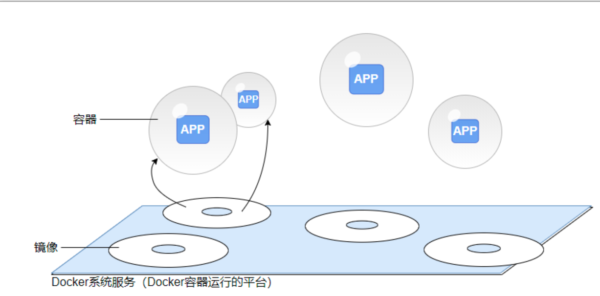


### 2.1.下载镜像：

从镜像仓库 `https://hub.docker.com` 下载镜像：

```shell
docker pull redis:5.0.12					# 下载redis镜像，默认下载redis:lastest
docker images								# 查看docker镜像
```


​	镜像的名称由两部分组成：`repository:tag`，其中的 `tag` 一般用来表示版本，默认的 `tag` 是 `latest`，表示最近的版本。镜像的名称相当于在镜像上贴的一个标签，在一个镜像上可以贴多个标签：

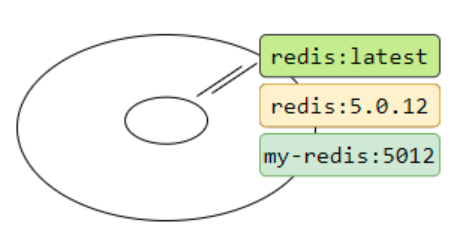

**添加名称：**

```shell
# 镜像可以起另一个名称，名称格式repository:tag，默认的tag是lastest
docker tag redis:5.0.12  ztr/redis:v5012
# 查看镜像，可以看出同一个镜像(id相同)可以有多个名称
docker images | grep redis
```

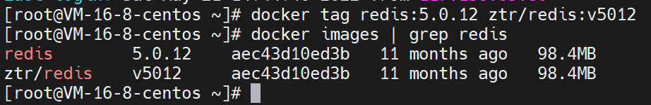


### 2.2.删除镜像

镜像的名称可以被删除，当只有一个镜像名称时，整个镜像就被删除了：

```shell
docker rmi redis:5.0.12
```

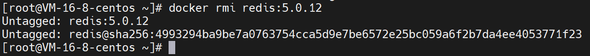

```shell
# 再次查看镜像发现已经删除一个
docker images | grep redis
```

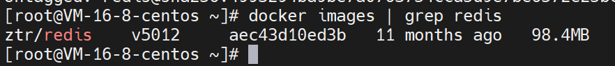

```shell
docker rmi ztr/redis:v5012							# 只有唯一一个镜像时会整个删除
```

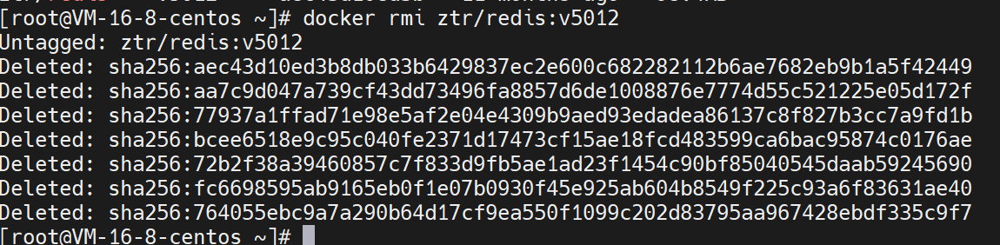


### 2.3.导入导出镜像

导出镜像并压缩到压缩文件：

```shell
# 把两个镜像 redis:latest 并压缩到 imgs.gz
docker save redis:5.0.12 | gzip > imgs.gz
```

导入镜像：

```shell
gunzip -c imgs.gz | docker load
```


## 3.从镜像运行启动容器

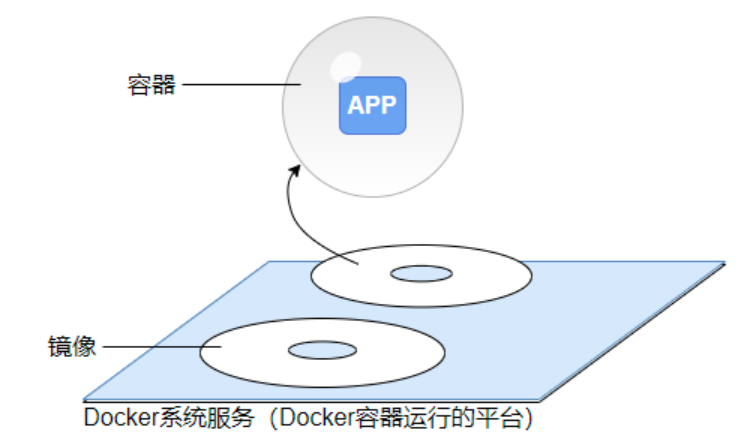

从一个镜像可以运行启动一个或多个容器，所谓容器，我们可以理解为虚拟计算机，其中运行着操作系统，操作系统中运行着我们部署的任务。

从tomcat镜像启动容器：

```shell
docker run tomcat
```

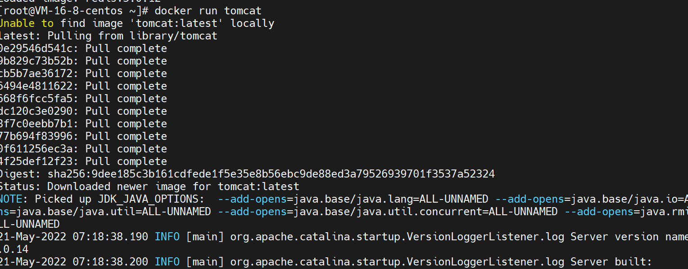

容器启动后在容器中运行了tomcat应用，这样启动会占用命令行，可以使用Ctrl+C退出tomcat应用，当容器中没有应用时，容器也会自动关闭退出。

查看容器：

```shell
docker ps -a 
```

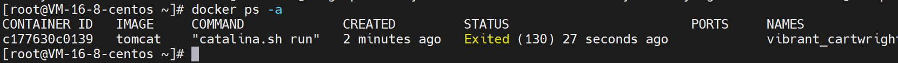


### 3.1.容器启动后运行的命令

容器启动后需要运行指定命令来启动应用。在镜像中指定的默认运行命令是：

```shell
docker history tomcat
```

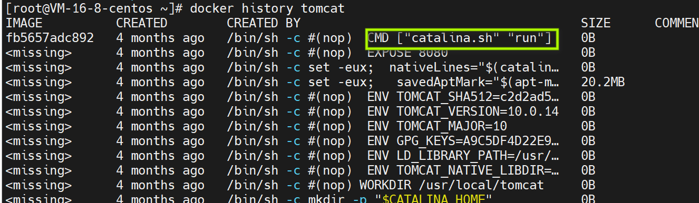

tomcat镜像中设置的cmd指令规定了容器启动后默认运行命令：

```shell
catalina.sh run
```

**其他镜像设置的默认命令：**

```shell
docker history redis

---------------------------------------------------------------------------------
[root@localhost ~]# docker history redis
IMAGE          CREATED       CREATED BY                                      SIZE
bc8d70f9ef6c   3 weeks ago   /bin/sh -c #(nop)  CMD ["redis-server"]         0B
<missing>      3 weeks ago   /bin/sh -c #(nop)  EXPOSE 6379                  0B
<missing>      3 weeks ago   /bin/sh -c #(nop)  ENTRYPOINT ["docker-entry…   0B


docker history mariadb

---------------------------------------------------------------------------------
[root@localhost ~]# docker history mariadb
IMAGE          CREATED       CREATED BY                                      SIZE
eff629089685   13 days ago   /bin/sh -c #(nop)  CMD ["mysqld"]               0B
<missing>      13 days ago   /bin/sh -c #(nop)  EXPOSE 3306                  0B
<missing>      13 days ago   /bin/sh -c #(nop)  ENTRYPOINT ["docker-entry…   0B


docker history centos:7

----------------------------------------------------------------------------------
[root@localhost ~]# docker history centos:7
IMAGE          CREATED        CREATED BY                                      SIZE
300e315adb2f   6 months ago   /bin/sh -c #(nop)  CMD ["/bin/bash"]            0B

```

### 3.2.entrypoint和cmd

entrypoint和cmd两项都是用来设置容器中运行的命令。

- 只设置CMD来执行ls -a -l：

```shell
CMD ["ls", "-a", "-l"]
```

- 用 `ENTRYPOINT` 和 `CMD` 两个一起设置来执行 `ls -a -l`：

```shell
ENTRYPOINT ["ls"]
CMD ["-a", "-l"]
```

两项一起设置时，会把两项设置的内容**连接起来作为一个完整的命令**。

容器启动时覆盖entrypoint和cmd。以tomcat为例，镜像中设置的默认命令是catalina.sh run，可以任意指定命令覆盖这个默认命令，这里执行ls -a -l 来测试：

- 覆盖CMD:

```shell
docker run tomcat ls -a -l
```

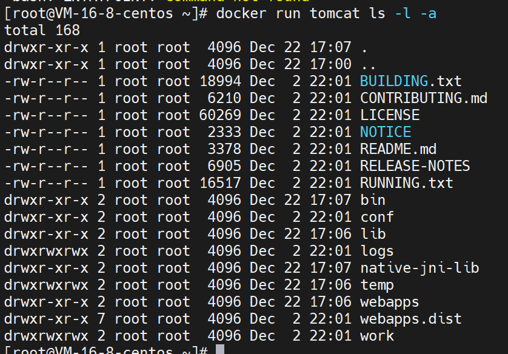

- 覆盖ENTRYPOINT:

--ENTRYPOINT:设置运行的命令，不许写在镜像名称tomcat的前面

```shell
docker run --entrypoint ls tomcat -a -l
```

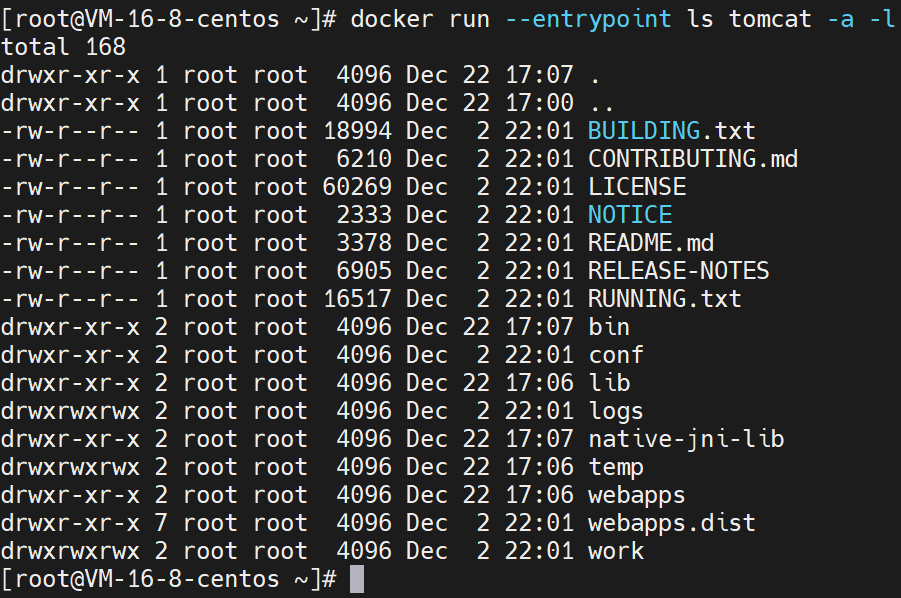

### 3.3.后台运行

后台启动tomcat:

```shell
docker run -d tomcat							# 后台运行tomcat
docker ps										# 只查看运行的容器
docker ps -a 									# 查看所有容器(包含已停止)
docker ps -qa 									# 仅列出容器的id
```

可以使用容器的名称或id查看容器的日志，使用id时允许至少写3位，和其他id区分即可：

```shell
docker logs 名称或id
```


### 3.4.进入容器，运行指定命令

绝大多数情况下，一个容器中只允许运行一个应用，但也允许启动多个应用，进入启动的容器，在里面运行启动其他应用：

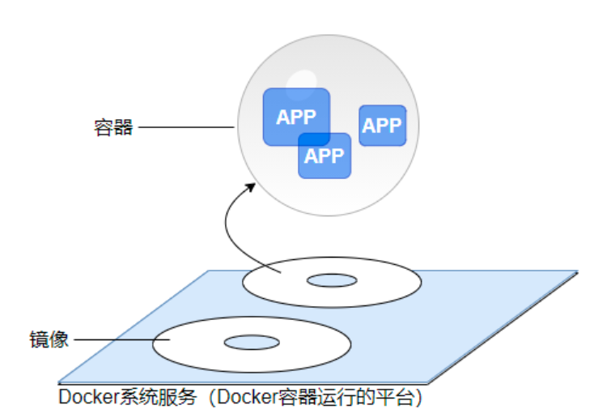

运行的命令用docker exec:

```shell
# 进入容器，运行指定命令
docker exec -it d91 pwd								# d91为id
docker exec -it d91 touch test.txt					# 进入容器创建test.txt文件
docker exec -it d91 ls -a 							
docker exec -it d91 top								# 启动top查看进程列表,ctrl+c结束
docker exec -it d91 bash							# 启动bash命令行，exit退出bash
```


### 3.5.--name 和 --restart=always

--name:每个启动的容器都可以指定一个名称，方便使用名称来操作容器；

--restart=always:docker系统服务重启，或者操作系统重启，容器都会随之自动重启。

```shell
# cat1容器可以随系统启动
docker run -d \
--name cat1 \
--restart=always \
tomcat

# cat2系统重启后默认是关闭状态，不会自动启动
docker run -d \
--name cat2 \
tomcat

# 查看容器
docker logs cat1

docker inspect cat1

# 重启docker系统服务
systemctl restart docker

# 查看容器，可以看到 cat1 自动重启了，而 cat2 处于关闭状态
docker ps -a
```

### 3.6.--rm 和 docker cp

--rm:有时候我们会临时使用一个容器之后这个容器就不再使用了，添加--rm参数可以在容器停止时自动删除容器；

docker cp:在容器和宿主机之间复制文件。如我们从tomcat的一个临时容器复制配置文件server.xml到宿主机，然后在server.xml中把端口号8080改成80.

```shell
# 启动一个临时容器
docker run -d \
--rm \
--name tmp \
tomcat

# 把 tomcat 的 server.xml 复制到宿主机的 /root/ 目录下
docker cp tmp:/usr/local/tomcat/conf/server.xml  /root/

# 停止临时容器，会自动删除
docker stop tmp

docker ps -a

# 修改 server.xml 中的8080端口，改成80
vim server.xml

# -v 把宿主机路径挂载到容器的一个路径
# 挂载的路径可以是文件，也可以是文件夹
# 这里把修改过的 server.xml 挂载到新启动的容器中
docker run -d \
--name cat2 \
-v /root/server.xml :/usr/local/tomcat/conf/server.xml \
tomcat

# 查看启动日志，确认使用 80 端口启动
docker logs cat2
```

