# HTTP协议

## 本阶段学习

1.javaSE阶段都是通过main方法本地访问代码，javaEE是企业级JAVA，我们本阶段将通过服务器和浏览器去访问我们的应用。

2.浏览器相当于是客户端，代码相当于是服务端。

3.掌握HTTP协议。

## 1.主要内容

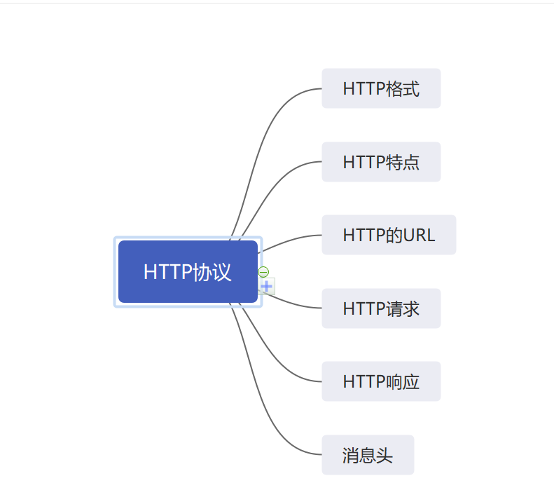

HTTP的诞生：1989年3月，互联网还直属于少数人。在这个互联网的黎明期，HTTP诞生了。

CERN（欧洲核子研究组织）主席伯纳斯-李提出一种能让远隔两地的研究者们共享知识的设想。

最初的基本理念是：借助多文档之间相互关联行成的超文本（HyperText）,连成相互参阅的WWW(World Wide Web,万维网)。

WWW这一名称是WEB浏览器当年用超文本的应用程序时的名称，现在用来表示这一系列的集合，也可简称成web.

**TCP/IP**:通常使用的网络是在TCP/IP协议族上运作的，而HTTP是属于它内部的一个子集。

**TCP/IP协议族：**计算机与网络设备要相互通信，双方就必须基于相同的方法，比如如何探测通信目标，由谁先发起通信，使用哪种语言进行通信等。不同的硬件、操作系统之间的通信都需要建立一定的规则，这种规则就叫**协议。**

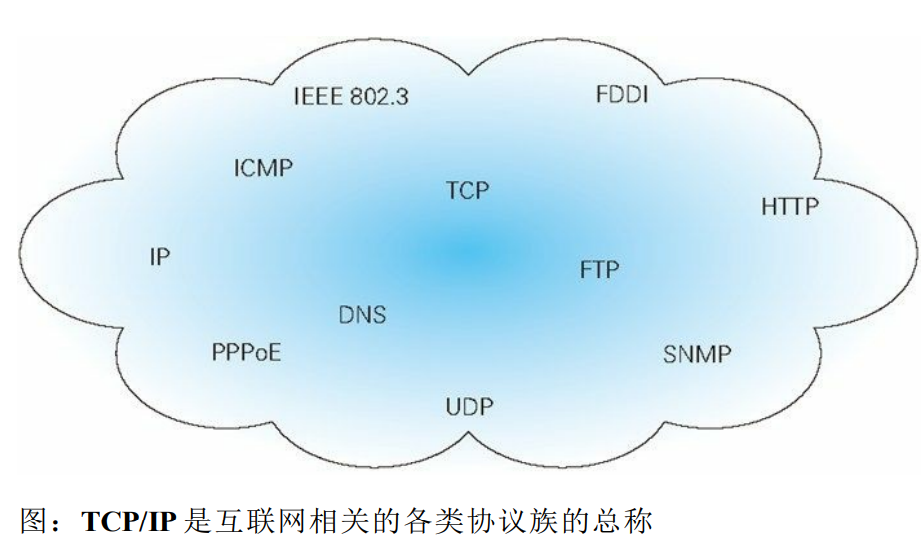

### **1.1 TCP/IP协议分层及作用**：

1. 应用层:应用程序间沟通的层，如简单电子邮件传输(SMTP)、文件传输协议(FTP)、网络远程访问协议(Telnet)等。

2. 传输层:在此层中，它提供了节点间的数据传送，应用程序之间的通信服务，主要功能是数据格式化、数据确认和丢失重传等。如[传输控制协议](https://www.baidu.com/s?wd=传输控制协议&tn=SE_PcZhidaonwhc_ngpagmjz&rsv_dl=gh_pc_zhidao)(TCP)、[用户数据报协议](https://www.baidu.com/s?wd=用户数据报协议&tn=SE_PcZhidaonwhc_ngpagmjz&rsv_dl=gh_pc_zhidao)(UDP)等，TCP和UDP给数据包加入传输数据并把它传输到下一层中，这一层负责传送数据，并且确定数据已被送达并接收。

3. 互连网络层:负责提供基本的数据封包传送功能，让每一块数据包都能够到达目的主机(但不检查是否被正确接收)，如网际协议(IP)。

4. [网络接口层](https://www.baidu.com/s?wd=网络接口层&tn=SE_PcZhidaonwhc_ngpagmjz&rsv_dl=gh_pc_zhidao)(主机-网络层):接收IP数据报并进行传输，从网络上接收物理帧，抽取IP数据报转交给下一层，对实际的网络媒体的管理，定义如何使用实际网络(如Ethernet、Serial Line等)来传送数据。

   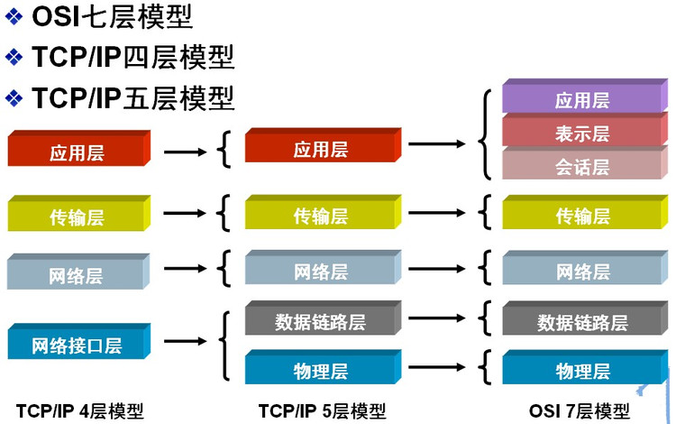

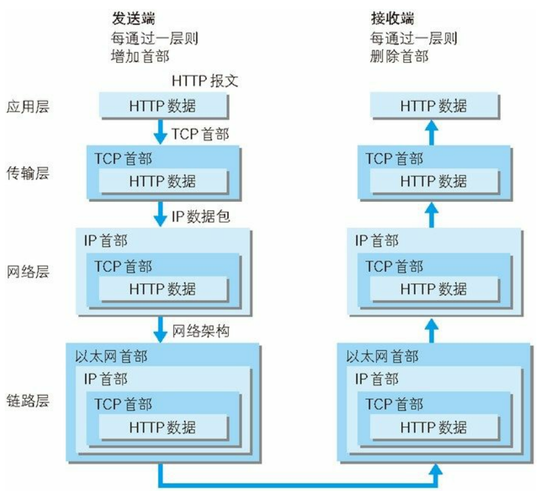

**IP协议**：负责传输；---路由选择

**TCP协议**：确保可靠性；---三次握手四次挥手

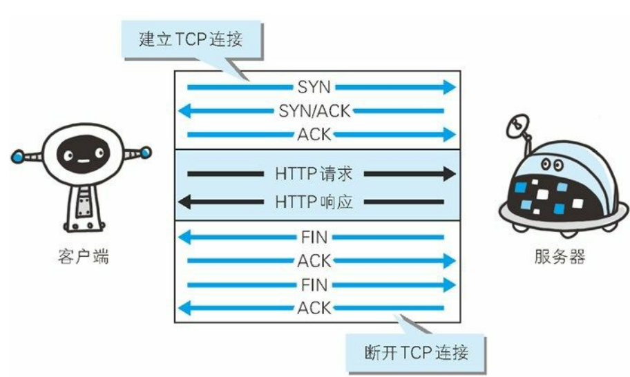

**DNS服务**：负责域名解析。

## 2.HTTP协议概述

**超文本传输协议**（Hypertext Transfer Protocol，HTTP）是一个简单的请求-响应协议，它通常运行在[TCP](https://baike.baidu.com/item/TCP/33012)之上。它指定了客户端可能发送给服务器什么样的消息以及得到什么样的响应。请求和响应消息的头以[ASCII](https://baike.baidu.com/item/ASCII/309296)形式给出；而消息内容则具有一个类似[MIME](https://baike.baidu.com/item/MIME/2900607)的格式。这个简单模型是早期[Web](https://baike.baidu.com/item/Web/150564)成功的有功之臣，因为它使开发和部署非常地直截了当。

通信规则规定了客户端发送给服务器的内容格式，也规定了服务器发送给客户端的内容格式，客户端发送给服务器的叫“**请求协议**”，服务器发送给客户端的叫“**响应协议**”。

在浏览器中按F12可以查看：

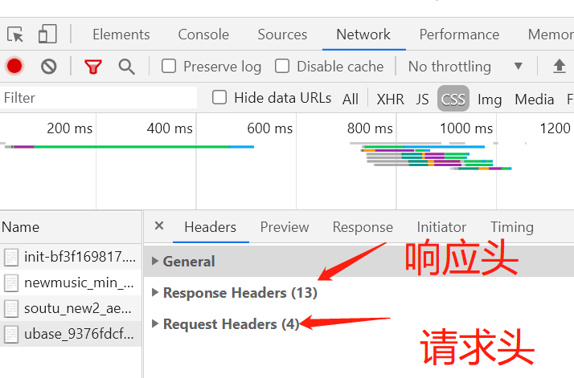

## 3.浏览器的书写格式

```
http://127.0.0.1:8080/project/index.html?name=张三
http是规则，以后大家可能还会遇到ftp等协议
127.0.0.1:8080是访问地址及端口号  可以通过cmd命令的ping 和 ipconfig查看本机或其他服务器的ip
project是工程类目
当浏览器获取信息后，按照特定格式解析并发送即可。接受到服务器给出的响应时，也按照http协议进行解析获取各个数据，最后按照特定格式展现给用户。
```

## 4.HTTP协议的特点

- 支持C/S模式；
- 简介快速：客户向服务器请求服务时，只需要发送请求的方式及路径。由于HTTP协议简单，使得HTTP的服务器程序规模小，因而通讯速度快。请求方法有GET,POST等，每种方法规定客户与服务器联系类型的不同；
- 灵活：HTTP允许传输任意类型的数据对象，传输的类型由Content-Type标记；
- 无连接：每次连接只处理一个请求，服务器处理完客户的请求，收到客户的应答后便断开连接，这种方式可以节省时间。（注：现在的http协议1.1版本可以支持可持续链接，效率更高）
- 无状态：HTTP协议是无状态协议。对于事物处理没有记忆能力。如果需要用到前面的信息，则它必须重传。这样导致每次的连接传的数据量增大，另一方面，在服务器不需要先前的信息时他的应答较快。

## 5.HTTP协议的URL

HTTP是一个基于请求与相应模式的，应用层协议，常基于TCP的连接方式，绝大多数的web开发，都是构建在HTTP协议上的web应用。

HTTP协议的URL格式如下：

```
http://host:port/abs-path

http:通过http协议定位网络资源
host:表示合法的Internet主机域名或者IP地址
port:指定的端口号，为空则表示使用了缺省端口80
abs-path:指定资源的URL，如果URL中没有给出abs-path,那么当他作为请求URL时，必须以/的形式给出通常这个工作由浏览器自动帮我们完成
```

在互联网上，域名通过DNS服务映射到IP地址之后访问目标网站。

在相同的IP地址下，由于虚拟主机可以寄存多个主机名和域名的web网站，因此在发送HTTP请求时，必须在Host首部内指定主机域名或域名URL。

## 6.HTTP请求

http请求由3部分组成：请求头，请求行，请求正文

通过开发者工具F12-Network查看

请求行以一个方法符号开头，以空格分开，后面跟请求的URL和协议版本，格式如下：

```
Method Request-URL HTTP-Version CRLF
```

Method:表示请求方法；

Request-URL：是一个统一资源标识符；

HTTP-Version：表CRLF示请求得版本协议;

CRLF:表示回车或换行。

示例：访问www.baidu.com打开鼠标右键检查可以看到：

Request Headers：请求协议，可以点击view source进行产看具体组成部分

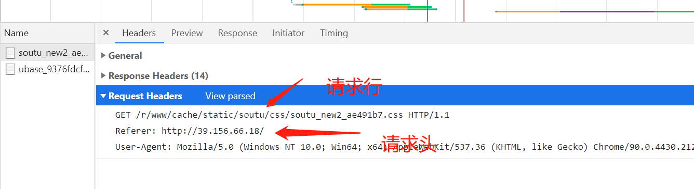

由此可以看出HTTP请求协议由三部分组成：**请求行，请求头（K-V结构），请求正文（只有POST请求才有）**；

请求行由请求方式，请求路径，请求版本协议组成。

**HTTP支持的方法**：

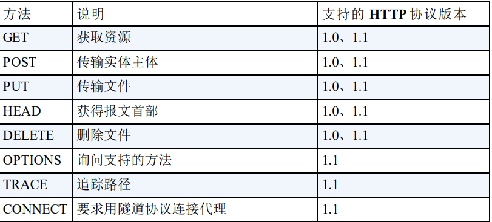

## 7.HTTP响应

在接收和解释请求消息后，服务器返回一个HTTP响应消息。HTTP响应消息由三部分组成：状态行，消息报文，响应正文。

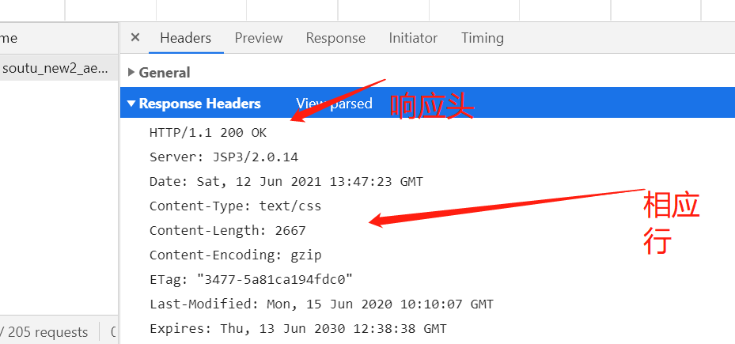

由此可以看出HTTP请求协议由三部分组成：**响应行，响应头（K-V结构），请求正文（只有POST请求才有）**；

响应行由响应方式，响应路径，响应版本协议组成。

### 格式：

```
状态行
响应头1
响应头2
....
响应空行
响应体
```

### 报文：

用于HTTP协议交互的信息被称为HTTP报文。客户端的请求信息被称为请求报文，服务器端的被称为响应报文。

HTTP的报文可分为报文首部和报文主体两块，最初由CRLF来划分。

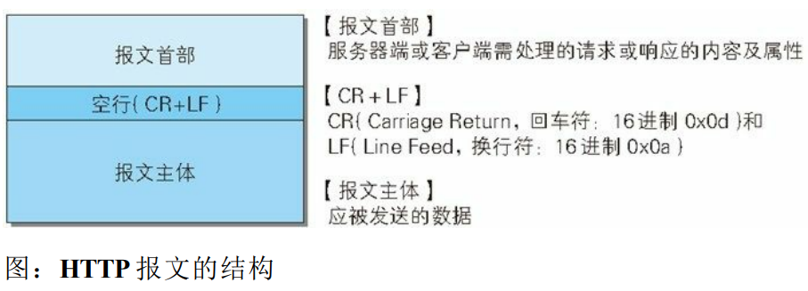

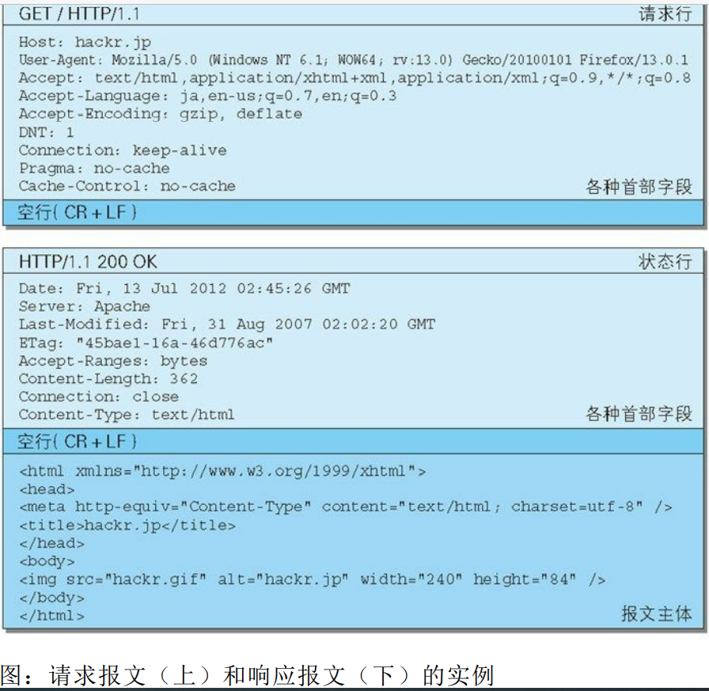

请求行：包含用于请求的方法，请求URL和HTTP的版本；

状态行：包含表明响应结果的状态码，原因短语和HTTP版本；

首部字段：包含表示请求和响应的各种条件或属性的各类部首；

一般有4种部首：通用部首，请求部首，响应部首和实体部首。

状态码的类别如下：

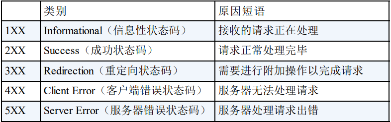

常见的状态码：200-成功，204-请求成功但没有资源返回，404-没有可返回的资源，500-服务器在执行请求时发生错误，通常是代码问题。

## 8.消息头

HTTP消息由客户端到服务器得请求和服务器到客户端得组成。请求消息和响应消息都是由开始行(对于请求消息，开始行就是请求行，对于响应消息，开始行就是状态行)，消息报头（可选），空行（只有CRLF的行），消息正文(可选)组成。

每个报头域都是由**名字+":"+空格+值** 组成，消息报头域的名字是忽略大小写的。


**请求头**

请求报头允许客户端向服务器端传递请求的附加消息以及客户端自身的消息。

- **<u>Referer</u>**：该请求头指明请求从哪里来

  比如广告请求，摩天轮票务网等，有广告的和没没广告的进入都是相同网站，但是有广告的会收广告费
  
  如果是地址栏中输入地址访问的都没有该请求头，地址栏输入地址，通过请求可以看到，此时多了一个Referer的请求头，并且后面的值表示该请求从哪里发出。比如：百度文档，只能从百度来才有效，否则不算。通常用来做统计工作，防盗链。

**响应头：**

响应报头允许服务器传递不能放在状态行中的附加相应信息，以及关于服务器的信息和Re'quest-URL所标识的资源进行下一步的访问信息。

- **<u>Location</u>**:Location响应报头域用于重定向接收者到一个新的位置，Location响应报头域常用在更换域名的时候:

  ```
  response.sendRedirect("http://www.baidu.com")
  ```

  ```
  location--统一资源定位符  互联网每个文件都有一个唯一的url
  * 他指出浏览器的位置和和浏览器该怎么去执行它
  * location对象属性和返回值：
  * localtion.href  获取或设置整个Url
  * location.host   获取主机域名  www.baidu.com
  * location.port   获取端口号
  * location.pathname  获取路径
  * location.search  返回参数
  * location.hash   返回片段#后面的内容
  * 在F12写location回车就可以看到以上属性
  ```

- **<u>Refresh:</u>**:自动跳转（单位是秒），可以在页面通过meta标签来实现，也可以在后台实现：

  ```
  <meta http-equiv="refresh" content="3;url=http://www.baidu.com">  // 3秒后跳转到百度
  ```

## 9.通信数据转发程序

HTTP通信时，除客户端和服务器外，还有一些用于通信数据转发的应用程序，例如代理，网关和隧道。这些应用程序和服务器可以将请求转发给通信线路上的下一站服务器，并且能将接收那台服务器发送的响应再转发给客户端。

- **代理**：代理是一种有转发功能的应用程序，它扮演了服务器和客户端中间人的角色，接受由客户端发送的请求并转发给服务器，同时也接受服务器返回的响应并转发给客户端。
- **网关**：网关时转发其他服务器通信数据的服务器，接受从客户端发来的请求时，它就像自己拥有资源的源服务器一样对请求进行处理。客户端有时都不会察觉，自己的通信目标是一个网关。
- **隧道：**隧道是在相隔甚远的客户端和服务器两者之间进行转换，并保持双方通信连接的应用程序。

## 10.确保Web安全的HTTPS

### 10.1 HTTP的不足：

- 通信使用明文（不加密），内容可能会被窃听；

- 不验证通信方的身份，因此有可能遭遇伪装；

- 无法证明报文的完整性，所以有可能已遭篡改。

  

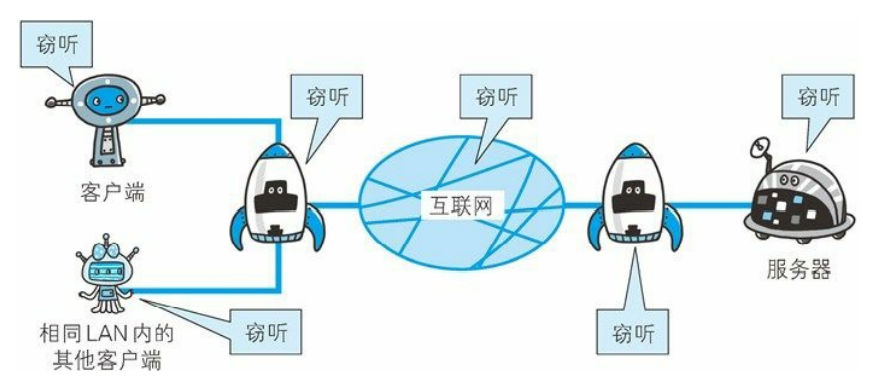

图：互联网的任何角落都有可能遭遇窃听风险

### 10.2 加密处理

世界互联网无处不在的窃听，那么我们该怎么办呢？

这是我们可以将我们请求的对象进行加密，加密的对象可以有一下几个：

**通信的加密**：HTTP协议中没有加密的机制，但可以通过SSL（Secure Sokect Layer 安全套接层）或TLS（Transport Layer Securety 安全层传输协议）的组合使用，加密HTTP的通信内容。

用SSL建立的通信协议后，就可以在这体哦啊线路上进行HTTP通信了。与SSL组合使用的HTTP被称为HTTPS（HTTP Secure 超文本传输安全协议）或 HTTP over SSL。

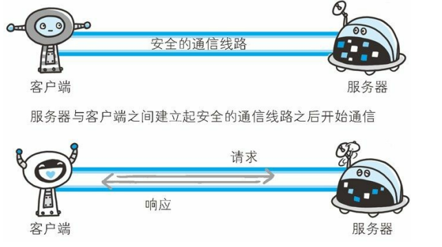

**内容的加密**：把HTTP报文里所有的内容加密处理。在这种情况下，客户端需要对HTTP报文进行加密处理后再发送请求。

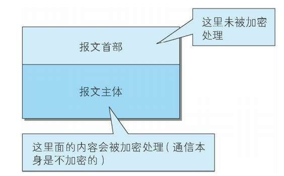

值得注意的是，由于该方式不同于SSL或TLS将整个通信线路加密处理，所以内容仍有被篡改的风险。

### 10.3 HTTP+加密+认证+完整性保护=HTTPS

HTTP加上加密处理和认证以及完整性保护后就是HTTPS

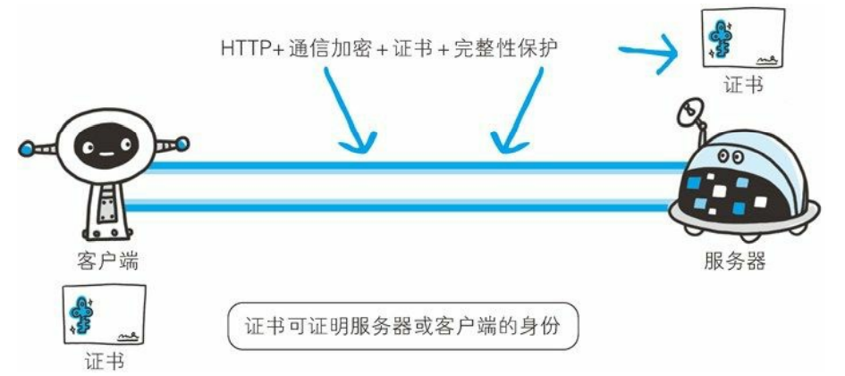

如果HTTP协议中使用未经通信加密的明文，比如在web网页中输入信用卡号，如果这条通信线路遭到窃听就会被暴露。

另外，对于HTTP来说，客户端也好，服务器也罢，都没有办法确认通信方的。因为可能并不是和实际预想的通信方通信，并且还要考虑到接收报文途中遭遇篡改的可能性。

为了统一解决上述问题，需要在HTTP上再加入加密处理和认证等机制，所以HTTPS诞生了。

通常使用HTTPS在登录页面和购物结算页面，使用HTTPS时，不再用http://，而是改用https://。另外，当浏览器在访问使用HTTPS的网站时，浏览器地址栏会出现一个带有锁的标记，对HTTPS的显示方式会因浏览器的不同而有所改变。

**HTTPS使用了混合加密的方式：**

HTTPS采用了共享密钥加密和公开密钥加密两者并用的混合加密机制。

- 共享密钥加密：加密和解密同用一把密钥；
- 公开密钥：使用一对非对称的密钥，一把叫做私有密钥，一把叫做公开密钥。使用公开密钥进行加密，使用私有密钥进行解密，这种方式不用担心密钥被攻击者窃听而盗用。

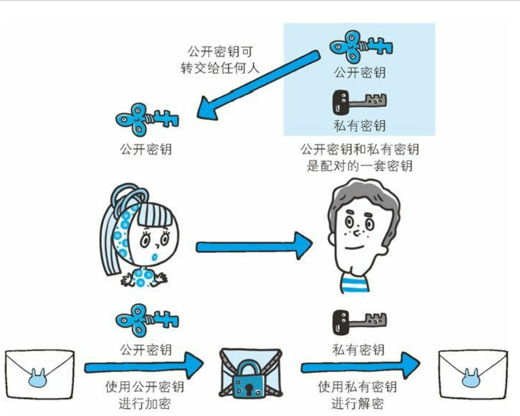

# 


# HTTPServlet

## 1.HTTPServlet的主要内容

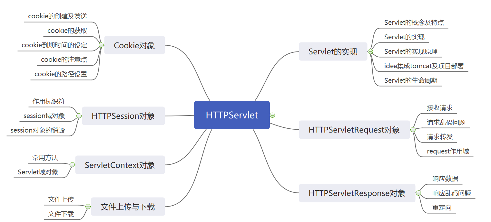

**了解：什么是jsp，和Servlet有什么区别？**

jsp 本质上就是一个 Servlet，它是 Servlet 的一种特殊形式（由 SUN 公司推出），每个 jsp 页面都是一个 servlet实例。

Servlet 是由 Java 提供用于开发 web 服务器应用程序的一个组件，运行在服务端，由 servlet 容器管理，用来生成动态内容。一个 servlet 实例是实现了特殊接口 Servlet 的 Java 类，所有自定义的 servlet 均必须实现 Servlet 接口。

区别：

jsp 是 html 页面中内嵌的 Java 代码，侧重页面显示；

Servlet 是 html 代码和 Java 代码分离，侧重逻辑控制，mvc 设计思想中 jsp 位于视图层，servlet 位于控制层Jsp 运行机制：

jsp执行过程如下图：

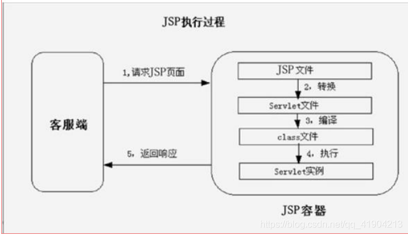

JVM 只能识别 Java 类，并不能识别 jsp 代码！web 容器收到以.jsp 为扩展名的 url 请求时，会将访问请求交给tomcat 中 jsp 引擎处理，每个 jsp 页面第一次被访问时，jsp 引擎将 jsp 代码解释为一个 servlet 源程序，接着编译servlet 源程序生成.class 文件，再有 web 容器 servlet 引擎去装载执行 servlet 程序，实现页面交互。

## 2.Servlet的实现

Servlet是Server和Applet的缩写，是服务小程序的意思，使用Java语言编写的服务端小程序，可以生成动态的web网页，Servlet主要运行在服务器端，并由服务器调用执行，是一种按Servlet标准来开发的类。是sun公司提供的一门开发动态web资源的技术（要实现web页面开发，就需要实现servlet标准）。

Servlet本质上也是Java类，但要遵循Servlet规范进行编写，没有main()方法，他的创建，使用，销毁都有Servlet容器进行管理（如tomcat）。就是自己写的类不需要main(),由服务器调用。

Servlet是和HTTP协议紧密联系的，其可以处理HTTP协议相关的所有的内容。这也是Servlet广泛应用的关键。

提供Servlet功能的服务器，叫做Servlet容器，常见的容器有很多，如tomcat,jetty,weblogic Server,jboss等。

### 2.1 创建web项目

**1.idea选择File-->New-->Project-->创建java**

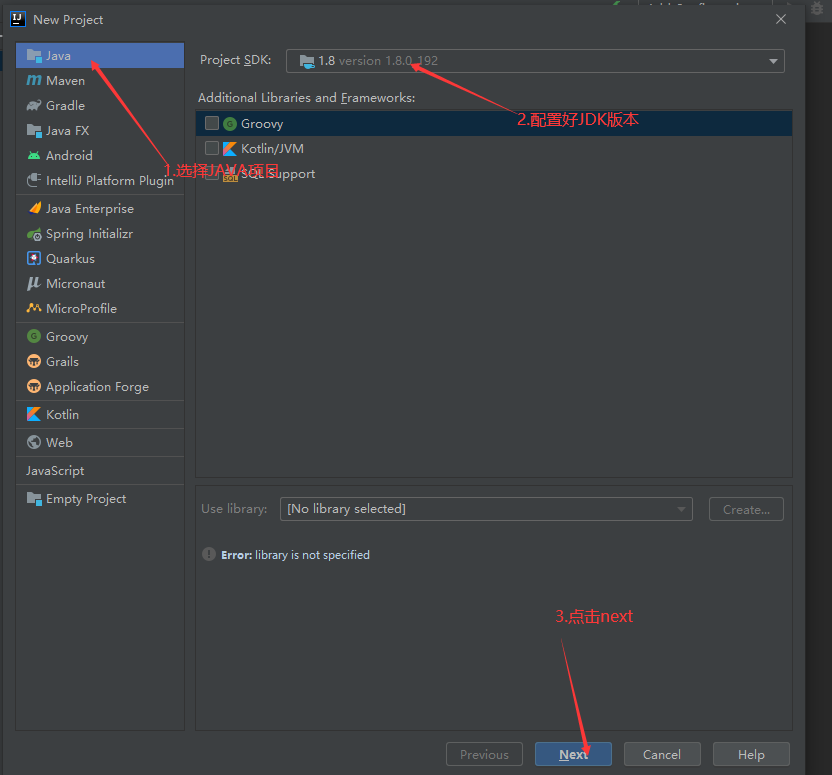

**2.命名好项目名称，选择好项目工作空间后点击Finish**

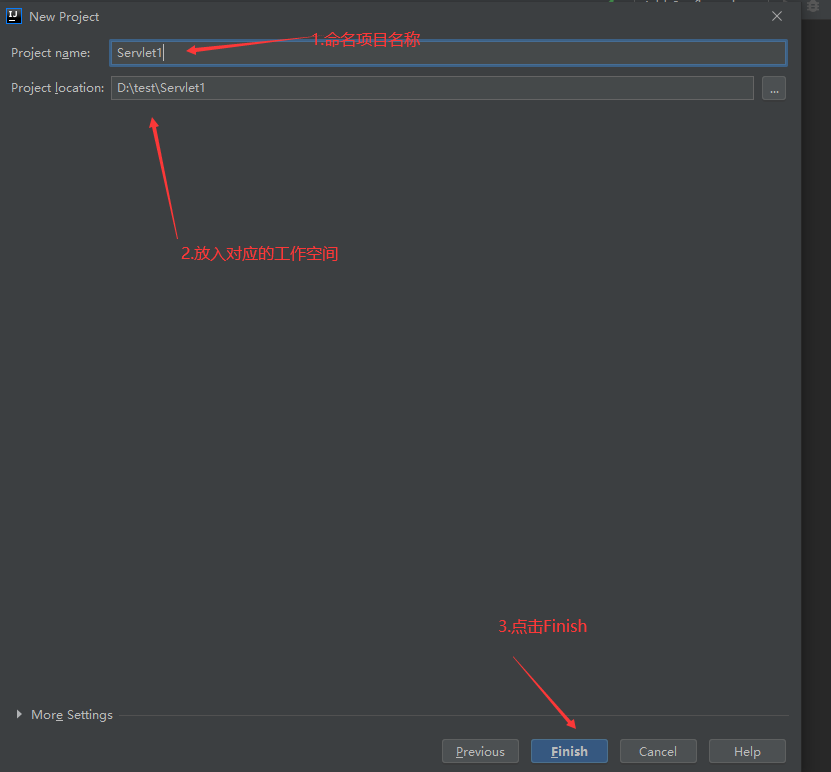

**此时的项目只是简单的Java项目，要想让它变成web项目，我们还需要以下步骤：**

**3.点击项目名，鼠标右键，选择Add Framework Support...**

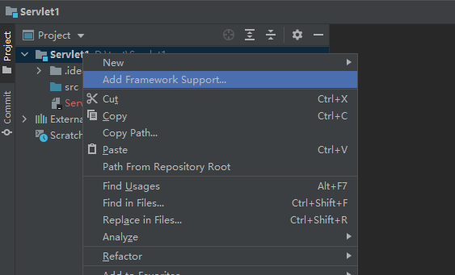

**4.勾选web application,并勾选创建web.xml点击OK**

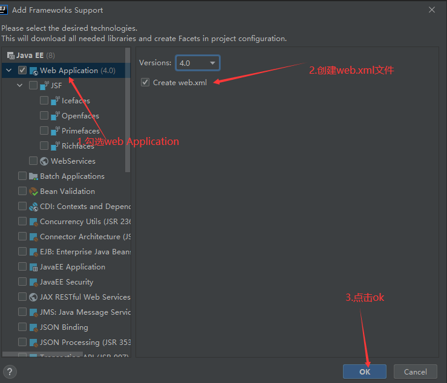

**此时的项目就是一个完整的web项目，有WEB-INF文件夹，并在文件夹下有一个web.xml的文件**

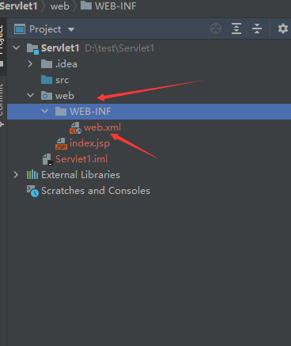

**5.打开项目后需要在任务栏配置tomcat服务器**

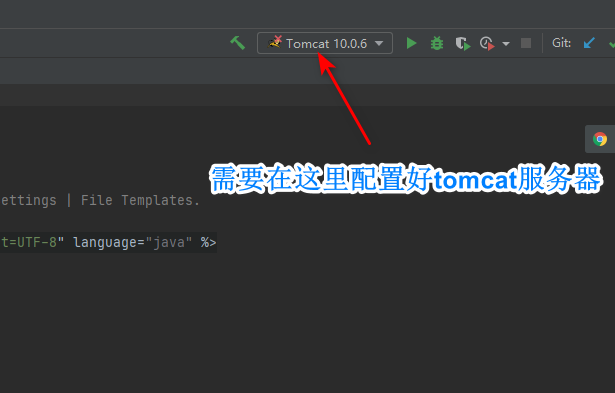

**6.点击Edit编辑tomcat服务器**


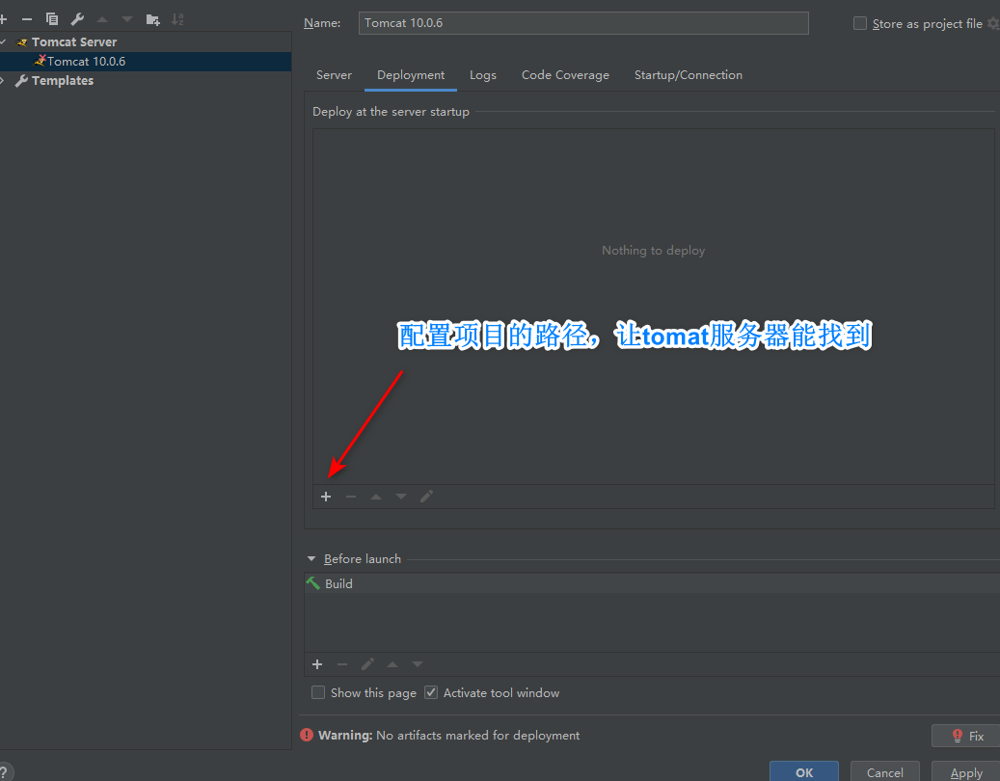

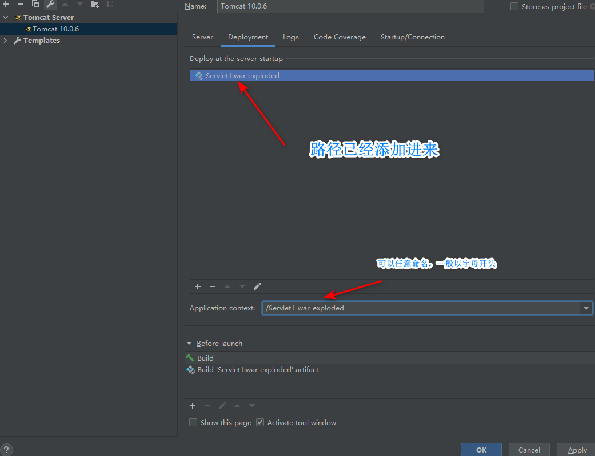

**命名Application context后要将Server中的URL匹配**

**7.启动服务**

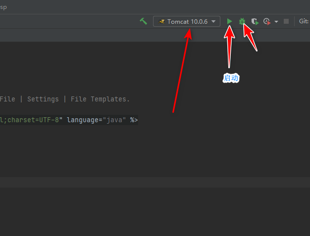

### 2.2 Servlet的实现

Servlet的实现步骤：

1.新建web项目，新建包和类；

2.继承父类HttpServlet；

3.重写父类方法service；

4.接收请求，相应结果；

5.设置访问路径@WebServlet("/路径")。

#### 2.2.1 新建包，新建类

​	**1.点击File-->new -->package 创建一个包，然后在包下创建类并继承HttpServlet;**

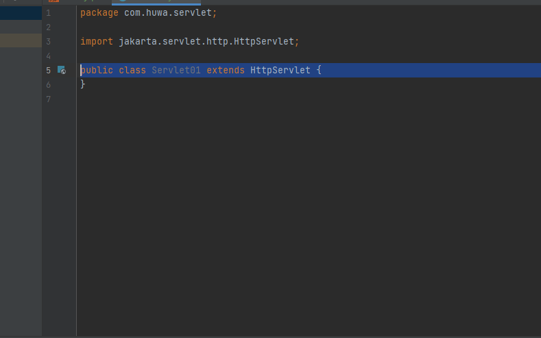

**注：如果继承不了HttpServlet，则需要按以下步骤集成tomcat服务器：**

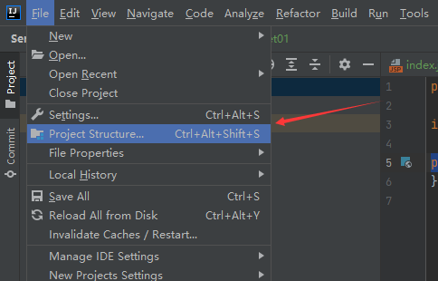

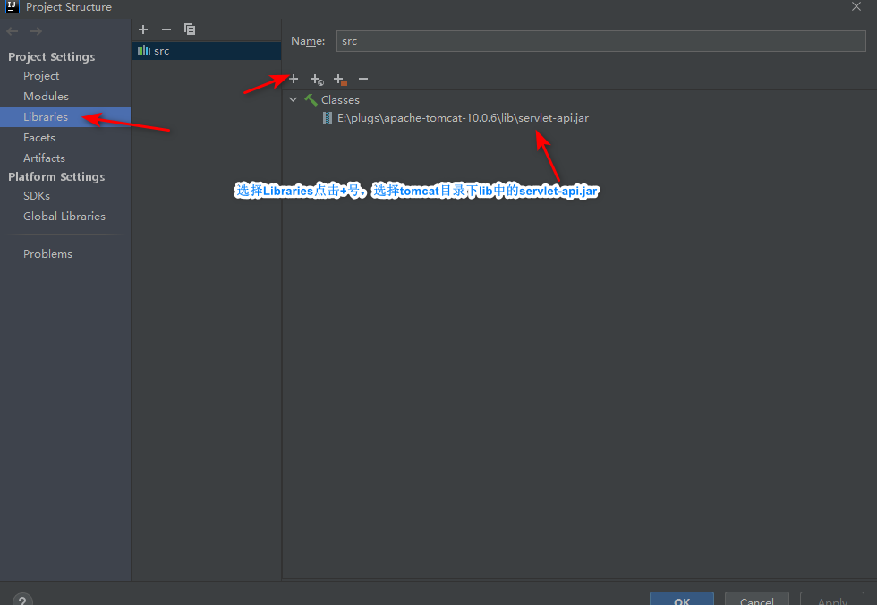

#### 2.2.2 重写父类方法 Ctrl+O，并接收请求，返回响应


```
package com.huwa.servlet;

import jakarta.servlet.ServletException;
import jakarta.servlet.annotation.WebServlet;
import jakarta.servlet.http.HttpServlet;
import jakarta.servlet.http.HttpServletRequest;
import jakarta.servlet.http.HttpServletResponse;

import java.io.IOException;

@WebServlet("/s02") // 设置访问路径
public class Servlet01 extends HttpServlet {

    @Override
    protected void service(HttpServletRequest req, HttpServletResponse resp) throws ServletException, IOException {

        // 接受请求
        String username = req.getParameter("username");
        System.out.println("请求参数"+username);

        // 响应结果
        resp.getWriter().write("Hello"+username);
    }
}

```

注解配置访问路径

```
可以设置单个路径
@WebServlet(name = "Servlet01",value = "/s01")
@WebServlet(name = "Servlet01",urlPatterns = "/s01")
也可以设置多个路径
@WebServlet(name = "Servlet01",value = {"/s01","/s02"})
@WebServlet(name = "Servlet01",urlPatterns = {"/s01","/s02"})
```


#### 2.2.3 发布项目并启动服务

编写完成，但需要外界访问到这个项目，还需要将项目发布到服务器上并运行。

##### 2.2.3.1 启动服务，并在浏览器中拼接参数访问

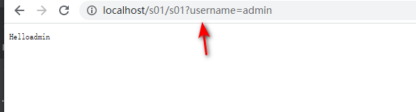


### 2.3 Servlet的工作流程

1.通过请求头获知浏览器访问的是哪个主机；

2.再通过请求行获取访问的是哪一个web应用；

3.再通过请求行中的访问路径获知访问的是哪个资源；

4.通过获取的路径，匹配真实的路径；

5.服务器会创建servlet队象（如果第一次访问时，创建servlet实例，并调用init方法进行初始化操作）；

6.调用service(request,response)来处理请求和响应操作；

7.调用service完毕后返回服务器，并由服务器将response缓冲区的数据取出，以http的格式发送给浏览器。


在HttpServlet中的service()相当于是doGet()和doPost()的集合：

```
package com.huwa.servlet;

import jakarta.servlet.ServletException;
import jakarta.servlet.annotation.WebServlet;
import jakarta.servlet.http.HttpServlet;
import jakarta.servlet.http.HttpServletRequest;
import jakarta.servlet.http.HttpServletResponse;

import java.io.IOException;

@WebServlet("/s03")
public class Servlet03 extends HttpServlet {
    @Override
    protected void doGet(HttpServletRequest req, HttpServletResponse resp) throws ServletException, IOException {
        System.out.println("doGet请求");
        doPost(req,resp);
    }

    @Override
    protected void doPost(HttpServletRequest req, HttpServletResponse resp) throws ServletException, IOException {
        System.out.println("doPost请求");
    }
}
```


#### 2.4 Servlet的生命周期

servlet没有main（）方法，不能独立运行，它的运行完全由servlet引擎来控制和调度。所谓的生命周期，指的是servlet容器何时创建servlet实例，何时调用其方法进行请求的处理，何时销毁其实例的整个过程。

- **实例和初始化时机**

  当请求到达容器时，容器查找该servlet对象	是否存在，如果不存在，则会创建实例并初始化。

- **就绪/调用/服务阶段**

  有请求到达容器，容器调用servlet的service（）方法，处理请求的方法在整个生命周期中可以被多次调用，HttpServler的service()方法会依据请求方式来调用doGet()或者doPost()方法。但是这两个方法在默认情况下会抛出异常，需要子类取override。

- **销毁时机**

  当容器关闭时（应用停止）	，会将程序中的servlet进行销毁。

上述的生命周期可以通过Servlet中的生命周期方法进行观察。在Servlet中有3个生命周期方法，不由用户手动调用，而是在特定的时机由容器主动调用，观察这3个生命周期的方法即可观察到Servlet的生命周期。


创建Servlet类继承HttpServlet，并重写它的init(),service(),destroy();

```
@WebServlet("/s04")
public class Servlet04 extends HttpServlet {
    /**
     * 服务方法
     * @param req
     * @param resp
     * @throws ServletException
     * @throws IOException
     */
    @Override
    protected void service(HttpServletRequest req, HttpServletResponse resp) throws ServletException, IOException {
        System.out.println("Service.....");
    }

    /**
     * 销毁方法
     */
    @Override
    public void destroy() {
        System.out.println("destroy....");
    }

    /**
     * 初始化方法
     * @throws ServletException
     */
    @Override
    public void init() throws ServletException {
        System.out.println("init.....");
    }
}

```


**当我第一次启动服务时，servlet类会调用init()方法和service()方法:**

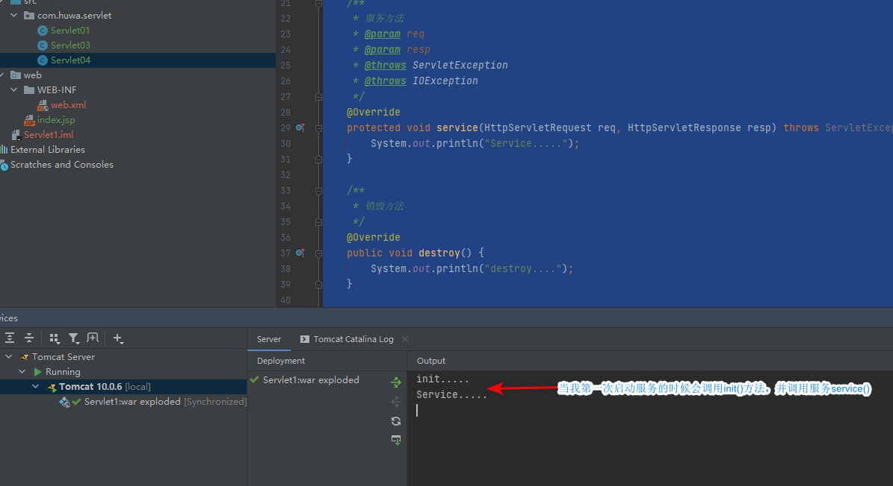


**当我再次刷新页面时，service()方法再次被调用，证明service()方法是在每次用它的时候都会调用一次：**

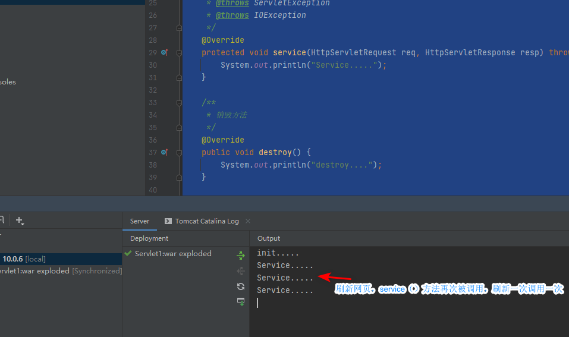


**当我再重启这个服务时，表示前面创建的实例将不再调用，就会执行销毁方法destroy():**

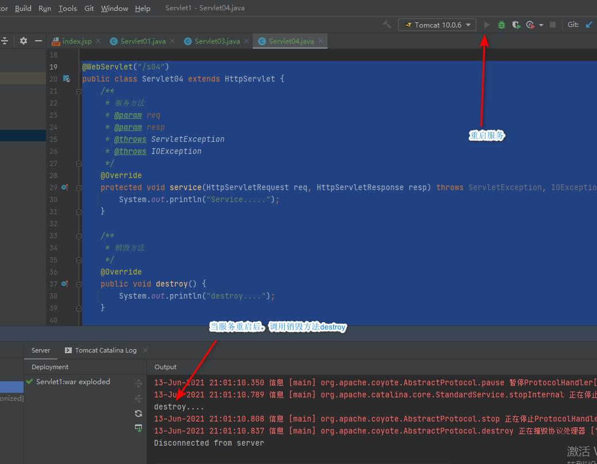


Servlet的生命周期，简单概括分为以下4步：

**Servlet类的加载-->实例化-->服务-->销毁**


下图描述了tomcat和Servlet工作的时序图;

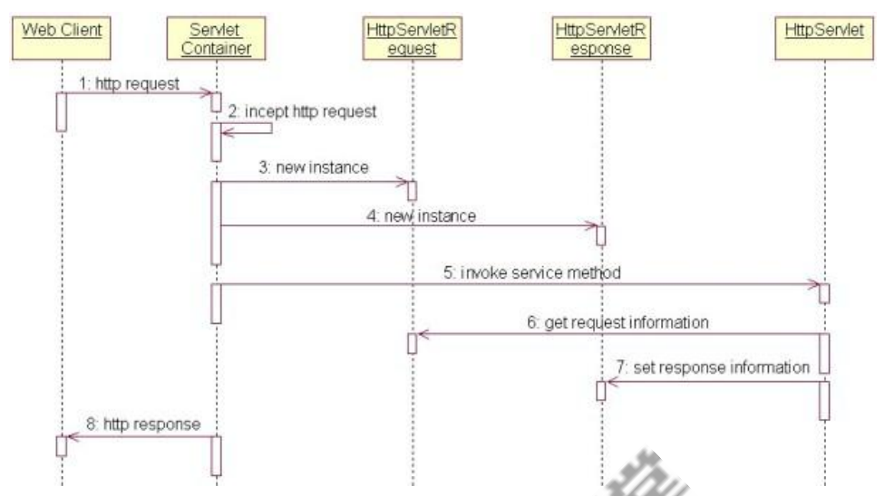

1.Web Client向Servlet容器（Tomcat）发送请求；

2.Servlet接收Web Client的请求；

3.Servlet容器创建一个HttpServletRequest对象，将Web Client请求的信息封装到这个对象中；

4.Servlet容器创建一个HttpServletResponse对象；

5.Servlet容器调用HttpServlet对象的service()方法，把Request和Response作为参数，传给HttpServler;

6.HttpServlet调用HttpServletRequest对象的有关方法，获取Http请求信息；

7.HttpServlet调用HttpServletResponse对象的有关方法，生成响应数据；

8.Servlet容器把HttpServlet的响应结果传给Web Client.


## 3.HttpServletRequest对象

HttpServletRequest对象：主要作用是接收客户端发送过来的信息，例如：请求的参数，发送的头信息等都属于客户端发送过来的信息。service()方法中的形参接收的是HttpServletRequest接口的实例化对象，表示该对象主要应用在HTTP协议上，该对象由tomcat封装好传递过来。

HttpServletRequest是ServletRequest的子接口，ServletRequest也只有这么一个子接口。既然只有一个子接口，为什么不将这两个接口合并呢？

从长远上来讲：现在主要用的协议是Http协议，但以后可能出现更多新的协议，若以后想要支持这种新的协议，只需要直接继承ServletRequest接口就行了。

在HttpServletRequest中定义了很多的方法，但都是围绕接收客户端参数的。那么该怎么拿到该对象呢？不需要，直接在service()方法中由容器传入过来，而我们需要做的就是取出对象中的数据，进行分析、处理。


### 3.1 接受请求

#### 3.1.1 常用方法

​	**1.方法**

| getRequestURL()      | 获取客户端发出请求时的完整URL  http开始到?结束         |
| -------------------- | ------------------------------------------------------ |
| **getRequestURI()**  | **获取请求行中的资源名称部分（项目名称开始,站点名） ** |
| **getQueryString()** | **获取请求行中的参数部分**                             |
| **getMethod()**      | **获取客户端请求方式**                                 |
| **getProtocol()**    | **获取HTTP版本号**                                     |
| **getContextPath()** | **获取webapp名字**                                     |

​	**2.示例**

```
package com.hwua.servlet;

import javax.servlet.ServletException;
import javax.servlet.annotation.WebServlet;
import javax.servlet.http.HttpServlet;
import javax.servlet.http.HttpServletRequest;
import javax.servlet.http.HttpServletResponse;
import java.io.IOException;

/**
 * HttpServletRequest对象的请求方法
 *
 */
@WebServlet("/ser01")
public class Servlet01 extends HttpServlet {

    @Override
    protected void service(HttpServletRequest req, HttpServletResponse resp) throws ServletException, IOException {
    	// http://localhost:80/s02/ser01?name=admin&pwd=123456
        // 1.获取完整路径（从http开始到?结束）
        System.out.println(req.getRequestURL());

        // 2.获取请求部分路径（从站点名/项目对外访问路径开始，到?前面结束）
        System.out.println(req.getRequestURI());

        // 3.获取请求参数字符串(从?开始到最后)
        System.out.println(req.getQueryString());

        // 4.获取请求的方式 POST/GET
        System.out.println(req.getMethod());

        // 5.获取请求的协议版本
        System.out.println(req.getProtocol());

        // 6.获取站点名
        System.out.println(req.getContextPath());
        
    }
}

```


#### 3.1.2 获取请求参数

​	**1.方法**

| getParameter(name)                  | 获取指定名称的参数       |
| ----------------------------------- | ------------------------ |
| **getParameterValues**(String name) | 获取指定名称参数的所有值 |

​	**2.示例**

```
package com.hwua.servlet;

import javax.servlet.ServletException;
import javax.servlet.annotation.WebServlet;
import javax.servlet.http.HttpServlet;
import javax.servlet.http.HttpServletRequest;
import javax.servlet.http.HttpServletResponse;
import java.io.IOException;

/**
 * HttpServletRequest对象的请求方法
 *
 */
@WebServlet("/ser02")
public class Servlet02 extends HttpServlet {

    /**
     * * http://localhost:80/s02/ser02?name=张三&pwd=123456&hobby=sing&hobby=dance&hobby=play
     * @param req
     * @param resp
     * @throws ServletException
     * @throws IOException
     */
    @Override
    protected void service(HttpServletRequest req, HttpServletResponse resp) throws ServletException, IOException {
        // 1.获取请求参数--通过参数名获取参数值 getParamter("参数名") 返回的是字符串
        String name = req.getParameter("name");// 括号中的值要与请求地址中=前面的值保持一致
        System.out.println("姓名"+ name);
        System.out.println("密码" + req.getParameter("pwd"));

        // 2.通过参数名获取请求的所有参数值
        String[] hobby = req.getParameterValues("hobby");
        System.out.println(hobby.length);

    }
}

```

用我们以上方法访问的url：http://localhost:80/s02/ser02?name=张三&pwd=123456&hobby=sing&hobby=dance&hobby=play在控制台是可以正常显示中文的：

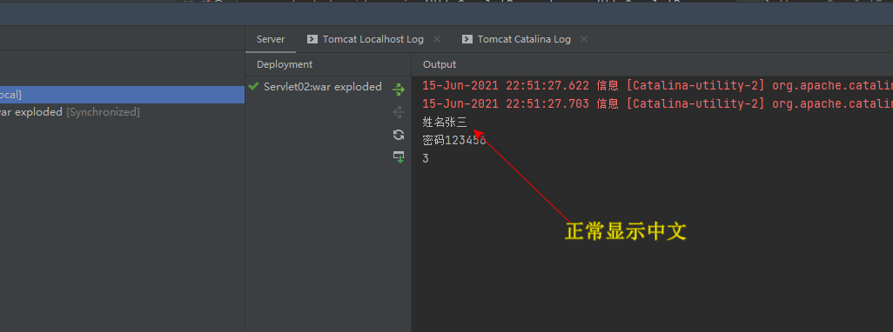

但是我们选择表单提交时就会出现乱码：

1.在index.jsp添加表单提交，提交方式为post

```
<%@ page contentType="text/html;charset=UTF-8" language="java" %>
<html>
  <head>
    <title>$Title$</title>
  </head>
  <body>
  <form method="post" action="ser02">
    姓名：<button name="name" type="text"></button>
    密码：<button name="pwd" type="password"></button>
    <button>提交</button>
  </form>
  </body>
</html>
```

2.重启访问http://localhost/s02/ser02 输入中文提交，此时就会出现乱码:

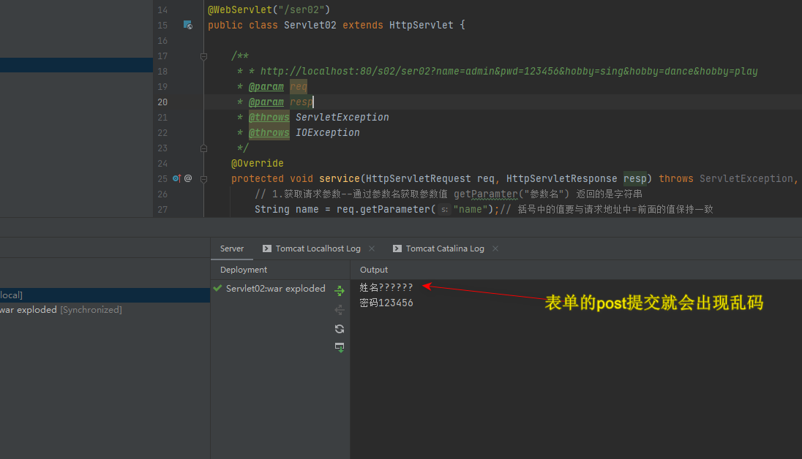

### 3.2 请求乱码的问题

由于现在的request属于接收客户端的参数，所以必然有其默认的语言编码，主要是由于在解析过程中默认使用的编码方式为ISO-8859-1(此编码不支持中文)，所以解析时一定会出现乱码。要想解决这种乱码问题，需要设置request中的编码方式，告诉服务器以何种方式解析数据，或者在接收到乱码	数据以后，再通过响应的编码格式还原。

**方式一：**

```
request.setCharacterEncoding("UTF-8");
```

这种方式只针对POST请求有效（必须在接受所有数据之前设定）

**方式二：**

```
new String(request.getParameter(name).getBytes("ISO-8859-1"),"UTF-8");
```

接住了String对象的方法，这种方式对任何请求有效，是通用的。

Tomcat8起，以后的GET方式请求是不会乱码的。

```
package com.huwa.servlet;

import javax.servlet.ServletException;
import javax.servlet.annotation.WebServlet;
import javax.servlet.http.HttpServlet;
import javax.servlet.http.HttpServletRequest;
import javax.servlet.http.HttpServletResponse;
import java.io.IOException;

/**
 * HttpServletRequest对象的请求方法
 * 请求乱码问题
 * tomcat8以上版本 GET请求不会乱码，POST请求会乱码
 * req.setCharacterEncoding("UTF-8");
 * tomcat7及一下版本GET和POST都会乱码
 *
 */
@WebServlet("/ser02")
public class Servlet02 extends HttpServlet {

    /**
     * * http://localhost:80/s02/ser02?name=admin&pwd=123456&hobby=sing&hobby=dance&hobby=play
     * @param req
     * @param resp
     * @throws ServletException
     * @throws IOException
     */
    @Override
    protected void service(HttpServletRequest req, HttpServletResponse resp) throws ServletException, IOException {
       // 设置请求的编码格式
        req.setCharacterEncoding("UTF-8");


        // 1.获取请求参数--通过参数名获取参数值 getParamter("参数名") 返回的是字符串
        String name = req.getParameter("name");// 括号中的值要与请求地址中=前面的值保持一致
        System.out.println("姓名"+ name);
        System.out.println("密码" + req.getParameter("pwd"));

        // 2.通过参数名获取请求的所有参数值
        String[] hobby = req.getParameterValues("hobby");
        System.out.println(hobby.length);

    }
}

```


### 3.3 请求转发

请求转发，是一种**服务器的行为**，当客户端请求到达后，服务器进行转发，此时会将请求对象进行保存，地址栏中的url地址不会发生改变，**得到响应后**，服务器端再将响应发送给客户端，**从始至终只有一个请求发出**。

实现方式如下，达到多个资源协同响应的结果：

```
request.getRequestDispatcher(url).forward(request,response);
```


### 3.4 request的作用域

​	通过该对象可以在一个请求中传递数据，作用范围：**在一次请求中有效，即服务器跳转有效**：

```
// 设置域对象内容
request.setAttribute(String name,String value);
// 获取域对象内容
request.getAttribute(String name);
// 删除域对象内容
request.removeAttribute(String name);
```

request域对象的数据在一次请求中有效，则经过请求转发，request域中的数据依然存在，则在请求转发的过程中可以通过request来传输或共享数据。

案例：

1.设计登录页面表单

```
<%@ page contentType="text/html;charset=UTF-8" language="java" %>
<html>
<head>
    <title>用户登录</title>
</head>
<body>
    <form method="post" action="ser04">
        姓名：<input type="text" name="userName" >
        密码：<input type="password" name="userPwd">
        <button type="submit">登录</button> <%=request.getAttribute("msg")%>
    </form>
</body>
</html>

```

2.完成账户密码的验证

```
package com.huwa.servlet;

import javax.servlet.ServletException;
import javax.servlet.annotation.WebServlet;
import javax.servlet.http.HttpServlet;
import javax.servlet.http.HttpServletRequest;
import javax.servlet.http.HttpServletResponse;
import java.io.IOException;

/**
 * 用户登录，对应login.jsp
 * @Author zoutr
 * @Description
 * @Date 2021/6/16
 * @Copyright 中信网络科技有限公司 Copyright(c)
 **/
@WebServlet("/ser04")
public class Servlet06 extends HttpServlet {
    /**
     * 用户登录成功跳转到首页，并输出欢迎***登录成功
     * 登录失败，跳转到登陆页面，并显示登录失败原因
     * 姓名：admin
     * 密码：123456
     * 请求转发: req.getRequestDispatcher("/")
     */
    @Override
    protected void service(HttpServletRequest req, HttpServletResponse resp) throws ServletException, IOException {
        //设置请求的编码格式
        req.setCharacterEncoding("UTF-8");

        // 接受请求的参数
        String username = req.getParameter("username"); // 表单元素input的name属性值一样
        String pwd = req.getParameter("pwd");

        // 判断用户名
        if (username == null || !"admin".equals(username)) {

            // 设置request请求域---相当于是一个特殊的变量，存入动态页面。作用域：将数据存储起来
            req.setAttribute("msg", "用户名不正确");

            // 请求转发
            req.getRequestDispatcher("login.jsp").forward(req, resp);
            return;
        }
        if (pwd == null || !"123456".equals(pwd)) {

            //  设置request请求域---相当于是一个特殊的变量，存入动态页面。作用域：将数据存储起来
            req.setAttribute("msg", "密码不正确");

            // 请求转发
            req.getRequestDispatcher("login.jsp").forward(req, resp);
            return;
        }

        // 登录成功页面跳转
        // 将用户名设置到作用域中
        req.setAttribute("username", username);
        // 请求转发跳转到首页
        req.getRequestDispatcher("main.jsp").forward(req, resp);

    }
}

```

3.跳转成功的main.jsp

```
<%--
  Created by IntelliJ IDEA.
  User: Lisa Li
--%>
<%@ page contentType="text/html;charset=UTF-8" language="java" %>
<html>
<head>
    <title>首页</title>
</head>
<body>
    <h2>
        欢迎<%=request.getAttribute("userName")%>登录！
    </h2>
</body>
</html>

```

4.访问localhost:8080/s01/login.jsp登录

输入username = admin , pwd = 123456

页面成功跳转到main.jsp

## 4.HttpServletResponse对象

Web服务器收到客户端的http请求，会针对每一次的请求，分别创建一个用于**代表请求的request对象**，和**代表响应的response对象**。

request和response对象代表请求和响应：**获取客户端的资源需要通过resquest对象；向客户端输出数据需要通过response对象**。


HttpServletResponse的主要功能用于服务器对客户端的请求进行相应，将web服务器处理后的结果返回给客户端。service()方法中的形参接收的是HttpServletResponse接口的实例化对象，这个对象中封装了向客户端发送数据，发送响应头，发送响应状态码的方法。


#### 4.1 响应数据

接收客户端的请求后，可以通过HttpServletResponse对象直接进行相应，响应时需要获取输出流。有以下两种形式：

```
getWriter()   --获取字符流（只能响应回字符）
getOutputStream()   --获取字节流（能响应一切数据）
响应回的数据到客户端被浏览器解析
```

**注意：两者不能同时使用：**

```
package com.huwa.servlet;

import javax.servlet.ServletException;
import javax.servlet.ServletOutputStream;
import javax.servlet.annotation.WebServlet;
import javax.servlet.http.HttpServlet;
import javax.servlet.http.HttpServletRequest;
import javax.servlet.http.HttpServletResponse;
import java.io.IOException;
import java.io.PrintWriter;

/**
 * getWriter()   --获取字符流（只能响应回字符）
 * getOutputStream()   --获取字节流（能响应一切数据）
 * 响应回的数据到客户端被浏览器解析
 **/
@WebServlet("/ser05")
public class Servlet07 extends HttpServlet {
    @Override
    protected void service(HttpServletRequest req, HttpServletResponse resp) throws ServletException, IOException {
        // 字符输出流
        PrintWriter writer = resp.getWriter();
        writer.write("Hello");
        writer.write("<h2>Hello</h2>");
        writer.flush();
        writer.close();

// 字节输出流
        ServletOutputStream out = resp.getOutputStream();
        out.write("Hello".getBytes());
        out.write("<h2>Hello</h2>".getBytes());
        out.flush();
        out.close();
    }
}
```

以上两种流一起使用会报错。

如果上面的Hello拼接中文会出现字节不乱码，字符乱码的状况

设置相应类型，默认是字符串：

```
// 设置响应的MIME类型
response.setHeader("content-type","text/html"); // html
```

#### 4.2 响应乱码问题

在响应中，如果我们响应的内容中含有中文，则有可能出现乱码。这是因为服务器传输的数据也会经过网络传输，服务端有一种编码方式，在客户端也存在一种编码方式，当两端使用的编码方式不同时就会出现乱码。

**getWriter()的字符乱码**

对于getWriter()获取到的字符流，响应中文必定出现乱码，由于服务器端在进行编码时默认会使用ISO-8859-1格式的编码，该编码格式并不支持中文。

要解决这种乱码问题只能在服务端告知服务器使用一种能支持中文的编码格式，比如通常我们使用的"UTF-8":

```
response.setCharacterEncoding("UTF-8");
```

此时我们只完成了一半的工作，要保证数据的正确显示，还需要**指定客户端**的解码方式：

```
response.setHeader("content-type","text/html";charset=UTF-8);
```

两端指定编码后，乱码就解决了。所以，我们要**保证发送端和接收端的编码一致**。

```
response.setContentType(“text/html;charset=UTF-8);
```


**getOutputStream()字节乱码**

对于getOutputStream()方式获取到的字节流，响应中文时，由于本身就是传输的字节，所以此时可能出现乱码，也可能正确显示。当服务器端给的字节恰好和客户端使用的编码格式一致时则能正确显示，否则出现乱码。无论如何我们都应给掌握服务器和客户端使用的是哪种编码方式，以确保数据正确显示。

指定客户端和服务器端的编码方式一直：

```
response.setHeader("content-type","text/html;charset=UTF-8");

// 设置客户端的编码及类型
ServletOutputStream out = response.getOutputStream();
response.setHeader("content-type","text/html;charset=UTF-8");
out.write("<h2>你好</h2>".getBytes());
```

**同样也可以使用依据代替：**

```
response.setContentType(“text/html;charset=UTF-8);
```

总结：**要想解决响应的乱码，只需要保证使用中文的编码格式。并且保证服务器端和客户端使用相同的编码方式即可。**


### 4.3 重定向

重定向是一种服务器指导 ，客户端的行为。客户端发出的第一个请求，被服务器接收处理后，服务器会进行响应，在重定向的同时，服务器会给客户端一个新的地址（下次请求的地址 response.sendRedirect(url)）,当客户端接收到响应后，会立刻，自动根据服务器给的新的地址发起第二个请求，服务器接收请求并作出响应，重定向完成。

从描述中可以看出，重定向有两个请求存在，并且属于客户端行为：

```
// 重定向跳转到index.jsp
response.sendRedirect("index.jsp");
```

通过浏览器观察我们可以看到第一次获得的响应码为302并且含有一个location头信息。并且地址栏看到的地址是和第一次请求看到的地址不同，地址栏已经发生了变化。


### 4.4 请求转发和重定向的区别

请求转发和重定向的比较：

| 请求转发(req.getRequestDispatcher().foward()) | 重定向(resp.sendRedirect())       |
| --------------------------------------------- | --------------------------------- |
| 一次请求，数据在request域中共享               | 两次请求，request域中的数据不共享 |
| 服务器端行为                                  | 客户端行为                        |
| 地址栏不发生变化                              | 地址栏发生变化                    |
| 绝对地址定位到站点后                          | 绝对地址可以写到http://           |

两者皆可完成跳转，根据实际需求选取即可。


## 5.Cookie对象

Cookie是浏览器提供的一种技术，通过服务器的程序能将一些只需保存到客户端，后者在客户端进行处理的数据，放在本地的计算机上，不需要通过网络传输，因而提高网页处理的频率，并且能够减少服务器的负载。但是由于Cookie是服务器保存到客户端的信息，所以其安全性是很差的。例如常见的记住密码等操作就是由Cookie进行实现。


有一个专门操作cookie的类：java.servlet.http.Cookie.随着服务器端的响应发送给客户端，保存在浏览器，当下次再访问服务器时把Cookie再带到服务器、

Cookie的格式：**键值对用"="连接，多个键值对通过";"隔开**。


#### 5.1 Cookie的创建和发送

通过new Cookie("key","value");来创建一个cookie对象，要想将cookie随响应发送到客户端，需要先添加到response对象中，response.addCookie(cookie);此时，这个cookie对象就会随着响应发送到了客户端，在浏览器上可以看见。

```
// 创建一个cookie对象
Cookie cookie = new Cookie("username","刘德华");
// 发送cookie对象
response.addCookie(cookie);
```

F12查看--application--cookies

每个cookie大概4K.每个浏览器，每个域名的规定不一样---最好不要往cookie中存储大量数据


#### 5.2 Cookie的获取

在服务器端只提供了一个getCookies()的方法，用来获取客户端回传的所有cookie组成的数组，如果需要获取单个cookie则需要通过遍历，getName()获取cookie的名称，getValue()获取cookie的值。

```
// 获取cookie数组
Cookie[] cookie = request.getCookies();
// 判断数组是否为空
if (cookies != null && cookies.length > 0) {
	// 遍历cookie数组
	for (Cookie cookie : cookies) {
	System.out.println(cookie.getName()); // 获取cookie的名称
	System.out.println(cookie.getValue()); // 获取cookie的值
	}
}
```

#### 5.3 Cookie设定到期时间

除了cookie的名称和内容外，我们还需要关心的一个信息：到期时间。到期时间用来指定该cookie何时失效。默认为当前浏览器关闭即失效。我们可以手动设定cookie的到期时间（通过到期时间来计算），通过setMaxAge(int time);方法设定cookie的最大有效时间，以秒为单位。

**到期时间的取值：**

- 负整数

  若为负数则表示不存在该cookie.

  cookie的maxAge属性的默认值就是-1， 表示只在浏览器内存中存活，一旦关闭浏览器窗口，那么cookie就会消失。

- 正整数

  若大于0的整数，表示存储的秒数。

  表示cookie对象可存活的指定秒数。当生命大于0时，浏览器会把cookie保存到硬盘上，就算关闭浏览器，就算重启客户端电脑，cookie也会存活相应的时间。

- 零0

  若为0，则表示删除该cookie。

  cookie的生命等于0是一个特殊的值，它表示cookie被作废！也就是说，如果原来浏览器中已经保存这个cookie，那么可以通过cookie的setMaxAge(0)来删除这个cookie。无论在浏览器中，还是在客户端的硬盘上都会删除这个cookie。


**设置Cookie指定时间后失效**：

```
// 创建cookie对象
Cookie cookie = new Cookie("username","张学友");
// 设置cookie在3天后失效
cookie.setMaxAge(3*24*60*60);
// 发送cookie
response.addCookie(cookie);

```

#### 5.4 Cookie的注意事项

1. Cookie保存在当前浏览器中。

   在一般的站点中常常有记住用户名这个操作，该操作只是将信息保存到本机上，换电脑后这些信息就无效了，而且cookie还不能跨浏览器。

2. Cookie存中文问题

   Cookie中不能出现中文，如果有中文则通过URLEncoder.encode()来设置编码，获取时通过URLDecoder.decoder()来进行解码。

   ```
   String name = "姓名";
   String value = "张三";
   // 通过URLEncoder.encode()来设置编码
   name = URLEncoder.encode(name);
   value = URLEncoder.encode(value);
   // 创建Cookie
   Cookie cookie = new Cookie(name,value);
   // 发送Cookie
   response.addCookie(cookie);
   
   
   // 获取时通过URLDecoder.decoder()来进行解码
   URLDecoder.decoder(cookie.getName());
   URLDecoder.decoder(cookie.getValue());
   ```

3. 同名cookie的问题

   如果服务器发送重复的cookie，则会覆盖原来的cookie。

4. 浏览器存放cookie的数量

   不同浏览器对存放的cookie数量也有一定的限定，Cookie的存储是有上限的。Cookie是存储在客户端（浏览器）的，而且一般是由服务器端创建和设定的。后期节后Session来实现回话跟踪。


#### 5.5 Cookie的路径

Cookie的setPath设置路径，这个路径直接决定服务器的请求是否会从浏览器中加载某些cookie。

**情景一**：当前服务器下的任何项目的任何资源都可以获取Cookie对象。

```
// 当前项目路径为:s01
Cookie cookie = new Cookie("***","***");
// 设置路径为"/",表示在当前服务器下任何项目都可以访问到cookie对象
cookie.setPath("/");
response.addCookie(cookie);
```

**情景二**：当前项目下的资源可以获取Cookie对象（默认不设置cookie的path）

```;
// 当前项目路径为:s01
Cookie cookie = new Cookie("***","***");
// 设置路径为"/s01",表示在当前服务器下任何项目都可以访问到cookie对象
cookie.setPath("/s01");
response.addCookie(cookie);
```

**情景三**：指定项目下的资源可以获取Cookie对象

```
// 当前项目路径为:s01
Cookie cookie = new Cookie("***","***");
// 设置路径为"/s02",表示在s02下项目都可以访问到cookie对象
cookie.setPath("/s02");
response.addCookie(cookie);
```

**情景四**：指定目录下的资源可以访问Cookie对象

```
// 当前项目路径为:s01
Cookie cookie = new Cookie("***","***");
// 设置路径为"/s02/cook",表示在s02/cook目录下可以访问到cookie对象
cookie.setPath("/s02/cook");
response.addCookie(cookie);
```

如果我们设置path,如果当前访问的路径包含了cookie的路径（当前访问路径在cookie路径基础上，要比cookie的范围小），cookie就会加载到request对象中。

cookie的路径指的是可以访问该 cookie的顶层目录，该路径的自路径也可以访问该cookie对象。


总结：**当访问的路径包含了cookie的路径时，则该请求将带上该cookie；如果访问的路径不包含cookie的路径，则该请求不会携带该cookie对象**。


## 6.HttpSession对象

HttpSession对象是javax.servlet.http.HttpSisson的实例，该接口并不像HttpServletRequest或HttpServletResponse还存在一个父接口。该接口只是一个纯粹的接口，这因为session本身就属于HTTP协议的范畴。

对于服务器而言，每一个连接到它的客户端都是一个session,servlet容器使用此接口创建HTTP客户端和HTTP服务端之间的会话。会话将保留指定的时间段，跨多个连接或来自用户的页面请求。一个会话通常对应于一个用户，该用户可能多次访问一个站点。可以通过此接口查看或操作某个会话的有关信息，比如会话标识符，创建时间和最后一次访问时间。在整个session中，最重要的就是对属性的操作。


**注**：**会话**(Session)是一个客户与服务器之间的不中断的请求响应序列。对客户的每个请求，服务器能够识别出请求来自于同一个客户。当一个未知的客户向Web应用程序发送第一个请求时就开始了一个会话。当客户明确结束会话或服务器在一个预定义的时限内不从客户接受任何请求时，会话就结束了。当会话结束后，服务器就忘记了客户以及客户的请求。


session无论客户端还是服务器端都可以感知到，若重新打开一个浏览器，则无法取得之前的session,因为每一个session只保存在当前浏览器之中，并在相关的页面中取得。

Session的作用就是为了标识一次会话，或者说确认一个用户；并且在一次会话（一次用户的多个请求）期间共享数据。我们可以通过request.getSession（）方法来获取当前会话的session对象。

```
// 如果session对象存在，则获取；如果session对象不存在，则创建
HttpSession session = request.getSession();
```

### 6.1 标识符 JSESSIONID

Session既然是为了标识一侧会话，那么此次会话就应该有一个唯一的标识，这个标识就是sessionID.

每当一次请求到达服务器，如果开启了会话（访问了session），服务器第一时间会查看是否从客户端回传一个名为JSESSIONID的cookie,如果没有，则认为这是第一次新的会话，会创建一个新的session对象，并用唯一的sessionID为此次会话做一个标识。如果有JSESSIONID这个标识作为回传，服务器会根据JSESSIONID这个值去查看是否含有id为JSESSION的值的session对象，如果没有则认为是一个新的会话 ，重新创建一个新的session对象，并标识此次会话。如果找到了响应的session对象，则认为是之前标识过的一次会话，返回该session对象，数据达到共享。


这里提到的一个叫JSESSIONID的cookie，是一个比较特殊的cookie，当用户请求服务器时，如果访问了session，则服务器会创建一个名为JSESSIONID的值，值为获得到的session（无论获得到的还是新创建的）的sessionID的cookie对象，并添加到response对象中，响应给客户端，有效时间为关闭服务器。

**所以Session的底层是依赖cookie来实现的**。

```
package com.hwua.session;


import javax.servlet.ServletException;
import javax.servlet.annotation.WebServlet;
import javax.servlet.http.HttpServlet;
import javax.servlet.http.HttpServletRequest;
import javax.servlet.http.HttpServletResponse;
import javax.servlet.http.HttpSession;
import java.io.IOException;

@WebServlet("session01")
public class Session01 extends HttpServlet {
    @Override
    protected void service(HttpServletRequest req, HttpServletResponse resp) throws ServletException, IOException {
        // 获取session对象
        HttpSession session = req.getSession();

        // 会话标识符
        System.out.println("绘画标识符:" + session.getId());
    }
}

```

F12--Application--Cookie会创建一个与控制台相同的id。并且第一次请求会和其他次数会话不同。

### 6.2 Session的域对象

Session用来表示一次会话，在一次会话中数据是可以共享的，这时session作为域对象存在，可以通过setAttribute(name,value)方法向域对象中添加数据，通过getAttribute(name)获取域对象的数据，通过removeAttribute(name)从域对象中移除数据。

范围比request大，request只是一次请求。

```
// 获取域对象
HttpSession session = request.getSession();
// 设置session域对象
session.setAttribute("username","admin");
// 获取指定名称的session对象
String username = (String)request.getAttribute("username");
// 移除指定名称的session对象
session.removeAttribute("username");
```

数据存储在session域对象中，当session对象不存在，或者是两个不同的session对象时，数据也就不能共享了。这就是session的生命周期。

```
package com.hwua.session;


import javax.servlet.ServletException;
import javax.servlet.annotation.WebServlet;
import javax.servlet.http.HttpServlet;
import javax.servlet.http.HttpServletRequest;
import javax.servlet.http.HttpServletResponse;
import javax.servlet.http.HttpSession;
import java.io.IOException;

/**
 * session的作用域 -- 在会话中有效，可以多次请求，无论是请求转发还是重定向
 *  request作用域（一次请求中有效，只有请求转发有效）
 *  setAttribute(name,value) 设置作用域
 *  getAttribute(name) 获取作用域
 *  removeAttribute(name) 移除作用域
 */
@WebServlet("session02")
public class Session02 extends HttpServlet {
    @Override
    protected void service(HttpServletRequest req, HttpServletResponse resp) throws ServletException, IOException {

        // session的作用域
        HttpSession session = req.getSession();
        session.setAttribute("name", "zhangsan");

        // request作用域
        req.setAttribute("name2", "lisi");

        //请求转发到session03---两个都能拿到
        // req.getRequestDispatcher("session03").forward(req,resp);

        // 重定向
        resp.sendRedirect("session03");
    }
}

```

```
package com.hwua.session;


import javax.servlet.ServletException;
import javax.servlet.annotation.WebServlet;
import javax.servlet.http.HttpServlet;
import javax.servlet.http.HttpServletRequest;
import javax.servlet.http.HttpServletResponse;
import javax.servlet.http.HttpSession;
import java.io.IOException;


@WebServlet("session03")
public class Session03 extends HttpServlet {
    @Override
    protected void service(HttpServletRequest req, HttpServletResponse resp) throws ServletException, IOException {

      // 获取作用域
        String name = (String) req.getSession().getAttribute("name");
        System.out.println("session的：" + name);

        //request的作用域获取
        System.out.println("Resquest的:" + req.getAttribute("name2"));
    }
}
```


### 6.3 session对象的销毁

#### 6.3.1 默认时间销毁

当客户端第一次请求到servlet并且操作session时，session对象生成。Tomcat中的session默认存活时间是30min。

即你不操作的时间，一旦操作界面，session就会重新计时。

那么session的默认时间可以更改么？答案是肯定的。

可以在tomcat的conf目录下的web.xml进行修改：

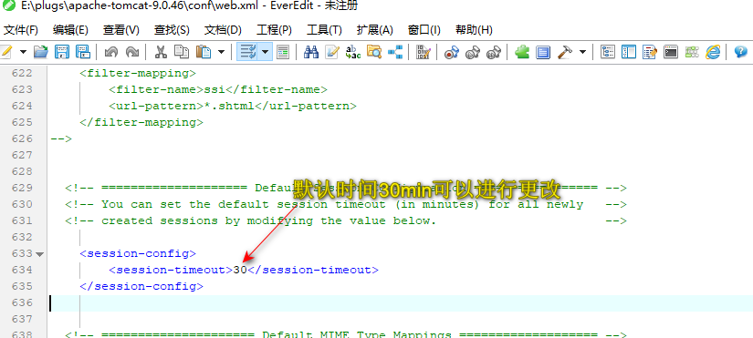

#### 6.3.2 自己设定到期时间

当然除了以上的修改方式外，我们也可以在程序中自己设定到期时间，通过session.setMaxInactiveInterval(int)来设定session的最大不活动时间，单位为秒。

```
// 获取session对象
HttpSession session = request.getSession();
// 设置session最大不活动时间
session.setMaxInactiveInterval(15);
```

当然我们也可以通过getMaxInactiveInterval()方法来查看当期Session对象的最大不活动时间：

```
// 获取session的最大不活动时间
int time = session.getMaxInactiveInterval();
```

#### 6.3.3 立刻失效

或者我们也可以session.invalidate()方法让session立刻失效：

```
// 销毁session对象
session.invalidate();
```

#### 6.3.4  关闭浏览器

从前面的JSESSION可知道，session的底层依赖cookie实现，并且该cookie的有效时间为关闭浏览器，从而session在浏览器关闭时就相当于失效了（因为没有JSESSION再与之对应了）。


#### 6.3.5 关闭服务器

当关闭服务器时，session销毁。

session失效则意味着此次会话结束，数据共享结束。


## 7. ServletContext对象

每一个web应用都有且只有一个ServletContext对象，又称为Application对象，从名称可以得知，该对象是与应用程序相关的。在web容器启动的时候，会为每一个web应用程序生成一个对应的ServletContext对象。

该对象有两大作用：第一：作为域对象来共享数据，此时数据在整个应用程序中共享；第二：该对象中保存了当前应用程序的相关信息。例如可以通过getServerInfo()方法获取当前服务器信息,getRealPath(String path)获取资源的真实路径等。


### 7.1 ServletContext对象的获取

获取ServletContext对象的途径有很多：

1. 通过request对象获取：

```
ServletContext servletContext = request.getServletContext();
```

​	2.通过session对象获取：

```
ServletContext servletContext = request.getSession().getServletContext();
```

​	3.通过servletConfig对象获取，在servlet标准钟提供了ServletConfig方法;

```
ServletConfig servletConfig = getServletConfig();
ServletContext servletContext = servletConfig.getServletContex();
```

​	4.直接获取，servlet类中提供了直接过去ServletContext的方法：

```
ServletContext servletContext = getServletContext();
```

**常用方法：**

```
// 获取项目存放的真实路径
String realPath =  request.getServletContex().getRealPath("/");
// 获取当前服务器的版本信息
String serverInfo = request.getServletContex().getServerInfo();
```

### 7.2 ServletContext域对象

ServletContext也可以当作域对象来使用，通过向ServletContext中存取数据，可以使得整个应用程序共享某些数据。当然不建议存放过多数据，因为ServletContext中一旦存入数据，没有手动移除将被一直保存。

```
// 获取ServletContext对象
ServletContext servletContext = request.getServletContex();
// 设置域对象
servletContext.setAttribute("name","zhangsan");
// 获取域对象
String name = (String) servletContext.getAttribute("name");
// 移除域对象
servletContext.removeAttribute("name");
```

**Servlet的三大域对象：**

1. request域对象

   在一次请求中有效，请求转发有效，重定向失效。

2. session域对象

   在一次请求中有效，请求转发和重定向都有效，session销毁后失效。

3. servletContext域对象

   在整个应用程序中有效，服务器关闭后失效。

## 8.文件的上传和下载

在上网的时候我们常常遇到文件的上传的情况，例如上传头像，上传资料等。当然除了上传外，遇到的下载情况也比较多，接下来看看servlet是怎么实现上传和下载的。


### 8.1 文件上传

文件的上传设计前台代码的编写和后台服务器的编写。前台发送文件，后台接收并保存文件，这才是一个完整的文件上传。

#### 8.1.1 前台页面

在做文件上传时，会有一个上传文件的界面，首先我们需要一个表单，并且表单的请求方式为POST,其次form表单的enctype必须设为"multipart/form-data",即 enctype = "multipart/form-data"---二进制表单 ，意思是设置表单的类型为文件上传表单。默认情况下这个表单类型是"application/x-www-form-urlencoded",不能用于文件上传。

```
<!--
文件上传表单
1. 表单提交类型 method="post"
2. 表单类型 enctype="multipart/form-data"
3. 表单元素类型 文件域设置name属性值
-->
<form method="post" action="uploadServlet" enctype="multipart/form-data"> 姓名：<input type="text" name="uname" > <br>
文件：<input type="file" name="myfile" > <br>
<button type="submit">提交</button>
</form>
```

#### 8.1.2 后台实现

使用注解 @MultipartConfig 将一个 Servlet 标识为支持文件上传。 Servlet 将 multipart/form-data 的 POST 请求封装 成 Part，通过 Part 对上传的文件进行操作。

```
package com.hwua.session;
import javax.servlet.ServletException;
import javax.servlet.annotation.MultipartConfig;
import javax.servlet.annotation.WebServlet;
import javax.servlet.http.HttpServlet;
import javax.servlet.http.HttpServletRequest;
import javax.servlet.http.HttpServletResponse;
import javax.servlet.http.Part;
import java.io.IOException;

/*
* 文件上传：
*       如果表单类型的类型enctype="multipart/form-data"，对应的servlet类一定要加注解@MultipartConfig
*           如果没有注解，所有的参数都会为null*/
@WebServlet("/uploadServlet")
@MultipartConfig // 如果是文件上传表单，一定要加这个注解
public class UploadServlet extends HttpServlet {
    @Override
    protected void service(HttpServletRequest request, HttpServletResponse response) throws
            ServletException, IOException {

        // 设置请求的编码格式
        request.setCharacterEncoding("UTF-8");
        // 获取普通表单项 （文本框）
        String uname = request.getParameter("uname"); // "uname"代表的是文本框的name属性值
        System.out.println("姓名：" + uname);
        // 通过 getPart(name) 方法获取Part对象 （name代表的是页面中file文件域的name属性值）
        Part part = request.getPart("myfile");
        // 通过Part对象，获取上传的文件名
        String fileName = part.getSubmittedFileName();
        // 判断文件是否上传
        if (fileName != null && !fileName.equals("")) {
            // 获取上传文件需要存放的路径 （得到项目存放的真实路径）---创建一个upload的文件夹
            String realPath = request.getServletContext().getRealPath("/upload/");
            // 将文件上传到指定位置
            part.write(realPath + fileName);
        }
    }
}
```

### 8.2 文件的下载

文件下载，即将服务器上的资源下载（拷贝）到本地，我们可以通过两种方式下载。第一种是通过超链接本身的特 性来下载；第二种是通过代码下载。


#### 8.2.1 超链接下载

当我们在 HTML 或 JSP 页面中使用a标签时，原意是希望能够进行跳转，但当超链接遇到浏览器不识别的资源时会自 动下载；当遇见浏览器能够直接显示的资源，浏览器就会默认显示出来，比如 txt、png、jpg 等。当然我们也可以通 过 download 属性规定浏览器进行下载。但有些浏览器并不支持。

**默认下载**

```
<!-- 当超链接遇到浏览器不识别的资源时，会自动下载 -->
<a href="test.zip">超链接下载</a>
```

**指定 download 属性下载**

```
<!-- 当超链接遇到浏览器识别的资源时，默认不会下载。通过download属性可进行下载 -->
<a href="test.txt" download>超链接下载</a>
```

download 属性可以不写任何信息，会自动使用默认文件名。如果设置了download属性的值，则使用设置的值做为 文件名。当用户打开浏览器点击链接的时候就会直接下载文件。


#### 8.2.2 后台实现下载

**实现步骤：**

1. 需要通过 response.setContentType 方法设置 Content-type 头字段的值， 为浏览器无法使用某种方式或激活某 个程序来处理的 MIME 类型，例 如 "application/octet-stream" 或 "application/x-msdownload" 等。 
2. 需要通过 response.setHeader 方法设置 Content-Disposition 头的值 为 "attachment;filename=文件名" 
3. 读取下载文件，调用 response.getOutputStream 方法向客户端写入附件内容。

前台：

```
<form action="download">
        文件名:<input type="text" name="fileName">
        <button>下载</button>
    </form>
```

后台：

```
package com.xxxx.servlet;
import javax.servlet.ServletException;
import javax.servlet.ServletOutputStream;
import javax.servlet.http.HttpServlet;
import javax.servlet.http.HttpServletRequest;
import javax.servlet.http.HttpServletResponse;
import java.io.File;
import java.io.FileInputStream;
import java.io.IOException;
import java.io.InputStream;
@WebServlet("/download")
public class DownloadServlet extends HttpServlet {
protected void service(HttpServletRequest request, HttpServletResponse response) throws
ServletException, IOException {
// 设置请求的编码
request.setCharacterEncoding("UTF-8");

 // 获取要下载的文件名
        String name = request.getParameter("fileName");
        // 判断文件名是否为空
        if (name == null || "".equals(name.trim())) {
            System.out.println("请输入要下载的文件名");
            return;
        }
// 获取文件下载路径
String path = getServletContext().getRealPath("/");
// 通过路径得到file对象
File file = new File(path + name);
// 判断file对象是否存在，且是否是一个标准文件
if (file.exists() && file.isFile()) {
// 设置响应类型 (浏览器无法使用某种方式或激活某个程序来处理的类型)
response.setContentType("application/x-msdownload");
// 设置头信息
response.setHeader("Content-Disposition", "attachment;filename=" + name);
// 得到输入流
InputStream is = new FileInputStream(file);
// 得到输出流
ServletOutputStream os = response.getOutputStream();
// 定义byte数组
byte[] car = new byte[1024];
// 定义长度
int len = 0;
// 循环 输出
while ((len = is.read(car)) != -1)
{ os.write(car, 0, len);
}
// 关闭流 释放资源
os.close();
is.close();
} else {
System.out.println("文件不存在，下载失败！");
		}
	 }
}

```

   
