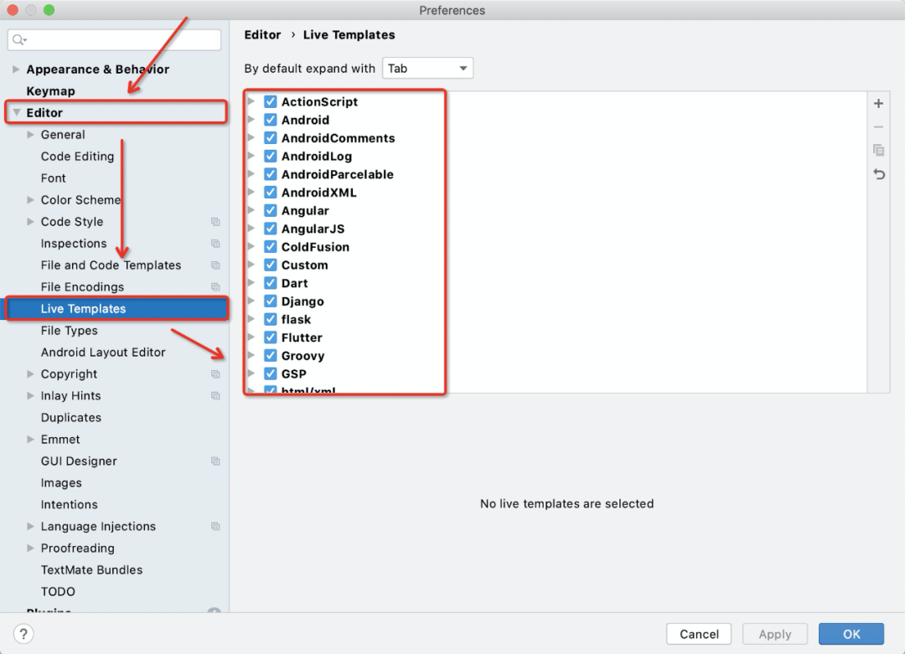

# Ideal使用小技巧

​	欲善其事，先利其器。对于研发同学，在日常的开发工作中，我们与之打交道最多的便是编程的IDE。能否高效和灵活的使用IDE，将对我们的工作效率起着举足轻重的作用。

## 1.**Postfix Completion**

​	Postfix Completion (下称Postfix) 是一种通过 . + 模板Key 来对当前已经输出的表达式，添加和应用预设代码模板的编码增强能力。其核心要解决的问题是，将编码过程中一些通用的代码结构范式进行抽象和沉淀，并能在同类型的场景下，通过 . + 模板Key 的方式进行唤醒和复用。

举个例子，现在需要完成下面一段代码的编写，为了对name参数进行判空保护：

```shell
if (name != null) {
  
}
```

在普通文本编辑器中，其中 if 2次，name 4次，(){}!= 共6次，再加空格Tab和光标切换，一共需要按键23次。

在IDEA编辑器中，不使用Postfix时，一共需要按键20次，不考虑代码格式化的情况可以减少到16次。

在IDEA编辑器中，使用Postfix时，只需要8次，如下图：


​	在这个例子中，可以对比出使用Postfix前后的效果，使用之后在编码中减少了一半的手动按键操作，且生成的代码是自带格式化的。在实际的编码过程中，各项目大小和复杂度差异性虽然很大，但细化到这种基本单位的编程范式时，它们都是融会贯通的。


与上例中nn并列的Postfix，IDEA给我们预设的还有很多，下面对一些非常高频使用的Postfix进行梳理。

- **var**:快速定义一个局部变量，自带IDE的类型推断

.gif)

- **notnull**:快速进行NPE的判空保护：

.gif)

- **nn**:同notnull，是它的简写，推荐用这个，更加便捷：

.gif)

- **try catch**:快速对当前语句添加try catch异常捕获，同时IDE还会对catch中的Exception自动做类型推断：

.gif)

- **cast**:快速实现类型强转，不需要反复使用()包裹和光标切换；配合instanceof使用时还能自动实现cast类型的推断：

.gif)

- **if**:快速实现if判断的代码范式：

.gif)

- **throw**:快速实现抛异常：

.gif)

- **for**:快速实现集合或数组的迭代：

.gif)

- **fori**:快速实现集合或数组的带索引值迭代；同时对整型数字也支持：

.gif)

- **sout/soutv**:快速实现（不带参数/带参数）的打印功能：

.gif)

- **return**:快速实现方法中的值返回逻辑：

.gif)

- **format**：快速实现字符串格式化：

.gif)


## 2.高级用法

担心系统预设的Postfix不足以满足我们的编码需求，IDEA还提供了Postfix的自定义功能。

这里我以自定义一个对集合判空的代码范式，来举例说明自定义Postfix的流程：

1）进入IDE设置界面，然后依次进入Editor => General => Postfix Completion => 面板左下角加号 => Java：


2）在弹起的页面中，按照下图进行配置，然后保存退出设置页。


此时我们自定义的 isempty 这个Postfix即完成了，下面来看下实际使用的效果：

.gif)

​	在实际开发过程中，对于根据已经输入的表达式就能决定接下来代码格式的功能，我们都能使用这种自定义方式进行代码的抽象和复用。


## 3.**Live Template**

.gif)

上面这段编码中，我先后使用了Live Template的以下三个模板能力：

- psfs：定义字符串常量
- main：添加入口函数
- sout：实现日志输出

这里我们将其和上面提到的Postfix对比来看，两者都是提供代码级别模板的功能。不同的是，Postfix需要一个已经输入的表达式和 . + 模板Key 来进行触发，而Live Template不需要这些，它仅仅需要 模板Key 即可触发。

Live Template提供的预设模板要比Postfix要高出一个数量级，因此这里我就不进行一一演示，我们可以进行设置面板，然后按照Editor => Live Templates的路径自行查看，如下图：



和Postfix一样，Live Template也支持自定义模板，但它的自定义模板相对来说更加灵活和开放，甚至支持我们直接植入脚本。鉴于Live Template的高度灵活性，单独介绍这块会占据大量的篇幅，因此这里我将从几个实际的案例场景来开拓一下思路，而具体自定义拓展过程就不详细展开介绍了。

- **Key值映射**：将DB中查询到 List<T> 结构的数据，根据Key值映射转化为 Map<K, T> 结构的数据，以便于进行后续的数据填充逻辑：

.gif)

- **DB批量查询**：在数据查询时，我们会有根据ID主键进行批量DB数据查询的诉求，如下：

```java
List<User> users = userMapper.queryUserByIds(userIds);
```

这种写法会有一个弊端，就是当 userIds 大到一定的量级时，该查询会变得非常耗时。

对于该问题其中一个解法是，将这个大的 userIds 拆分成多个批次，然后让这多个批次异步并行去查询。这里便使用Live Template来抽取一个针对该场景的代码模板，如下：

.gif)

按照该模板，我们的查询语句将变成这样：

```java
List<User> users = batchQuery(userIds, 100, userMapper::queryUserByIds, null);
```

可以看到，和之前相比，多传一个分批的size参数，同时还支持指定的异步任务调度器的自定义配置，而返回结果和之前的查询方式保持完全一致，不需要外部有额外的适配工作。


- **脚本植入**:

这个功能是我非常看好Live Template的主要原因，它的灵活性和拓展性也主要来源于这里。它支持我们通过一个 模板Key 来唤起和执行一段脚本，这也就意味着，我们的自定义的Live Template模板是可编程的，极大程度提高了该模板的拓展性。


单描述功能会有些空洞，这里我结合一个实际案例进行介绍，我们来实现一个跨电脑的代码共享功能：


1）首先，使用python的flask框架写一个极简的服务端应用并启动，提供最简单的 push 和 pull 的能力，如下：

```python

from flask import Flask, request

DEFAULT = 'nothing'
code = DEFAULT

app = Flask(__name__)

@app.route('/push')
def push():
  global code
  code = request.args.get('code', DEFAULT)
  return 'Success'

@app.route('/pull')
def pull():
  return code

app.run()
```

2）然后，我们来通过groovy脚本实现一个代码 pull 的模板，这里应用了Live Template的 groovy script 能力，对应脚本如下：

```python
def url = new URL('http://127.0.0.1:5000/pull');
def conn = url.openConnection() as HttpURLConnection;
def result = conn.inputStream.text;
return result
```

3）最后，再实现代码push的模板，脚本如下（下面的代码入参，是通过剪切板赋值传递过来的）：

```python
def code = _1;
def url = new URL('http://127.0.0.1:5000/push?code=' + new URLEncoder().encode(code));
def conn = url.openConnection() as HttpURLConnection;
def result = conn.inputStream.text;
return result
```

此时就已经完成了跨设备的代码分享功能，为方便演示，这里就用 People1 和 People2 两个类来模拟两台独立的电脑。People1 将自己的一段代码复制到剪切板中，然后通过 push 模板调用 push 接口来将这段代码上传到Python服务应用中；People2 再通过 pull 脚本来调用服务端的 pull 接口，访问到 People1 上传的代码并输入到当前的代码编辑器中，实现效果如下图：

.gif)


## 4.**File Template**

File Template，顾名思义，对应文件级别的模板。对于该模板，我们使用脚本的主要在于两个场景，分别是文件头和文件的自定义，下面结合案例依次展开。

按照下图的路径，来更改文件头的格式，IDE就会在我们新建一个类或接口时，根据这里的配置格式来自动生成对应的文件注释头。


**抽象通用Controller**

看下面一段代码，这是一个针对于User这个domain的增删改查接口类：

```java
package com.alibaba.ide.code.controller;

import com.alibaba.ide.code.entity.Result;
import com.alibaba.ide.code.entity.User;
import com.alibaba.ide.code.service.Condition;
import com.alibaba.ide.code.service.UserService;
import org.springframework.web.bind.annotation.*;

import javax.annotation.Resource;
import java.io.Serializable;
import java.util.List;

/**
 * @author puke
 * @version 2021/2/9
 */
@RestController
@RequestMapping("api/user")
public class UserController {

    @Resource
    private UserService userService;

    @PostMapping
    public Result<User> create(@RequestBody User record) {
        User user = userService.insert(record);
        return Result.success(user);
    }

    @PutMapping
    public Result<User> update(@RequestBody User record) {
        User user = userService.update(record);
        return Result.success(user);
    }

    @DeleteMapping("{id}")
    public Result<Void> deleteById(@PathVariable Serializable id) {
        boolean success = userService.deleteById(id);
        return success ? Result.success() : Result.fail();
    }

    @GetMapping("{id}")
    public Result<User> queryById(@PathVariable Serializable id) {
        User user = userService.queryById(id);
        return Result.success(user);
    }

    @GetMapping
    public Result<List<User>> queryByCondition(Condition<User> condition) {
        List<User> list = userService.queryByCondition(condition);
        return Result.success(list);
    }
}
```

仔细看这段代码会发现，如果基于该接口再新增另一个domain对应的Controller接口类，代码中的基本结构和逻辑都是可以复用的。此时，便是File Template排上用场的地方，我们定义一个通用的 Controller 模板，将共性的部分抽象到模板里，再将差异性的部分通过模板入参 Subject 变量传入进来（注，这里需要用到Velocity 模板[1]的知识）。

```java

#set($SubjectOfLowerFirst = ${Subject.substring(0,1).toLowerCase()} + $Subject.substring(1))
package ${PACKAGE_NAME};

import com.alibaba.ide.code.entity.Result;
import com.alibaba.ide.code.entity.${Subject};
import com.alibaba.ide.code.service.Condition;
import com.alibaba.ide.code.service.${Subject}Service;
import org.springframework.web.bind.annotation.*;

import javax.annotation.Resource;
import java.io.Serializable;
import java.util.List;

#parse("File Header.java")
@RestController
@RequestMapping("api/${SubjectOfLowerFirst}")
public class ${Subject}Controller {

    @Resource
    private ${Subject}Service ${SubjectOfLowerFirst}Service;

    @PostMapping
    public Result<${Subject}> create(@RequestBody ${Subject} record) {
        ${Subject} ${SubjectOfLowerFirst} = ${SubjectOfLowerFirst}Service.insert(record);
        return Result.success(${SubjectOfLowerFirst});
    }

    @PutMapping
    public Result<${Subject}> update(@RequestBody ${Subject} record) {
        ${Subject} ${SubjectOfLowerFirst} = ${SubjectOfLowerFirst}Service.update(record);
        return Result.success(${SubjectOfLowerFirst});
    }

    @DeleteMapping("{id}")
    public Result<Void> deleteById(@PathVariable Serializable id) {
        boolean success = ${SubjectOfLowerFirst}Service.deleteById(id);
        return success ? Result.success() : Result.fail();
    }

    @GetMapping("{id}")
    public Result<${Subject}> queryById(@PathVariable Serializable id) {
        ${Subject} ${SubjectOfLowerFirst} = ${SubjectOfLowerFirst}Service.queryById(id);
        return Result.success(${SubjectOfLowerFirst});
    }

    @GetMapping
    public Result<List<${Subject}>> queryByCondition(Condition<${Subject}> condition) {
        List<${Subject}> list = ${SubjectOfLowerFirst}Service.queryByCondition(condition);
        return Result.success(list);
    }
}
```

模板定义完成，接下来来看一下实际的使用效果：

.gif)

这里使用 Goods 作为新的domain对象，可以看到，生成的 Controller 代码已经具备 UserController 的全部能力，并且生成的代码全部都是 Goods 相关的api，这样就实现了File Template的横向迁移能力。


## 5.**低频高效快捷键**

IDEA中的快捷键多达上百个，我们很难把每个都记清楚，网上也有很多对应的总结。这里我主要梳理一些，大家使用相对比较低频，但又非常高效的快捷键。

- **选择重复元素：Control + G**

  通常情况下，我们可以使用 Shift + F6 对类名、方法名和变量名进行批量更改，但对于其他元素进行批量更改时，该快捷键特别合适，且不限编程语言。

.gif)

- **批量框选：Option + 鼠标左键拖拽**

对于"对齐"的代码进行批量更改的最优解，没有之一：

.gif)


- **整行移动：Option + Shift + ↑/↓**

快速调整代码执行顺序，免除繁琐的剪切粘贴过程：

.gif)


- **整行/块复制：Command + D**

对于整行/块的复制，效率远高于纯手动的复制粘贴：

.gif)


- **展开/收起：Command + . or Command + Shift + +/-**

前者，快速显示/隐藏当前方法体；后者，快速概览当前类的所有方法：

.gif)


- **修改方法签名：Command + F6**

在方法被多文件或多处调用时，该方式替换效率极高：

.gif)


- **查看历史剪切板：Command + Shift + V**

开发中经常会出现需要复制多个文本的诉求，而PC默认的剪切板只能保存一个，该功能专门用来解决这个痛点：

.gif)


- **代码抽取**

代码抽取主要用在代码重构的时候，以最快速度达到我们抽取一个变量、方法的目的。

1）抽局部变量：Command + Option + V

.gif)

2）抽成员变量：Command + Option + F

.gif)

3）抽静态常量：Command + Option + C

.gif)

4）抽方法入参：Command + Option + P

.gif)

5）抽方法：Command + Option + M

.gif)


## 6.**代码调试**

代码调试在开发中使用的非常多，常规的单步、多步、进入、跳出操作这里也不特殊说明了。

有一点值得说的就是，利用条件断点来实现运行期的代码植入功能，先看下图：

.gif)


可以看到，Debug模式运行时，我们能动态改变 age 变量的值，本来被赋值为 20 的，结果输出出来却是 10。

这个是我在开发中无意间发现的一个功能，算是一个Trick了。但这个功能在实际的开发过程中特别有用，尤其针对于一些代码改动后再次运行的成本比较高的场景。比如Android开发过程中，能够在不重新打整包的情况下，动态修改页面中各个元素的样式、接口的请求、数据的内容等等；再比如服务端场景中，如果我们的应用支持Debug模式，则可以通过该功能实现应用无需重新部署的情况下，进行动态更改上下文逻辑的操作。