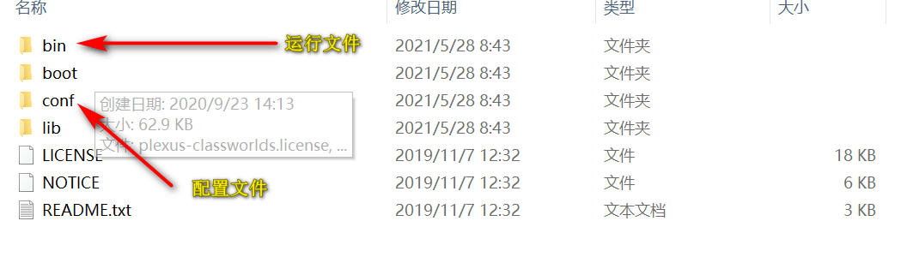
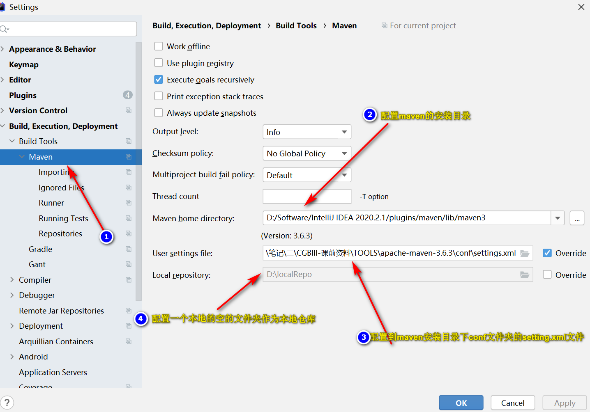

# Maven详细教程

## 	1.什么是Maven

​	如今我们构建一个项目需要用到很多第三方的类库，如写一个使用Spring的Web项目就需要引入大量的jar包。一个项目Jar包的数量之多往往让我们瞠目结舌，并且Jar包之间的关系错综复杂，一个Jar包往往又会引用其他Jar包，缺少任何一个Jar包都会导致项目编译失败。以往开发项目时，程序员往往需要花较多的精力在引用Jar包搭建项目环境上，而这一项工作尤为艰难，少一个Jar包、多一个Jar包往往会报一些让人摸不着头脑的异常。

​	而Maven就是一款帮助程序员构建项目的工具，我们只需要告诉Maven需要哪些Jar 包，它会帮助我们下载所有的Jar，极大提升开发效率。

​	

## 2.什么是Maven仓库

​	Maven仓库用来存放Maven管理的所有Jar包。分为：本地仓库 和 中央仓库:

- 本地仓库：Maven在本地的jar包仓库；

- 中央仓库：Maven的官方提供的仓库。

  当项目编译时，Maven首先从本地仓库中寻找项目所需的Jar包，若本地仓库没有，再到Maven的中央仓库下载所需Jar包。

## 3.什么是“坐标”

​	在Maven中，坐标是Jar包的唯一标识，Maven通过坐标在仓库中找到项目所需的Jar包。如下代码中，groupId和artifactId构成了一个Jar包的坐标：

```xml
<dependency>
   <groupId>cn.missbe.web.search</groupId>
   <artifactId>resource-search</artifactId>
   <packaging>jar</packaging>
   <version>1.0-SNAPSHOT</version>
</dependency>
```

- **groupId**:所需Jar包的项目名;
- **artifactId**:所需Jar包的模块名
- **version**:所需Jar包的版本号


## 4.传递依赖 与 排除依赖

- 传递依赖：如果我们的项目引用了一个Jar包，而该Jar包又引用了其他Jar包，那么在默认情况下项目编译时，Maven会把直接引用和间接引用的Jar包都下载到本地。
- 排除依赖：如果我们只想下载直接引用的Jar包，那么需要在pom.xml中做如下配置：(将需要排除的Jar包的坐标写在中)

```xml
<exclusions>
   <exclusion>
      <groupId>cn.missbe.web.search</groupId>
      <artifactId>resource-search</artifactId>
      <packaging>pom</packaging>
      <version>1.0-SNAPSHOT</version>
   </exclusion>
</exclusions>
```


## 5.下载安装Maven

​	Maven的官方下载网址为：https://maven.apache.org/download.cgi。下载解压后目录结构如下：



​	Maven默认使用的配置仓库是Maven自己提供的官方仓库，因为这个仓库地址在国外，所以下载jar包会非常的慢，所以需要将conf文件夹中的settings.xml文件进行修改，需要添加阿里云的镜像仓库-将mirror白哦前内容注释，并复制以下内容粘贴进去，并将jdk配置成1.8:

```xml
<mirrors>

   <mirror>
	<id>aliyun</id>
	<name>aliyun for maven</name>
	<mirrorOf>*</mirrorOf>
	<url>https://maven.aliyun.com/repository/public</url>
   </mirror>
     
  </mirrors>
```

```xml
<profile>
   <id>jdk-1.8</id>
   <activation>
	<activeByDefault>true</activeByDefault>
      <jdk>1.8</jdk>
   </activation>
   <properties>
	   <maven.compiler.source>1.8</maven.compiler.source>
	   <maven.compiler.target>1.8</maven.compiler.target>
	   <maven.compiler.compilerVersion>
        1.8
       </maven.compiler.compilerVersion>
	 </properties>
   </profile>
```


## 6.IDEA整合Maven

​	打开IDEA的,配置Maven，步骤如下：

File-->settings-->Build,Execution,Deploment-->Built Tools-->Mven:

