# 数据结构和算法

数据结构和算法是每一个学习计算机专业的同学必须掌握的课程，是编程必备的基础。但这是一门不太好学的课程，非常枯燥乏味。但一旦掌握，会让你的编程能力有质的飞跃，因为程序设计的基础=数据结构+算法。

数据结构演示网站：

https://www.cs.usfca.edu/~galles/visualization/Algorithms.html

## 1.数据结构和算法概述

数据结构是一门研究非数值计算的程序设计问题中的操作对象，以及它们的关系和操作等相关问题的学科。简而言之，就是把数据元素按照一定的关系组织起来的集合，用来组织和存储数据。

算法是指解题方案的准确而完整的描述，是一系列解决问题的清晰指令，算法代表着用系统的方法解决问题的策略机制。也就是说，能够对一定规范的输出，在有限时间内获得所要求的输出，得到想要的结果。


### 1.1.数据结构的分类

数据结构可分为**逻辑结构**和**物理结构**两大类。

- **逻辑结构：**逻辑结构是从具体问题中抽象出来的模型，是抽象意义上的结构，按照对象中的数据元素之间的相互关系分类，可以分为如下类别：

  - **集合结构：**集合结构中数据元素除了属于同一个集合外，它们之间没有任何的关系。就如下图各个数字之间的关系-它们在一个集合中，但相互之间没有练习。

  
  - **线性结构：**线性结构中数据元素之间存在一对一的关系。

  
  - **树形结构：**树形结构中数据元素之间存在一对多的层次关系。

  
  - **图形结构：**图形结构数据元素之间存在多对多的关系。

  

- **物理结构：**逻辑结构在计算机中真正的表现方式（映像）称为物理结构（存储结构）。常见的物理结构有如下几种：

  - **顺序存储结构：**把数据元素放在地址连续的存储单元里面，其数据间的逻辑关系和物理关系是一致的。数组就是常见的顺序存储结构。

  
  顺序结构存在一定的弊端，就如生活中排队有人插队也有人突然离开，这个时候结构在不断变化，就需要该表结构为链式存储结构-排队打饭变为语音叫号。

  - **链式存储结构：**把数据元素存储在任意存储单元中，这组单元可以是连续的也可以是不连续的。此时，数据元素之间并不能反应元素间的逻辑关系，因此在链式存储结构中引进了一个指针存放数据元素的地址，这样通过地址就可以查找出对应元素的位置。链式结构插入数据是先连接后断开，如在3和4之间插入数字20，先将20和4连接，再断开3和4，最后连接3和20，后面我们会从代码出发进行演示。

  备注：Java没有指针，指针概念来源于C，你可以理解成Java的地址引用。

  


### 1.2.算法体验

​	在生活中，如果我们遇到某一问题，常常解决方案不是唯一的。例如从成都到重庆，我们可以坐动车，可以坐轮船或开车，甚至可以走路，不同的解决方案所带来的时间成本和金钱成本是不一样的，比如坐动车时间最少，费用最高，步行费用最低，但时间花费更大。在程序中，我们也可以用不同的算法解决相同的问题，而不同算法的成本也是不相同的。总体上来说，一个优秀的算法追求以下两个目标：

1. 花最少的时间完成需求；
2. 占用最少的内存空间完成需求。

下面我们通过案例来了解以下算法：

**需求1：**计算1-100整数的和。

第一种：

```java
public static void main(String[] args) { 
    int sum = 0; 
    int n=100; 
    for (int i = 1; i <= n; i++) { 
        sum += i; 
    }
    System.out.println("sum=" + sum); 
}
```

第二种：

```java
public static void main(String[] args) { 
    int sum = 0; 
    int n=100; 
    sum = (n+1)*n/2; 
    System.out.println("sum="+sum); 
}
```

分析：

第一种解法要完成需求需要以下几个步骤：

1. 定义两个整型变量；
2. 执行100次加法运算；
3. 打印结果到控制台。

第二种解法要完成需求需要以下几个步骤：

1. 定义两个整型变量；
2. 执行1次加法运算，1次乘法运算，1次出发运算，总共3次运算；
3. 打印结果到控制台。

很明显，第二种算法完成需求花费的时间更少。


**需求2：**计算10的阶乘。

第一种：

```java
public class Test { 
    public static void main(String[] args) { 
        //测试，计算10的阶乘 
        long result = fun1(10); 
        System.out.println(result); 
    }
    //计算n的阶乘 
    public static long fun1(long n){ 
        if (n==1){ 
            return 1; 
        }
        return n*fun1(n-1); 
    } 
}
```

第二种：

```java
public class Test { 
    public static void main(String[] args) { 
        //测试，计算10的阶乘 
        long result = fun2(10); 
        System.out.println(result); 
    }
    //计算n的阶乘 
    public static long fun2(long n){ 
        int result=1; 
        for (long i = 1; i <= n; i++) { 
            result*=i; 
        }
        return result; 
    } 
}
```

分析：

​	第一种解法使用递归完成需求，fun1方法会执行10次，并且第一次执行未完毕，调用第二次执行，第二次执行未完毕，调用第三次执行。。。最终，最多的时候，需要在占内存中同时开辟10块内存分别执行10个fun1方法。

​	第二种解法使用for循环完成需求，fun2方法只会执行一次，最终，只需要在占内存空间执行fun2方法即可。

​	明显第二种算法完成需求，占用内存空间更少。


## 2.算法分析

​	前面我们已经介绍了，研究算法的最终目的就是如何花更少的时间，如何占用更少的内存去完成相同的需求，并且也通过案例演示了不同算法之间时间耗费和空间耗费上的差异，但我们并不能将时间占用和空间占用量化，因此，接下来我们要学习有关算法时间耗费和算法空间耗费的描述和分析。有关算法时间耗费分析，我们称之为算法的**时间复杂度分析**，有关算法的空间耗费分析，我们称之为算法的**空间复杂度分析**。


### 2.1.算法的时间复杂度分析

​	我们要计算算法时间耗费情况，首先我们得度量算法的执行时间，那么如何度量呢？

- **事后分析估算方法：**

​	比较容易想到的方法就是我们把算法执行若干次，然后拿个计时器在旁边计时，这种事后统计的方法看上去的确不错，并且也并非要我们真的拿个计算器在旁边计算，因为计算机都提供了计时的功能。这种统计方法主要是通过设计好的测试程序和测试数据，利用计算机计时器对不同的算法编制的程序的运行时间进行比较，从而确定算法效率的高低，但是这种方法有很大的缺陷：必须依据算法实现编制好的测试程序，通常要花费大量时间和精力，测试完了如果发现测试的是非常糟糕的算法，那么之前所做的事情就全部白费了，并且不同的测试环境(硬件环境)的差别导致测试的结果差异也很大。

测试计算0-100之间整数和所需时间属于时候分析时间：

```java
public static void main(String[] args) { 
    long start = System.currentTimeMillis(); 
    int sum = 0; 
    int n=100; 
    for (int i = 1; i <= n; i++) { 
        sum += i; 
    }
    System.out.println("sum=" + sum); 
    
    long end = System.currentTimeMillis(); 
    System.out.println(end-start); 
}
```

以上分析执行时间有一定的弊端，必须在Windows10和Windows7所执行的时间有可能是不一样的。

- **事后分析估算法：**

  在计算机程序编写前，依据统计方法对算法进行估算，经过总结，我们发现一个高级语言编写的程序程序在计算机上运行所消耗的时间取决于下列因素：

  1. 算法采用的策略和方案；
  2. 编译产生的代码质量；
  3. 问题的输入规模(所谓的问题输入规模就是输入量的多少)；
  4. 机器执行指令的速度。

由此可见，抛开这些与计算机硬件、软件有关的因素，一个程序的运行时间依赖于算法的好坏和问题的输入规模。如果算法固定，那么该算法的执行时间就只和问题的输入规模有关系了。

我们再次以之前的求1-100和案例为例，进行分析：

第一种解法：

```java
// 如果输入量为n为1，则需要计算1次
// 如果输入量n为1亿，则需要计算1亿次
public static void main(String[] args) { 
    int sum = 0;
    //执行1次 
    int n=100;
    //执行1次 
    for (int i = 1; i <= n; i++) {
        //执行了n+1次 
        sum += i;
        //执行了n次 
    }
    System.out.println("sum=" + sum); 
}
```


第二种解法：

```java
// 如果输入量为n为1，则需要计算1次
// 如果输入量n为1亿，则需要计算1次
public static void main(String[] args) { 
    int sum = 0;
    //执行1次 
    int n=100;
    //执行1次 
    sum = (n+1)*n/2;
    //执行1次 
    System.out.println("sum="+sum); 
}
```

因此，当输入规模为n时，第一种算法执行了1+1+(n+1)+n=2n+3次；第二种算法执行了1+1+1=3次。如果我们把

第一种算法的循环体看做是一个整体，忽略结束条件的判断，那么其实这两个算法运行时间的差距就是n和1的差

距。为什么循环判断在算法1里执行了n+1次，看起来是个不小的数量，但是却可以忽略呢？我们来看下一个例子：

**需求：**计算100个1+100个2+100个3+...100个100的结果

```java
public static void main(String[] args) { 
    int sum=0; 
    int n=100; 
    for (int i = 1; i <=n ; i++) { 
        for (int j = 1; j <=n ; j++) { 
            sum+=i; 
        } 
    }
    System.out.println("sum="+sum); 
}
```

​	上面这个例子中，如果我们要精确的研究循环的条件执行了多少次，是一件很麻烦的事情，并且，由于真正计算和的代码是内循环的循环体，所以，在研究算法的效率时，我们只考虑核心代码的执行次数，这样可以简化分析。

​	我们研究算法复杂度，侧重的是当输入规模不断增大时，算法的增长量的一个抽象(规律)，而不是精确地定位需要执行多少次，因为如果是这样的话，我们又得考虑回编译期优化等问题，容易主次跌倒。

​	我们不关心编写程序所用的语言是什么，也不关心这些程序将跑在什么样的计算机上，我们只关心它所实现的算法。这样，不计那些循环索引的递增和循环终止的条件、变量声明、打印结果等操作，最终在分析程序的运行时间时，最重要的是把程序看做是独立于程序设计语言的算法或一系列步骤。我们分析一个算法的运行时间，最重要的就是把核心操作的次数和输入规模关联起来。


### 2.2.函数渐进增长

​	给定两个函数f(n)和g(n),如果存在一个整数N，使得对于所有的n>N,f(n)总是比g(n)大，那么我们说f(n)的增长渐近快于g(n)。

概念似乎有点艰涩难懂，那接下来我们做几个测试。

**测试一：**假设四个算法的输入规模都是n：

 1.算法A1要做2n+3次操作，可以这么理解：先执行n次循环，执行完毕后，再有一个n次循环，最后有3次运算；

 2.算法A2要做2n次操作；

 3.算法B1要做3n+1次操作，可以这个理解：先执行n次循环，再执行一个n次循环，再执行一个n次循环，最后有1次运算。

 4.算法B2要做3n次操作；

那么，上述算法，哪一个更快一些呢？

| 输入规模 | 算法A1(2n+3)执行次数 | 算法A2(2n)执行次数 | 算法B1(3n+1)执行次数 | 算法B2(3n)执行次数 |
| -------- | -------------------- | ------------------ | -------------------- | ------------------ |
| n=1      | 5                    | 2                  | 4                    | 3                  |
| n=2      | 7                    | 4                  | 7                    | 6                  |
| n=3      | 9                    | 6                  | 10                   | 9                  |
| n=10     | 23                   | 20                 | 31                   | 30                 |
| n=100    | 203                  | 100                | 301                  | 300                |


通过数据表格，比较算法A1和算法B1：

当输入规模n=1时，A1需要执行5次，B1需要执行4次，所以A1的效率比B1的效率低；

当输入规模n=2时，A1需要执行7次，B1需要执行7次，所以A1的效率和B1的效率一样；

当输入规模n>2时，A1需要的执行次数一直比B1需要执行的次数少，所以A1的效率比B1的效率高；

所以我们可以得出结论：

**当输入规模n>2时，算法A1的渐近增长小于算法B1的渐近增长**。

​	通过观察折线图，我们发现，随着输入规模的增大，算法A1和算法A2逐渐重叠到一块，算法B1和算法B2逐渐重叠到一块，所以我们得出结论：

**随着输入规模的增大，算法的常数操作可以忽略不计**。

**测试二：**假设四个算法的输入规模都是n：

 1.算法C1需要做4n+8次操作

 2.算法C2需要做n次操作

 3.算法D1需要做2n^2次操作

 4.算法D2需要做n^2次操作

那么上述算法，哪个更快一些？


通过数据表格，对比算法C1和算法D1：

当输入规模n<=3时，算法C1执行次数多于算法D1，因此算法C1效率低一些；

当输入规模n>3时，算法C1执行次数少于算法D1，因此，算法D2效率低一些，

所以，总体上，算法C1要优于算法D1.

通过折线图，对比对比算法C1和C2：

随着输入规模的增大，算法C1和算法C2几乎重叠

通过折线图，对比算法C系列和算法D系列：

随着输入规模的增大，即使去除n^2前面的常数因子，D系列的次数要远远高于C系列。

因此，可以得出结论：**随着输入规模的增大，与最高次项相乘的常数可以忽略**。

**测试三：**假设四个算法的输入规模都是n：

算法E1:

2n^2+3n+1;

算法E2：

n^2

算法F1：

2n^3+3n+1

算法F2：

n^3

那么上述算法，哪个更快一些？


通过数据表格，对比算法E1和算法F1： 

当n=1时，算法E1和算法F1的执行次数一样；

当n>1时，算法E1的执行次数远远小于算法F1的执行次数；

所以算法E1总体上是由于算法F1的。

通过折线图我们会看到，算法F系列随着n的增长会变得特块，算法E系列随着n的增长相比较算法F来说，变得比较

慢，所以可以得出结论：**最高次项的指数大的，随着n的增长，结果也会变得增长特别快**。

**测试四：**假设五个算法的输入规模都是n：

算法G：

n^3;

算法H:

n^2;

算法I：

n:

算法J：

logn

算法K:

1

那么上述算法，哪个效率更高呢？


通过观察数据表格和折线图，很容易可以得出结论：**算法函数中n最高次幂越小，算法效率越高**。

综上所述，在我们比较算法随着输入规模的增长量时，可以有以下规则：

**1.算法函数中的常数可以忽略；**

**2.算法函数中最高次幂的常数因子可以忽略；**

**3.算法函数中最高次幂越小，算法效率越高。**


### 3.3.算法时间复杂度


#### 3.3.1.大O记法

**概念**：在进行算法分析时，语句总的执行次数T(n)是关于问题规模n的函数，进而分析T(n)随着n的变化情况并确定T(n)的量级。算法的时间复杂度，就是算法的时间量度，记作:T(n)=O(f(n))。它表示随着问题规模n的增大，算法执行时间的增长率和f(n)的增长率相同，称作算法的渐近时间复杂度，简称时间复杂度，其中f(n)是问题规模n的某个函数。

在这里，我们需要明确一个事情：**执行次数=执行时间**

用大写O()来体现算法时间复杂度的记法，我们称之为大O记法。一般情况下，随着输入规模n的增大，T(n)增长最慢的算法为最优算法。

下面我们使用大O表示法来表示一些求和算法的时间复杂度：

**算法一：**

```java
public static void main(String[] args) { 
    int sum = 0;//执行1次 
    int n=100;//执行1次 
    sum = (n+1)*n/2;//执行1次 
    System.out.println("sum="+sum); 
}
```

**算法二：**

```java
public static void main(String[] args) { 
    int sum = 0;//执行1次 
    int n=100;//执行1次 
    for (int i = 1; i <= n; i++) { 
        sum += i;//执行了n次 
    }
    System.out.println("sum=" + sum); 
}
```

**算法三：**

```java
public static void main(String[] args) { 
    int sum=0;//执行1次 
    int n=100;//执行1次 
    for (int i = 1; i <=n ; i++) { 
        for (int j = 1; j <=n ; j++) { 
            sum+=i;//执行n^2次 
        } 
    }
    System.out.println("sum="+sum); 
}
```

如果忽略判断条件的执行次数和输出语句的执行次数，那么当输入规模为n时，以上算法执行的次数分别为：

**算法一：3次**

**算法二：n+3次**

**算法三：n^2+2次**

如果用大O记法表示上述每个算法的时间复杂度，应该如何表示呢？基于我们对函数渐近增长的分析，推导大O阶

的表示法有以下几个规则可以使用：

​	**1.用常数1取代运行时间中的所有加法常数；**

​	**2.在修改后的运行次数中，只保留高阶项；**

​	**3.如果最高阶项存在，且常数因子不为1，则去除与这个项相乘的常数；**

所以，上述算法的大O记法分别为：

算法一：O(1)

算法二：O(n)

算法三：O(n^2)

#### 3.3.2.常见的大O阶

- **线性阶**：一般含有非嵌套循环涉及线性阶，线性阶就是随着输入规模的扩大，对应计算次数呈直线增长，例如：

```java
public static void main(String[] args) { 
    int sum = 0; 
    int n=100; 
    for (int i = 1; i <= n; i++) { 
        sum += i; 
    }
    System.out.println("sum=" + sum); 
}
```

上面这段代码，它的循环的时间复杂度为O(n),因为循环体中的代码需要执行n次。

- **平方阶**：一般嵌套循环属于这种时间复杂度。

```java
public static void main(String[] args) { 
    int sum=0,n=100; 
    for (int i = 1; i <=n ; i++) { 
        for (int j = 1; j <=n ; j++) { 
            sum+=i; 
        } 
    }
    System.out.println(sum); 
}
```

​	上面这段代码，n=100，也就是说，外层循环每执行一次，内层循环就执行100次，那总共程序想要从这两个循环中出来，就需要执行100*100次，也就是n的平方次，所以这段代码的时间复杂度是O(n^2)。

- **立方阶**：一般三层嵌套循环属于这种时间复杂度。

```java
public static void main(String[] args) { 
    int x=0,n=100; 
    for (int i = 1; i <=n ; i++) { 
        for (int j = i; j <=n ; j++) { 
            for (int j = i; j <=n ; j++) { 
                x++; 
            } 
        } 
    }
    System.out.println(x); 
}
```

​	上面这段代码，n=100，也就是说，外层循环每执行一次，中间循环循环就执行100次，中间循环每执行一次，最内层循环需要执行100次，那总共程序想要从这三个循环中出来，就需要执行100*100*100次，也就是n的立方，所以这段代码的时间复杂度是O(n^3)。

- **对数阶**：对数，属于高中数学的内容，我们分析程序以程序为主，数学为辅，所以不用过分担心。

```java
int i=1,n=100; 
while(i<n){ 
    i = i*2; 
}
```

​	由于每次i*2之后，就距离n更近一步，假设有x个2相乘后大于n，则会退出循环。由于是2^x=n,得到x=log(2)n,所以这个循环的时间复杂度为O(logn);

对于对数阶，由于随着输入规模n的增大，不管底数为多少，他们的增长趋势是一样的，所以我们会忽略底数。


- **常数阶：**一般不涉及循环操作的都是常数阶，因为它不会随着n的增长而增加操作次数。例如：

```java
public static void main(String[] args) { 
    int n=100; 
    int i=n+2; 
    System.out.println(i); 
}
```

​	上述代码，不管输入规模n是多少，都执行2次，根据大O推导法则，常数用1来替换，所以上述代码的时间复杂度为O(1)。

下面是对常见时间复杂度的一个总结：

| 描述       | 增长的数量级 | 说明     | 举例           |
| ---------- | ------------ | -------- | -------------- |
| 常数级     | 1            | 普通语句 | 将两个数相加   |
| 对数级     | logN         | 二分策略 | 二分查找       |
| 线性级     | N            | 循环     | 找出最大元素   |
| 线性对数级 | NlogN        | 分治思想 | 归并排序       |
| 平方级     | N^2          | 双层循环 | 检查所有元素对 |
| 立方级     | N^3          | 三层循环 | 检查所有三元组 |
| 指数级     | 2^N          | 穷举查找 | 检查所有子集   |

他们的复杂程度从低到高依次为：**O(1)<O(logn)<O(n)<O(nlogn)<O(n^2)<O(n^3)**

​	根据前面的折线图分析，我们会发现，从平方阶开始，随着输入规模的增大，时间成本会急剧增大，所以，我们的算法，尽可能的追求的是O(1),O(logn),O(n),O(nlogn)这几种时间复杂度，而如果发现算法的时间复杂度为平方阶、立方阶或者更复杂的，那我们可以分为这种算法是不可取的，需要优化。


#### 3.3.3.函数调用时间复杂度分析

之前，我们分析的都是单个函数内，算法代码的时间复杂度，接下来我们分析函数调用过程中时间复杂度。

**案例一：**

```java
public static void main(String[] args) { 
    int n=100; 
    for (int i = 0; i < n; i++) { 
        show(i); 
    } 
}
private static void show(int i) { S
    ystem.out.println(i); 
}
```

​	在main方法中，有一个for循环，循环体调用了show方法，由于show方法内部只执行了一行代码，所以show方法的时间复杂度为O(1),那main方法的时间复杂度就是O(n)。

**案例二：**

```java
public static void main(String[] args) { 
    int n=100; 
    for (int i = 0; i < n; i++) { 
        show(i); 
    } 
}
private static void show(int i) { 
    for (int j = 0; j < i; i++) { 
        System.out.println(i); 
    } 
}
```

​	在main方法中，有一个for循环，循环体调用了show方法，由于show方法内部也有一个for循环，所以show方法的时间复杂度为O(n),那main方法的时间复杂度为O(n^2)。

**案例三：**

```java
public static void main(String[] args) { 
    int n=100; show(n); 
    for (int i = 0; i < n; i++) { 
        show(i); 
    }
    for (int i = 0; i < n; i++) { 
        for (int j = 0; j < n; j++) { 
            System.out.println(j); 
        } 
    } 
}
private static void show(int i) { 
    for (int j = 0; j < i; i++) { 
        System.out.println(i); 
    } 
}
```

​	在show方法中，有一个for循环，所以show方法的时间复杂度为O(n),在main方法中，show(n)这行代码内部执行的次数为n，第一个for循环内调用了show方法，所以其执行次数为n^2,第二个嵌套for循环内只执行了一行代码，所以其执行次数为n^2,那么main方法总执行次数为n+n^2+n^2=2n^2+n。根据大O推导规则，去掉n保留最高阶项，并去掉最高阶项的常数因子2，所以最终main方法的时间复杂度为O(n^2)。


#### 3.3.4.最坏情况

​	从心理学角度讲，每个人对发生的事情都会有一个预期，比如看到半杯水，有人会说：哇哦，还有半杯水哦！但也有人会说：天哪，只有半杯水了。一般人处于一种对未来失败的担忧，而在预期的时候趋向做最坏的打算，这样即使最糟糕的结果出现，当事人也有了心理准备，比较容易接受结果。假如最糟糕的结果并没有出现，当事人会很快乐。

算法分析也是类似，假如有一个需求：有一个存储了n个随机数字的数组，请从中查找出指定的数字。

```java
public int search(int num){ 
    int[] arr={11,10,8,9,7,22,23,0}; 
    for (int i = 0; i < arr.length; i++) { 
        if (num==arr[i]){ 
            return i; 
        } 
    }
    return -1; 
}
```

- 最好情况：查找的第一个数字就是期望的数字，那么算法的时间复杂度为O(1)；
- 最坏情况：查找的最后一个数字，才是期望的数字，那么算法的时间复杂度为O(n)；
- 平均情况：任何数字查找的平均成本是O(n/2)。

最坏情况是一种保证，在应用中，这是一种最基本的保障，即使在最坏情况下，也能够正常提供服务，所以，除非特别指定，我们提到的运行时间都指的是最坏情况下的运行时间。

### 3.4.算法空间复杂度

​	计算机的软硬件都经历了一个比较漫长的演变史，作为为运算提供环境的内存，更是如此，从早些时候的512k,经历了1M，2M，4M...等，发展到现在的8G，甚至16G和32G，所以早期，算法在运行过程中对内存的占用情况也是一个经常需要考虑的问题。我么可以用算法的空间复杂度来描述算法对内存的占用。


##### 3.4.1.Java中常见的内存占用

1.基本数据类型内存占用情况：

| 数据类型 | 内存占用字节数 |
| -------- | -------------- |
| byte     | 1              |
| short    | 2              |
| int      | 4              |
| long     | 8              |
| float    | 4              |
| double   | 8              |
| boolean  | 1              |
| char     | 2              |

2.计算机访问内存的方式都是一次一个字节


3.一个引用（机器地址）需要8个字节表示：

例如： Date date = new Date(),则date这个变量需要占用8个字节来表示


4.创建一个对象，比如new Date()，除了Date对象内部存储的数据(例如年月日等信息)占用的内存，该对象本身也

有内存开销，每个对象的自身开销是16个字节，用来保存对象的头信息。


5.一般内存的使用，如果不够8个字节，都会被自动填充为8字节：


6.java中数组被被限定为对象，他们一般都会因为记录长度而需要额外的内存，一个原始数据类型的数组一般需要

24字节的头信息(16个自己的对象开销，4字节用于保存长度以及4个填充字节)再加上保存值所需的内存。


##### 3.4.2.算法的空间复杂度

了解了java的内存最基本的机制，就能够有效帮助我们估计大量程序的内存使用情况。

算法的空间复杂度计算公式记作：S(n)=O(f(n)),其中n为输入规模，f(n)为语句关于n所占存储空间的函数。

**案例：**对指定的数组元素进行反转，并返回反转的内容。

解法一：

```java
public static int[] reverse1(int[] arr){ 
    int n=arr.length;//申请4个字节 
    int temp;//申请4个字节 
    for(int start=0,end=n-1;start<=end;start++,end--){ 
        temp=arr[start]; 
        arr[start]=arr[end]; 
        arr[end]=temp; 
    }
    return arr; 
}
```

解法二：

```java
public static int[] reverse2(int[] arr){ 
    int n=arr.length;//申请4个字节 
    int[] temp=new int[n];//申请n*4个字节+数组自身头信息开销24个字节 
    for (int i = n-1; i >=0; i--) { 
        temp[n-1-i]=arr[i]; 
    }
    return temp; 
}
```

忽略判断条件占用的内存，我们得出的内存占用情况如下：

算法一：

不管传入的数组大小为多少，始终额外申请4+4=8个字节；

算法二：

4+4n+24=4n+28;

​	根据大O推导法则，算法一的空间复杂度为O(1),算法二的空间复杂度为O(n),所以从空间占用的角度讲，算法一要优于算法二。

​	由于java中有内存垃圾回收机制，并且jvm对程序的内存占用也有优化（例如即时编译），我们无法精确的评估一个java程序的内存占用情况，但是了解了java的基本内存占用，使我们可以对java程序的内存占用情况进行估算。由于现在的计算机设备内存一般都比较大，基本上个人计算机都是4G起步，大的可以达到32G，所以内存占用一般情况下并不是我们算法的瓶颈，普通情况下直接说复杂度，默认为算法的时间复杂度。

​	但是，如果你做的程序是嵌入式开发，尤其是一些传感器设备上的内置程序，由于这些设备的内存很小，一般为几kb，这个时候对算法的空间复杂度就有要求了，但是一般做java开发的，基本上都是服务器开发，一般不存在这样的问题。


## 3.排序

### 3.1.简单排序

​	在我们的程序中，排序是非常常见的一种需求，提供一些数据元素，把这些数据元素按照一定的规则进行排序。比如查询一些订单，按照订单的日期进行排序；再比如查询一些商品，按照商品的价格进行排序等等。所以，接下来我们要学习一些常见的排序算法。

​	在java的开发工具包jdk中，已经给我们提供了很多数据结构与算法的实现，比如List，Set，Map，Math等等，都是以API的方式提供，这种方式的好处在于一次编写，多处使用。我们借鉴jdk的方式，也把算法封装到某个类中，那如果是这样，在我们写java代码之前，就需要先进行API的设计，设计好之后，再对这些API进行实现。

就比如我们先设计一套API如下：

| 类名     | ArrayList                                                    |
| -------- | ------------------------------------------------------------ |
| 构造方法 | ArrayList()：创建ArrayList对象                               |
| 成员方法 | 1.boolean add(E e)：向集合中添加元素；2.E remove(int index)：从集合中删除指定元素 |

然后再使用java代码去实现它。以后我们讲任何数据结构与算法都是以这种方式讲解。


### 3.2.Compaarable接口介绍

​	由于我们这里要讲排序，所以肯定会在元素之间进行比较，而Java提供了一个接口Comparable就是用来定义排序规则的，在这里我们以案例的形式对Comparable接口做一个简单的回顾。

**需求：**

 1.定义一个学生类Student，具有年龄age和姓名username两个属性，并通过Comparable接口提供比较规则；

 2.定义测试类Test，在测试类Test中定义测试方法Comparable getMax(Comparable c1,Comparable c2)完成测试。

```java
//学生类 
public class Student implements Comparable<Student>{ 
    private String username; 
    private int age; 
    
    public String getUsername() { 
        return username; 
    }
    
    public void setUsername(String username) { 
        this.username = username; 
    }
    
    public int getAge() { 
        return age; 
    }
    
	public void setAge(int age) { 
        this.age = age; 
    }
    
    @Override 
    public String toString() { 
        return "Student{" + 
            "username='" + username + '\'' + 
            ", age=" + age + 
            '}'; 
    }
	//定义比较规则 
    @Override 
    public int compareTo(Student o) { 
        return this.getAge()-o.getAge(); 
    } 
}
//测试类 
public class Test { 
    public static void main(String[] args) { 
        Student stu1 = new Student(); 
        stu1.setUsername("zhangsan"); 
        stu1.setAge(17); 
        Student stu2 = new Student(); 
        stu2.setUsername("lisi"); 
        stu2.setAge(19); 
        Comparable max = getMax(stu1, stu2); 
        System.out.println(max); 
    }
    //测试方法，获取两个元素中的较大值 
    public static Comparable getMax(Comparable c1,Comparable c2){ 
        int cmp = c1.compareTo(c2); 
        if (cmp>=0){ 
            return c1; 
        }else{
            return c2; 
        } 
    } 
}
```


### 3.3.冒泡排序

冒泡排序（Bubble Sort），是一种计算机科学领域的较简单的排序算法。

**需求：**

排序前：{4,5,6,3,2,1}										排序后：{1,2,3,4,5,6}

**排序原理：**

1. 比较相邻的元素。如果前一个元素比后一个元素大，就交换这两个元素的位置。

2. 对每一对相邻元素做同样的工作，从开始第一对元素到结尾的最后一对元素。最终最后位置的元素就是最大

值。


**冒泡排序API设计：**

| 类名     | Bubble                                                       |
| -------- | ------------------------------------------------------------ |
| 构造方法 | Bubble()：创建Bubble对象                                     |
| 成员方法 | 1.public static void sort(Comparable[] a)：对数组内的元素进行排序 ；2.private static boolean greater(Comparable v,Comparable w):判断v是否大于w；3.private static void exch(Comparable[] a,int i,int j)：交换a数组中，索引i和索引j处的值 |

冒泡排序代码实现：

```java
//排序代码 
public class Bubble { 
    /* 对数组a中的元素进行排序 */ 
    public static void sort(Comparable[] a){
        for(int i=a.length-1;i>0;i--){ 
            for (int j = 0; j <i; j++) { 
                if (greater(a[j],a[j+1])){ 
                    exch(a,j,j+1); 
                } 
            } 
        } 
    }
    /* 比较v元素是否大于w元素 */ 
    private static boolean greater(Comparable v,Comparable w){ 
        return v.compareTo(w)>0; 
    }
    /*数组元素i和j交换位置 */ 
    private static void exch(Comparable[] a,int i,int j){ 
        Comparable t = a[i]; a[i]=a[j]; a[j]=t; 
    } 
}

//测试代码 
public class Test { 
    public static void main(String[] args) { 
        Integer[] a = {4, 5, 6, 3, 2, 1};
        Bubble.sort(a); 
        System.out.println(Arrays.toString(a)); 
    } 
}
```

​	**冒泡排序的时间复杂度分析** 冒泡排序使用了双层for循环，其中内层循环的循环体是真正完成排序的代码，所以，我们分析冒泡排序的时间复杂度，主要分析一下内层循环体的执行次数即可。

在最坏情况下，也就是假如要排序的元素为{6,5,4,3,2,1}逆序，那么：

元素比较的次数为：

 (N-1)+(N-2)+(N-3)+...+2+1=((N-1)+1)*(N-1)/2=N^2/2-N/2;

元素交换的次数为：

 (N-1)+(N-2)+(N-3)+...+2+1=((N-1)+1)*(N-1)/2=N^2/2-N/2;

总执行次数为：

 (N^2/2-N/2)+(N^2/2-N/2)=N^2-N;

按照大O推导法则，保留函数中的最高阶项那么最终冒泡排序的时间复杂度为O(N^2)。

### 3.4.选择排序

选择排序是一种更加简单直观的排序方法。

**需求：**

排序前：{4,6,8,7,9,2,10,1}											排序后：{1,2,4,5,7,8,9,10}

**排序原理：**

 1.每一次遍历的过程中，都假定第一个索引处的元素是最小值，和其他索引处的值依次进行比较，如果当前索引处的值大于其他某个索引处的值，则假定其他某个索引出的值为最小值，最后可以找到最小值所在的索引

 2.交换第一个索引处和最小值所在的索引处的值


**选择排序API设计：**

| 类名     | Selection                                                    |
| -------- | ------------------------------------------------------------ |
| 构造方法 | Selection()：创建Selection对象                               |
| 成员方法 | 1.public static void sort(Comparable[] a)：对数组内的元素进行排序;2.private static boolean greater(Comparable v,Comparable w):判断v是否大于w;3.private static void exch(Comparable[] a,int i,int j)：交换a数组中，索引i和索引j处的值。 |

**选择排序的代码实现：**

```java
// 排序代码
public class Selection { 
    /* 对数组a中的元素进行排序 */ 
    public static void sort(Comparable[] a){ 
        for (int i=0;i<=a.length-2;i++){ 
            //假定本次遍历，最小值所在的索引是i 
            int minIndex=i; 
            for (int j=i+1;j<a.length;j++){ 
                if (greater(a[minIndex],a[j])){ 
                    //跟换最小值所在的索引 
                    minIndex=j; 
                } 
            }
            //交换i索引处和minIndex索引处的值 
            exch(a,i,minIndex); 
        } 
    }
    
    /* 比较v元素是否大于w元素 */ 
    private static boolean greater(Comparable v,Comparable w){ 
        return v.compareTo(w)>0; 
    }
    
    /*数组元素i和j交换位置 */ 
    private static void exch(Comparable[] a,int i,int j){ 
        Comparable t = a[i]; 
        a[i]=a[j]; 
        a[j]=t; 
    } 
}

//测试代码 
public class Test { 
    public static void main(String[] args) { 
        Integer[] a = {4,6,8,7,9,2,10,1}; 
        Selection.sort(a); 
        System.out.println(Arrays.toString(a)); 
    } 
}
```

**选择排序的时间复杂度分析：**

​	选择排序使用了双层for循环，其中外层循环完成了数据交换，内层循环完成了数据比较，所以我们分别统计数据交换次数和数据比较次数：

数据比较次数：

 (N-1)+(N-2)+(N-3)+...+2+1=((N-1)+1)*(N-1)/2=N^2/2-N/2;

数据交换次数：

 N-1

时间复杂度：N^2/2-N/2+（N-1）=N^2/2+N/2-1;

根据大O推导法则，保留最高阶项，去除常数因子，时间复杂度为O(N^2)。


### 3.5.插入排序

插入排序（Insertion sort）是一种简单直观且稳定的排序算法。插入排序的工作方式非常像人们排序一手扑克牌一样。开始时，我们的左手为空并且桌子上的牌面朝下。然后，我们每次从桌子上拿走一张牌并将它插入左手中正确的位置。为了找到一张牌的正确位置，我们从右到左将它与已在手中的每张牌进行比较，如下图所示：


**需求：**

排序前：{4,3,2,10,12,1,5,6}

排序后：{1,2,3,4,5,6,10,12}

**排序原理：**

1.把所有的元素分为两组，已经排序的和未排序的；

2.找到未排序的组中的第一个元素，向已经排序的组中进行插入；

3.倒叙遍历已经排序的元素，依次和待插入的元素进行比较，直到找到一个元素小于等于待插入元素，那么就把待

插入元素放到这个位置，其他的元素向后移动一位。


**插入排序API设计：**

| 类名     | Insertion                                                    |
| -------- | ------------------------------------------------------------ |
| 构造方法 | Insertion()：创建Insertion对象                               |
| 成员方法 | 1.public static void sort(Comparable[] a)：对数组内的元素进行排序；2.private static boolean greater(Comparable v,Comparable w):判断v是否大于w；3.private static void exch(Comparable[] a,int i,int j)：交换a数组中，索引i和索引j处的值 |

**插入排序代码实现：**

```java
public class Insertion { 
    /* 对数组a中的元素进行排序 */ 
    public static void sort(Comparable[] a){ 
        for (int i=1;i<a.length;i++){ 
            //当前元素为a[i],依次和i前面的元素比较，找到一个小于等于a[i]的元素 
            for (int j=i;j>0;j--){ 
                if (greater(a[j-1],a[j])){ 
                    //交换元素 
                    exch(a,j-1,j); 
                }else { 
                    //找到了该元素，结束 
                    break; 
                } 
            }
        }
    }
    /* 比较v元素是否大于w元素 */ 
    private static boolean greater(Comparable v,Comparable w){ 
        return v.compareTo(w)>0; 
    }
    /*数组元素i和j交换位置 */ 
    private static void exch(Comparable[] a,int i,int j){ 
        Comparable t = a[i]; 
        a[i]=a[j]; 
        a[j]=t; 
    } 
}
```

**插入排序的时间复杂度分析**:

插入排序使用了双层for循环，其中内层循环的循环体是真正完成排序的代码，所以，我们分析插入排序的时间复

杂度，主要分析一下内层循环体的执行次数即可。

最坏情况，也就是待排序的数组元素为{12,10,6,5,4,3,2,1}，那么：

比较的次数为：

(N-1)+(N-2)+(N-3)+...+2+1=((N-1)+1)*(N-1)/2=N^2/2-N/2;

交换的次数为：

(N-1)+(N-2)+(N-3)+...+2+1=((N-1)+1)*(N-1)/2=N^2/2-N/2;

总执行次数为：

(N^2/2-N/2)+(N^2/2-N/2)=N^2-N;

按照大O推导法则，保留函数中的最高阶项那么最终插入排序的时间复杂度为O(N^2)。


## 4.高级排序

​	之前我们学习过基础排序，包括冒泡排序，选择排序还有插入排序，并且对他们在最坏情况下的时间复杂度做了分析，发现都是O(N^2)，而平方阶通过我们之前学习算法分析我们知道，随着输入规模的增大，时间成本将急剧上升，所以这些基本排序方法不能处理更大规模的问题，接下来我们学习一些高级的排序算法，争取降低算法的时间复杂度最高阶次幂。


### 4.1.希尔排序

​	希尔排序是插入排序的一种，又称“缩小增量排序”，是插入排序算法的一种更高效的改进版本。

​	前面学习插入排序的时候，我们会发现一个很不友好的事儿，如果已排序的分组元素为{2,5,7,9,10}，未排序的分组元素为{1,8}，那么下一个待插入元素为1，我们需要拿着1从后往前，依次和10,9,7,5,2进行交换位置，才能完成真正的插入，每次交换只能和相邻的元素交换位置。那如果我们要提高效率，直观的想法就是一次交换，能把1放到更前面的位置，比如一次交换就能把1插到2和5之间，这样一次交换1就向前走了5个位置，可以减少交换的次数，这样的需求如何实现呢？接下来我们来看看希尔排序的原理。

**需求：**

排序前：{9,1,2,5,7,4,8,6,3,5}

排序后：{1,2,3,4,5,5,6,7,8,9}

**排序原理：**

 1.选定一个增长量h，按照增长量h作为数据分组的依据，对数据进行分组；

 2.对分好组的每一组数据完成插入排序；

 3.减小增长量，最小减为1，重复第二步操作。


增长量h的确定：增长量h的值每一固定的规则，我们这里采用以下规则：

```java
int h=1;
while(h<5){ 
    h=2h+1；//3,7 
}
//循环结束后我们就可以确定h的最大值； 
h的减小规则为： h=h/2
```

**希尔排序的API设计：**

| 类名     | shell                                                        |
| -------- | ------------------------------------------------------------ |
| 构造方法 | Shell()：创建Shell对象                                       |
| 成员方法 | 1.public static void sort(Comparable[] a)：对数组内的元素进行排序;2.private static boolean greater(Comparable v,Comparable w):判断v是否大于w;3.private static void exch(Comparable[] a,int i,int j)：交换a数组中，索引i和索引j处的值 |

**希尔排序的代码实现：**

```java
//排序代码 
public class Shell { 
    /* 对数组a中的元素进行排序 */ 
    public static void sort(Comparable[] a){ 
        int N = a.length; 
        //确定增长量h的最大值 
        int h=1; 
        while(h<N/2){ 
            h=h*2+1; 
        }
        
        
        //当增长量h小于1，排序结束 
        while(h>=1){ 
            //找到待插入的元素 
            for (int i=h;i<N;i++){ 
                //a[i]就是待插入的元素 
                //把a[i]插入到a[i-h],a[i-2h],a[i-3h]...序列中 
                for (int j=i;j>=h;j-=h){ 
                    //a[j]就是待插入元素，依次和a[j-h],a[j-2h],a[j-3h]进行比较，如果a[j]小，那么 交换位置，如果不小于，a[j]大，则插入完成。 
                    if (greater(a[j-h],a[j])){ 
                        exch(a,j,j-h); 
                    }else{
                        break; 
                    } 
                } 
            }
            h/=2; 
        } 
    }
    
    
    /* 比较v元素是否大于w元素 */ 
    private static boolean greater(Comparable v,Comparable w){ 
        return v.compareTo(w)>0; 
    }
    
    
    /*数组元素i和j交换位置 */ 
    private static void exch(Comparable[] a,int i,int j){ 
        Comparable t = a[i]; a[i]=a[j]; a[j]=t; 
    } 
}

//测试代码 
public class Test { 
    public static void main(String[] args) { 
        Integer[] a = {9,1,2,5,7,4,8,6,3,5} ; 
        Shell.sort(a); 
        System.out.println(Arrays.toString(a)); 
    } 
}
```

**希尔排序的时间复杂度分析**

​	在希尔排序中，增长量h并没有固定的规则，有很多论文研究了各种不同的递增序列，但都无法证明某个序列是最好的，对于希尔排序的时间复杂度分析，已经超出了我们课程设计的范畴，所以在这里就不做分析了。

​	我们可以使用事后分析法对希尔排序和插入排序做性能比较。在资料的测试数据文件夹下有一reverse_shell_insertion.txt文件，里面存放的是从100000到1的逆向数据，我们可以根据这个批量数据完成测试。测试的思想：在执行排序前前记录一个时间，在排序完成后记录一个时间，两个时间的时间差就是排序的耗时。

**希尔排序和插入排序性能比较测试代码：**

```java
public class SortCompare { 
    public static void main(String[] args) throws Exception{ 
        ArrayList<Integer> list = new ArrayList<>(); 
        //读取reverse_arr.txt文件 
        BufferedReader reader = new BufferedReader(new InputStreamReader(new FileInputStream("reverse_shell_insertion.txt"))); 
        String line=null; 
        while((line=reader.readLine())!=null){ 
            //把每一个数字存入到集合中
            list.add(Integer.valueOf(line)); 
        }
        reader.close(); 
        //把集合转换成数组 
        Integer[] arr = new Integer[list.size()]; 
        list.toArray(arr); 
        
        testInsertion(arr);//使用插入排序耗时：20859 
        // testShell(arr);//使用希尔排序耗时：31 
    }
    
    public static void testInsertion(Integer[] arr){ 
        //使用插入排序完成测试 
        long start = System.currentTimeMillis(); 
        Insertion.sort(arr); 
        long end= System.currentTimeMillis(); 
        System.out.println("使用插入排序耗时："+(end-start)); 
    }
    
    public static void testShell(Integer[] arr){ 
        //使用希尔排序完成测试 
        long start = System.currentTimeMillis(); 
        Shell.sort(arr); 
        long end = System.currentTimeMillis(); 
        System.out.println("使用希尔排序耗时："+(end-start)); 
    } 
}
```

通过测试发现，在处理大批量数据时，希尔排序的性能确实高于插入排序。


### 4.2.归并排序

#### 4.2.1.递归

**定义：**

定义方法时，在方法内部调用方法本身，称之为递归。

```java
public void show(){ 
    System.out.println("aaaa"); 
    show(); 
}
```

**作用：**

它通常把一个大型复杂的问题，层层转换为一个与原问题相似的，规模较小的问题来求解。递归策略只需要少量的

程序就可以描述出解题过程所需要的多次重复计算，大大地减少了程序的代码量。

**注意事项：**

​	在递归中，不能无限制的调用自己，必须要有边界条件，能够让递归结束，因为每一次递归调用都会在栈内存开辟新的空间，重新执行方法，如果递归的层级太深，很容易造成栈内存溢出。


**需求：**请定义一个方法，使用递归完成求N的阶乘:

```java
分析： 
    1!: 1 
    2!: 2*1=2*1! 
    3!: 3*2*1=3*2! 
    4!: 4*3*2*1=4*3!
        ... 
    n!: n*(n-1)*(n-2)...*2*1=n*(n-1)! 
所以，假设有一个方法factorial(n)用来求n的阶乘，那么n的阶乘还可以表示为n*factorial(n-1)
```

**代码实现：**

```java
public class Test { 
    public static void main(String[] args) throws Exception { 
        int result = factorial(5); 
        System.out.println(result); 
    }
    
    public static int factorial(int n){ 
        if (n==1){ 
            return 1; 
        }
        return n*factorial(n-1); 
    } 
}
```


#### 4.2.2.归并排序

​	归并排序是建立在归并操作上的一种有效的排序算法，该算法是采用分治法的一个非常典型的应用。将已有序的子序列合并，得到完全有序的序列；即先使每个子序列有序，再使子序列段间有序。若将两个有序表合并成一个有序表，称为二路归并。

**需求：**

排序前：{8,4,5,7,1,3,6,2}

排序后：{1,2,3,4,5,6,7,8}

**排序原理：**

 1.尽可能的一组数据拆分成两个元素相等的子组，并对每一个子组继续拆分，直到拆分后的每个子组的元素个数是1为止。

 2.将相邻的两个子组进行合并成一个有序的大组；

 3.不断的重复步骤2，直到最终只有一个组为止。


**归并排序API设计：**

| 类名     | Merge                                                        |
| -------- | ------------------------------------------------------------ |
| 构造方法 | Merge()：创建Merge对象                                       |
| 成员方法 | 1.public static void sort(Comparable[] a)：对数组内的元素进行排序；2.private static void sort(Comparable[] a, int lo, int hi)：对数组a中从索引lo到索引hi之间的元素进；3.private static void merge(Comparable[] a, int lo, int mid, int hi):从索引lo到所以mid为一个子；4.private static boolean less(Comparable v,Comparable w):判断v是否小于w；5.private static void exch(Comparable[] a,int i,int j)：交换a数组中，索引i和索引j处的值 |
| 成员变量 | 1.private static Comparable[] assist：完成归并操作需要的辅助数组 |

**归并排序代码实现：**

```java
//排序代码 
public class Merge { 
    private static Comparable[] assist;//归并所需要的辅助数组 
    /* 对数组a中的元素进行排序 */ 
    public static void sort(Comparable[] a) { 
        assist = new Comparable[a.length]; 
        int lo = 0; 
        int hi = a.length-1; 
        sort(a, lo, hi); 
    }
    
    /*对数组a中从lo到hi的元素进行排序 */ 
    private static void sort(Comparable[] a, int lo, int hi) { 
        if (hi <= lo) { 
            return; 
        }
        
        int mid = lo + (hi - lo) / 2; 
        //对lo到mid之间的元素进行排序； 
        sort(a, lo, mid); 
        //对mid+1到hi之间的元素进行排序； 
        sort(a, mid+1, hi); 
        //对lo到mid这组数据和mid到hi这组数据进行归并 
        merge(a, lo, mid, hi); 
    }
    
    /*对数组中，从lo到mid为一组，从mid+1到hi为一组，对这两组数据进行归并 */ 
    private static void merge(Comparable[] a, int lo, int mid, int hi) { 
        //lo到mid这组数据和mid+1到hi这组数据归并到辅助数组assist对应的索引处 
        int i = lo;//定义一个指针，指向assist数组中开始填充数据的索引 
        int p1 = lo;//定义一个指针，指向第一组数据的第一个元素 
        int p2 = mid + 1;//定义一个指针，指向第二组数据的第一个元素
        
        //比较左边小组和右边小组中的元素大小，哪个小，就把哪个数据填充到assist数组中 
        while (p1 <= mid && p2 <= hi) { 
            if (less(a[p1], a[p2])) { 
                assist[i++] = a[p1++]; 
            } else { 
                assist[i++] = a[p2++]; 
            } 
        }
        
        //上面的循环结束后，如果退出循环的条件是p1<=mid，则证明左边小组中的数据已经归并完毕，如果退 出循环的条件是p2<=hi,则证明右边小组的数据已经填充完毕； 
        //所以需要把未填充完毕的数据继续填充到assist中,
        //下面两个循环，只会执行其中的一个 
        while(p1<=mid){ 
            assist[i++]=a[p1++]; 
        }
        while(p2<=hi){ 
            assist[i++]=a[p2++]; 
        }
        
        //到现在为止，assist数组中，从lo到hi的元素是有序的，再把数据拷贝到a数组中对应的索引处 
        for (int index=lo;index<=hi;index++){ 
            a[index]=assist[index]; 
        } 
    }
    
    /* 比较v元素是否小于w元素 */ 
    private static boolean less(Comparable v, Comparable w) { 
        return v.compareTo(w) < 0; 
    }
    
    /*数组元素i和j交换位置 */ 
    private static void exch(Comparable[] a, int i, int j) { 
        Comparable t = a[i]; 
        a[i] = a[j]; 
        a[j] = t; 
    } 
}

//测试代码 
public class Test { 
    public static void main(String[] args) throws Exception { 
        Integer[] arr = {8, 4, 5, 7, 1, 3, 6, 2}; 
        Merge.sort(arr); 
        System.out.println(Arrays.toString(arr)); 
    }
}
```

**归并排序时间复杂度分析：**

​	归并排序是分治思想的最典型的例子，上面的算法中，对a[lo...hi]进行排序，先将它分为a[lo...mid]和a[mid+1...hi]两部分，分别通过递归调用将他们单独排序，最后将有序的子数组归并为最终的排序结果。该递归的出口在于如果一个数组不能再被分为两个子数组，那么就会执行merge进行归并，在归并的时候判断元素的大小进行排序。


​	用树状图来描述归并，如果一个数组有8个元素，那么它将每次除以2找最小的子数组，共拆log8次，值为3，所以树共有3层,那么自顶向下第k层有2^k个子数组，每个数组的长度为2^(3-k)，归并最多需要2^(3-k)次比较。因此每层的比较次数为 2^k * 2^(3-k)=2^3,那么3层总共为 3*2^3。*

​	假设元素的个数为n，那么使用归并排序拆分的次数为log2(n),所以共log2(n)层，那么使用log2(n)替换上面3*2^3中 的3这个层数，最终得出的归并排序的时间复杂度为：log2(n)* 2^(log2(n))=log2(n)*n,根据大O推导法则，忽略底数，最终归并排序的时间复杂度为O(nlogn);

**归并排序的缺点：**

需要申请额外的数组空间，导致空间复杂度提升，是典型的以空间换时间的操作。

**归并排序与希尔排序性能测试：**

​	之前我们通过测试可以知道希尔排序的性能是由于插入排序的，那现在学习了归并排序后，归并排序的效率与希尔排序的效率哪个高呢？我们使用同样的测试方式来完成一样这两个排序算法之间的性能比较。在资料的测试数据文件夹下有一个reverse_arr.txt文件，里面存放的是从1000000到1的逆向数据，我们可以根据这个批量数据完成测试。测试的思想：在执行排序前前记录一个时间，在排序完成后记录一个时间，两个时间的时间差就是排序的耗时。

**希尔排序和插入排序性能比较测试代码：**

```java
public class SortCompare { 
    public static void main(String[] args) throws Exception{ 
        ArrayList<Integer> list = new ArrayList<>(); 
        //读取a.txt文件 
        BufferedReader reader = new BufferedReader(new InputStreamReader(new FileInputStream("reverse_merge_shell.txt"))); 
        String line=null; 
        while((line=reader.readLine())!=null){ 
            //把每一个数字存入到集合中 
            list.add(Integer.valueOf(line)); 
        }
        
        reader.close(); 
        //把集合转换成数组 
        Integer[] arr = new Integer[list.size()]; 
        list.toArray(arr); 
        // testMerge(arr);//使用归并排序耗时：1200 
        testShell(arr);//使用希尔排序耗时：1277 
    }
    
    public static void testMerge(Integer[] arr){ 
        //使用插入排序完成测试 
        long start = System.currentTimeMillis(); 
        Merge.sort(arr); 
        long end= System.currentTimeMillis(); 
        System.out.println("使用归并排序耗时："+(end-start)); 
    }
    
    public static void testShell(Integer[] arr){ 
        //使用希尔排序完成测试 
        long start = System.currentTimeMillis(); 
        Shell.sort(arr); 
        long end = System.currentTimeMillis(); 
        System.out.println("使用希尔排序耗时："+(end-start)); 
    } 
}
```

通过测试，发现希尔排序和归并排序在处理大批量数据时差别不是很大。

### 4.3.快速排序

​	快速排序是对冒泡排序的一种改进。它的基本思想是：通过一趟排序将要排序的数据分割成独立的两部分，其中一部分的所有数据都比另外一部分的所有数据都要小，然后再按此方法对这两部分数据分别进行快速排序，整个排序过程可以递归进行，以此达到整个数据变成有序序列。

**需求：**

排序前:{6, 1, 2, 7, 9, 3, 4, 5, 8}

排序后:{1, 2, 3, 4, 5, 6, 7, 8, 9}

**排序原理：**

1.首先设定一个分界值，通过该分界值将数组分成左右两部分；

2.将大于或等于分界值的数据放到到数组右边，小于分界值的数据放到数组的左边。此时左边部分中各元素都小于

或等于分界值，而右边部分中各元素都大于或等于分界值；

3.然后，左边和右边的数据可以独立排序。对于左侧的数组数据，又可以取一个分界值，将该部分数据分成左右两

部分，同样在左边放置较小值，右边放置较大值。右侧的数组数据也可以做类似处理。

4.重复上述过程，可以看出，这是一个递归定义。通过递归将左侧部分排好序后，再递归排好右侧部分的顺序。当

左侧和右侧两个部分的数据排完序后，整个数组的排序也就完成了。


**快速排序API设计:**

| 类名     | Quick                                                        |
| -------- | ------------------------------------------------------------ |
| 构造方法 | Quick()：创建Quick对象                                       |
| 成员方法 | 1.public static void sort(Comparable[] a)：对数组内的元素进行排序；2.private static void sort(Comparable[] a, int lo, int hi)：对数组a中从索引lo到索引hi之间的元素；3.public static int partition(Comparable[] a,int lo,int hi):对数组a中，从索引 lo到索引 hi之间的元；4.private static boolean less(Comparable v,Comparable w):判断v是否小于w；5.private static void exch(Comparable[] a,int i,int j)：交换a数组中，索引i和索引j处的值 |

**切分原理：**

把一个数组切分成两个子数组的基本思想：

1.找一个基准值，用两个指针分别指向数组的头部和尾部；

2.先从尾部向头部开始搜索一个比基准值小的元素，搜索到即停止，并记录指针的位置；

3.再从头部向尾部开始搜索一个比基准值大的元素，搜索到即停止，并记录指针的位置；

4.交换当前左边指针位置和右边指针位置的元素；

5.重复2,3,4步骤，直到左边指针的值大于右边指针的值停止。

**快速排序代码实现：**

```java
//排序代码 
public class Quick { 
    public static void sort(Comparable[] a) { 
        int lo = 0; 
        int hi = a.length - 1; 
        sort(a, lo,hi); 
    }
    
    private static void sort(Comparable[] a, int lo, int hi) { 
        if (hi<=lo){ 
            return; 
        }
        
        //对a数组中，从lo到hi的元素进行切分 
        int partition = partition(a, lo, hi); 
        //对左边分组中的元素进行排序 
        //对右边分组中的元素进行排序
        sort(a,lo,partition-1); 
        sort(a,partition+1,hi); 
    }
    
    public static int partition(Comparable[] a, int lo, int hi) { 
        Comparable key=a[lo];//把最左边的元素当做基准值 
        int left=lo;//定义一个左侧指针，初始指向最左边的元素 
        int right=hi+1;//定义一个右侧指针，初始指向左右侧的元素下一个位置 
        //进行切分 
        while(true){ 
            //先从右往左扫描，找到一个比基准值小的元素 
            while(less(key,a[--right])){//循环停止，证明找到了一个比基准值小的元素 
                if (right==lo){ 
                    break;//已经扫描到最左边了，无需继续扫描 
                } 
            }
            
            //再从左往右扫描，找一个比基准值大的元素 
            while(less(a[++left],key)){//循环停止，证明找到了一个比基准值大的元素 
                if (left==hi){ 
                    break;//已经扫描到了最右边了，无需继续扫描 
                } 
            }
            if (left>=right){ 
                //扫描完了所有元素，结束循环 
                break; 
            }else{
                //交换left和right索引处的元素 
                exch(a,left,right); 
            } 
        }
        
        //交换最后rigth索引处和基准值所在的索引处的值 
        exch(a,lo,right); 
        return right;//right就是切分的界限 
    }
    
    /*数组元素i和j交换位置 */ 
    private static void exch(Comparable[] a, int i, int j) { 
        Comparable t = a[i]; 
        a[i] = a[j]; 
        a[j] = t; 
    }
    
    /* 比较v元素是否小于w元素 */
    private static boolean less(Comparable v, Comparable w) { 
        return v.compareTo(w) < 0; 
    }
}

//测试代码 
public class Test { 
    public static void main(String[] args) throws Exception { 
        Integer[] arr = {6, 1, 2, 7, 9, 3, 4, 5, 8}; 
        Quick.sort(arr); 
        System.out.println(Arrays.toString(arr)); 
    } 
}
```

**快速排序和归并排序的区别：**

​	快速排序是另外一种分治的排序算法，它将一个数组分成两个子数组，将两部分独立的排序。快速排序和归并排序是互补的：归并排序将数组分成两个子数组分别排序，并将有序的子数组归并从而将整个数组排序，而快速排序的方式则是当两个数组都有序时，整个数组自然就有序了。在归并排序中，一个数组被等分为两半，归并调用发生在处理整个数组之前，在快速排序中，切分数组的位置取决于数组的内容，递归调用发生在处理整个数组之后。

**快速排序时间复杂度分析：**

​	快速排序的一次切分从两头开始交替搜索，直到left和right重合，因此，一次切分算法的时间复杂度为O(n),但整个快速排序的时间复杂度和切分的次数相关。最优情况：每一次切分选择的基准数字刚好将当前序列等分。


​	如果我们把数组的切分看做是一个树，那么上图就是它的最优情况的图示，共切分了logn次，所以，最优情况下快速排序的时间复杂度为O(nlogn);

最坏情况：每一次切分选择的基准数字是当前序列中最大数或者最小数，这使得每次切分都会有一个子组，那么总

共就得切分n次，所以，最坏情况下，快速排序的时间复杂度为O(n^2)。


​	平均情况：每一次切分选择的基准数字不是最大值和最小值，也不是中值，这种情况我们也可以用数学归纳法证明，快速排序的时间复杂度为O(nlogn),由于数学归纳法有很多数学相关的知识，容易使我们混乱，所以这里就不对平均情况的时间复杂度做证明了。


### 4.4.排序的稳定性

**稳定性的定义：**

​	数组arr中有若干元素，其中A元素和B元素相等，并且A元素在B元素前面，如果使用某种排序算法排序后，能够保证A元素依然在B元素的前面，可以说这个该算法是稳定的。


**稳定性的意义：**

​	如果一组数据只需要一次排序，则稳定性一般是没有意义的，如果一组数据需要多次排序，稳定性是有意义的。例如要排序的内容是一组商品对象，第一次排序按照价格由低到高排序，第二次排序按照销量由高到低排序，如果第二次排序使用稳定性算法，就可以使得相同销量的对象依旧保持着价格高低的顺序展现，只有销量不同的对象才需要重新排序。这样既可以保持第一次排序的原有意义，而且可以减少系统开销。

第一次按照价格从低到高排序：

| 商品名     | 价格 | 销量 |
| ---------- | ---- | ---- |
| 三星Note9  | 3999 | 21   |
| 华为mate30 | 4999 | 65   |
| 华为p30    | 5999 | 65   |
| Iphone 11  | 6899 | 32   |

第二次按照销量进行从高到低排序：

| 商品名     | 价格 | 销量 |
| ---------- | ---- | ---- |
| 华为mate30 | 4999 | 65   |
| 华为p30    | 5999 | 65   |
| Iphone 11  | 6899 | 32   |
| 三星Note9  | 3999 | 21   |

**常见排序算法的稳定性：**

**冒泡排序：**

​	只有当arr[i]>arr[i+1]的时候，才会交换元素的位置，而相等的时候并不交换位置，所以冒泡排序是一种稳定排序算法。

**选择排序:**

​	选择排序是给每个位置选择当前元素最小的,例如有数据{5(1)，8 ，5(2)， 2， 9 },第一遍选择到的最小元素为2，所以5(1)会和2进行交换位置，此时5(1)到了5(2)后面，破坏了稳定性，所以选择排序是一种不稳定的排序算法。

**插入排序：**

​	比较是从有序序列的末尾开始，也就是想要插入的元素和已经有序的最大者开始比起，如果比它大则直接插入在其后面，否则一直往前找直到找到它该插入的位置。如果碰见一个和插入元素相等的，那么把要插入的元素放在相等元素的后面。所以，相等元素的前后顺序没有改变，从原无序序列出去的顺序就是排好序后的顺序，所以插入排序是稳定的。

**希尔排序：**

​	希尔排序是按照不同步长对元素进行插入排序 ,虽然一次插入排序是稳定的，不会改变相同元素的相对顺序，但在不同的插入排序过程中，相同的元素可能在各自的插入排序中移动，最后其稳定性就会被打乱，所以希尔排序是不稳定的。

**归并排序：**

​	归并排序在归并的过程中，只有arr[i]<arr[i+1]的时候才会交换位置，如果两个元素相等则不会交换位置，所以它并不会破坏稳定性，归并排序是稳定的。

**快速排序：**

​	快速排序需要一个基准值，在基准值的右侧找一个比基准值小的元素，在基准值的左侧找一个比基准值大的元素，然后交换这两个元素，此时会破坏稳定性，所以快速排序是一种不稳定的算法。


## 5.线性表

线性表是最基本、最简单、也是最常用的一种数据结构。一个线性表是n个具有相同特性的数据元素的有限序列。


前驱元素：

若A元素在B元素的前面，则称A为B的前驱元素

后继元素：

若B元素在A元素的后面，则称B为A的后继元素

**线性表的特征：**数据元素之间具有一种“一对一”的逻辑关系。

1. 第一个数据元素没有前驱，这个数据元素被称为头结点；

2. 最后一个数据元素没有后继，这个数据元素被称为尾结点；

3. 除了第一个和最后一个数据元素外，其他数据元素有且仅有一个前驱和一个后继。

如果把线性表用数学语言来定义，则可以表示为(a1,...ai-1,ai,ai+1,...an)，ai-1领先于ai,ai领先于ai+1，称ai-1是ai的

前驱元素，ai+1是ai的后继元素


**线性表的分类：**

线性表中数据存储的方式可以是顺序存储，也可以是链式存储，按照数据的存储方式不同，可以把线性表分为顺序

表和链表。


### 5.1.顺序表

​	顺序表是在计算机内存中以数组的形式保存的线性表，线性表的顺序存储是指用一组地址连续的存储单元，依次存储线性表中的各个元素、使得线性表中再逻辑结构上响铃的数据元素存储在相邻的物理存储单元中，即通过数据元素物理存储的相邻关系来反映数据元素之间逻辑上的相邻关系。


#### 5.1.1.顺序表的实现

**顺序表API设计：**

| 类名     | SequenceList                                                 |
| -------- | ------------------------------------------------------------ |
| 构造方法 | SequenceList(int capacity)：创建容量为capacity的SequenceList对象 |
| 成员方法 | 1.public void clear()：空置线性表；2.publicboolean isEmpty()：判断线性表是否为空，是返回true，否返回false；3.public int length():获取线性表中元素的个数；4.public T get(int i):读取并返回线性表中的第i个元素的值；5.public void insert(int i,T t)：在线性表的第i个元素之前插入一个值为t的数据元素；6.public void insert(T t):向线性表中添加一个元素t；7.public T remove(int i):删除并返回线性表中第i个数据元素；8.public int indexOf(T t):返回线性表中首次出现的指定的数据元素的位序号，若不存在，则返回-1。 |
| 成员变量 | 1.private T[] eles：存储元素的数组；2.private int N:当前线性表的长度 |

**顺序表的代码实现：**

```java
//顺序表代码 
public class SequenceList<T> { 
    //存储元素的数组 
    private T[] eles; 
    //记录当前顺序表中的元素个数 
    private int N; 
    
    //构造方法 
    public SequenceList(int capacity){ 
        eles = (T[])new Object[capacity]; 
        N=0; 
    }
    
    //将一个线性表置为空表 
    public void clear(){ 
        N=0; 
    }
    
    //判断当前线性表是否为空表 
    public boolean isEmpty(){
        return N==0; 
    }
    
    //获取线性表的长度 
    public int length(){ 
        return N; 
    }
    
    //获取指定位置的元素 
    public T get(int i){ 
        if (i<0 || i>=N){ 
            throw new RuntimeException("当前元素不存在！"); 
        }
        return eles[i]; 
    }
    
    //向线型表中添加元素t 
    public void insert(T t){ 
        if (N==eles.length){ 
            throw new RuntimeException("当前表已满"); 
        }
        eles[N++] = t; 
    }
    
    //在i元素处插入元素t 
    public void insert(int i,T t){ 
        if (i==eles.length){ 
            throw new RuntimeException("当前表已满"); 
        }
        
        if (i<0 || i>N){ 
            throw new RuntimeException("插入的位置不合法"); 
        }
        
        //把i位置空出来，i位置及其后面的元素依次向后移动一位 
        for (int index=N;index>i;index--){ 
            eles[index]=eles[index-1]; 
        }
        
        //把t放到i位置处 
        eles[i]=t; 
        //元素数量+1 
        N++; 
    }
    
    //删除指定位置i处的元素，并返回该元素 
    public T remove(int i){ 
        if (i<0 || i>N-1){ 
            throw new RuntimeException("当前要删除的元素不存在"); 
        }
        
        //记录i位置处的元素 
        T result = eles[i]; 
        
        //把i位置后面的元素都向前移动一位
        for (int index=i;index<N-1;index++){ 
            eles[index]=eles[index+1]; 
        }
        
        //当前元素数量-1 
        N--; 
        return result; 
    }
    
    //查找t元素第一次出现的位置 
    public int indexOf(T t){ 
        if(t==null){ 
            throw new RuntimeException("查找的元素不合法"); 
        }
        
        for (int i = 0; i < N; i++) { 
            if (eles[i].equals(t)){ 
                return i; 
            } 
        }
        return -1; 
    } 
}


//测试代码 
public class SequenceListTest { 
    public static void main(String[] args) { 
        //创建顺序表对象 
        SequenceList<String> sl = new SequenceList<>(10); 
        //测试插入 
        sl.insert("姚明"); 
        sl.insert("科比"); 
        sl.insert("麦迪"); 
        sl.insert(1,"詹姆斯"); 
        //测试获取 
        String getResult = sl.get(1); 
        System.out.println("获取索引1处的结果为："+getResult); 
        //测试删除 
        String removeResult = sl.remove(0); 
        System.out.println("删除的元素是："+removeResult);
        //测试清空 
        sl.clear(); 
        System.out.println("清空后的线性表中的元素个数为:"+sl.length()); 
    } 
}
```


#### 5.1.2.顺序表的遍历

一般作为容器存储数据，都需要向外部提供遍历的方式，因此我们需要给顺序表提供遍历方式。

在java中，遍历集合的方式一般都是用的是foreach循环，如果想让我们的SequenceList也能支持foreach循环，则需要做如下操作：

 1.让SequenceList实现Iterable接口，重写iterator方法；

 2.在SequenceList内部提供一个内部类SIterator,实现Iterator接口，重写hasNext方法和next方法；

代码：

```java
//顺序表代码 
import java.util.Iterator; 
public class SequenceList<T> implements Iterable<T>{ 
    //存储元素的数组 
    private T[] eles; 
    //记录当前顺序表中的元素个数 
    private int N; 
    
    //构造方法 
    public SequenceList(int capacity){ 
        eles = (T[])new Object[capacity]; 
        N=0; 
    }
    //将一个线性表置为空表 
    public void clear(){ 
        N=0; 
    }
    
    //判断当前线性表是否为空表 
    public boolean isEmpty(){ 
        return N==0; 
    }
    
    //获取线性表的长度 
    public int length(){ 
        return N; 
    }
    
    //获取指定位置的元素 
    public T get(int i){ 
        if (i<0 || i>=N){ 
            throw new RuntimeException("当前元素不存在！"); 
        }
        return eles[i]; 
    }
    
    //向线型表中添加元素t 
    public void insert(T t){ 
        if (N==eles.length){ 
            throw new RuntimeException("当前表已满"); 
        }
        eles[N++] = t; 
    }
    
    //在i元素处插入元素t 
    public void insert(int i,T t){ 
        if (i==eles.length){ 
            throw new RuntimeException("当前表已满"); 
        }
        if (i<0 || i>N){ 
            throw new RuntimeException("插入的位置不合法"); 
        }
        
        //把i位置空出来，i位置及其后面的元素依次向后移动一位 
        for (int index=N;index>i;index--){ 
            eles[index]=eles[index-1]; 
        }
        //把t放到i位置处 
        eles[i]=t; 
        //元素数量+1 
        N++; 
    }
    
    //删除指定位置i处的元素，并返回该元素 
    public T remove(int i){ 
        if (i<0 || i>N-1){ 
            throw new RuntimeException("当前要删除的元素不存在"); 
        }
        
        //记录i位置处的元素 
        T result = eles[i]; 
        //把i位置后面的元素都向前移动一位 
        for (int index=i;index<N-1;index++){ 
            eles[index]=eles[index+1]; 
        }
        
        //当前元素数量-1 
        N--; 
        return result; 
    }
    
    //查找t元素第一次出现的位置 
    public int indexOf(T t){ 
        if(t==null){ 
            throw new RuntimeException("查找的元素不合法"); 
        }
        for (int i = 0; i < N; i++) { 
            if (eles[i].equals(t)){ 
                return i; 
            } 
        }
        return -1; 
    }
    
    //打印当前线性表的元素
    public void showEles(){ 
        for (int i = 0; i < N; i++) { 
            System.out.print(eles[i]+" "); 
        }
        System.out.println(); 
    }
    
    @Override 
    public Iterator iterator() { 
        return new SIterator(); 
    }
    
    private class SIterator implements Iterator{ 
        private int cur; 
        public SIterator(){ 
            this.cur=0; 
        }
        
        @Override 
        public boolean hasNext() { 
            return cur<N; 
        }
        
        @Override 
        public T next() { 
            return eles[cur++]; 
        } 
    } 
}

//测试代码 
public class Test { 
    public static void main(String[] args) throws Exception { 
        SequenceList<String> squence = new SequenceList<>(5); 
        //测试遍历 
        squence.insert(0, "姚明"); 
        squence.insert(1, "科比"); 
        squence.insert(2, "麦迪"); 
        squence.insert(3, "艾佛森"); 
        squence.insert(4, "卡特"); 
        for (String s : squence) { 
            System.out.println(s); 
        } 
    } 
} 
```


#### 5.1.3.顺序表的容量可变

​	在之前的实现中，当我们使用SequenceList时，先new SequenceList(5)创建一个对象，创建对象时就需要指定容器的大小，初始化指定大小的数组来存储元素，当我们插入元素时，如果已经插入了5个元素，还要继续插入数据，则会报错，就不能插入了。这种设计不符合容器的设计理念，因此我们在设计顺序表时，应该考虑它的容量的伸缩性。考虑容器的容量伸缩性，其实就是改变存储数据元素的数组的大小，那我们需要考虑什么时候需要改变数组的大小？

1.添加元素时：

​	添加元素时，应该检查当前数组的大小是否能容纳新的元素，如果不能容纳，则需要创建新的容量更大的数组，我们这里创建一个是原数组两倍容量的新数组存储元素。


2.移除元素时：

​	移除元素时，应该检查当前数组的大小是否太大，比如正在用100个容量的数组存储10个元素，这样就会造成内存空间的浪费，应该创建一个容量更小的数组存储元素。如果我们发现数据元素的数量不足数组容量的1/4，则创建一个是原数组容量的1/2的新数组存储元素。


**顺序表的容量可变代码：**

```java
//顺序表代码 
public class SequenceList<T> implements Iterable<T>{ 
    //存储元素的数组
    private T[] eles; 
    //记录当前顺序表中的元素个数 
    private int N; 
    
    //构造方法 
    public SequenceList(int capacity){ 
        eles = (T[])new Object[capacity]; 
        N=0; 
    }
    
    //将一个线性表置为空表 
    public void clear(){ 
        N=0; 
    }
    
    //判断当前线性表是否为空表 
    public boolean isEmpty(){ 
        return N==0; 
    }
    
    //获取线性表的长度 
    public int length(){ 
        return N; 
    }
    
    //获取指定位置的元素 
    public T get(int i){ 
        if (i<0 || i>=N){ 
            throw new RuntimeException("当前元素不存在！"); 
        }
        return eles[i]; 
    }
    
    //向线型表中添加元素t 
    public void insert(T t){ 
        if (N==eles.length){ 
            resize(eles.length*2); 
        }
        eles[N++] = t; 
    }
    
    //在i元素处插入元素t 
    public void insert(int i,T t){ 
        if (i<0 || i>N){ 
            throw new RuntimeException("插入的位置不合法"); 
        }
        
        //元素已经放满了数组，需要扩容 
        if (N==eles.length){ 
            resize(eles.length*2); 
        }
        
        //把i位置空出来，i位置及其后面的元素依次向后移动一位
        for (int index=N-1;index>i;index--){ 
            eles[index]=eles[index-1]; 
        }
        
        //把t放到i位置处 
        eles[i]=t; 
        //元素数量+1 
        N++; 
    }
    
    //删除指定位置i处的元素，并返回该元素 
    public T remove(int i){ 
        if (i<0 || i>N-1){ 
            throw new RuntimeException("当前要删除的元素不存在"); 
        }
        
        //记录i位置处的元素 
        T result = eles[i]; 
        //把i位置后面的元素都向前移动一位 
        for (int index=i;index<N-1;index++){ 
            eles[index]=eles[index+1]; 
        }
        
        //当前元素数量-1
        N--; 
        
        //当元素已经不足数组大小的1/4,则重置数组的大小 
        if (N>0 && N<eles.length/4){ 
            resize(eles.length/2); 
        }
        return result; 
    }
    
    //查找t元素第一次出现的位置 
    public int indexOf(T t){ 
        if(t==null){ 
            throw new RuntimeException("查找的元素不合法"); 
        }
        for (int i = 0; i < N; i++) { 
            if (eles[i].equals(t)){ 
                return i; 
            } 
        }
        return -1; 
    }
    
    //打印当前线性表的元素 
    public void showEles(){ 
        for (int i = 0; i < N; i++) { 
            System.out.print(eles[i]+" "); 
        }
        System.out.println();
    }
    
    @Override public Iterator iterator() { 
        return new SIterator(); 
    }
    
    private class SIterator implements Iterator{ 
        private int cur; public SIterator(){
            this.cur=0; 
        }
        
        @Override 
        public boolean hasNext() { 
            return cur<N; 
        }
        
        @Override 
        public T next() { 
            return eles[cur++]; 
        } 
    }
    
    //改变容量 
    private void resize(int newSize){ 
        //记录旧数组 
        T[] temp = eles; 
        //创建新数组 
        eles = (T[]) new Object[newSize]; 
        //把旧数组中的元素拷贝到新数组 
        for (int i = 0; i < N; i++) { 
            eles[i] = temp[i]; 
        } 
    }
    
    public int capacity(){ 
        return eles.length; 
    } 
}


//测试代码 
public class Test { 
    public static void main(String[] args) throws Exception { 
        SequenceList<String> squence = new SequenceList<>(5); 
        //测试遍历 
        squence.insert(0, "姚明"); 
        squence.insert(1, "科比"); 
        squence.insert(2, "麦迪"); 
        squence.insert(3, "艾佛森"); 
        squence.insert(4, "卡特"); 
        System.out.println(squence.capacity()); 
        
        squence.insert(5,"aa");
        System.out.println(squence.capacity()); 
        squence.insert(5,"aa"); 
        squence.insert(5,"aa"); 
        squence.insert(5,"aa"); 
        squence.insert(5,"aa"); 
        squence.insert(5,"aa"); 
        System.out.println(squence.capacity()); 
        squence.remove(1); 
        squence.remove(1); 
        squence.remove(1); 
        squence.remove(1); 
        squence.remove(1); 
        squence.remove(1); 
        squence.remove(1); 
        System.out.println(squence.capacity()); 
    } 
}
```


#### 5.1.4.顺序表的时间复杂度

get(i):不难看出，不论数据元素量N有多大，只需要一次eles[i]就可以获取到对应的元素，所以时间复杂度为O(1);

insert(int i,T t):每一次插入，都需要把i位置后面的元素移动一次，随着元素数量N的增大，移动的元素也越多，时

间复杂为O(n);

remove(int i):每一次删除，都需要把i位置后面的元素移动一次，随着数据量N的增大,移动的元素也越多，时间复

杂度为O(n);

由于顺序表的底层由数组实现，数组的长度是固定的，所以在操作的过程中涉及到了容器扩容操作。这样会导致顺

序表在使用过程中的时间复杂度不是线性的，在某些需要扩容的结点处，耗时会突增，尤其是元素越多，这个问题

越明显


#### 5.1.5.Java中ArrayList实现

java中ArrayList集合的底层也是一种顺序表，使用数组实现，同样提供了增删改查以及扩容等功能。

1.是否用数组实现；

2.有没有扩容操作；

3.有没有提供遍历方式；


### 5.2.链表

​	之前我们已经使用顺序存储结构实现了线性表，我们会发现虽然顺序表的查询很快，时间复杂度为O(1),但是增删的效率是比较低的，因为每一次增删操作都伴随着大量的数据元素移动。这个问题有没有解决方案呢？有，我们可以使用另外一种存储结构实现线性表，链式存储结构。

​	链表是一种物理存储单元上非连续、非顺序的存储结构，其物理结构不能只管的表示数据元素的逻辑顺序，数据元素的逻辑顺序是通过链表中的指针链接次序实现的。链表由一系列的结点（链表中的每一个元素称为结点）组成，结点可以在运行时动态生成。


​	那我们如何使用链表呢？按照面向对象的思想，我们可以设计一个类，来描述结点这个事物，用一个属性描述这个结点存储的元素，用来另外一个属性描述这个结点的下一个结点。

**结点API设计：**

| 类名     | Node                                        |
| -------- | ------------------------------------------- |
| 构造方法 | Node(T t,Node next)：创建Node对象           |
| 成员变量 | T item:存储数据； Node next：指向下一个结点 |

**结点类实现：**

```java
public class Node<T> { 
    //存储元素 
    public T item; 
    
    //指向下一个结点 
    public Node next; 
    
    public Node(T item, Node next) { 
        this.item = item; 
        this.next = next; 
    } 
}
```

**生成链表：**

```java
public static void main(String[] args) throws Exception { 
    //构建结点 
    Node<Integer> first = new Node<Integer>(11, null); 
    Node<Integer> second = new Node<Integer>(13, null); 
    Node<Integer> third = new Node<Integer>(12, null); 
    Node<Integer> fourth = new Node<Integer>(8, null); 
    Node<Integer> fifth = new Node<Integer>(9, null); 
    
    //生成链表 
    first.next = second; 
    second.next = third; 
    third.next = fourth; 
    fourth.next = fifth; 
}
```


#### 5.1.单向链表

​	单向链表是链表的一种，它由多个结点组成，每个结点都由一个数据域和一个指针域组成，数据域用来存储数据，指针域用来指向其后继结点。链表的头结点的数据域不存储数据，指针域指向第一个真正存储数据的结点。


- **单向链表API设计**

| 类名       | LinkList                                                     |
| ---------- | ------------------------------------------------------------ |
| 构造方法   | LinkList()：创建LinkList对象                                 |
| 成员方法   | 1.public void clear()：空置线性表； 2.publicboolean isEmpty()：判断线性表是否为空，是返回true，否返回false； 3.public int length():获取线性表中元素的个数； 4.public T get(int i):读取并返回线性表中的第i个元素的值；5.public void insert(T t)：往线性表中添加一个元素；6.public void insert(int i,T t)：在线性表的第i个元素之前插入一个值为t的数据元素；7.public T remove(int i):删除并返回线性表中第i个数据元素；8.public int indexOf(T t):返回线性表中首次出现的指定的数据元素的位序号，若不存在，则返回-1。 |
| 成员内部类 | private class Node:结点类                                    |
| 成员变量   | 1.private Node head:记录首结点； 2.private int N:记录链表的长度 |


- **单项链表代码实现：**

```java
//单向列表代码 
import java.util.Iterator; 
public class LinkList<T> implements Iterable<T> { 
    //记录头结点 
    private Node head; 
    //记录链表的长度 
    private int N; 
    public LinkList(){ 
        //初始化头结点 
        head = new Node(null,null); 
        N=0; 
    }
    
    //清空链表 
    public void clear(){ 
        head.next=null;
        head.item=null; 
        N=0; 
    }
    
    //获取链表的长度 
    public int length(){ 
        return N; 
    }
    
    //判断链表是否为空 
    public boolean isEmpty(){ 
        return N==0; 
    }
    
    //获取指定位置i出的元素 
    public T get(int i){ 
        if (i<0||i>=N){ 
            throw new RuntimeException("位置不合法！"); 
        }
        Node n = head.next; 
        for (int index = 0; index < i; index++) { 
            n = n.next; 
        }
        return n.item; 
    }
    
    //向链表中添加元素t 
    public void insert(T t){ 
        //找到最后一个节点 
        Node n = head; 
        while(n.next!=null){ 
            n = n.next; 
        }
        Node newNode = new Node(t, null); 
        n.next = newNode; 
        //链表长度+1 N++; 
    }
    
    //向指定位置i处，添加元素t 
    public void insert(int i,T t){ 
        if (i<0||i>=N){ 
            throw new RuntimeException("位置不合法！"); 
        }
        
        //寻找位置i之前的结点 
        Node pre = head; 
        for (int index = 0; index <=i-1; index++) { 
            pre = pre.next; 
        }
        
        //位置i的结点 
        Node curr = pre.next; 
        //构建新的结点，让新结点指向位置i的结点
        Node newNode = new Node(t, curr); 
        
        //让之前的结点指向新结点 
        pre.next = newNode; 
        
        //长度+1
        N++; 
    }
    
    //删除指定位置i处的元素，并返回被删除的元素 
    public T remove(int i){ 
        if (i<0 || i>=N){ 
            throw new RuntimeException("位置不合法"); 
        }
        
        //寻找i之前的元素 
        Node pre = head; 
        for (int index = 0; index <=i-1; index++) { 
            pre = pre.next; 
        }
        
        //当前i位置的结点 
        Node curr = pre.next; 
        //前一个结点指向下一个结点，删除当前结点 
        pre.next = curr.next; 
        //长度-1 
        N--; 
        return curr.item; 
    }
    
    //查找元素t在链表中第一次出现的位置 
    public int indexOf(T t){ 
        Node n = head; 
        for (int i = 0;n.next!=null;i++){ 
            n = n.next; 
            if (n.item.equals(t)){ 
                return i; 
            } 
        }
        return -1; 
    }
    
    //结点类
    private class Node{ 
        //存储数据 
        T item;
        //下一个结点
        Node next; 
        
        public Node(T item, Node next) { 
            this.item = item; 
            this.next = next; 
        }
    }
    
    @Override public Iterator iterator() { 
        return new LIterator(); 
    }
    
    private class LIterator implements Iterator<T>{ 
        private Node n; 
        public LIterator() { 
            this.n = head; 
        }
        
        @Override 
        public boolean hasNext() { 
            return n.next!=null; 
        }
        
        @Override 
        public T next() { 
            n = n.next; 
            return n.item; 
        } 
    } 
}

//测试代码 
public class Test { 
    public static void main(String[] args) throws Exception { 
        LinkList<String> list = new LinkList<>(); 
        list.insert(0,"张三"); 
        list.insert(1,"李四"); 
        list.insert(2,"王五"); 
        list.insert(3,"赵六");
        
        //测试length方法 
        for (String s : list) { 
            System.out.println(s); 
        }
        
        System.out.println(list.length()); 
        System.out.println("-------------------"); 
        
        //测试get方法 
        System.out.println(list.get(2)); 
        System.out.println("------------------------"); 
        
        //测试remove方法 
        String remove = list.remove(1); 
        System.out.println(remove); 
        System.out.println(list.length()); 
        System.out.println("----------------");; 
        
        for (String s : list) { 
            System.out.println(s); 
        }
    }
}
```


#### 5.2.双向链表

​	双向链表也叫双向表，是链表的一种，它由多个结点组成，每个结点都由一个数据域和两个指针域组成，数据域用来存储数据，其中一个指针域用来指向其后继结点，另一个指针域用来指向前驱结点。链表的头结点的数据域不存储数据，指向前驱结点的指针域值为null，指向后继结点的指针域指向第一个真正存储数据的结点。


​	按照面向对象的思想，我们需要设计一个类，来描述结点这个事物。由于结点是属于链表的，所以我们把结点类作为链表类的一个内部类来实现

- **节点API设计：**

| 类名     | Node                                                         |
| -------- | ------------------------------------------------------------ |
| 构造方法 | Node(T t,Node pre,Node next)：创建Node对象                   |
| 成员变量 | T item:存储数据；Node next：指向下一个结点；Node pre:指向上一个结点 |

- **双向链表API设计：**

| 类名       | TowWayLinkList                                               |
| ---------- | ------------------------------------------------------------ |
| 构造方法   | TowWayLinkList()：创建TowWayLinkList对象                     |
| 成员方法   | 1.public void clear()：空置线性表；2.publicboolean isEmpty()：判断线性表是否为空，是返回true，否返回false；3.public int length():获取线性表中元素的个数；4.public T get(int i):读取并返回线性表中的第i个元素的值；5.public void insert(T t)：往线性表中添加一个元素；6.public void insert(int i,T t)：在线性表的第i个元素之前插入一个值为t的数据元素；7.public T remove(int i):删除并返回线性表中第i个数据元素；8.public int indexOf(T t):返回线性表中首次出现的指定的数据元素的位序号，若不存在，则返回-1；9.public T getFirst():获取第一个元素；10.public T getLast():获取最后一个元素。 |
| 成员内部类 | private class Node:结点类                                    |
| 成员变量   | 1.private Node fifirst:记录首结点；2.private Node last:记录尾结点；2.private int N:记录链表的长度 |

- **双向链表代码实现：**

```java
//双向链表代码 
import java.util.Iterator; 

public class TowWayLinkList<T> implements Iterable<T>{ 
    //首结点 
    private Node head; 
    //最后一个结点 
    private Node last; 
    //链表的长度 
    private int N; 
    public TowWayLinkList() { 
        last = null; 
        head = new Node(null,null,null); 
        N=0; 
    }
    
    //清空链表 
    public void clear(){ 
        last=null; 
        head.next=last; 
        head.pre=null;
        head.item=null;
        N=0; 
    }
    
    //获取链表长度 
    public int length(){ 
        return N; 
    }
    
    //判断链表是否为空 
    public boolean isEmpty(){ 
        return N==0; 
    }
    
    //插入元素t 
    public void insert(T t){ 
        if (last==null){ 
            last = new Node(t,head,null); 
            head.next = last; 
        }else{
            Node oldLast = last;
            Node node = new Node(t, oldLast, null); 
            oldLast.next = node;
            last = node; 
        }
        
        //长度+1 
        N++; 
    }
    
    //向指定位置i处插入元素t 
    public void insert(int i,T t){ 
        if (i<0 || i>=N){ 
            throw new RuntimeException("位置不合法"); 
        }
        
        //找到位置i的前一个结点 
        Node pre = head; 
        for (int index = 0; index < i; index++) { 
            pre = pre.next; 
        }
        
        //当前结点 
        Node curr = pre.next; 
        //构建新结点 
        Node newNode = new Node(t, pre, curr); 
        curr.pre= newNode;
        pre.next = newNode; 
        //长度+1 
        N++; 
    }
    
    //获取指定位置i处的元素 
    public T get(int i){ 
        if (i<0||i>=N){
            throw new RuntimeException("位置不合法"); 
        }
        
        //寻找当前结点 
        Node curr = head.next; 
        for (int index = 0; index <i; index++) { 
            curr = curr.next; 
        }
        return curr.item; 
    }
    
    //找到元素t在链表中第一次出现的位置 
    public int indexOf(T t){ 
        Node n= head; 
        for (int i=0;n.next!=null;i++){ 
            n = n.next; 
            if (n.next.equals(t)){ 
                return i; 
            } 
        }
        return -1; 
    }
    
    //删除位置i处的元素，并返回该元素 
    public T remove(int i){ 
        if (i<0 || i>=N){ 
            throw new RuntimeException("位置不合法"); 
        }
        
        //寻找i位置的前一个元素 
        Node pre = head; 
        for (int index = 0; index <i ; index++) { 
            pre = pre.next; 
        }
        
        //i位置的元素 
        Node curr = pre.next;
        
        //i位置的下一个元素 
        Node curr_next = curr.next; 
        pre.next = curr_next; 
        curr_next.pre = pre; 
        
        //长度-1； 
        N--; 
        return curr.item; 
    }
    
    //获取第一个元素 
    public T getFirst(){ 
        if (isEmpty()){ 
            return null; 
        }
        
        return head.next.item; 
    
    }
    
    //获取最后一个元素 
    public T getLast(){ 
        if (isEmpty()){ 
            return null; 
        }
        return last.item; 
    }
    
    @Override 
    public Iterator<T> iterator() { 
        return new TIterator(); 
    }
    
    private class TIterator implements Iterator{ 
        private Node n = head; 
        
        @Override 
        public boolean hasNext() { 
            return n.next!=null; 
        }
        
        @Override 
        public Object next() { 
            n = n.next; 
            return n.item; 
        } 
    }
    
    //结点类 
    private class Node{ 
        public Node(T item, Node pre, Node next) { 
            this.item = item; 
            this.pre = pre; 
            this.next = next; 
        }
        
        //存储数据 
        public T item; 
        //指向上一个结点 
        public Node pre; 
        //指向下一个结点 
        public Node next; 
    } 
}

//测试代码 
public class Test { 
    public static void main(String[] args) throws Exception { 
        TowWayLinkList<String> list = new TowWayLinkList<>(); 
        list.insert("乔峰"); 
        list.insert("虚竹");
        list.insert("段誉"); 
        list.insert(1,"鸠摩智"); 
        list.insert(3,"叶二娘"); 
        for (String str : list) { 
            System.out.println(str); 
        }
        System.out.println("----------------------"); 
        String tow = list.get(2); 
        System.out.println(tow); 
        
        System.out.println("-------------------------");
        String remove = list.remove(3); 
        System.out.println(remove); 
        System.out.println(list.length());
        
        System.out.println("--------------------");
        System.out.println(list.getFirst()); 
        System.out.println(list.getLast()); 
    } 
}
```

- **Java中LinkedList实现：**

java中LinkedList集合也是使用双向链表实现，并提供了增删改查等相关方法

1.底层是否用双向链表实现；

2.结点类是否有三个域


#### 5.3.链表的复杂度分析

get(int i):每一次查询，都需要从链表的头部开始，依次向后查找，随着数据元素N的增多，比较的元素越多，时间复杂度为O(n)

insert(int i,T t):每一次插入，需要先找到i位置的前一个元素，然后完成插入操作，随着数据元素N的增多，查找的元素越多，时间复杂度为O(n);

remove(int i):每一次移除，需要先找到i位置的前一个元素，然后完成插入操作，随着数据元素N的增多，查找的元素越多，时间复杂度为O(n)。

相比较顺序表，链表插入和删除的时间复杂度虽然一样，但仍然有很大的优势，因为链表的物理地址是不连续的，它不需要预先指定存储空间大小，或者在存储过程中涉及到扩容等操作,,同时它并没有涉及的元素的交换。

相比较顺序表，链表的查询操作性能会比较低。因此，如果我们的程序中查询操作比较多，建议使用顺序表，增删操作比较多，建议使用链表。


#### 5.4.链表反转

单链表的反转，是面试中的一个高频题目。

**需求：**

原链表中数据为：1->2->3>4

反转后链表中数据为：4->3->2->1

**反转API：**

```java
public void reverse()：对整个链表反转
public Node reverse(Node curr)：反转链表中的某个结点curr,并把反转后的curr结点返回
```

​	使用递归可以完成反转，递归反转其实就是从原链表的第一个存数据的结点开始，依次递归调用反转每一个结点，直到把最后一个结点反转完毕，整个链表就反转完毕。


**代码实现**：

```java
public void reverse(){ 
    if (N==0){ 
        //当前是空链表，不需要反转 
        return; 
    }
    
    reverse(head.next); 
} 
/**
* @param curr 当前遍历的结点 
* @return 反转后当前结点上一个结点 
*/
public Node reverse(Node curr){ 
    //已经到了最后一个元素 
    if (curr.next==null){ 
        //反转后，头结点应该指向原链表中的最后一个元素 
        head.next=curr; 
        return curr; 
    }
    
    //当前结点的上一个结点 
    Node pre = reverse(curr.next);
    pre.next = curr;
    
    //当前结点的下一个结点设为null 
    curr.next=null; 
    
    //返回当前结点 
    return curr; 
}

//测试代码 
public class Test { 
    public static void main(String[] args) throws Exception { 
        LinkList<Integer> list = new LinkList<>(); 
        list.insert(1); 
        list.insert(2); 
        list.insert(3); 
        list.insert(4); 
        for (Integer i : list) { 
            System.out.print(i+" "); 
        }
        
        System.out.println(); 
        System.out.println("--------------------"); 
        
        list.reverse(); 
        for (Integer i : list) { 
            System.out.print(i+" "); 
        } 
    } 
}
```


#### 5.5.快慢指针

​	快慢指针指的是定义两个指针，这两个指针的移动速度一块一慢，以此来制造出自己想要的差值，这个差值可以然我们找到链表上相应的结点。一般情况下，快指针的移动步长为慢指针的两倍


##### 5.5.1.中间值问题

我们先来看下面一段代码，然后完成需求。

```java
//测试类 
public class Test { 
    public static void main(String[] args) throws Exception { 
        Node<String> first = new Node<String>("aa", null); 
        Node<String> second = new Node<String>("bb", null); 
        Node<String> third = new Node<String>("cc", null); 
        Node<String> fourth = new Node<String>("dd", null); 
        Node<String> fifth = new Node<String>("ee", null); 
        Node<String> six = new Node<String>("ff", null); 
        Node<String> seven = new Node<String>("gg", null); 
        
        //完成结点之间的指向
        first.next = second; 
        second.next = third; 
        third.next = fourth; 
        fourth.next = fifth; 
        fifth.next = six; 
        six.next = seven;
        
        //查找中间值 
        String mid = getMid(first); 
        System.out.println("中间值为："+mid); 
    
    }
    
    /**
    * @param first 链表的首结点 
    * @return 链表的中间结点的值 
    */ 
    public static String getMid(Node<String> first) { 
        return null; 
    }
    
    //结点类 
    private static class Node<T> { 
        //存储数据 
        T item; 
        //下一个结点 
        Node next; 
        public Node(T item, Node next) { 
            this.item = item; 
            this.next = next; 
        } 
    } 
}
```

**需求：**

请完善测试类Test中的getMid方法，可以找出链表的中间元素值并返回。

利用快慢指针，我们把一个链表看成一个跑道，假设a的速度是b的两倍，那么当a跑完全程后，b刚好跑一半，以此来达到找到中间节点的目的。

如下图，最开始，slow与fast指针都指向链表第一个节点，然后slow每次移动一个指针，fast每次移动两个指针。


- **代码实现：**

```java
/**
* @param first 链表的首结点 
* @return 链表的中间结点的值 
*/ 
public static String getMid(Node<String> first) { 
    Node<String> slow = first; 
    Node<String> fast = first;
    while(fast!=null && fast.next!=null){ 
        fast=fast.next.next; 
        slow=slow.next; 
    }
    return slow.item; 
}
```


### 5.3.栈


#### 5.3.1.栈概述

- **生活中的栈：**存储货物或供旅客住宿的地方,可引申为仓库、中转站 。例如我们现在生活中的酒店，在古时候叫客栈，是供旅客休息的地方，旅客可以进客栈休息，休息完毕后就离开客栈。

- **计算机中的栈：**我们把生活中的栈的概念引入到计算机中，就是供数据休息的地方，它是一种数据结构，数据既可以进入到栈中，又可以从栈中出去。栈是一种基于先进后出(FILO)的数据结构，是一种只能在一端进行插入和删除操作的特殊线性表。它按照先进后出的原则存储数据，先进入的数据被压入栈底，最后的数据在栈顶，需要读数据的时候从栈顶开始弹出数据（最后一个数据被第一个读出来）。

  我们称数据进入到栈的动作为**压栈**，数据从栈中出去的动作为**弹栈**。


#### 5.3.2.栈的实现

- **栈API设计：**

| 类名     | Stack                                                        |
| -------- | ------------------------------------------------------------ |
| 构造方法 | Stack())：创建Stack对象                                      |
| 成员方法 | 1.public boolean isEmpty()：判断栈是否为空，是返回true，否返回false；2.public int size():获取栈中元素的个数；3.public T pop():弹出栈顶元素；4.public void push(T t)：向栈中压入元素t |
| 成员变量 | 1.private Node head:记录首结点；2.private int N:当前栈的元素个数 |


- **栈代码实现：**

```java
//栈代码 
import java.util.Iterator; 

public class Stack<T> implements Iterable<T>{ 
    //记录首结点 
    private Node head; 
    //栈中元素的个数 
    private int N; 
    public Stack() { 
        head = new Node(null,null); 
        N=0; 
    }
    
    //判断当前栈中元素个数是否为0 
    public boolean isEmpty(){ 
        return N==0;
    }
    
    //把t元素压入栈 
    public void push(T t){ 
        Node oldNext = head.next; 
        Node node = new Node(t, oldNext); 
        head.next = node; 
        //个数+1 
        N++; 
    }
    
    //弹出栈顶元素 
    public T pop(){ 
        Node oldNext = head.next;
        if (oldNext==null){
            return null;
        }
        
        //删除首个元素 
        head.next = head.next.next; 
        //个数-1 
        N--; 
        return oldNext.item;
    }
    
    //获取栈中元素的个数 
    public int size(){ 
        return N; 
    }
    
    @Override 
    public Iterator<T> iterator() { 
        return new SIterator(); 
    }
    
    private class SIterator implements Iterator<T>{ 
        private Node n = head; 
        
        @Override 
        public boolean hasNext() { 
            return n.next!=null; 
        }
        
        @Override 
        public T next() { 
            Node node = n.next; 
            n = n.next;
            return node.item;
        } 
    }
    
    private class Node{ 
        public T item; 
        public Node next;
        public Node(T item, Node next) { 
            this.item = item; 
            this.next = next; 
        } 
    } 
}


//测试代码 
public class Test { 
    public static void main(String[] args) throws Exception { 
        Stack<String> stack = new Stack<>(); 
        stack.push("a");
        stack.push("b");
        stack.push("c");
        stack.push("d"); 
        for (String str : stack) { 
            System.out.print(str+" ");
        }
        
        System.out.println("-----------------------------"); 
        
        String result = stack.pop();
        System.out.println("弹出了元素："+result); 
        System.out.println(stack.size()); 
    }
}
```


#### 5.3.3.案例

- **括号匹配问题**

**问题描述:**

```java
给定一个字符串，里边可能包含"()"小括号和其他字符，请编写程序检查该字符串的中的小括号是否成对出现。 
    
例如：
    "(上海)(长安)"：正确匹配 
    "上海((长安))"：正确匹配 
    "上海(长安(北京)(深圳)南京)":正确匹配 
    "上海(长安))"：错误匹配 
    "((上海)长安"：错误匹配
```

**示例代码：**

```java
public class BracketsMatch { 
    public static void main(String[] args) { 
        String str = "(上海(长安)())";
        boolean match = isMatch(str);
        System.out.println(str+"中的括号是否匹配："+match);
    }
    
    /**
    * 判断str中的括号是否匹配 
    * @param str 括号组成的字符串 
    * @return 如果匹配，返回true，如果不匹配，返回false 
    */ 
    public static boolean isMatch(String str){ 
        return false; 
    } 
}
```

请完善 isMath方法。

**分析：**

```java
1.创建一个栈用来存储左括号 
2.从左往右遍历字符串，拿到每一个字符 
3.判断该字符是不是左括号，如果是，放入栈中存储 
4.判断该字符是不是右括号，如果不是，继续下一次循环 
5.如果该字符是右括号，则从栈中弹出一个元素t；
6.判断元素t是否为null，如果不是，则证明有对应的左括号，如果不是，则证明没有对应的左括号 
7.循环结束后，判断栈中还有没有剩余的左括号，如果有，则不匹配，如果没有，则匹配
```

**代码实现：**

```java
public class BracketsMatch { 
    public static void main(String[] args) { 
        String str = "(fdafds(fafds)())"; 
        boolean match = isMatch(str); 
        System.out.println(str + "中的括号是否匹配：" + match); 
    }
    /**
    * 判断str中的括号是否匹配 
    * @param str 括号组成的字符串 
    * @return 如果匹配，返回true，如果不匹配，返回false 
    */ 
    public static boolean isMatch(String str) { 
        //1.创建一个栈用来存储左括号 
        Stack<String> chars = new Stack<>();
        //2.从左往右遍历字符串，拿到每一个字符 
        for (int i = 0; i < str.length(); i++) { 
            String currChar = str.charAt(i) + ""; 
            //3.判断该字符是不是左括号，如果是，放入栈中存储 
            if (currChar.equals("(")) { 
                chars.push(currChar); 
            } else if (currChar.equals(")")) { //4.判断该字符是不是右括号，如果不是，继续下一次循 环
                //5.如果该字符是右括号，则从栈中弹出一个元素t； 
                String t = chars.pop(); 
                //6.判断元素t是否为null，如果不是，则证明有对应的左括号，如果不是，则证明没有对应的 左括号
                if (t == null) { 
                    return false; 
                } 
            } 
        }
        //7.循环结束后，判断栈中还有没有剩余的左括号，如果有，则不匹配，如果没有，则匹配 
        if (chars.size() == 0) { 
            return true; 
        } else { 
            return false; 
        } 
    } 
}
```


#### 5.3.5.逆波兰表达式求值问题

​	逆波兰表达式求值问题是我们计算机中经常遇到的一类问题，要研究明白这个问题，首先我们得搞清楚什么是逆波兰表达式？要搞清楚逆波兰表达式，我们得从中缀表达式说起。

**中缀表达式：**

​	中缀表达式就是我们平常生活中使用的表达式，例如：1+3*2,2-(1+3)等等，中缀表达式的特点是：二元运算符总是置于两个操作数中间。中缀表达式是人们最喜欢的表达式方式，因为简单，易懂。但是对于计算机来说就不是这样了，因为中缀表达式的运算顺序不具有规律性。不同的运算符具有不同的优先级，如果计算机执行中缀表达式，需要解析表达式语义，做大量的优先级相关操作。

**逆波兰表达式(后缀表达式)：**

​	逆波兰表达式是波兰逻辑学家J・卢卡西维兹(J・ Lukasewicz)于1929年首先提出的一种表达式的表示方法，后缀表达式的特点：运算符总是放在跟它相关的操作数之后。

| 中缀表达式 | 逆波兰表达式 |
| ---------- | ------------ |
| a+b        | ab+          |
| a+(b-c)    | abc-+        |
| a+(b-c)*d  | abc-d*+      |
| a*(b-c)+d  | abc-*d+      |

**需求：**

给定一个只包含加减乘除四种运算的逆波兰表达式的数组表示方式，求出该逆波兰表达式的结果。

```java
public class ReversePolishNotation { 
    public static void main(String[] args) { 
        //中缀表达式3*（17-15）+18/6的逆波兰表达式如下 
        String[] notation = {"3", "17", "15", "-", "*","18", "6","/","+"}; 
        int result = caculate(notation);
        System.out.println("逆波兰表达式的结果为："+result); 
    }
    
    /**
    * @param notaion 逆波兰表达式的数组表示方式 
    * @return 逆波兰表达式的计算结果 
    */ 
    public static int caculate(String[] notaion){ 
        return -1; 
    } 
}
```

完善caculate方法，计算出逆波兰表达式的结果。

**分析：**

```java
1.创建一个栈对象oprands存储操作数 
2.从左往右遍历逆波兰表达式，得到每一个字符串 
3.判断该字符串是不是运算符，如果不是，把该该操作数压入oprands栈中 
4.如果是运算符，则从oprands栈中弹出两个操作数o1,o2 
5.使用该运算符计算o1和o2，得到结果result
6.把该结果压入oprands栈中 
7.遍历结束后，拿出栈中最终的结果返回
```

**代码实现：**

```java
public class ReversePolishNotation { 
    public static void main(String[] args) { 
        //中缀表达式3*（17-15）+18/6的逆波兰表达式如下 
        String[] notation = {"3", "17", "15", "-", "*", "18", "6", "/", "+"}; 
        int result = caculate(notation); 
        System.out.println("逆波兰表达式的结果为：" + result); 
    }
    
    /**
    * @param notaion 逆波兰表达式的数组表示方式 
    * @return 逆波兰表达式的计算结果
    */ 
    public static int caculate(String[] notaion) { 
        //1.创建一个栈对象oprands存储操作数 
        Stack<Integer> oprands = new Stack<>(); 
        //2.从左往右遍历逆波兰表达式，得到每一个字符串 
        for (int i = 0; i < notaion.length; i++) { 
            String curr = notaion[i]; 
            //3.判断该字符串是不是运算符，如果不是，把该该操作数压入oprands栈中 
            Integer o1; Integer o2; 
            Integer result; 
            switch (curr) { 
                case "+": 
                    //4.如果是运算符，则从oprands栈中弹出两个操作数o1,o2 
                    o1 = oprands.pop(); 
                    o2 = oprands.pop(); 
                    //5.使用该运算符计算o1和o2，得到结果result 
                    result = o2 + o1; 
                    //6.把该结果压入oprands栈中 
                    oprands.push(result); 
                    break;        
                case "-": 
                    //4.如果是运算符，则从oprands栈中弹出两个操作数o1,o2 
                    o1 = oprands.pop(); 
                    o2 = oprands.pop();
                    //5.使用该运算符计算o1和o2，得到结果result 
                    result = o2 - o1; 
                    //6.把该结果压入oprands栈中 
                    oprands.push(result); 
                    break; 
                case "*": 
                    //4.如果是运算符，则从oprands栈中弹出两个操作数o1,o2 
                    o1 = oprands.pop(); 
                    o2 = oprands.pop(); 
                    //5.使用该运算符计算o1和o2，得到结果result 
                    result = o2 * o1; 
                    //6.把该结果压入oprands栈中 
                    oprands.push(result); 
                    break; 
                case "/": 
                    //4.如果是运算符，则从oprands栈中弹出两个操作数o1,o2 
                    o1 = oprands.pop();
                    o2 = oprands.pop(); 
                    //5.使用该运算符计算o1和o2，得到结果result 
                    result = o2 / o1; 
                    //6.把该结果压入oprands栈中 
                    oprands.push(result); 
                    break; 
                default: 
                    oprands.push(Integer.parseInt(curr)); 
                    break; 
            } 
        }
        
        //7.遍历结束后，拿出栈中最终的结果返回 
        Integer result = oprands.pop(); 
        return result; 
    } 
}
```


### 5.4.队列

​	队列是一种基于先进先出(FIFO)的数据结构，是一种只能在一端进行插入,在另一端进行删除操作的特殊线性表，它按照先进先出的原则存储数据，先进入的数据，在读取数据时先读被读出来。


#### 5.4.1.队列的API设计

| 类名     | Queue                                                        |
| -------- | ------------------------------------------------------------ |
| 构造方法 | Queue()：创建Queue对象                                       |
| 成员方法 | 1.public boolean isEmpty()：判断队列是否为空，是返回true，否返回false；2.public int size():获取队列中元素的个数；3.public T dequeue():从队列中拿出一个元素；4.public void enqueue(T t)：往队列中插入一个元素 |
| 成员变量 | 1.private Node head:记录首结点；2.private int N:当前栈的元素个数；3.private Node last:记录最后一个结点 |


#### 5.4.2.队列的代码实现

```java
//队列代码
import java.util.Iterator; 

public class Queue<T> implements Iterable<T>{ 
    //记录首结点 
    private Node head; 
    //记录最后一个结点 
    private Node last; 
    //记录队列中元素的个数 
    private int N; 
    
    public Queue() { 
        head = new Node(null,null); l
            ast=null; 
        N=0;
    }
    
    //判断队列是否为空 
    public boolean isEmpty(){ 
        return N==0; 
    }
    
    //返回队列中元素的个数 
    public int size(){ 
        return N; 
    }
    
    //向队列中插入元素t 
    public void enqueue(T t){ 
        if (last==null){ 
            last = new Node(t,null); 
            head.next=last; 
        }else{
            Node oldLast = last; 
            last = new Node(t,null);
            oldLast.next=last; 
        }
        //个数+1 
        N++; 
    }
    
    //从队列中拿出一个元素 
    public T dequeue(){ 
        if (isEmpty()){ 
            return null; 
        }
        Node oldFirst = head.next; 
        head.next = oldFirst.next;
        N--; 
        if (isEmpty()){ 
            last=null; 
        }
        return oldFirst.item; 
    }
    @Override 
    public Iterator<T> iterator() { 
        return new QIterator(); 
    }
    
    private class QIterator implements Iterator<T>{ 
        private Node n = head; 
        
        @Override 
        public boolean hasNext() { 
            return n.next!=null;
        }
        
        @Override 
        public T next() { 
            Node node = n.next; 
            n = n.next; 
            return node.item; 
        } 
    }
    
    private class Node{ 
        public T item;
        public Node next;
        public Node(T item, Node next) {
            this.item = item; 
            this.next = next;
        } 
    }
}


//测试代码 
public class Test { 
    public static void main(String[] args) throws Exception { 
        Queue<String> queue = new Queue<>(); 
        queue.enqueue("a"); 
        queue.enqueue("b"); 
        queue.enqueue("c"); 
        queue.enqueue("d"); 
        for (String str : queue) { 
            System.out.print(str+" "); 
        }
        
        System.out.println("-----------------------------"); 
        String result = queue.dequeue(); 
        System.out.println("出列了元素："+result); 
        System.out.println(queue.size()); 
    } 
}
```


## 6.符号表

​	符号表最主要的目的就是将一个键和一个值联系起来，符号表能够将存储的数据元素是一个键和一个值共同组成的键值对数据，我们可以根据键来查找对应的值。


符号表中，键具有唯一性。

符号表在实际生活中的使用场景是非常广泛的，见下表：

| 应用       | 查找目的                 | 键     | 值       |
| ---------- | ------------------------ | ------ | -------- |
| 字典       | 找出单词的释义           | 单词   | 释义     |
| 图书的索引 | 找出某个术语相关的页码   | 术语   | 一串页码 |
| 网络搜索   | 找出某个关键字对应的网页 | 关键字 | 网页名称 |


### 6.1.符号表API设计

**结点类：**

| 类名     | Node<Key,Value>                                              |
| -------- | ------------------------------------------------------------ |
| 构造方法 | Node(Key key,Value value,Node next)：创建Node对象            |
| 成员变量 | 1.public Key key:存储键；2.public Value value:存储值；3.public Node next:存储下一个结点 |

**符号表：**

| 类名     | SymbolTable<Key,Value>                                       |
| -------- | ------------------------------------------------------------ |
| 构造方法 | SymbolTable()：创建SymbolTable对象                           |
| 成员方法 | 1.public Value get(Key key)：根据键key，找对应的值；2.public void put(Key key,Value val):向符号表中插入一个键值对；3.public void delete(Key key):删除键为key的键值对；4.public int size()：获取符号表的大小 |
| 成员变量 | 1.private Node head:记录首结点；2.private int N:记录符号表中键值对的个数 |


### 6.2.符号表实现

```java
//符号表 
public class SymbolTable<Key,Value> { 
    //记录首结点
    private Node head; 
    //记录符号表中元素的个数 
    private int N; 
    
    public SymbolTable() { 
        head = new Node(null,null,null);
        N=0; 
    }
    
    //获取符号表中键值对的个数 
    public int size(){ 
        return N; 
    }
    
    //往符号表中插入键值对 
    public void put(Key key,Value value){ 
        //先从符号表中查找键为key的键值对 
        Node n = head; 
        while(n.next!=null){ 
            n = n.next; 
            if (n.key.equals(key)){ 
                n.value=value; 
                return; 
            }
        }
        
        //符号表中没有键为key的键值对 
        Node oldFirst = head.next; 
        Node newFirst = new Node(key,value,oldFirst); 
        head.next = newFirst; 
        //个数+1 
        N++; 
    }
    
    //删除符号表中键为key的键值对 
    public void delete(Key key){
        Node n = head; 
        while(n.next!=null){ 
            if (n.next.key.equals(key)){ 
                n.next = n.next.next; 
                N--; 
                return; 
            }
            
            n = n.next; 
        } 
    }
    
    //从符号表中获取key对应的值 
    public Value get(Key key){ 
        Node n = head; 
        while(n.next!=null){ 
            n = n.next; 
            if (n.key.equals(key)){ 
                return n.value; 
            } 
        }
        
        return null; 
    }
    
    private class Node{ 
        //键
        public Key key; 
        //值
        public Value value;
        //下一个结点 
        public Node next; 
        public Node(Key key, Value value, Node next) { 
            this.key = key; 
            this.value = value; 
            this.next = next; 
        } 
    } 
}


//测试类 
public class Test { 
    public static void main(String[] args) throws Exception { 
        SymbolTable<Integer, String> st = new SymbolTable<>();
        st.put(1, "张三"); 
        st.put(3, "李四");
        st.put(5, "王五");
        
        System.out.println(st.size()); 
        
        st.put(1,"老三");
        
        System.out.println(st.get(1)); 
        System.out.println(st.size()); 
        
        st.delete(1); 
        
        System.out.println(st.size()); 
    } 

}
```

### 6.3.有序符号表

​	刚才实现的符号表，我们可以称之为无序符号表，因为在插入的时候，并没有考虑键值对的顺序，而在实际生活中，有时候我们需要根据键的大小进行排序，插入数据时要考虑顺序，那么接下来我们就实现一下有序符号表。

```java
//有序符号表 
public class OrderSymbolTable<Key extends Comparable<Key>,Value> { 
    //记录首结点 
    private Node head; 
    //记录符号表中元素的个数 
    private int N; 
    public OrderSymbolTable() { 
        head = new Node(null,null,null);
        N=0; 
    }
    
    //获取符号表中键值对的个数 
    public int size(){ 
        return N;
    }
    
    //往符号表中插入键值对 
    public void put(Key key,Value value){ 
        //记录当前结点
        Node curr = head.next;
        //记录上一个结点 
        Node pre = head; 
        //1.如果key大于当前结点的key，则一直寻找下一个结点 
        while(curr!=null && key.compareTo(curr.key)>0){ 
            pre = curr; 
            curr = curr.next; 
        }
        //2.如果当前结点curr的key和将要插入的key一样，则替换 
        if (curr!=null && curr.key.compareTo(key)==0){
            curr.value=value; 
            return; 
        }
        
        //3.没有找到相同的key，把新结点插入到curr之前
        Node newNode = new Node(key, value, curr); 
        pre.next = newNode; 
    }
    
    //删除符号表中键为key的键值对 
    public void delete(Key key){ 
        Node n = head;
        while(n.next!=null){
            if (n.next.key.equals(key)){ 
                n.next = n.next.next;
                N--; 
                return;
            }
            n = n.next; 
        }
    }
    
    //从符号表中获取key对应的值 
    public Value get(Key key){ 
        Node n = head; 
        while(n.next!=null){
            n = n.next;
            if (n.key.equals(key)){ 
                return n.value; 
            } 
        }
        
        return null; 
    }
    
    private class Node{
        //键
        public Key key; 
        //值
        public Value value; 
        //下一个结点 
        public Node next; 
        
        public Node(Key key, Value value, Node next) { 
            this.key = key; 
            this.value = value; 
            this.next = next; 
        } 
    }
}


//测试代码 
public class Test { 
    public static void main(String[] args) throws Exception { 
        OrderSymbolTable<Integer, String> bt = new OrderSymbolTable<>(); 
        bt.put(4, "二哈"); 
        bt.put(3, "张三");
        bt.put(1, "李四");
        bt.put(1, "aa"); 
        bt.put(5, "王五"); 
    } 
}
```


## 7.树

​	之前我们实现的符号表中，不难看出，符号表的增删查操作，随着元素个数N的增多，其耗时也是线性增多的，时间复杂度都是O(n),为了提高运算效率，接下来我们学习树这种数据结构。

### 7.1.树的基本定义

​	树是我们计算机中非常重要的一种数据结构，同时使用树这种数据结构，可以描述现实生活中的很多事物，例如家谱、单位的组织架构、等等。

​	树是由n（n>=1）个有限结点组成一个具有层次关系的集合。把它叫做“树”是因为它看起来像一棵倒挂的树，也就是说它是根朝上，而叶朝下的。


树具有以下特点：

 1.每个结点有零个或多个子结点；

 2.没有父结点的结点为根结点；

 3.每一个非根结点只有一个父结点；

 4.每个结点及其后代结点整体上可以看做是一棵树，称为当前结点的父结点的一个子树；


### 7.2.树的相关术语

**结点的度：**

一个结点含有的子树的个数称为该结点的度；

**叶结点：**

度为0的结点称为叶结点，也可以叫做终端结点

**分支结点：**

度不为0的结点称为分支结点，也可以叫做非终端结点

**结点的层次：**

从根结点开始，根结点的层次为1，根的直接后继层次为2，以此类推

**结点的层序编号：**

将树中的结点，按照从上层到下层，同层从左到右的次序排成一个线性序列，把他们编成连续的自然数。

**树的度：**

树中所有结点的度的最大值

**树的高度(深度)：**

树中结点的最大层次

**森林：**

 m（m>=0）个互不相交的树的集合，将一颗非空树的根结点删去，树就变成一个森林；给森林增加一个统一的根

结点，森林就变成一棵树

**孩子结点：**

一个结点的直接后继结点称为该结点的孩子结点

**双亲结点(父结点)：**

一个结点的直接前驱称为该结点的双亲结点

**兄弟结点：**

同一双亲结点的孩子结点间互称兄弟结点


### 7.3.二叉树的基本定义

二叉树就是度不超过2的树(每个结点最多有两个子结点)：


**满二叉树：**

一个二叉树，如果每一个层的结点树都达到最大值，则这个二叉树就是满二叉树。


**完全二叉树：**

叶节点只能出现在最下层和次下层，并且最下面一层的结点都集中在该层最左边的若干位置的二叉树。


### 7.4.二叉查找树的创建


#### 7.4.1.二叉树的节点类

​	根据对图的观察，我们发现二叉树其实就是由一个一个的结点及其之间的关系组成的，按照面向对象的思想，我们设计一个结点类来描述结点这个事物。

**结点类API设计：**

| 类名     | Node<Key,Value>                                              |
| -------- | ------------------------------------------------------------ |
| 构造方法 | Node(Key key, Value value, Node left, Node right)：创建Node对象 |
| 成员变量 | 1.public Node left:记录左子结点；2.public Node right:记录右子结点；3.public Key key:存储键；4.public Value value:存储值 |

**代码实现：**

```java
private class Node<Key,Value>{ 
    //存储键
    public Key key; 
    //存储值 
    private Value value; 
    //记录左子结点 
    public Node left; 
    //记录右子结点 
    public Node right;
    
    public Node(Key key, Value value, Node left, Node right) { 
        this.key = key; 
        this.value = value;
        this.left = left; 
        this.right = right; 
    } 
}
```


#### 7.4.2.二叉查找树的API设计

| 类名     | BinaryTree,Value value>                                      |
| -------- | ------------------------------------------------------------ |
| 构造方法 | BinaryTree()：创建BinaryTree对象                             |
| 成员变量 | 1.private Node root:记录根结点；2.private int N:记录树中元素的个数 |
| 成员方法 | 1. public void put(Key key,Value value):向树中插入一个键值对；2.private Node put(Node x, Key key, Value val)：给指定树x上，添加键一个键值对，并返回添加后的新树；3.public Value get(Key key):根据key，从树中找出对应的值；4.private Value get(Node x, Key key):从指定的树x中，找出key对应的值；5.public void delete(Key key):根据key，删除树中对应的键值对；6.private Node delete(Node x, Key key):删除指定树x上的键为key的键值对，并返回删除后的新树；7.public int size():获取树中元素的个数 |

#### 7.4.3.二叉树的查找实现

**插入方法put实现思想：**

1.如果当前树中没有任何一个结点，则直接把新结点当做根结点使用

2.如果当前树不为空，则从根结点开始：

 2.1.如果新结点的key小于当前结点的key，则继续找当前结点的左子结点；

 2.2.如果新结点的key大于当前结点的key，则继续找当前结点的右子结点；

 2.3.如果新结点的key等于当前结点的key，则树中已经存在这样的结点，替换该结点的value值即可。


**查询方法get实现思想：**

从根节点开始：

 1.如果要查询的key小于当前结点的key，则继续找当前结点的左子结点；

 2.如果要查询的key大于当前结点的key，则继续找当前结点的右子结点；

 3.如果要查询的key等于当前结点的key，则树中返回当前结点的value。

**删除方法delete实现思想：**

 1.找到被删除结点；

 2.找到被删除结点右子树中的最小结点minNode

 3.删除右子树中的最小结点

 4.让被删除结点的左子树称为最小结点minNode的左子树，让被删除结点的右子树称为最小结点minNode的右子	树

 5.让被删除结点的父节点指向最小结点minNode


**代码：**

```java
//二叉树代码 
public class BinaryTree<Key extends Comparable<Key>, Value> { 
    //记录根结点 
    private Node root; 
    //记录树中元素的个数 
    private int N; 
    
    //获取树中元素的个数 
    public int size() { 
        return N; 
    }
    
    //向树中添加元素key-value 
    public void put(Key key, Value value) { 
        root = put(root, key, value); 
    }
    
    //向指定的树x中添加key-value,并返回添加元素后新的树 
    private Node put(Node x, Key key, Value value) { 
        if (x == null) { 
            //个数+1 
            N++; 
            return new Node(key, value, null, null); 
        }
        
        int cmp = key.compareTo(x.key); 
        if (cmp > 0) { 
            //新结点的key大于当前结点的key，继续找当前结点的右子结点 
            x.right = put(x.right, key, value); 
        
        } else if (cmp < 0) { 
            //新结点的key小于当前结点的key，继续找当前结点的左子结点 
            x.left = put(x.left, key, value); 
        } else { 
            //新结点的key等于当前结点的key，把当前结点的value进行替换 
            x.value = value; 
        }
        return x; 
    }
    
    //查询树中指定key对应的value 
    public Value get(Key key) { 
        return get(root, key); 
    }
    
    //从指定的树x中，查找key对应的值
    public Value get(Node x, Key key) { 
        if (x == null) {
            return null; 
        }
        int cmp = key.compareTo(x.key); 
        if (cmp > 0) { 
            //如果要查询的key大于当前结点的key，则继续找当前结点的右子结点；
            return get(x.right, key); 
        } else if (cmp < 0) { 
            //如果要查询的key小于当前结点的key，则继续找当前结点的左子结点； 
            return get(x.left, key); 
        } else {
            //如果要查询的key等于当前结点的key，则树中返回当前结点的value。 
            return x.value; 
        }
    }
    
    
    //删除树中key对应的value 
    public void delete(Key key) { 
        root = delete(root, key);
    }
    
    //删除指定树x中的key对应的value，并返回删除后的新树 
    public Node delete(Node x, Key key) { 
        if (x == null) { 
            return null;
        }
        
        int cmp = key.compareTo(x.key); 
        if (cmp > 0) {
            //新结点的key大于当前结点的key，继续找当前结点的右子结点 
            x.right = delete(x.right, key); 
        } else if (cmp < 0) { 
            //新结点的key小于当前结点的key，继续找当前结点的左子结点 
            x.left = delete(x.left, key); 
        } else { 
            //新结点的key等于当前结点的key,当前x就是要删除的结点 
            //1.如果当前结点的右子树不存在，则直接返回当前结点的左子结点 
            if (x.right == null) { 
                return x.left; 
            }
            
            //2.如果当前结点的左子树不存在，则直接返回当前结点的右子结点 
            if (x.left == null) { 
                return x.right; 
            }
            
            //3.当前结点的左右子树都存在 
            //3.1找到右子树中最小的结点 
            Node minNode = x.right; 
            while (minNode.left != null) { 
                minNode = minNode.left; 
            }
            
            //3.2删除右子树中最小的结点
            Node n = x.right;
            while (n.left != null) { 
                if (n.left.left == null) { 
                    n.left = null; 
                } else { 
                    n = n.left;
                }
            }
            
            //3.3让被删除结点的左子树称为最小结点minNode的左子树，让被删除结点的右子树称为最小结点 minNode的右子树
            minNode.left = x.left; 
            minNode.right = x.right; 
            
            //3.4让被删除结点的父节点指向最小结点
            minNode x = minNode; 
            //个数-1 
            N--; 
        }
        return x; 
    }
    
    private class Node { 
        //存储键 
        public Key key;
        //存储值 
        private Value value; 
        //记录左子结点 
        public Node left;
        //记录右子结点 
        public Node right; 
        public Node(Key key, Value value, Node left, Node right) { 
            this.key = key; 
            this.value = value;
            this.left = left; 
            this.right = right; 
        } 
    } 
}


//测试代码 
public class Test { 
    public static void main(String[] args) throws Exception { 
        BinaryTree<Integer, String> bt = new BinaryTree<>();
        bt.put(4, "二哈"); 
        bt.put(1, "张三"); 
        bt.put(3, "李四");
        bt.put(5, "王五");
        System.out.println(bt.size()); 
        
        bt.put(1,"老三");
        System.out.println(bt.get(1)); 
        System.out.println(bt.size());
        
        bt.delete(1);
        System.out.println(bt.size());
    }
}
```


#### 7.4.4.二叉查找树的其他便捷方法

- **查找二叉树中的最小值**

  在某些情况下，我们需要查找出树中存储所有元素的键的最小值，比如我们的树中存储的是学生的排名和姓名数据，那么需要查找出排名最低是多少名？这里我们设计如下两个方法来完成：

| public Key min()         | 找出树中最小的键                |
| ------------------------ | ------------------------------- |
| private Node min(Node x) | 找出指定树x中，最小键所在的结点 |

```java
//找出整个树中最小的键
public Key min(){ 
    return min(root).key; 
}

//找出指定树x中最小的键所在的结点 
private Node min(Node x){ 
    if (x.left!=null){ 
        return min(x.left); 
    }else{
        return x; 
    } 
}
```

- **查找二叉树中的最大值**

  在某些情况下，我们需要查找出树中存储所有元素的键的最大值，比如比如我们的树中存储的是学生的成绩和学生的姓名，那么需要查找出最高的分数是多少？这里我们同样设计两个方法来完成：

| public Key max()        | 找出树中最大的键                |
| ----------------------- | ------------------------------- |
| public Node max(Node x) | 找出指定树x中，最大键所在的结点 |

```java
//找出整个树中最大的键 
public Key max(){ 
    return max(root).key; 
}

//找出指定树x中最大键所在的结点 
public Node max(Node x){ 
    if (x.right!=null){
        return max(x.right); 
    }else{
        return x; 
    } 
}
```


### 7.5.二叉树的基础遍历

​	很多情况下，我们可能需要像遍历数组数组一样，遍历树，从而拿出树中存储的每一个元素，由于树状结构和线性结构不一样，它没有办法从头开始依次向后遍历，所以存在如何遍历，也就是按照什么样的**搜索路径**进行遍历的问题。


​	我们把树简单的画作上图中的样子，由一个根节点、一个左子树、一个右子树组成，那么按照根节点什么时候被访问，我们可以把二叉树的遍历分为以下三种方式：

 1.前序遍历：先访问根结点，然后再访问左子树，最后访问右子树

 2.中序遍历：先访问左子树，中间访问根节点，最后访问右子树

 3.后序遍历：先访问左子树，再访问右子树，最后访问根节点

如果我们分别对下面的树使用三种遍历方式进行遍历，得到的结果如下：


- **前序遍历：**

前序遍历的API： 

```java
public Queue<Key> preErgodic()：使用前序遍历，获取整个树中的所有键
private void preErgodic(Node x,Queue<Key> keys)：使用前序遍历，把指定树x中的所有键放入到keys队列中
```

实现过程中，我们通过前序遍历，把,把每个结点的键取出，放入到队列中返回即可。

**实现步骤：**

1.把当前结点的key放入到队列中;

2.找到当前结点的左子树，如果不为空，递归遍历左子树

3.找到当前结点的右子树，如果不为空，递归遍历右子树

**代码：**

```java
//使用前序遍历，获取整个树中的所有键 
public Queue<Key> preErgodic(){ 
    Queue<Key> keys = new Queue<>(); 
    preErgodic(root,keys); 
    return keys; 
}


//使用前序遍历，把指定树x中的所有键放入到keys队列中 
private void preErgodic(Node x,Queue<Key> keys){ 
    if (x==null){ 
        return; 
    }
    
    //1.把当前结点的key放入到队列中;
    keys.enqueue(x.key);
    
    //2.找到当前结点的左子树，如果不为空，递归遍历左子树 
    if (x.left!=null){ 
        preErgodic(x.left,keys);
    }
    
    //3.找到当前结点的右子树，如果不为空，递归遍历右子树 
    if (x.right!=null){ 
        preErgodic(x.right,keys); 
    } 
}


//测试代码 
public class Test { 
    public static void main(String[] args) throws Exception { 
        BinaryTree<String, String> bt = new BinaryTree<>(); 
        bt.put("E", "5"); 
        bt.put("B", "2");
        bt.put("G", "7"); 
        bt.put("A", "1"); 
        bt.put("D", "4"); 
        bt.put("F", "6"); 
        bt.put("H", "8");
        bt.put("C", "3"); 
        
        Queue<String> queue = bt.preErgodic(); 
        for (String key : queue) {
            System.out.println(key+"="+bt.get(key));
        }
    } 
}
```


- **中序遍历**

中序遍历API：

```java
public Queue<Key> midErgodic()：使用中序遍历，获取整个树中的所有键
private void midErgodic(Node x,Queue<Key> keys)：使用中序遍历，把指定树x中的所有键放入到keys队列中
```

**实现步骤：**

1.找到当前结点的左子树，如果不为空，递归遍历左子树

2.把当前结点的key放入到队列中;

3.找到当前结点的右子树，如果不为空，递归遍历右子树

**代码：**

```java
//使用中序遍历，获取整个树中的所有键 
public Queue<Key> midErgodic(){ 
    Queue<Key> keys = new Queue<>();
    midErgodic(root,keys);
    return keys;
}

//使用中序遍历，把指定树x中的所有键放入到keys队列中 
private void midErgodic(Node x,Queue<Key> keys){ 
    if (x==null){ 
        return;
    }
    
    //1.找到当前结点的左子树，如果不为空，递归遍历左子树 
    if (x.left!=null){ 
        midErgodic(x.left,keys);
    }
    
    //2.把当前结点的key放入到队列中; 
    keys.enqueue(x.key);
    
    //3.找到当前结点的右子树，如果不为空，递归遍历右子树 
    if (x.right!=null){
        midErgodic(x.right,keys); 
    } 
}


//测试代码 
public class Test { 
    public static void main(String[] args) throws Exception { 
        BinaryTree<String, String> bt = new BinaryTree<>(); 
        bt.put("E", "5"); 
        bt.put("B", "2");
        bt.put("G", "7");
        bt.put("A", "1"); 
        bt.put("D", "4"); 
        bt.put("F", "6"); 
        bt.put("H", "8");
        bt.put("C", "3"); 
        
        Queue<String> queue = bt.midErgodic(); 
        
        for (String key : queue) { 
            System.out.println(key+"="+bt.get(key)); 
        } 
    } 
}
```


- **后序遍历**

后序遍历API：

```java
public Queue<Key> afterErgodic()：使用后序遍历，获取整个树中的所有键
private void afterErgodic(Node x,Queue<Key> keys)：使用后序遍历，把指定树x中的所有键放入到keys队列中
```


**实现步骤：**

1.找到当前结点的左子树，如果不为空，递归遍历左子树

2.找到当前结点的右子树，如果不为空，递归遍历右子树

3.把当前结点的key放入到队列中;

**代码：**

```java
//使用后序遍历，获取整个树中的所有键 
public Queue<Key> afterErgodic(){ 
    Queue<Key> keys = new Queue<>(); 
    afterErgodic(root,keys); 
    return keys; 
}

//使用后序遍历，把指定树x中的所有键放入到keys队列中 
private void afterErgodic(Node x,Queue<Key> keys){ 
    if (x==null){ 
        return; 
    }
    
    //1.找到当前结点的左子树，如果不为空，递归遍历左子树 
    if (x.left!=null){ 
        afterErgodic(x.left,keys);
    }
    
    //2.找到当前结点的右子树，如果不为空，递归遍历右子树 
    if (x.right!=null){ 
        afterErgodic(x.right,keys);
    }
    
    //3.把当前结点的key放入到队列中;
    keys.enqueue(x.key);
}


//测试代码 
public class Test { 
    public static void main(String[] args) throws Exception { 
        BinaryTree<String, String> bt = new BinaryTree<>();
        bt.put("E", "5"); 
        bt.put("B", "2");
        bt.put("G", "7"); 
        bt.put("A", "1");
        bt.put("D", "4");
        bt.put("F", "6");
        bt.put("H", "8"); 
        bt.put("C", "3"); 
        
        Queue<String> queue = bt.afterErgodic(); 
        for (String key : queue) {
            System.out.println(key+"="+bt.get(key));
        }
    } 
}
```


### 7.6.二叉树的层序遍历

所谓的层序遍历，就是从根节点（第一层）开始，依次向下，获取每一层所有结点的值，有二叉树如下：


层序遍历API：

```java
public Queue<Key> layerErgodic()：使用层序遍历，获取整个树中的所有键
```

**实现步骤：**

1.创建队列，存储每一层的结点；

2.使用循环从队列中弹出一个结点：

 2.1.获取当前结点的key；

 2.2.如果当前结点的左子结点不为空，则把左子结点放入到队列中

 2.3.如果当前结点的右子结点不为空，则把右子结点放入到队列中


**代码：**

```java
//使用层序遍历得到树中所有的键 
public Queue<Key> layerErgodic(){ 
    Queue<Key> keys = new Queue<>();
    Queue<Node> nodes = new Queue<>(); 
    nodes.enqueue(root); 
    
    while(!nodes.isEmpty()){
        Node x = nodes.dequeue(); 
        keys.enqueue(x.key); 
        
        if (x.left!=null){ 
            nodes.enqueue(x.left);
        }
        
        if (x.right!=null){
            nodes.enqueue(x.right); 
        }
    }
    return keys; 
}


//测试代码 
public class Test { 
    public static void main(String[] args) throws Exception { 
        BinaryTree<String, String> bt = new BinaryTree<>();
        bt.put("E", "5");
        bt.put("B", "2"); 
        bt.put("G", "7");
        bt.put("A", "1");
        bt.put("D", "4");
        bt.put("F", "6"); 
        bt.put("H", "8");
        bt.put("C", "3"); 
        
        Queue<String> queue = bt.layerErgodic(); 
        for (String key : queue) { 
            System.out.println(key+"="+bt.get(key)); 
        } 
    } 
}
```


### 7.7.二叉树最大深度问题

**需求：**

给定一棵树，请计算树的最大深度（树的根节点到最远叶子结点的最长路径上的结点数）。


上面这棵树的最大深度为4。

**实现：**

API求最大深度：

```java
public int maxDepth()：计算整个树的最大深度
private int maxDepth(Node x):计算指定树x的最大深度
```

**实现步骤：**

1.如果根结点为空，则最大深度为0；

2.计算左子树的最大深度；

3.计算右子树的最大深度；

4.当前树的最大深度=左子树的最大深度和右子树的最大深度中的较大者+1

**代码：**

```java
//计算整个树的最大深度
public int maxDepth() { 
    return maxDepth(root);
}

//计算指定树x的最大深度 
private int maxDepth(Node x){ 
    //1.如果根结点为空，则最大深度为0； 
    if (x == null) {
        return 0; 
    }
    
    int max = 0; 
    int maxL = 0; 
    int maxR = 0;
    
    //2.计算左子树的最大深度；
    if (x.left != null) {
        maxL = maxDepth(x.left);
    }
    
    //3.计算右子树的最大深度；
    if (x.right != null) { 
        maxR = maxDepth(x.right); 
    }
    
    //4.当前树的最大深度=左子树的最大深度和右子树的最大深度中的较大者+1 
    max = maxL > maxR ? maxL + 1 : maxR + 1; return max; 
}


//测试代码
public class Test { 
    public static void main(String[] args) throws Exception { 
        BinaryTree<String, String> bt = new BinaryTree<>();
        bt.put("E", "5"); 
        bt.put("B", "2"); 
        bt.put("G", "7");
        bt.put("A", "1");
        bt.put("D", "4");
        bt.put("F", "6"); 
        bt.put("H", "8"); 
        bt.put("C", "3"); 
        
        int i = bt.maxDepth(); 
        System.out.println(i);
    }
}
```


### 7.8.折纸问题

**需求：**

​	请把一段纸条竖着放在桌子上，然后从纸条的下边向上方对折1次，压出折痕后展开。此时 折痕是凹下去的，即折痕突起的方向指向纸条的背面。如果从纸条的下边向上方连续对折2 次，压出折痕后展开，此时有三条折痕，从上到下依次是下折痕、下折痕和上折痕。

​	给定一 个输入参数N，代表纸条都从下边向上方连续对折N次，请从上到下打印所有折痕的方向 例如：N=1时，打印： down；N=2时，打印： down down up


**分析：**

​	我们把对折后的纸张翻过来，让粉色朝下，这时把第一次对折产生的折痕看做是根结点，那第二次对折产生的下折痕就是该结点的左子结点，而第二次对折产生的上折痕就是该结点的右子结点，这样我们就可以使用树型数据结构来描述对折后产生的折痕。

这棵树有这样的特点：

1.根结点为下折痕；

2.每一个结点的左子结点为下折痕；

3.每一个结点的右子结点为上折痕。


**实现步骤：**

 1.定义结点类

 2.构建深度为N的折痕树；

 3.使用中序遍历，打印出树中所有结点的内容；

**构建深度为N的折痕树：**

1.第一次对折，只有一条折痕，创建根结点；

2.如果不是第一次对折，则使用队列保存根结点；

3.循环遍历队列：

 3.1.从队列中拿出一个结点；

 3.2如果这个结点的左子结点不为空，则把这个左子结点添加到队列中；

 3.3.如果这个结点的右子结点不为空，则把这个右子结点添加到队列中；

 3.4.判断当前结点的左子结点和右子结点都不为空，如果是，则需要为当前结点创建一个值为down的左子结点，一个值为up的右子结点。

**代码：**

```java
public class PaperFolding { 
    public static void main(String[] args) { 
        
        //构建折痕树 
        Node tree = createTree(3); 
        //遍历折痕树，并打印 
        printTree(tree);
    
    }
    
    //3.使用中序遍历，打印出树中所有结点的内容； 
    private static void printTree(Node tree) { 
        if (tree==null){ 
            return; 
        }
        
        printTree(tree.left);
        System.out.print(tree.item+",");
        
        printTree(tree.right); 
    }
    
    //2.构建深度为N的折痕树； 
    private static Node createTree(int N) { 
        Node root = null; 
        for (int i = 0; i <N ; i++) { 
            if (i==0){ 
                
                //1.第一次对折，只有一条折痕，创建根结点； 
                root = new Node("down",null,null); 
            }else{
                
                //2.如果不是第一次对折，则使用队列保存根结点； 
                Queue<Node> queue = new Queue<>(); 
                queue.enqueue(root); 
                //3.循环遍历队列： 
                while(!queue.isEmpty()){ 
                    //3.1从队列中拿出一个结点； 
                    Node tmp = queue.dequeue();
                    //3.2如果这个结点的左子结点不为空，则把这个左子结点添加到队列中； 
                    if (tmp.left!=null){
                        queue.enqueue(tmp.left); 
                    }
                    //3.3如果这个结点的右子结点不为空，则把这个右子结点添加到队列中； 
                    if (tmp.right!=null){ 
                        queue.enqueue(tmp.right); 
                    }
                    //3.4判断当前结点的左子结点和右子结点都不为空，如果是，则需要为当前结点创建一个 值为down的左子结点，一个值为up的右子结点。 
                    if (tmp.left==null && tmp.right==null){
                        tmp.left = new Node("down",null,null); 
                        tmp.right = new Node("up",null,null);
                    } 
                } 
            } 
        }
        
        return root;
    }
    
    
    //1.定义结点类 
    private static class Node{ 
        //存储结点元素 
        String item; 
        //左子结点 
        Node left;
        //右子结点 
        Node right;
        
        public Node(String item, Node left, Node right) { 
            this.item = item; 
            this.left = left; 
            this.right = right; 
        } 
    } 
}
```


## 8.堆

### 8.1.堆的定义

堆是计算机科学中一类特殊的数据结构的统称，堆通常可以被看做是一棵完全二叉树的数组对象。

**堆的特性：**

 1.它是完全二叉树，除了树的最后一层结点不需要是满的，其它的每一层从左到右都是满的，如果最后一层结点不是满的，那么要求左满右不满。


 2.它通常用数组来实现。

​	具体方法就是将二叉树的结点按照层级顺序放入数组中，根结点在位置1，它的子结点在位置2和3，而子结点的子结点则分别在位置4,5,6和7，以此类推。


​	如果一个结点的位置为k，则它的父结点的位置为[k/2],而它的两个子结点的位置则分别为2k和2k+1。这样，在不使用指针的情况下，我们也可以通过计算数组的索引在树中上下移动：从a[k]向上一层，就令k等于k/2,向下一层就令k等于2k或2k+1。

 3.每个结点都大于等于它的两个子结点。这里要注意堆中仅仅规定了每个结点大于等于它的两个子结点，但这两个子结点的顺序并没有做规定，跟我们之前学习的二叉查找树是有区别的。


### 8.2.堆的API设计

| 类名     | Heap                                                         |
| -------- | ------------------------------------------------------------ |
| 构造方法 | Heap(int capacity)：创建容量为capacity的Heap对象             |
| 成员方法 | 1.private boolean less(int i,int j)：判断堆中索引i处的元素是否小于索引j处的元素；2.private void exch(int i,int j):交换堆中i索引和j索引处的值；3.public T delMax():删除堆中最大的元素,并返回这个最大元素；4.public void insert(T t)：往堆中插入一个元素；5.private void swim(int k):使用上浮算法，使索引k处的元素能在堆中处于一个正确的位置；6.private void sink(int k):使用下沉算法，使索引k处的元素能在堆中处于一个正确的位置 |
| 成员变量 | 1.private T[] imtes : 用来存储元素的数组；2.private int N：记录堆中元素的个数 |


### 8.3.堆的实现

- **insert插入方法的实现**

  ​	堆是用数组完成数据元素的存储的，由于数组的底层是一串连续的内存地址，所以我们要往堆中插入数据，我们只能往数组中从索引0处开始，依次往后存放数据，但是堆中对元素的顺序是有要求的，每一个结点的数据要大于等于它的两个子结点的数据，所以每次插入一个元素，都会使得堆中的数据顺序变乱，这个时候我们就需要通过一些方法让刚才插入的这个数据放入到合适的位置。


​	所以，如果往堆中新插入元素，我们只需要不断的比较新结点a[k]和它的父结点a[k/2]的大小，然后根据结果完成数据元素的交换，就可以完成堆的有序调整。

- **delMax删除最大元素方法的实现**

  ​	由堆的特性我们可以知道，索引1处的元素，也就是根结点就是最大的元素，当我们把根结点的元素删除后，需要有一个新的根结点出现，这时我们可以暂时把堆中最后一个元素放到索引1处，充当根结点，但是它有可能不满足堆的有序性需求，这个时候我们就需要通过一些方法，让这个新的根结点放入到合适的位置。


​	所以，当删除掉最大元素后，只需要将最后一个元素放到索引1处，并不断的拿着当前结点a[k]与它的子结点a[2k]和a[2k+1]中的较大者交换位置，即可完成堆的有序调整。

- **堆的代码实现：**

```java
//堆代码 
public class Heap<T extends Comparable<T>> { 
    //存储堆中的元素 
    private T[] items; 
    //记录堆中元素的个数
    private int N; 
    public Heap(int capacity) { 
        items = (T[]) new Comparable[capacity+1]; N=0; 
    }
    
    //判断堆中索引i处的元素是否小于索引j处的元素 
    private boolean less(int i,int j){ 
        return items[i].compareTo(items[j])<0;
    }
    
    //交换堆中i索引和j索引处的值 
    private void exch(int i,int j){
        T tmp = items[i]; 
        items[i] = items[j]; 
        items[j] = tmp;
    }
    
    //往堆中插入一个元素 
    public void insert(T t){ 
        items[++N] = t; swim(N); 
    }
    
    //删除堆中最大的元素,并返回这个最大元素 
    public T delMax(){ 
        T max = items[1]; 
        //交换索引1处和索引N处的值 
        exch(1,N); 
        //删除最后位置上的元素 
        items[N]=null;
        N--;//个数-1 
        sink(1); 
        return max; 
    }
    
    //使用上浮算法，使索引k处的元素能在堆中处于一个正确的位置 
    private void swim(int k){ 
        //如果已经到了根结点，就不需要循环了 
        while(k>1){ 
            //比较当前结点和其父结点 
            if(less(k/2,k)){ 
                //父结点小于当前结点，需要交换 
                exch(k/2,k); 
            }
            k = k/2;
        } 
    }
    
    //使用下沉算法，使索引k处的元素能在堆中处于一个正确的位置 
    private void sink(int k){ 
        //如果当前已经是最底层了，就不需要循环了 
        while(2*k<=N){
            //找到子结点中的较大者 
            int max; 
            if (2*k+1<=N){
                //存在右子结点 
                if (less(2*k,2*k+1)){ 
                    max = 2*k+1;
                }else{
                    max = 2*k;
                } 
            }else{//不存在右子结点 
                max = 2*k;
            }
            
            //比较当前结点和子结点中的较大者，如果当前结点不小，则结束循环 
            if (!less(k,max)){ 
                break;
            }
            
            //当前结点小，则交换，
            exch(k,max); 
            k = max; 
        }
    }
}


//测试代码 
public class Test { 
    public static void main(String[] args) throws Exception {
        Heap<String> heap = new Heap<String>(20); 
        heap.insert("S"); 
        heap.insert("G"); 
        heap.insert("I"); 
        heap.insert("E"); 
        heap.insert("N");
        heap.insert("H");
        heap.insert("O");
        heap.insert("A");
        heap.insert("T"); 
        heap.insert("P"); 
        heap.insert("R"); 
        
        String del; 
        while((del=heap.delMax())!=null){ 
            System.out.print(del+",");
        } 
    }
}
```


### 8.4.堆排序

给定一个数组：

 String[] arr = {"S","O","R","T","E","X","A","M","P","L","E"}

请对数组中的字符按从小到大排序。

**实现步骤：**

1.构造堆；

2.得到堆顶元素，这个值就是最大值；

3.交换堆顶元素和数组中的最后一个元素，此时所有元素中的最大元素已经放到合适的位置；

4.对堆进行调整，重新让除了最后一个元素的剩余元素中的最大值放到堆顶；

5.重复2~4这个步骤，直到堆中剩一个元素为止。

**API实现：**

| 类名     | HeapSort                                                     |
| -------- | ------------------------------------------------------------ |
| 成员方法 | 1.public static void sort(Comparable[] source)：对source数组中的数据从小到大排序；2.private static void createHeap(Comparable[] source, Comparable[] heap):根据原数组source，构造出堆heap；3.private static boolean less(Comparable[] heap, int i, int j)：判断heap堆中索引i处的元素是否小于索引j处的元素；4.private static void exch(Comparable[] heap, int i, int j):交换heap堆中i索引和j索引处的值；5.private static void sink(Comparable[] heap, int target, int range):在heap堆中，对target处的元素做下沉，范围是0~range。 |

#### 8.4.1.堆的构造过程

​	堆的构造，最直观的想法就是另外再创建一个和新数组数组，然后从左往右遍历原数组，每得到一个元素后，添加到新数组中，并通过上浮，对堆进行调整，最后新的数组就是一个堆。

​	上述的方式虽然很直观，也很简单，但是我们可以用更聪明一点的办法完成它。创建一个新数组，把原数组0~length-1的数据拷贝到新数组的1~length处，再从新数组长度的一半处开始往1索引处扫描（从右往左），然后对扫描到的每一个元素做下沉调整即可。


#### 8.4.2.堆排序过程

对构造好的堆，我们只需要做类似于堆的删除操作，就可以完成排序。

1.将堆顶元素和堆中最后一个元素交换位置；

2.通过对堆顶元素下沉调整堆，把最大的元素放到堆顶(此时最后一个元素不参与堆的调整，因为最大的数据已经到了数组的最右边)

3.重复1~2步骤，直到堆中剩最后一个元素。


**代码：**

```java
//对排序代码 
public class HeapSort {
    //对source数组中的数据从小到大排序 
    public static void sort(Comparable[] source) { 
        
        //1.创建一个比原数组大1的数组 
        Comparable[] heap = new Comparable[source.length + 1]; 
        //2.构造堆 
        createHeap(source,heap); 
        //3.堆排序 
        //3.1定义一个变量，记录heap中未排序的所有元素中最大的索引
        int N = heap.length-1; 
        while(N!=1){ 
            //3.2交换heap中索引1处的元素和N处的元素
            exch(heap,1,N);
            N--; 
            //3.3对索引1处的元素在0~N范围内做下沉操作 
            sink(heap,1,N); 
        }
        
        //4.heap中的数据已经有序，拷贝到source中 
        System.arraycopy(heap,1,source,0,source.length);
    }
    
    
    //根据原数组source，构造出堆heap 
    private static void createHeap(Comparable[] source, Comparable[] heap) {
        //1.把source中的数据拷贝到heap中，从heap的1索引处开始填充 
        System.arraycopy(source,0,heap,1,source.length); 
        //2.从heap索引的一半处开始倒叙遍历，对得到的每一个元素做下沉操作 
        for (int i = (heap.length-1)/2; i>0 ; i--) { 
            sink(heap,i,heap.length-1); 
        } 
    }
    
    //判断heap堆中索引i处的元素是否小于索引j处的元素 
    private static boolean less(Comparable[] heap, int i, int j) { 
        return heap[i].compareTo(heap[j])<0; 
    }
    
    //交换heap堆中i索引和j索引处的值 
    private static void exch(Comparable[] heap, int i, int j) { 
        Comparable tmp = heap[i];
        heap[i] = heap[j];
        heap[j] = tmp; 
    }
    
    //在heap堆中，对target处的元素做下沉，范围是0~range 
    private static void sink(Comparable[] heap, int target, int range){
        //没有子结点了 
        while (2*target<=range){ 
            //1.找出target结点的两个子结点中的较大值 
            int max=2*target;
            if (2*target+1<=range){ 
                //存在右子结点 
                if (less(heap,2*target,2*target+1)){ 
                    max=2*target+1; 
                }
            }
            
            //2.如果当前结点的值小于子结点中的较大值，则交换 
            if(less(heap,target,max)){
                exch(heap,target,max);
            }
            
            //3.更新target的值 
            target=max; 
        } 
    } 
}


//测试代码 
public class Test { 
    public static void main(String[] args) throws Exception { 
        String[] arr = {"S", "O", "R", "T", "E", "X", "A", "M", "P", "L", "E"}; 
        HeapSort.sort(arr); 
        System.out.println(Arrays.toString(arr)); 
    }
}
```


## 9.优先队列

​	普通的队列是一种先进先出的数据结构，元素在队列尾追加，而从队列头删除。在某些情况下，我们可能需要找出队列中的最大值或者最小值，例如使用一个队列保存计算机的任务，一般情况下计算机的任务都是有优先级的，我们需要在这些计算机的任务中找出优先级最高的任务先执行，执行完毕后就需要把这个任务从队列中移除。普通的队列要完成这样的功能，需要每次遍历队列中的所有元素，比较并找出最大值，效率不是很高，这个时候，我们就可以使用一种特殊的队列来完成这种需求，优先队列。


优先队列按照其作用不同，可以分为以下两种：

最大优先队列：

可以获取并删除队列中最大的值

最小优先队列：

可以获取并删除队列中最小的值


### 9.1.最大优先队列

​	我们之前学习过堆，而堆这种结构是可以方便的删除最大的值，所以，接下来我们可以基于堆区实现最大优先队列。

- **API设计：**

| 类名     | MaxPriorityQueue                                             |
| -------- | ------------------------------------------------------------ |
| 构造方法 | MaxPriorityQueue(int capacity)：创建容量为capacity的MaxPriorityQueue对象 |
| 成员方法 | 1.private boolean less(int i,int j)：判断堆中索引i处的元素是否小于索引j处的元素；2.private void exch(int i,int j):交换堆中i索引和j索引处的值；3.public T delMax():删除队列中最大的元素,并返回这个最大元素；4.public void insert(T t)：往队列中插入一个元素；5.private void swim(int k):使用上浮算法，使索引k处的元素能在堆中处于一个正确的位置；6.private void sink(int k):使用下沉算法，使索引k处的元素能在堆中处于一个正确的位置；7.public int size():获取队列中元素的个数；8.public boolean isEmpty():判断队列是否为空。 |
| 成员变量 | 1.private T[] imtes : 用来存储元素的数组；2.private int N：记录堆中元素的个数 |

- **代码实现：**

```java
//最大优先队列代码 
public class MaxPriorityQueue<T extends Comparable<T>> { 
    
    //存储堆中的元素 
    private T[] items; 
    //记录堆中元素的个数 
    private int N; 
    
    public MaxPriorityQueue(int capacity) { 
        items = (T[]) new Comparable[capacity+1];
        N = 0; 
    }
    
    //获取队列中元素的个数
    public int size() { 
        return N;
    }
    
    //判断队列是否为空 
    public boolean isEmpty() { 
        return N == 0;
    }
    
    //判断堆中索引i处的元素是否小于索引j处的元素 
    private boolean less(int i, int j) { 
        return items[i].compareTo(items[j]) < 0;
    }
    
    //交换堆中i索引和j索引处的值 
    private void exch(int i, int j) { 
        T tmp = items[i];
        items[i] = items[j];
        items[j] = tmp;
    }
    
    //往堆中插入一个元素 
    public void insert(T t) { 
        items[++N] = t;
        swim(N); 
    }
    
    //删除堆中最大的元素,并返回这个最大元素 
    public T delMax() { 
        T max = items[1]; 
        
        //交换索引1处和索引N处的值
        exch(1, N); 
        //删除最后位置上的元素
        items[N] = null; 
        
        N--;//个数-1 
        sink(1); 
        return max; 
    }
    
    //使用上浮算法，使索引k处的元素能在堆中处于一个正确的位置 
    private void swim(int k) { 
        //如果已经到了根结点，就不需要循环了 
        while (k > 1) { 
            //比较当前结点和其父结点 
            if (less(k / 2, k)) { 
                //父结点小于当前结点，需要交换 
                exch(k / 2, k); 
            }
            
            k = k / 2; 
        } 
    }
    
    //使用下沉算法，使索引k处的元素能在堆中处于一个正确的位置 
    private void sink(int k) {
        //如果当前已经是最底层了，就不需要循环了 
        while (2 * k <= N) { 
            //找到子结点中的较大者 
            int max = 2 * k;
            if (2 * k + 1 <= N) {
                //存在右子结点 
                if (less(2 * k, 2 * k + 1)) {
                    max = 2 * k + 1; 
                } 
            }
            
            //比较当前结点和子结点中的较大者，如果当前结点不小，则结束循环
            if (!less(k, max)) { 
                break;
            }
            
            //当前结点小，则交换， 
            exch(k, max);
            k = max; 
        } 
    } 
}


//测试代码 
public class Test { 
    public static void main(String[] args) throws Exception { 
        String[] arr = {"S", "O", "R", "T", "E", "X", "A", "M", "P", "L", "E"}; 
        MaxPriorityQueue<String> maxpq = new MaxPriorityQueue<>(20);
        
        for (String s : arr) { 
            maxpq.insert(s);
        }
        
        System.out.println(maxpq.size());
        String del; while(!maxpq.isEmpty()){
            del = maxpq.delMax(); 
            System.out.print(del+","); 
        } 
    } 
}
```


### 9.2.最小优先队列

最小优先队列实现起来也比较简单，我们同样也可以基于堆来完成最小优先队列。

我们前面学习堆的时候，堆中存放数据元素的数组要满足都满足如下特性：

1.最大的元素放在数组的索引1处。

2.每个结点的数据总是大于等于它的两个子结点的数据。


其实我们之前实现的堆可以把它叫做最大堆，我们可以用相反的思想实现最小堆，让堆中存放数据元素的数组满足

如下特性：

1.最小的元素放在数组的索引1处。

2.每个结点的数据总是小于等于它的两个子结点的数据。


这样我们就能快速的访问到堆中最小的数据。

- **API设计：**

| 类名     | MinPriorityQueue                                             |
| -------- | ------------------------------------------------------------ |
| 构造方法 | MinPriorityQueue(int capacity)：创建容量为capacity的MinPriorityQueue对象 |
| 成员方法 | 1.private boolean less(int i,int j)：判断堆中索引i处的元素是否小于索引j处的元素；2.private void exch(int i,int j):交换堆中i索引和j索引处的值；3.public T delMin():删除队列中最小的元素,并返回这个最小元素；4.public void insert(T t)：往队列中插入一个元素；5.private void swim(int k):使用上浮算法，使索引k处的元素能在堆中处于一个正确的位置；6.private void sink(int k):使用下沉算法，使索引k处的元素能在堆中处于一个正确的位置；7.public int size():获取队列中元素的个数；8.public boolean isEmpty():判断队列是否为空。 |
| 成员变量 | 1.private T[] imtes : 用来存储元素的数组；2.private int N：记录堆中元素的个数 |


- **代码实现：**

```java
//最小优先队列代码 
public class MinPriorityQueue<T extends Comparable<T>> { 
    
    //存储堆中的元素 
    private T[] items; 
    //记录堆中元素的个数 
    private int N; 
    
    public MinPriorityQueue(int capacity) { 
        items = (T[]) new Comparable[capacity+1];
        N = 0; 
    }
    
    //获取队列中元素的个数
    public int size() { 
        return N; 
    }
    
    //判断队列是否为空 
    public boolean isEmpty() { 
        return N == 0;
    }
    
    //判断堆中索引i处的元素是否小于索引j处的元素 
    private boolean less(int i, int j) { 
        return items[i].compareTo(items[j]) < 0; 
    }
    
    //交换堆中i索引和j索引处的值 
    private void exch(int i, int j) { 
        T tmp = items[i]; 
        items[i] = items[j]; 
        items[j] = tmp; 
    }
    
    //往堆中插入一个元素 
    public void insert(T t) { 
        items[++N] = t; 
        swim(N);
    }
    
    //删除堆中最小的元素,并返回这个最小元素 
    public T delMin() { 
        //索引1处的值是最小值 
        T min = items[1]; 
        //交换索引1处和索引N处的值 
        exch(1, N); 
        //删除索引N处的值 
        items[N] = null;
        //数据元素-1 
        N--; 
        
        //对索引1处的值做下沉，使堆重新有序 
        sink(1); //返回被删除的值 
        
        return min;
    }
    
    //使用上浮算法，使索引k处的元素能在堆中处于一个正确的位置 
    private void swim(int k) { 
        //如果没有父结点，则不再上浮
        while (k > 1) { 
            //如果当前结点比父结点小，则交换 
            if (less(k, k / 2)) {
                exch(k, k / 2); 
            }
            k = k / 2; 
        } 
    }
    
    //使用下沉算法，使索引k处的元素能在堆中处于一个正确的位置
    private void sink(int k) {
        //如果没有子结点，则不再下沉 
        while (2 * k <= N) { 
            //找出子结点中的较小值的索引 
            int min = 2 * k;
            if (2 * k + 1 <= N && less(2 * k + 1, 2 * k)) {
                min = 2 * k + 1;
            }
            
            //如果当前结点小于子结点中的较小值，则结束循环 
            if (less(k, min)) { 
                break;
            }
            
            //当前结点大，交换 
            exch(min, k); 
            k = min; 
        } 
    }
}


//测试代码 
public class Test { 
    public static void main(String[] args) throws Exception { 
        String[] arr = {"S", "O", "R", "T", "E", "X", "A", "M", "P", "L", "E"};
        MinPriorityQueue<String> minpq = new MinPriorityQueue<>(20); 
        for (String s : arr) {
            minpq.insert(s); 
        }
        
        System.out.println(minpq.size()); 
        
        String del; 
        while(!minpq.isEmpty()){ 
            del = minpq.delMin(); 
            
            System.out.print(del+",");
        } 
    }
}
```


### 9.3.索引优先队列

​	在之前实现的最大优先队列和最小优先队列，他们可以分别快速访问到队列中最大元素和最小元素，但是他们有一个缺点，就是没有办法通过索引访问已存在于优先队列中的对象，并更新它们。为了实现这个目的，在优先队列的基础上，学习一种新的数据结构，索引优先队列。接下来我们以最小索引优先队列举列。

- **索引优先队列实现思路**

**步骤一：**

​	存储数据时，给每一个数据元素关联一个整数，例如insert(int k,T t),我们可以看做k是t关联的整数，那么我们的实现需要通过k这个值，快速获取到队列中t这个元素，此时有个k这个值需要具有唯一性。

​	最直观的想法就是我们可以用一个T[] items数组来保存数据元素，在insert(int k,T t)完成插入时，可以把k看做是items数组的索引，把t元素放到items数组的索引k处，这样我们再根据k获取元素t时就很方便了，直接就可以拿到items[k]即可。


**步骤二：**

​	步骤一完成后的结果，虽然我们给每个元素关联了一个整数，并且可以使用这个整数快速的获取到该元素，但是，items数组中的元素顺序是随机的，并不是堆有序的，所以，为了完成这个需求，我们可以增加一个数组int[]pq,来保存每个元素在items数组中的索引，pq数组需要堆有序，也就是说，pq[1]对应的数据元素items[pq[1]]要小于等于pq[2]和pq[3]对应的数据元素items[pq[2]]和items[pq[3]]。


**步骤三：**

​	通过步骤二的分析，我们可以发现，其实我们通过上浮和下沉做堆调整的时候，其实调整的是pq数组。如果需要对items中的元素进行修改，比如让items[0]=“H”,那么很显然，我们需要对pq中的数据做堆调整，而且是调整pq[9]中元素的位置。但现在就会遇到一个问题，我们修改的是items数组中0索引处的值，如何才能快速的知道需要挑中pq[9]中元素的位置呢？

​	最直观的想法就是遍历pq数组，拿出每一个元素和0做比较，如果当前元素是0，那么调整该索引处的元素即可，但是效率很低。

我们可以另外增加一个数组，int[] qp,用来存储pq的逆序。例如：

在pq数组中：pq[1]=6;

那么在qp数组中，把6作为索引，1作为值，结果是：qp[6]=1;


​	当有了pq数组后，如果我们修改items[0]="H"，那么就可以先通过索引0，在qp数组中找到qp的索引：qp[0]=9,那么直接调整pq[9]即可。


- **API设计：**

| 类名     | IndexMinPriorityQueue                                        |
| -------- | ------------------------------------------------------------ |
| 构造方法 | IndexMinPriorityQueue(int capacity)：创建容量为capacity的IndexMinPriorityQueue对象 |
| 成员方法 | 1.private boolean less(int i,int j)：判断堆中索引i处的元素是否小于索引j处的元素；2.private void exch(int i,int j):交换堆中i索引和j索引处的值；3.public int delMin():删除队列中最小的元素,并返回该元素关联的索引；4.public void insert(int i,T t)：往队列中插入一个元素,并关联索引i；5.private void swim(int k):使用上浮算法，使索引k处的元素能在堆中处于一个正确的位置；6.private void sink(int k):使用下沉算法，使索引k处的元素能在堆中处于一个正确的位置；7.public int size():获取队列中元素的个数；8.public boolean isEmpty():判断队列是否为空；9.public boolean contains(int k):判断k对应的元素是否存在；10.public void changeItem(int i, T t):把与索引i关联的元素修改为为t；11.public int minIndex():最小元素关联的索引；12.public void delete(int i):删除索引i关联的元素。 |
| 成员变量 | 1.private T[] imtes : 用来存储元素的数；2.private int[] pq:保存每个元素在items数组中的索引，pq数组需要堆有序；3.private int [] qp:保存qp的逆序，pq的值作为索引，pq的索引作为值；4.private int N：记录堆中元素的个数。 |


- **代码实现：**

```java
//最小索引优先队列代码 

public class IndexMinPriorityQueue<T extends Comparable<T>> {
    //存储堆中的元素 
    private T[] items; 
    //保存每个元素在items数组中的索引，pq数组需要堆有序 
    private int[] pq; 
    //保存qp的逆序，pq的值作为索引，pq的索引作为值 
    private int[] qp; 
    //记录堆中元素的个数 
    private int N; 
    public IndexMinPriorityQueue(int capacity) { 
        items = (T[]) new Comparable[capacity + 1];
        pq = new int[capacity + 1];
        qp = new int[capacity + 1];
        N = 0; 
        for (int i = 0; i < qp.length; i++) { 
            //默认情况下，qp逆序中不保存任何索引 
            qp[i] = -1; 
        }
    }
    
    //获取队列中元素的个数
    public int size() { 
        return N; 
    }
    
    //判断队列是否为空 
    public boolean isEmpty() { 
        return N == 0; 
    }
    
    //判断堆中索引i处的元素是否小于索引j处的元素 
    private boolean less(int i, int j) { 
        //先通过pq找出items中的索引，然后再找出items中的元素进行对比 r
        eturn items[pq[i]].compareTo(items[pq[j]]) < 0;
    }
    
    //交换堆中i索引和j索引处的值 
    private void exch(int i, int j) { 
        //先交换pq数组中的值 
        int tmp = pq[i];
        pq[i] = pq[j];
        pq[j] = tmp; 
        
        //更新qp数组中的值 
        qp[pq[i]] = i; 
        qp[pq[j]] = j; 
    }
    
    //判断k对应的元素是否存在
    public boolean contains(int k) { 
        //默认情况下，qp的所有元素都为-1，如果某个位置插入了数据，则不为-1 
        return qp[k] != -1;
    }
    
    //最小元素关联的索引 
    public int minIndex() { 
        //pq的索引1处，存放的是最小元素在items中的索引 
        return pq[1]; 
    }
    
    //往队列中插入一个元素,并关联索引i 
    public void insert(int i, T t) { 
        //如果索引i处已经存在了元素，则不让插入 
        if (contains(i)) { 
            throw new RuntimeException("该索引已经存在");
        }
        
        //个数+1 
        N++; 
        //把元素存放到items数组中
        items[i] = t; 
        //使用pq存放i这个索引 
        pq[N] = i; 
        //在qp的i索引处存放N 
        qp[i] = N; 
        
        //上浮items[pq[N]],让pq堆有序 
        swim(N); 
    }
    
    
    //删除队列中最小的元素,并返回该元素关联的索引 
    public int delMin() { 
        //找到items中最小元素的索引 
        int minIndex = pq[1];
        //交换pq中索引1处的值和N处的值 
        exch(1, N); 
        //删除qp中索引pq[N]处的值 
        qp[pq[N]] = -1;
        //删除pq中索引N处的值 
        pq[N] = -1; 
        //删除items中的最小元素
        items[minIndex] = null; 
        //元素数量-1 
        N--;
        
        //对pq[1]做下沉，让堆有序
        sink(1);
        return minIndex; 
    }
    
    //删除索引i关联的元素 
    public void delete(int i) { 
        //找出i在pq中的索引 
        int k = qp[i]; 
        //把pq中索引k处的值和索引N处的值交换 
        exch(k, N); 
        //删除qp中索引pq[N]处的值
        qp[pq[N]] = -1; 
        //删除pq中索引N处的值 
        pq[N] = -1; 
        //删除items中索引i处的值
        items[i] = null;
        //元素数量-1
        N--; 
        
        //对pq[k]做下沉，让堆有序 
        sink(k); 
        //对pq[k]做上浮，让堆有序 
        swim(k); 
    }
    
    //把与索引i关联的元素修改为为t 
    public void changeItem(int i, T t) {
        //修改items数组中索引i处的值为t
        items[i] = t;
        //找到i在pq中的位置 
        int k = qp[i];
        //对pq[k]做下沉，让堆有序 
        sink(k); 
        //对pq[k]做上浮，让堆有序
        swim(k); 
    }
    
    //使用上浮算法，使索引k处的元素能在堆中处于一个正确的位置
    private void swim(int k) { 
        //如果已经到了根结点，则结束上浮
        while (k > 1) { 
            //比较当前结点和父结点，如果当前结点比父结点小，则交换位置 
            if (less(k, k / 2)) {
                exch(k, k / 2); 
            }
            k = k / 2; 
        } 
    }
    
    //使用下沉算法，使索引k处的元素能在堆中处于一个正确的位置
    private void sink(int k) { 
        //如果当前结点已经没有子结点了，则结束下沉 
        while (2 * k <= N) { 
            //找出子结点中的较小值 
            int min = 2 * k; 
            if (2 * k + 1 <= N && less(2 * k + 1, 2 * k)) { 
                min = 2 * k + 1;
            }
            
            //如果当前结点的值比子结点中的较小值小，则结束下沉 
            if (less(k, min)) {
                break;
            }
            
            exch(k, min);
            k = min;
        }
    }
}


//测试代码 
public class Test {
    public static void main(String[] args) {
        String[] arr = {"S", "O", "R", "T", "E", "X", "A", "M", "P", "L", "E"}; 
        IndexMinPriorityQueue<String> indexMinPQ = new IndexMinPriorityQueue<>(20);
        //插入 
        for (int i = 0; i < arr.length; i++) { 
            indexMinPQ.insert(i,arr[i]); 
        }
        
        System.out.println(indexMinPQ.size()); 
        
        //获取最小值的索引 
        System.out.println(indexMinPQ.minIndex());
        
        //测试修改 indexMinPQ.changeItem(0,"Z");
        int minIndex=-1; 
        while(!indexMinPQ.isEmpty()){
            minIndex = indexMinPQ.delMin(); 
            System.out.print(minIndex+","); 
        } 
    }
}
```


## 10.树的进阶


### 10.1.平衡树

​	之前我们学习过二叉查找树，发现它的查询效率比单纯的链表和数组的查询效率要高很多，大部分情况下，确实是这样的，但不幸的是，在最坏情况下，二叉查找树的性能还是很糟糕。

例如我们依次往二叉查找树中插入9,8,7,6,5,4,3,2,1这9个数据，那么最终构造出来的树是长得下面这个样子：


​	我们会发现，如果我们要查找1这个元素，查找的效率依旧会很低。效率低的原因在于这个树并不平衡，全部是向左边分支，如果我们有一种方法，能够不受插入数据的影响，让生成的树都像完全二叉树那样，那么即使在最坏情况下，查找的效率依旧会很好。


#### 10.1.1.2-3平衡树

​	为了保证查找树的平衡性，我们需要一些灵活性，因此在这里我们允许树中的一个结点保存多个键。确切的说，我们将一棵标准的二叉查找树中的结点称为2-结点(含有一个键和两条链)，而现在我们引入3-结点，它含有两个键和三条链。2-结点和3-结点中的每条链都对应着其中保存的键所分割产生的一个区间。

- **定义：**

  一棵2-3查找树要么为空，要么满足满足下面两个要求：

  - **2-结点：**含有一个键(及其对应的值)和两条链，左链接指向2-3树中的键都小于该结点，右链接指向的2-3树中的键都大于该结点。

  - **3-结点：**含有两个键(及其对应的值)和三条链，左链接指向的2-3树中的键都小于该结点，中链接指向的2-3树中的键都位于该结点的两个键之间，右链接指向的2-3树中的键都大于该结点。


- **查找：**

  将二叉查找树的查找算法一般化我们就能够直接得到2-3树的查找算法。要判断一个键是否在树中，我们先将它和根结点中的键比较。如果它和其中任意一个相等，查找命中；否则我们就根据比较的结果找到指向相应区间的连接，并在其指向的子树中递归地继续查找。如果这个是空链接，查找未命中。


- **插入：**

  -  **向2-结点中插入新键**

  往2-3树中插入元素和往二叉查找树中插入元素一样，首先要进行查找，然后将节点挂到未找到的节点上。2-3树之所以能够保证在最差的情况下的效率的原因在于其插入之后仍然能够保持平衡状态。如果查找后未找到的节点是一个2-结点，那么很容易，我们只需要将新的元素放到这个2-结点里面使其变成一个3-结点即可。但是如果查找的节点结束于一个3-结点，那么可能有点麻烦。

  

  - **向一棵只含有一个3-结点的树中插入新键**

    假设2-3树只包含一个3-结点，这个结点有两个键，没有空间来插入第三个键了，最自然的方式是我们假设这个结点能存放三个元素，暂时使其变成一个4-结点，同时他包含四条链接。然后，我们将这个4-结点的中间元素提升，左边的键作为其左子结点，右边的键作为其右子结点。插入完成，变为平衡2-3查找树，树的高度从0变为1。

    

  - **向一个父结点为2-结点的3-结点中插入新键**

    和上面的情况一样一样，我们也可以将新的元素插入到3-结点中，使其成为一个临时的4-结点，然后，将该结点中的中间元素提升到父结点即2-结点中，使其父结点成为一个3-结点，然后将左右结点分别挂在这个3-结点的恰当位置。

    

    

    

  - **向一个父结点为3-结点的3-结点中插入新键**

    当我们插入的结点是3-结点的时候，我们将该结点拆分，中间元素提升至父结点，但是此时父结点是一个3-结点，插入之后，父结点变成了4-结点，然后继续将中间元素提升至其父结点，直至遇到一个父结点是2-结点，然后将其变为3-结点，不需要继续进行拆分。

  

  

  

  

  - **分解根结点**

  当插入结点到根结点的路径上全部是3-结点的时候，最终我们的根结点会编程一个临时的4-结点，此时，就需要将根结点拆分为两个2-结点，树的高度加1。


#### 10.1.2.2-3树的性质

通过对2-3树插入操作的分析，我们发现在插入的时候，2-3树需要做一些局部的变换来保持2-3树的平衡。一棵完全平衡的2-3树具有以下性质：

   1.任意空链接到根结点的路径长度都是相等的。

2. 4-结点变换为3-结点时，树的高度不会发生变化，只有当根结点是临时的4-结点，分解根结点时，树高+1。 

3. 2-3树与普通二叉查找树最大的区别在于，普通的二叉查找树是自顶向下生长，而2-3树是自底向上生长。


#### 10.1.3.2-3树的实现

直接实现2-3树比较复杂，因为：

- 需要处理不同的结点类型，非常繁琐；

- 需要多次比较操作来将结点下移；

- 需要上移来拆分4-结点；

- 拆分4-结点的情况有很多种；

  2-3查找树实现起来比较复杂，在某些情况插入后的平衡操作可能会使得效率降低。但是2-3查找树作为一种比较重要的概念和思路对于我们后面要讲到的红黑树、B树和B+树非常重要。


### 10.2.红黑树

​	都是2-结点，树的高度为lgN,相比于我们普通的二叉查找树，最坏情况下树的高度为N，确实保证了最坏情况下的时间复杂度，但是2-3树实现起来过于复杂，所以我们介绍一种2-3树思想的简单实现：红黑树。红黑树主要是对2-3树进行编码，红黑树背后的基本思想是用标准的二叉查找树(完全由2-结点构成)和一些额外的信息(替换3-结点)来表示2-3树。我们将树中的链接分为两种类型：

**红链接：**将两个2-结点连接起来构成一个3-结点； 

**黑链接：**则是2-3树中的普通链接。

​	确切的说，我们将3-结点表示为由由一条**左斜**的红色链接(两个2-结点其中之一是另一个的左子结点)相连的两个2-结点。这种表示法的一个优点是，我们无需修改就可以直接使用标准的二叉查找树的get方法。


#### 10.2.1.红黑树的定义

红黑树是含有红黑链接并满足下列条件的二叉查找树：

1. 红链接均为左链接；

2. 没有任何一个结点同时和两条红链接相连；

3. 该树是完美黑色平衡的，即任意空链接到根结点的路径上的黑链接数量相同；

下面是红黑树与2-3树的对应关系：


#### 10.2.2.红黑树结点API

​	因为每个结点都只会有一条指向自己的链接（从它的父结点指向它），我们可以在之前的Node结点中添加一个布尔类型的变量color来表示链接的颜色。如果指向它的链接是红色的，那么该变量的值为true，如果链接是黑色的，那么该变量的值为false。


| 类名     | Node<Key,Value>                                              |
| -------- | ------------------------------------------------------------ |
| 构造方法 | Node(Key key, Value value, Node left, Node right，boolean color)：创建Node对象 |
| 成员变量 | 1.public Node left:记录左子结点；2.public Node right:记录右子结点；3.public Key key:存储键；4.public Value value:存储值；5.public boolean color:由其父结点指向它的链接的颜色 |


- **代码：**

```java
private class Node<Key,Value>{ 
    //存储键 
    public Key key; 
    //存储值 
    private Value value;
    //记录左子结点 
    public Node left; 
    //记录右子结点 
    public Node right; 
    
    //由其父结点指向它的链接的颜色
    public boolean color;
    public Node(Key key, Value value, Node left,Node right,boolean color) { 
        this.key = key;
        this.value = value; 
        this.left = left; 
        this.right = right;
        this.color = color; 
    }
}
```


#### 10.2.3.平衡化

​	在对红黑树进行一些增删改查的操作后，很有可能会出现红色的右链接或者两条连续红色的链接，而这些都不满足红黑树的定义，所以我们需要对这些情况通过旋转进行修复，让红黑树保持平衡。

- **左旋：**当某个结点的左子结点为黑色，右子结点为红色，此时需要左旋。

**前提：**当前结点为h，它的右子结点为x；

**左旋过程：**

 1.让x的左子结点变为h的右子结点：h.right=x.left;

 2.让h成为x的左子结点：x.left=h;

 3.让h的color属性变为x的color属性值：x.color=h.color;

 4.让h的color属性变为RED：h.color=true。


- **右旋：**当某个结点的左子结点是红色，且左子结点的左子结点也是红色，需要右旋。

**前提：**当前结点为h，它的左子结点为x；

**右旋过程：**

1. 让x的右子结点成为h的左子结点：h.left = x.right;

2. 让h成为x的右子结点：x.right=h;

3. 让x的color变为h的color属性值：x.color = h.color;

4. 让h的color为RED。

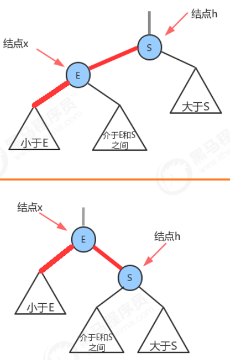


#### 10.2.4.向单个2-结点中插入新键

一棵只含有一个键的红黑树只含有一个2-结点。插入另一个键后，我们马上就需要将他们旋转。

- 如果新键小于当前结点的键，我们只需要新增一个红色结点即可，新的红黑树和单个3-结点完全等价。

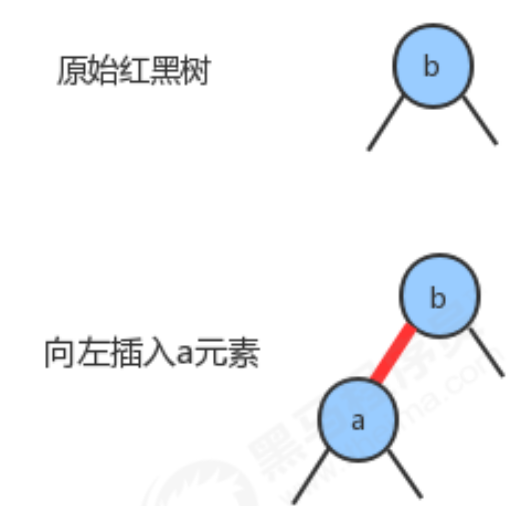

- 如果新键大于当前结点的键，那么新增的红色结点将会产生一条红色的右链接，此时我们需要通过左旋，把

  红色右链接变成左链接，插入操作才算完成。形成的新的红黑树依然和3-结点等价，其中含有两个键，一条红

  色链接。

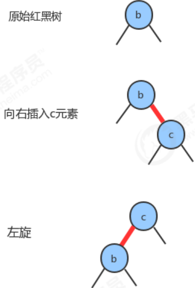

#### 10.2.5.向底部的2-结点插入新键

​	用和二叉查找树相同的方式向一棵红黑树中插入一个新键，会在树的底部新增一个结点（可以保证有序性），唯一区别的地方是我们会用红链接将新结点和它的父结点相连。如果它的父结点是一个2-结点，那么刚才讨论的两种方式仍然适用。

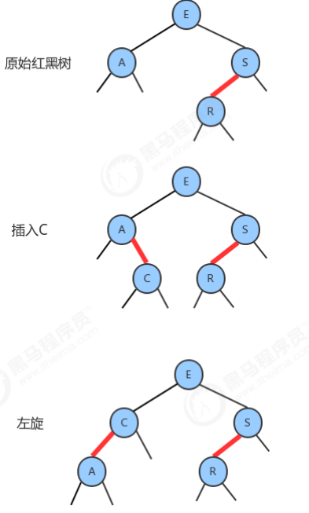


#### 10.2.6.颜色反转

​	当一个结点的左子结点和右子结点的color都为RED时，也就是出现了临时的4-结点，此时只需要把左子结点和右子结点的颜色变为BLACK，同时让当前结点的颜色变为RED即可。

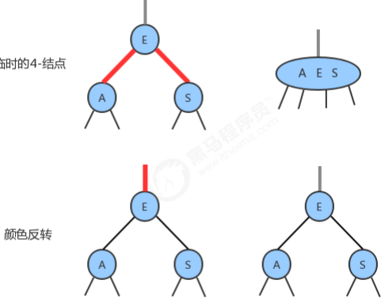


#### 10.2.7.向一颗双键树（3-结点）中插入新键

这种情况有可以分为三种子情况：

1. 新键大于原树中的两个键

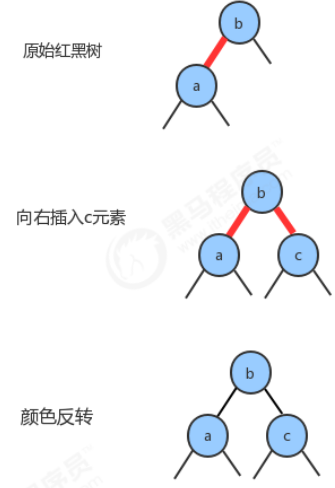

2. 新键小于原树中的两个键

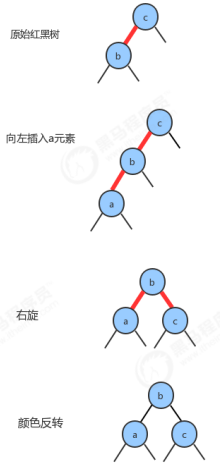

3. 新键介于原数中两个键之间

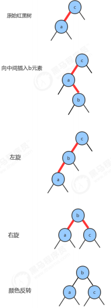

#### 10.2.8.根节点的颜色总是黑色

​	之前我们介绍结点API的时候，在结点Node对象中color属性表示的是父结点指向当前结点的连接的颜色，由于根结点不存在父结点，所以每次插入操作后，我们都需要把根结点的颜色设置为黑色。


#### 10.2.9.向树底部的3-结点插入新键

​	假设在树的底部的一个3-结点下加入一个新的结点。前面我们所讲的3种情况都会出现。指向新结点的链接可能是3-结点的右链接（此时我们只需要转换颜色即可），或是左链接(此时我们需要进行右旋转然后再转换)，或是中链接(此时需要先左旋转然后再右旋转，最后转换颜色)。颜色转换会使中间结点的颜色变红，相当于将它送入了父结点。这意味着父结点中继续插入一个新键，我们只需要使用相同的方法解决即可，直到遇到一个2-结点或者根结点为止。

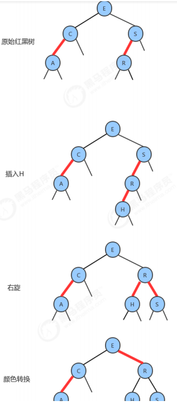

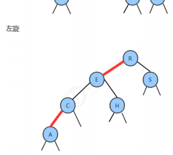

#### 10.2.10.红黑树的API设计

| 类名     | RedBlackTree, Value>                                         |
| -------- | ------------------------------------------------------------ |
| 构造方法 | RedBlackTree()：创建RedBlackTree对象                         |
| 成员方法 | 1.private boolean isRed(Node x)：判断当前结点的父指向链接是否为红色；2.private Node rotateLeft(Node h):左旋调整；3.private Node rotateRight(Node h):右旋调整；4.private void flflipColors(Node h)：颜色反转,相当于完成拆分4-结点；5.public void put(Key key, Value val):在整个树上完成插入操作；6.private Node put(Node h, Key key, Value val):在指定树中，完成插入操作,并返回添加元素后新的树；7.public Value get(Key key):根据key，从树中找出对应的值；8.private Value get(Node x, Key key):从指定的树x中，找出key对应的值；9.public int size():获取树中元素的个数 |
| 成员变量 | 1.private Node root : 记录根结点；2.private int N:记录树中元素的个数；3.private static fifinal boolean RED：红色链接标识；4.private static fifinal boolean BLACK:黑色链接标识 |


#### 10.2.11.红黑树的实现

```java
//红黑树代码 
public class RedBlackTree<Key extends Comparable<Key>, Value> {
    //根节点 
    private Node root;
    //记录树中元素的个数
    private int N;
    //红色链接 
    private static final boolean RED = true;
    //黑色链接 
    private static final boolean BLACK = false; 
    
    
    /**
    * 判断当前节点的父指向链接是否为红色 
    * @param x 
    * @return 
    */ 
    private boolean isRed(Node x) { 
        //空结点默认是黑色链接 
        if (x == null) { 
            return false;
        }
        
        //非空结点需要判断结点color属性的值 
        return x.color == RED; 
    }
    
    
    /**
    * 左旋转 
    * @param h 
    * @return 
    */ 
    private Node rotateLeft(Node h) { 
        //找出当前结点h的右子结点 
        Node hRight = h.right; 
        //找出右子结点的左子结点 
        Node lhRight = hRight.left; 
        //让当前结点h的右子结点的左子结点成为当前结点的右子结点 
        h.right = lhRight; 
        //让当前结点h称为右子结点的左子结点
        hRight.left = h; 
        //让当前结点h的color编程右子结点的color
        hRight.color = h.color; 
        //让当前结点h的color变为RED 
        h.color = RED; 
        //返回当前结点的右子结点 
        return hRight;
    }
    
    
    /**
    * 右旋 
    * @param h 
    * @return
    */ 
    private Node rotateRight(Node h) {
        //找出当前结点h的左子结点 
        Node hLeft = h.left; 
        //找出当前结点h的左子结点的右子结点
        Node rHleft = hLeft.right;
        //让当前结点h的左子结点的右子结点称为当前结点的左子结点
        h.left = rHleft; 
        //让当前结点称为左子结点的右子结点 
        hLeft.right = h; 
        //让当前结点h的color值称为左子结点的color值 
        hLeft.color = h.color; 
        //让当前结点h的color变为RED
        h.color = RED; 
        //返回当前结点的左子结点 
        return hLeft; 
    }
    
    
    /**
    * 颜色反转,相当于完成拆分4-节点 
    * @param h 
    */
    private void flipColors(Node h) {
        //当前结点的color属性值变为RED； 
        h.color = RED; 
        //当前结点的左右子结点的color属性值都变为黑色 
        h.left.color = BLACK; 
        h.right.color = BLACK; 
    }
    
    
    /**
    * 在整个树上完成插入操作 
    * @param key 
    * @param val 
    */ 
    public void put(Key key, Value val) { 
        //在root整个树上插入key-val 
        root = put(root, key, val); 
        //让根结点的颜色变为BLACK 
        root.color = BLACK; 
    }
    
    
    /**
    * 在指定树中，完成插入操作,并返回添加元素后新的树 
    * @param h 
    * @param key 
    * @param val 
    */ 
    private Node put(Node h, Key key, Value val) { 
        if (h == null) {
            //标准的插入操作，和父结点用红链接相连 
            N++; 
            return new Node(key, val, null, null, RED); 
        }
        
        
        //比较要插入的键和当前结点的键 
        int cmp = key.compareTo(h.key); 
        if (cmp < 0) { 
            //继续寻找左子树插入 
            h.left = put(h.left, key, val); 
        } else if (cmp > 0) { 
            //继续寻找右子树插入 
            h.right = put(h.right, key, val);
        } else {
            //已经有相同的结点存在，修改节点的值；
            h.value = val;
        }
        
        //如果当前结点的右链接是红色，左链接是黑色，需要左旋 
        if (isRed(h.right) && !isRed(h.left)) { 
            h=rotateLeft(h); 
        }
        
        //如果当前结点的左子结点和左子结点的左子结点都是红色链接，则需要右旋
        if (isRed(h.left) && isRed(h.left.left)) {
            h=rotateRight(h);
        }
        
        //如果当前结点的左链接和右链接都是红色，需要颜色变换 
        if (isRed(h.left) && isRed(h.right)) { 
            flipColors(h);
        }
        
        //返回当前结点 
        return h;
    }
    
    //根据key，从树中找出对应的值 
    public Value get(Key key) { 
        return get(root, key); 
    }
    
    //从指定的树x中，查找key对应的值 
    public Value get(Node x, Key key) { 
        //如果当前结点为空，则没有找到,返回null 
        if (x == null) {
            return null; 
        }
        
        //比较当前结点的键和key 
        int cmp = key.compareTo(x.key);
        if (cmp < 0) { 
            //如果要查询的key小于当前结点的key，则继续找当前结点的左子结点； 
            return get(x.left, key);
        } else if (cmp > 0) { 
            //如果要查询的key大于当前结点的key，则继续找当前结点的右子结点；
            return get(x.right, key);
        } else { 
            //如果要查询的key等于当前结点的key，则树中返回当前结点的value。
            return x.value;
        } 
    }
    
    
    //获取树中元素的个数 
    public int size() { 
        return N; 
    }
    
    //结点类 
    private class Node { 
        //存储键 
        public Key key;
        //存储值 
        private Value value;
        //记录左子结点 
        public Node left;
        //记录右子结点 
        public Node right; 
        //由其父结点指向它的链接的颜色 
        public boolean color;
        public Node(Key key, Value value, Node left, Node right, boolean color) { 
            this.key = key; 
            this.value = value; 
            this.left = left;
            this.right = right;
            this.color = color; 
        } 
    }
}


//测试代码 
public class Test { 
    public static void main(String[] args) throws Exception { 
        RedBlackTree<Integer, String> bt = new RedBlackTree<>();
        bt.put(4, "二哈"); 
        bt.put(1, "张三");
        bt.put(3, "李四");
        bt.put(5, "王五"); 
        System.out.println(bt.size());
        bt.put(1,"老三"); 
        System.out.println(bt.get(1));
        System.out.println(bt.size());
    }
}
```


### 10.3.B-树

​	前面我们已经学习了二叉查找树、2-3树以及它的实现红黑树。2-3树中，一个结点做多能有两个key，它的实现红黑树中使用对链接染色的方式去表达这两个key。接下来我们学习另外一种树型结构B树，这种数据结构中，一个结点允许多于两个key的存在。B树是一种树状数据结构，它能够存储数据、对其进行排序并允许以O(logn)的时间复杂度进行查找、顺序读取、插入和删除等操作。

#### 10.3.1.B树的特征

​	B树中允许一个结点中包含多个key，可以是3个、4个、5个甚至更多，并不确定，需要看具体的实现。现在我们选择一个参数M，来构造一个B树，我们可以把它称作是M阶的B树，那么该树会具有如下特点：

- 每个结点最多有M-1个key，并且以升序排列；

- 每个结点最多能有M个子结点；

- 根结点至少有两个子结点；

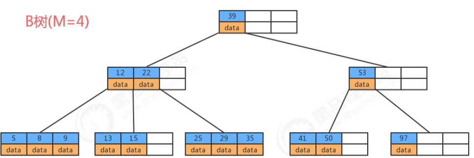


​	在实际应用中B树的阶数一般都比较大（通常大于100），所以，即使存储大量的数据，B树的高度仍然比较小，这样在某些应用场景下，就可以体现出它的优势。


#### 10.3.2.B树存储数据

若参数M选择为5，那么每个结点最多包含4个键值对，我们以5阶B树为例，看看B树的数据存储。

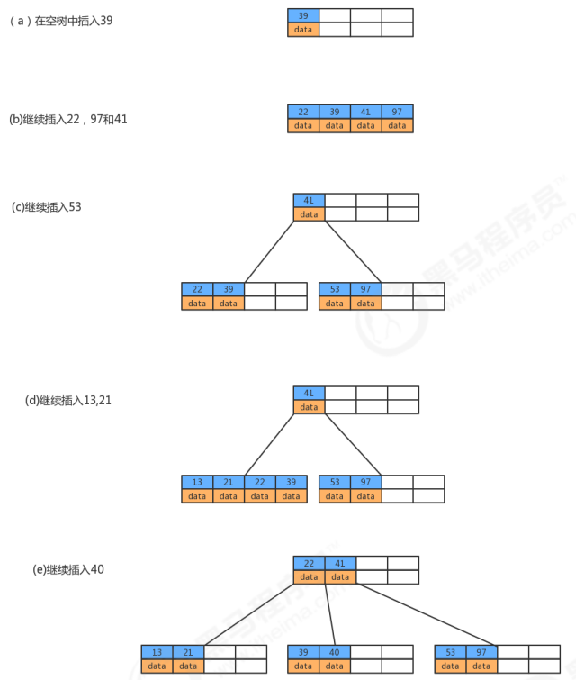

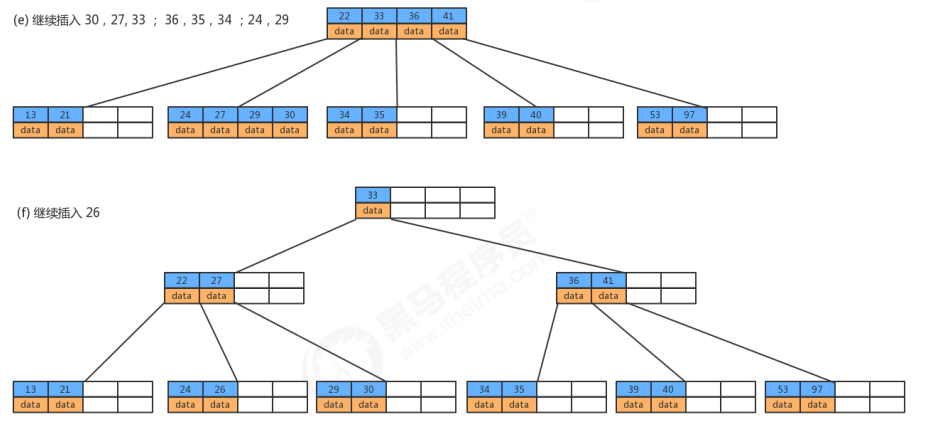


#### 10.3.3.B树在磁盘文件中的应用

​	在我们的程序中，不可避免的需要通过IO操作文件，而我们的文件是存储在磁盘上的。计算机操作磁盘上的文件是通过文件系统进行操作的，在文件系统中就使用到了B树这种数据结构。

- **磁盘**

  磁盘能够保存大量的数据，从GB一直到TB级，但是 他的读取速度比较慢，因为涉及到机器操作，读取速度为毫秒级 。

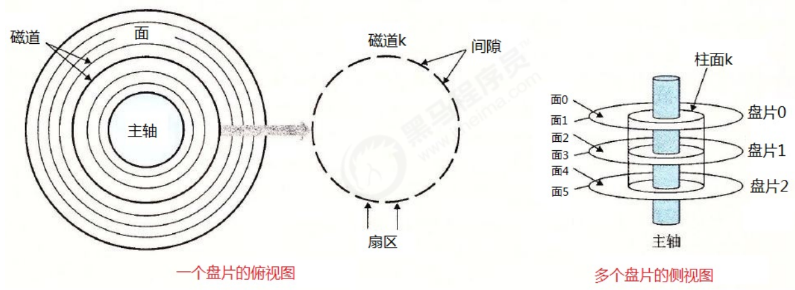


​	磁盘由盘片构成,每个盘片有两面，又称为盘面 。盘片中央有一个可以旋转的主轴，他使得盘片以固定的旋转速率旋转，通常是5400rpm或者是7200rpm,一个磁盘中包含了多个这样的盘片并封装在一个密封的容器内 。盘片的每个表面是由一组称为磁道同心圆组成的 ，每个磁道被划分为了一组扇区 ，每个扇区包含相等数量的数据位，通常是512个子节，扇区之间由一些间隙隔开,这些间隙中不存储数据 。


- **磁盘IO**

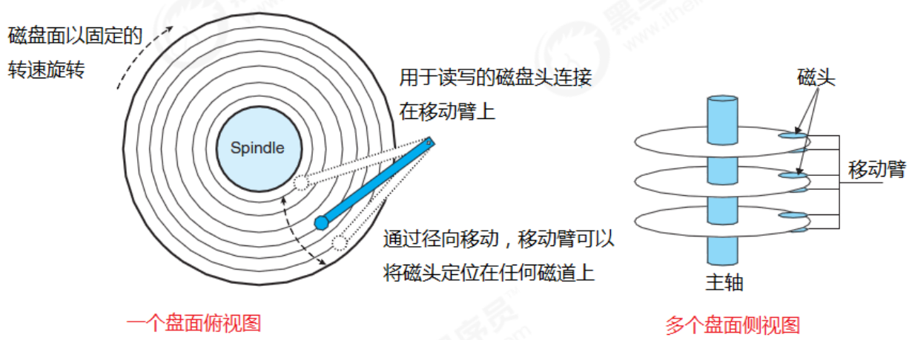

​	磁盘用磁头来读写存储在盘片表面的位，而磁头连接到一个移动臂上，移动臂沿着盘片半径前后移动，可以将磁头定位到任何磁道上，这称之为寻道操作。一旦定位到磁道后，盘片转动，磁道上的每个位经过磁头时，读写磁头就可以感知到该位的值，也可以修改值。对磁盘的访问时间分为 **寻道时间**，**旋转时间**，以及**传送时间**。

​	由于存储介质的特性，磁盘本身存取就比主存慢很多，再加上机械运动耗费，因此为了提高效率，要尽量减少磁盘I/O，减少读写操作。 为了达到这个目的，磁盘往往不是严格按需读取，而是每次都会预读，即使只需要一个字节，磁盘也会从这个位置开始，顺序向后读取一定长度的数据放入内存。这样做的理论依据是计算机科学中著名的局部性原理：当一个数据被用到时，其附近的数据也通常会马上被使用。由于磁盘顺序读取的效率很高（不需要寻道时间，只需很少的旋转时间），因此预读可以提高I/O效率。

​	页是计算机管理存储器的逻辑块，硬件及操作系统往往将主存和磁盘存储区分割为连续的大小相等的块，每个存储块称为一页（1024个字节或其整数倍），预读的长度一般为页的整倍数。主存和磁盘以页为单位交换数据。当程序要读取的数据不在主存中时，会触发一个缺页异常，此时系统会向磁盘发出读盘信号，磁盘会找到数据的起始位置并向后连续读取一页或几页载入内存中，然后异常返回，程序继续运行。

​	文件系统的设计者利用了磁盘预读原理，将一个结点的大小设为等于一个页（1024个字节或其整数倍），这样每个结点只需要一次I/O就可以完全载入。那么3层的B树可以容纳1024*1024*1024差不多10亿个数据，如果换成二叉查找树，则需要30层！假定操作系统一次读取一个节点，并且根节点保留在内存中，那么B树在10亿个数据中查找目标值，只需要小于3次硬盘读取就可以找到目标值，但红黑树需要小于30次，因此B树大大提高了IO的操作效率。


### 10.4.B+树

B+树是对B树的一种变形树，它与B树的差异在于：

1. 非叶结点仅具有索引作用，也就是说，非叶子结点只存储key，不存储value； 

2. 树的所有叶结点构成一个有序链表，可以按照key排序的次序遍历全部数据。


#### 10.4.1.B+树存储数据

若参数M选择为5，那么每个结点最多包含4个键值对，我们以5阶B+树为例，看看B+树的数据存储。

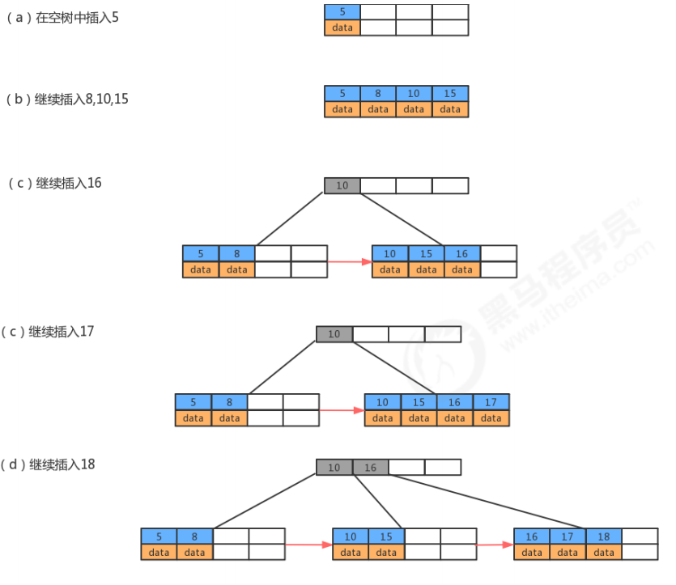

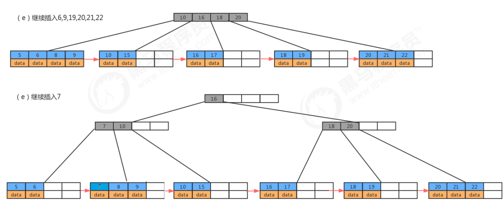


#### 10.4.2.B+树和B树的对比

**B+** **树的优点在于：**

1.由于B+树在非叶子结点上不包含真正的数据，只当做索引使用，因此在内存相同的情况下，能够存放更多的key。

 2.B+树的叶子结点都是相连的，因此对整棵树的遍历只需要一次线性遍历叶子结点即可。而且由于数据顺序排列并且相连，所以便于区间查找和搜索。而B树则需要进行每一层的递归遍历。

**B树的优点在于：**

由于B树的每一个节点都包含key和value，因此我们根据key查找value时，只需要找到key所在的位置，就能找到value，但B+树只有叶子结点存储数据，索引每一次查找，都必须一次一次，一直找到树的最大深度处，也就是叶子结点的深度，才能找到value。


#### 10.4.3.B+树在数据库中的应用

​	在数据库的操作中，查询操作可以说是最频繁的一种操作，因此在设计数据库时，必须要考虑到查询的效率问题，在很多数据库中，都是用到了B+树来提高查询的效率；

​	在操作数据库时，我们为了提高查询效率，可以基于某张表的某个字段建立索引，就可以提高查询效率，那其实这个索引就是B+树这种数据结构实现的。

- **未建立主键索引查询**

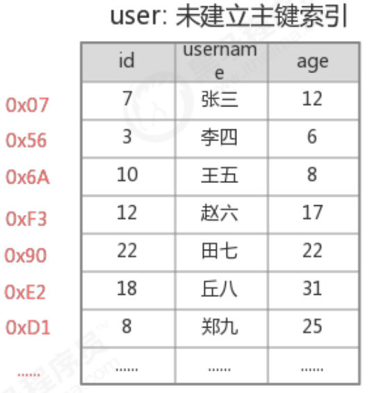

执行 **select * from user where id=18** ,需要从第一条数据开始，一直查询到第6条，发现id=18，此时才能查询出目标结果，共需要比较6次；

- **建立主键索引查询**

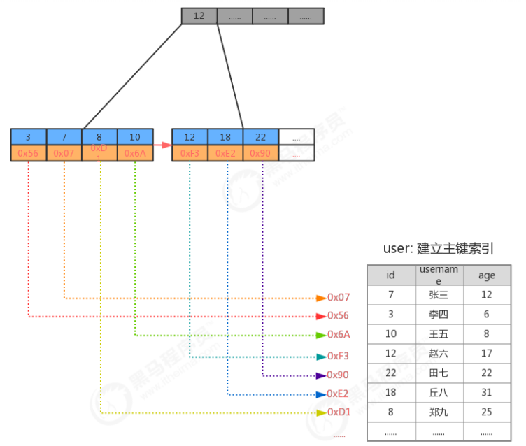

- **区域查询**

  执行 **select * from user where id>=12 and id<=18** ,如果有了索引，由于B+树的叶子结点形成了一个有序链表，所以我们只需要找到id为12的叶子结点，按照遍历链表的方式顺序往后查即可，效率非常高。


## 11.并查集

并查集是一种树型的数据结构 ，并查集可以高效地进行如下操作：

- 查询元素p和元素q是否属于同一组

- 合并元素p和元素q所在的组


### 11.1.并查集结构

并查集也是一种树型结构，但这棵树跟我们之前讲的二叉树、红黑树、B树等都不一样，这种树的要求比较简单：

1. 每个元素都唯一的对应一个结点；

2. 每一组数据中的多个元素都在同一颗树中；

3. 一个组中的数据对应的树和另外一个组中的数据对应的树之间没有任何联系；

4. 元素在树中并没有子父级关系的硬性要求；

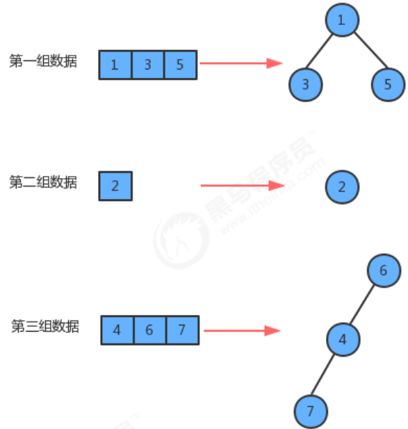


### 11.2.并查集API设计

| 类名     | UF                                                           |
| -------- | ------------------------------------------------------------ |
| 构造方法 | UF(int N)：初始化并查集，以整数标识(0,N-1)个结点             |
| 成员方法 | 1.public int count()：获取当前并查集中的数据有多少个分组；2.public boolean connected(int p,int q):判断并查集中元素p和元素q是否在同一分组中；3.public int fifind(int p):元素p所在分组的标识符；4.public void union(int p,int q)：把p元素所在分组和q元素所在分组合并。 |
| 成员变量 | 1.private int[] eleAndGroup: 记录结点元素和该元素所在分组的标识；2.private int count：记录并查集中数据的分组个数 |


### 11.3.并查集实现

- **UF(int N)构造方法实现**

1. 初始情况下，每个元素都在一个独立的分组中，所以，初始情况下，并查集中的数据默认分为N个组；

2. 初始化数组eleAndGroup； 

3. 把eleAndGroup数组的索引看做是每个结点存储的元素，把eleAndGroup数组每个索引处的值看做是该结点所在的分组，那么初始化情况下，i索引处存储的值就是i。

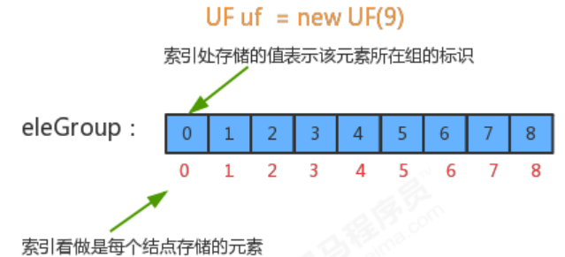


- **union(int p,int q)合并方法实现**

1. 如果p和q已经在同一个分组中，则无需合并；

2. 如果p和q不在同一个分组，则只需要将p元素所在组的所有的元素的组标识符修改为q元素所在组的标识符即可；

3. 分组数量-1。

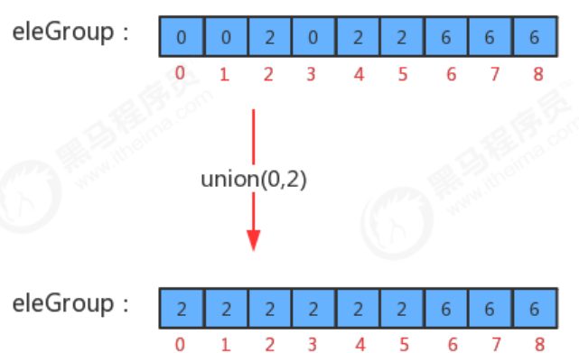


- **代码**

```java
//并查集代码 
public class UF { 
    //记录结点元素和该元素所在分组的标识 
    private int[] eleAndGroup; 
    //记录并查集中数据的分组个数 
    private int count; 
    //初始化并查集 
    public UF(int N){ 
        //初始情况下，每个元素都在一个独立的分组中，所以，初始情况下，并查集中的数据默认分为N个组 
        this.count=N; 
        //初始化数组 
        eleAndGroup = new int[N]; 
        
        //把eleAndGroup数组的索引看做是每个结点存储的元素，把eleAndGroup数组每个索引处的值看做是该结点所在的分组，那么初始化情况下，i索引处存储的值就是i 
        for (int i = 0; i < N; i++) {
            eleAndGroup[i]=i; 
        }
    }
    
    //获取当前并查集中的数据有多少个分组 
    public int count(){ 
        return count;
    }
    
    //元素p所在分组的标识符 
    public int find(int p){ 
        return eleAndGroup[p];
    }
    
    //判断并查集中元素p和元素q是否在同一分组中 
    public boolean connected(int p,int q){ 
        return find(p)==find(q);
    }
    
    //把p元素所在分组和q元素所在分组合并 
    public void union(int p,int q){ 
        //如果p和q已经在同一个分组中，则无需合并； 
        if (connected(p,q)){
            return; 
        }
        
        //如果p和q不在同一个分组，则只需要将p元素所在组的所有的元素的组标识符修改为q元素所在组的标识 符即可 
        int pGroup = find(p); 
        int qGroup = find(q);
        for (int i = 0; i < eleAndGroup.length; i++) { 
            if (eleAndGroup[i]==pGroup){ 
                eleAndGroup[i]=qGroup;
            } 
        }
        //分组数量-1 
        count--; 
    } 
}


//测试代码 
public class Test { 
    public static void main(String[] args) { 
        Scanner sc = new Scanner(System.in); 
        System.out.println("请录入并查集中元素的个数:"); 
        int N = sc.nextInt();
        UF uf = new UF(N); 
        while(true){ 
            System.out.println("请录入您要合并的第一个点:");
            int p = sc.nextInt(); 
            System.out.println("请录入您要合并的第二个点:"); 
            int q = sc.nextInt();
            
            //判断p和q是否在同一个组 
            if (uf.connected(p,q)){
                System.out.println("结点："+p+"结点"+q+"已经在同一个组");
                continue;
            }
            
            uf.union(p,q);
            System.out.println("总共还有"+uf.count()+"个分组"); 
        } 
    }
}
```


### 11.4.并查集的应用示例

​	如果我们并查集存储的每一个整数表示的是一个大型计算机网络中的计算机，则我们就可以通过connected(intp,int q)来检测，该网络中的某两台计算机之间是否连通？如果连通，则他们之间可以通信，如果不连通，则不能通信，此时我们又可以调用union(int p,int q)使得p和q之间连通，这样两台计算机之间就可以通信了。

​	一般像计算机这样网络型的数据，我们要求网络中的每两个数据之间都是相连通的，也就是说，我们需要调用很多次union方法，使得网络中所有数据相连，其实我们很容易可以得出，如果要让网络中的数据都相连，则我们至少要调用N-1次union方法才可以，但由于我们的union方法中使用for循环遍历了所有的元素，所以很明显，我们之前实现的合并算法的时间复杂度是O(N^2)，如果要解决大规模问题，它是不合适的，所以我们需要对算法进行优化。


### 11.5.UF_Tree算法优化

​	为了提升union算法的性能，我们需要重新设计fifind方法和union方法的实现，此时我们先需要对我们的之前数据结构中的eleAndGourp数组的含义进行重新设定：

1.我们仍然让eleAndGroup数组的索引作为某个结点的元素；

2.eleAndGroup[i]的值不再是当前结点所在的分组标识，而是该结点的父结点。

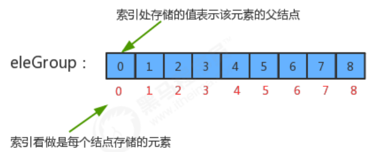


-  **UF_Tree API设计**

| 类名     | UF_Tree                                                      |
| -------- | ------------------------------------------------------------ |
| 构造方法 | UF_Tree(int N)：初始化并查集，以整数标识(0,N-1)个结点        |
| 成员方法 | 1.public int count()：获取当前并查集中的数据有多少个分组；2.public boolean connected(int p,int q):判断并查集中元素p和元素q是否在同一分组中；3.public int fifind(int p):元素p所在分组的标识符；4.public void union(int p,int q)：把p元素所在分组和q元素所在分组合并 |
| 成员变量 | 1.private int[] eleAndGroup: 记录结点元素和该元素的父结点；2.private int count：记录并查集中数据的分组个数 |


-  **fifind(int p)查询方法实现**

1.判断当前元素p的父结点eleAndGroup[p]是不是自己，如果是自己则证明已经是根结点了；

2.如果当前元素p的父结点不是自己，则让p=eleAndGroup[p]，继续找父结点的父结点,直到找到根结点为止。

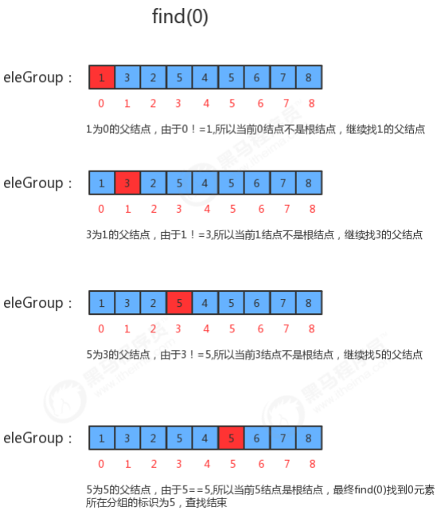


- **union(int p,int q)合并方法实现**

1. 找到p元素所在树的根结点

2. 找到q元素所在树的根结点

3. 如果p和q已经在同一个树中，则无需合并；

4. 如果p和q不在同一个分组，则只需要将p元素所在树根结点的父结点设置为q元素的根结点即可；

5. 分组数量-1

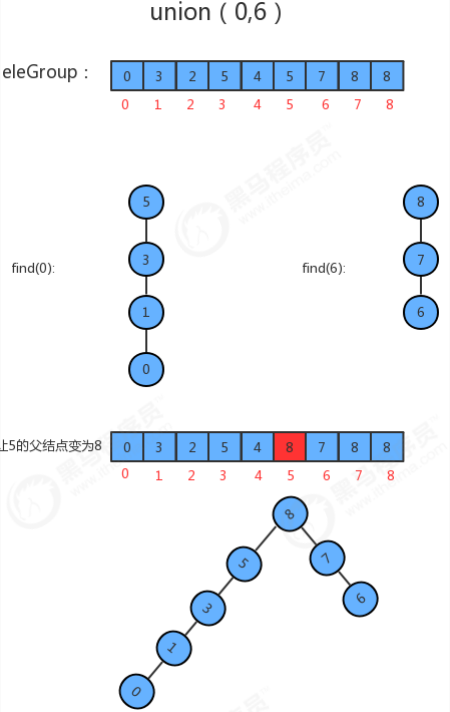

- **代码**

```java
public class UF_Tree { 
    //记录结点元素和该元素所的父结点 
    private int[] eleAndGroup;
    //记录并查集中数据的分组个数 
    private int count; 
    
    //初始化并查集 
    public UF_Tree(int N){
        //初始情况下，每个元素都在一个独立的分组中，所以，初始情况下，并查集中的数据默认分为N个组 
        this.count=N; 
        //初始化数组 
        eleAndGroup = new int[N];
        
        //把eleAndGroup数组的索引看做是每个结点存储的元素，把eleAndGroup数组每个索引处的值看做是该 结点的父结点，那么初始化情况下，i索引处存储的值就是i 
        for (int i = 0; i < N; i++) { 
            eleAndGroup[i]=i; 
        } 
    }
    
    //获取当前并查集中的数据有多少个分组 
    public int count(){ 
        return count; 
    }
    
    //元素p所在分组的标识符 
    public int find(int p){ 
        while(true){ 
            //判断当前元素p的父结点eleAndGroup[p]是不是自己，如果是自己则证明已经是根结点了； 
            if (p==eleAndGroup[p]){ 
                return p; 
            }
            
            //如果当前元素p的父结点不是自己，则让p=eleAndGroup[p]，继续找父结点的父结点,直到找到根 结点为止； 
            p=eleAndGroup[p]; 
        } 
    }
    
    //判断并查集中元素p和元素q是否在同一分组中 
    public boolean connected(int p,int q){ 
        return find(p)==find(q); 
    }
    
    //把p元素所在分组和q元素所在分组合并 
    public void union(int p,int q){ 
        //找到p元素所在树的根结点 
        int pRoot = find(p); 
        //找到q元素所在树的根结点 
        int qRoot = find(q);
        
        //如果p和q已经在同一个树中，则无需合并；
        if (pRoot==qRoot){
            return;
        }
        //如果p和q不在同一个分组，则只需要将p元素所在树根结点的父结点设置为q元素的根结点即可； 
        eleAndGroup[pRoot]=qRoot; 
        //分组数量-1
        count--; 
    }
}
```

- **优化后性能分析**

  我们优化后的算法union，如果要把并查集中所有的数据连通，仍然至少要调用N-1次union方法，但是，我们发现union方法中已经没有了for循环，所以union算法的时间复杂度由O(N^2)变为了O(N)。

  但是这个算法仍然有问题，因为我们之前不仅修改了union算法，还修改了fifind算法。我们修改前的fifind算法的时间复杂度在任何情况下都为O(1)，但修改后的fifind算法在最坏情况下是O(N)： 

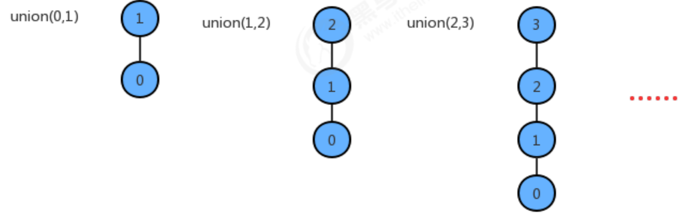

在union方法中调用了fifind方法，所以在最坏情况下union算法的时间复杂度仍然为O(N^2)。


### 11.6.路径压缩

​	UF_Tree中最坏情况下union算法的时间复杂度为O(N^2)，其最主要的问题在于最坏情况下，树的深度和数组的大小一样，如果我们能够通过一些算法让合并时，生成的树的深度尽可能的小，就可以优化fifind方法。

​	之前我们在union算法中，合并树的时候将任意的一棵树连接到了另外一棵树，这种合并方法是比较暴力的，如果我们把并查集中每一棵树的大小记录下来，然后在每次合并树的时候，把较小的树连接到较大的树上，就可以减小树的深度。

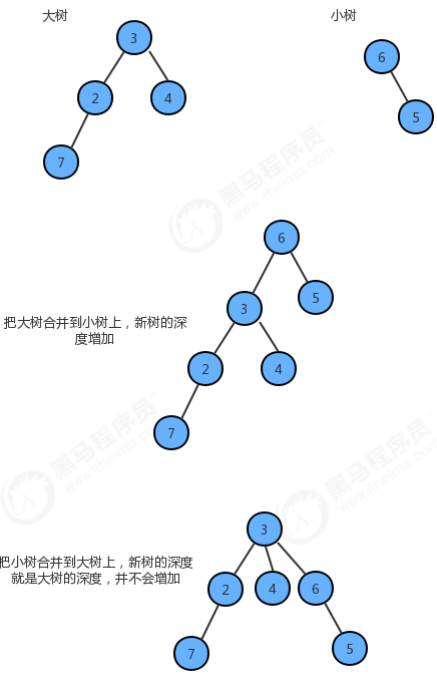

​	只要我们保证每次合并，都能把小树合并到大树上，就能够压缩合并后新树的路径，这样就能提高fifind方法的效率。为了完成这个需求，我们需要另外一个数组来记录存储每个根结点对应的树中元素的个数，并且需要一些代码调整数组中的值。

- **UF_Tree_Weighted API设计**

| 类名     | UF_Tree_Weighted                                             |
| -------- | ------------------------------------------------------------ |
| 构造方法 | UF_Tree_Weighted(int N)：初始化并查集，以整数标识(0,N-1)个结点 |
| 成员方法 | 1.public int count()：获取当前并查集中的数据有多少个分组；2.public boolean connected(int p,int q):判断并查集中元素p和元素q是否在同一分组中；3.public int fifind(int p):元素p所在分组的标识符；4.public void union(int p,int q)：把p元素所在分组和q元素所在分组合并 |
| 成员变量 | 1.private int[] eleAndGroup: 记录结点元素和该元素的父结点；2.private int[] sz: 存储每个根结点对应的树中元素的个数；3.private int count：记录并查集中数据的分组个数 |


- **代码**

```java
public class UF_Tree_Weighted { 
    //记录结点元素和该元素所的父结点 
    private int[] eleAndGroup;
    //存储每个根结点对应的树中元素的个数 
    private int[] sz; 
    //记录并查集中数据的分组个数 
    private int count; 
    
    //初始化并查集 
    public UF_Tree_Weighted(int N){
        //初始情况下，每个元素都在一个独立的分组中，所以，初始情况下，并查集中的数据默认分为N个组 
        this.count=N;
        //初始化数组
        eleAndGroup = new int[N];
        sz = new int[N]; 
        
        //把eleAndGroup数组的索引看做是每个结点存储的元素，把eleAndGroup数组每个索引处的值看做是该 结点的父结点，那么初始化情况下，i索引处存储的值就是i 
        for (int i = 0; i < N; i++) { 
            eleAndGroup[i]=i;
        }
        
        //把sz数组中所有的元素初始化为1，默认情况下，每个结点都是一个独立的树，每个树中只有一个元素 
        for (int i = 0; i < sz.length; i++) { 
            sz[i]=1; 
        }
    }
    
    
    //获取当前并查集中的数据有多少个分组 
    public int count(){ 
        return count; 
    }
    
    //元素p所在分组的标识符
    public int find(int p){ 
        while(true){
            //判断当前元素p的父结点eleAndGroup[p]是不是自己，如果是自己则证明已经是根结点了；
            if (p==eleAndGroup[p]){
                return p; 
            }
            
            //如果当前元素p的父结点不是自己，则让p=eleAndGroup[p]，继续找父结点的父结点,直到找到根 结点为止； 
            p=eleAndGroup[p];
        } 
    }
    
    //判断并查集中元素p和元素q是否在同一分组中 
    public boolean connected(int p,int q){ 
        return find(p)==find(q); 
    }
    
    //把p元素所在分组和q元素所在分组合并 
    public void union(int p,int q){ 
        //找到p元素所在树的根结点 
        int pRoot = find(p);
        //找到q元素所在树的根结点 
        int qRoot = find(q); 
        
        //如果p和q已经在同一个树中，则无需合并； 
        if (pRoot==qRoot){ 
            return; 
        }
        
        //如果p和q不在同一个分组，比较p所在树的元素个数和q所在树的元素个数,把较小的树合并到较大的树 上 
        if (sz[pRoot]<sz[qRoot]){
            eleAndGroup[pRoot] = qRoot;
            //重新调整较大树的元素个数 
            sz[qRoot]+=sz[pRoot]; 
        }else{
            eleAndGroup[qRoot]=pRoot;
            sz[pRoot]+=sz[qRoot];
        }
        
        //分组数量-1 
        count--;
    } 
}
```


### 11.7.案例-畅通工程

​	某省调查城镇交通状况，得到现有城镇道路统计表，表中列出了每条道路直接连通的城镇。省政府“畅通工程”的目标是使全省任何两个城镇间都可以实现交通（但不一定有直接的道路相连，只要互相间接通过道路可达即可）。问最少还需要建设多少条道路？

在我们的测试数据文件夹中有一个trffiffiffic_project.txt文件，它就是诚征道路统计表，下面是对数据的解释：


总共有20个城市，目前已经修改好了7条道路，问还需要修建多少条道路，才能让这20个城市之间全部相通？

**解题思路：**

1.创建一个并查集UF_Tree_Weighted(20);

2.分别调用union(0,1),union(6,9),union(3,8),union(5,11),union(2,12),union(6,10),union(4,8)，表示已经修建好的道路把对应的城市连接起来；

3.如果城市全部连接起来，那么并查集中剩余的分组数目为1，所有的城市都在一个树中，所以，只需要获取当前并查集中剩余的数目，减去1，就是还需要修建的道路数目；

**代码：**

```java
public class Traffic_Project { 
    public static void main(String[] args)throws Exception { 
        //创建输入流 
        BufferedReader reader = new BufferedReader(new InputStreamReader(Traffic_Project.class.getClassLoader().getResourceAsStream("traffic_projec t.txt")));
        //读取城市数目，初始化并查集 
        int number = Integer.parseInt(reader.readLine()); 
        UF_Tree_Weighted uf = new UF_Tree_Weighted(number);
        //读取已经修建好的道路数目 
        int roadNumber = Integer.parseInt(reader.readLine()); 
        
        //循环读取已经修建好的道路，并调用union方法 
        for (int i = 0; i < roadNumber; i++) { 
            String line = reader.readLine(); 
            int p = Integer.parseInt(line.split(" ")[0]); 
            int q = Integer.parseInt(line.split(" ")[1]); 
            uf.union(p,q); 
        }
        
        //获取剩余的分组数量 
        int groupNumber = uf.count(); 
        //计算出还需要修建的道路 
        System.out.println("还需要修建"+(groupNumber-1)+"道路，城市才能相通");
    } 
}
```


## 12.图的入门

​	在现实生活中，有许多应用场景会包含很多点以及点点之间的连接，而这些应用场景我们都可以用即将要学习的图这种数据结构去解决。

**地图：**

​	我们生活中经常使用的地图，基本上是由城市以及连接城市的道路组成，如果我们把城市看做是一个一个的点，把道路看做是一条一条的连接，那么地图就是我们将要学习的图这种数据结构。

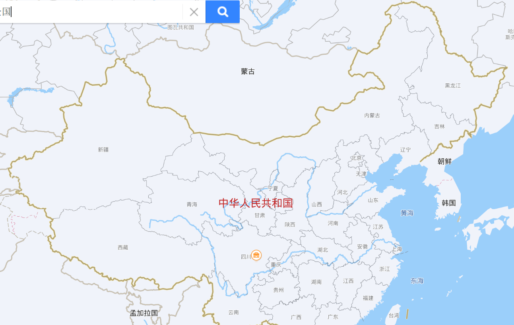

**电路图：**

​	下面是一个我们生活中经常见到的集成电路板，它其实就是由一个一个触点组成，并把触点与触点之间通过线进行连接，这也是我们即将要学习的图这种数据结构的应用场景


### 12.1.图的定义和分类

**定义：**图是由一组顶点和一组能够将两个顶点相连的边组成的

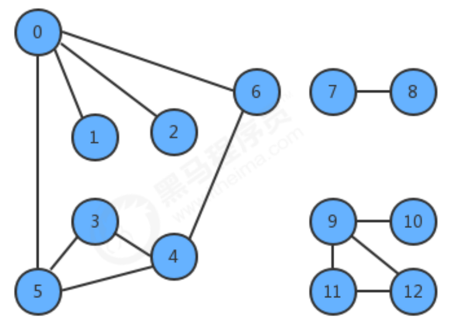

**特殊的图：**

1. 自环：即一条连接一个顶点和其自身的边；

2. 平行边：连接同一对顶点的两条边。

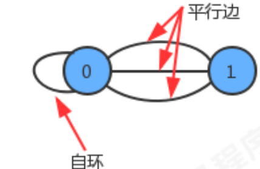

**图的分类：**

按照连接两个顶点的边的不同，可以把图分为以下两种：

无向图：边仅仅连接两个顶点，没有其他含义；

有向图：边不仅连接两个顶点，并且具有方向。


### 12.2.无向图

- **图的相关术语**

**相邻顶点：**当两个顶点通过一条边相连时，我们称这两个顶点是相邻的，并且称这条边依附于这两个顶点。

**度：**某个顶点的度就是依附于该顶点的边的个数

**子图：**是一幅图的所有边的子集(包含这些边依附的顶点)组成的图；

**路径：**是由边顺序连接的一系列的顶点组成

**环：**是一条至少含有一条边且终点和起点相同的路径

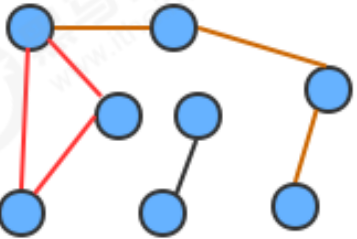

**连通图：**如果图中任意一个顶点都存在一条路径到达另外一个顶点，那么这幅图就称之为连通图

**连通子图：**一个非连通图由若干连通的部分组成，每一个连通的部分都可以称为该图的连通子图

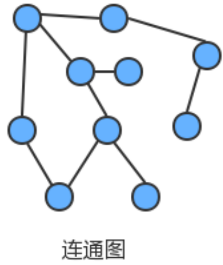

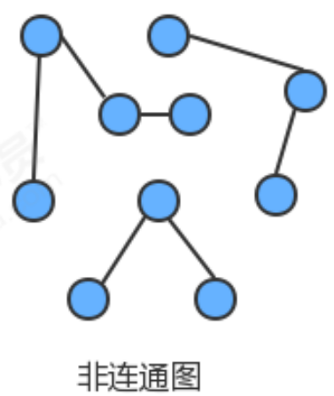

- **图的存储结构**

要表示一幅图，只需要表示清楚以下两部分内容即可：

1. 图中所有的顶点；

2. 所有连接顶点的边；

常见的图的存储结构有两种：邻接矩阵和邻接表

**邻接矩阵**：

1. 使用一个V*V的二维数组int[V][V] adj,把索引的值看做是顶点；

2. 如果顶点v和顶点w相连，我们只需要将adj[v][w]和adj[w][v]的值设置为1,否则设置为0即可。

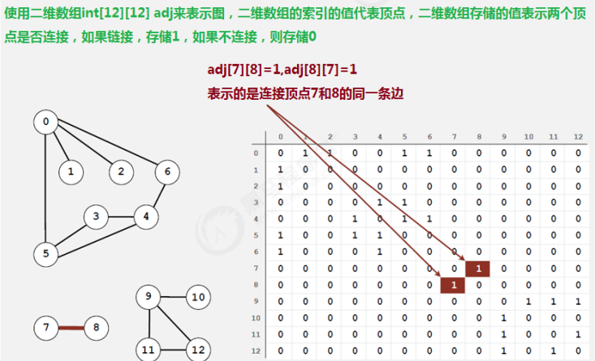

​	很明显，邻接矩阵这种存储方式的空间复杂度是V^2的，如果我们处理的问题规模比较大的话，内存空间极有可能不够用。

**邻接表**：

1.使用一个大小为V的数组 Queue[V] adj，把索引看做是顶点；

2.每个索引处adj[v]存储了一个队列，该队列中存储的是所有与该顶点相邻的其他顶点。

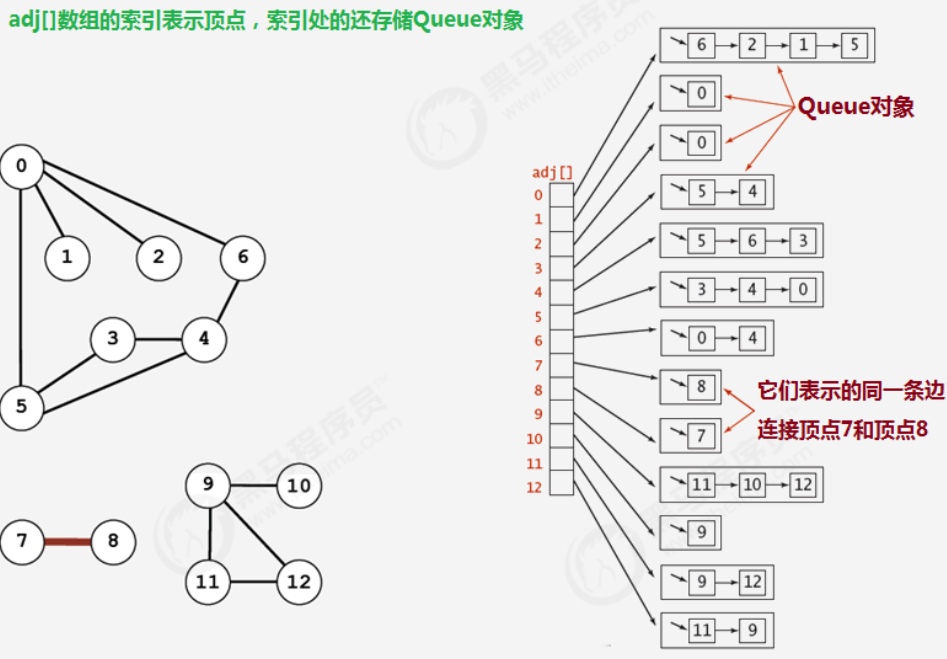

很明显，邻接表的空间并不是是线性级别的，所以后面我们一直采用邻接表这种存储形式来表示图。


### 12.3.图的实现

- **图的API设计**

| 类名     | Graph                                                        |
| -------- | ------------------------------------------------------------ |
| 构造方法 | Graph(int V)：创建一个包含V个顶点但不包含边的图              |
| 成员方法 | 1.public int V():获取图中顶点的数量；2.public int E():获取图中边的数量；3.public void addEdge(int v,int w):向图中添加一条边 v-w；4.public Queue adj(int v)：获取和顶点v相邻的所有顶点 |
| 成员变量 | 1.private fifinal int V: 记录顶点数量；2.private int E: 记录边数量；3.private Queue[] adj: 邻接表 |


- **代码实现**

```java
public class Graph { 
    
    //顶点数目 
    private final int V; 
    //边的数目 
    private int E; 
    //邻接表 
    private Queue<Integer>[] adj; 
    
    public Graph(int V){ 
        
        //初始化顶点数量 
        this.V = V; 
        //初始化边的数量 
        this.E=0; 
        //初始化邻接表 
        this.adj = new Queue[V];
        
        //初始化邻接表中的空队列 
        for (int i = 0; i < adj.length; i++) { 
            adj[i] = new Queue<Integer>();
        }
    }
    
    //获取顶点数目
    public int V(){ 
        return V;
    }
    
    //获取边的数目 
    public int E(){ 
        return E;
    }
    
    //向图中添加一条边 v-w 
    public void addEdge(int v, int w) { 
        //把w添加到v的链表中，这样顶点v就多了一个相邻点
        wadj[v].enqueue(w);
        //把v添加到w的链表中，这样顶点w就多了一个相邻点v
        adj[w].enqueue(v); 
        //边的数目自增1 
        E++; 
    }
    
    //获取和顶点v相邻的所有顶点 
    public Queue<Integer> adj(int v){ 
        return adj[v];
    }
}
```


### 12.4.图的搜索

​	在很多情况下，我们需要遍历图，得到图的一些性质，例如，找出图中与指定的顶点相连的所有顶点，或者判定某个顶点与指定顶点是否相通，是非常常见的需求。

有关图的搜索，最经典的算法有深度优先搜索和广度优先搜索，接下来我们分别讲解这两种搜索算法。


#### 12.4.1.深度优先搜索

​	所谓的深度优先搜索，指的是在搜索时，如果遇到一个结点既有子结点，又有兄弟结点，那么先找子结点，然后找兄弟结点。

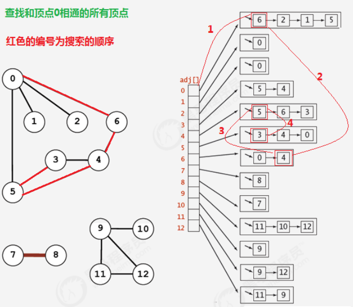

​	很明显，在由于边是没有方向的，所以，如果4和5顶点相连，那么4会出现在5的相邻链表中，5也会出现在4的相邻链表中，那么为了不对顶点进行重复搜索，应该要有相应的标记来表示当前顶点有没有搜索过，可以使用一个布尔类型的数组 boolean[V] marked,索引代表顶点，值代表当前顶点是否已经搜索，如果已经搜索，标记为true，如果没有搜索，标记为false。

- **API设计**

| 类名     | DepthFirstSearch                                             |
| -------- | ------------------------------------------------------------ |
| 构造方法 | DepthFirstSearch(Graph G,int s)：构造深度优先搜索对象，使用深度优先搜索找出G图中s顶点的所有相通顶点 |
| 成员方法 | 1.private void dfs(Graph G, int v)：使用深度优先搜索找出G图中v顶点的所有相通顶点；2.public boolean marked(int w):判断w顶点与s顶点是否相通；3.public int count():获取与顶点s相通的所有顶点的总数。 |
| 成员变量 | 1.private boolean[] marked: 索引代表顶点，值表示当前顶点是否已经被搜索；2.private int count：记录有多少个顶点与s顶点相通 |


- **代码**

```java
public class DepthFirstSearch { 
    
    //索引代表顶点，值表示当前顶点是否已经被搜索 
    private boolean[] marked; 
    //记录有多少个顶点与s顶点相通 
    private int count;
    
    //构造深度优先搜索对象，使用深度优先搜索找出G图中s顶点的所有相邻顶点 
    public DepthFirstSearch(Graph G,int s){ 
        //创建一个和图的顶点数一样大小的布尔数组 
        marked = new boolean[G.V()];
        //搜索G图中与顶点s相同的所有顶点 
        dfs(G,s); 
    }
    
    //使用深度优先搜索找出G图中v顶点的所有相邻顶点 
    private void dfs(Graph G, int v){ 
        //把当前顶点标记为已搜索 
        marked[v]=true;
        //遍历v顶点的邻接表，得到每一个顶点w 
        for (Integer w : G.adj(v)){ 
            //如果当前顶点w没有被搜索过，则递归搜索与w顶点相通的其他顶点 
            if (!marked[w]){ 
                dfs(G,w);
                           } 
        }
        
        //相通的顶点数量+1 
        count++; 
    }
    
    //判断w顶点与s顶点是否相通 
    public boolean marked(int w){ 
        return marked[w];
    }
    
    //获取与顶点s相通的所有顶点的总数 
    public int count(){ 
        return count; 
    }
}
```


#### 12.4.2.广度优先搜索

​	所谓的深度优先搜索，指的是在搜索时，如果遇到一个结点既有子结点，又有兄弟结点，那么先找兄弟结点，然后找子结点。

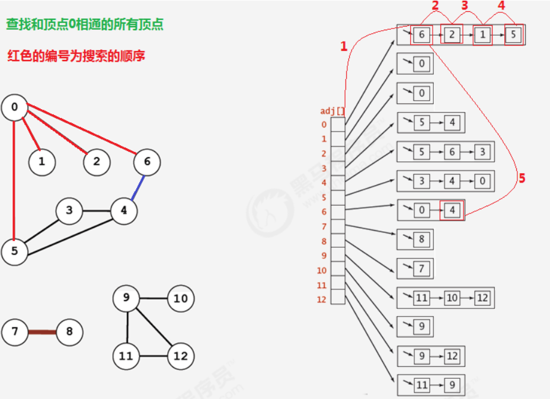

- **API设计**

| 类名     | BreadthFirstSearch                                           |
| -------- | ------------------------------------------------------------ |
| 构造方法 | BreadthFirstSearch(Graph G,int s)：构造广度优先搜索对象，使用广度优先搜索找出G图中s顶点的所有相邻顶点 |
| 成员方法 | 1.private void bfs(Graph G, int v)：使用广度优先搜索找出G图中v顶点的所有相邻顶点；2.public boolean marked(int w):判断w顶点与s顶点是否相通；3.public int count():获取与顶点s相通的所有顶点的总数 |
| 成员变量 | 1.private boolean[] marked: 索引代表顶点，值表示当前顶点是否已经被搜索；2.private int count：记录有多少个顶点与s顶点相通；3.private Queue waitSearch: 用来存储待搜索邻接表的点 |

- **代码**

```java
public class BreadthFirstSearch { 
    
    //索引代表顶点，值表示当前顶点是否已经被搜索 
    private boolean[] marked; 
    //记录有多少个顶点与s顶点相通 
    private int count; 
    //用来存储待搜索邻接表的点 
    private Queue<Integer> waitSearch;
    
    //构造广度优先搜索对象，使用广度优先搜索找出G图中s顶点的所有相邻顶点 
    public BreadthFirstSearch(Graph G, int s) {
        //创建一个和图的顶点数一样大小的布尔数组
        marked = new boolean[G.V()]; 
        //初始化待搜索顶点的队列 
        waitSearch = new Queue<Integer>();
        //搜索G图中与顶点s相同的所有顶点 
        dfs(G, s); 
    }
    
    //使用广度优先搜索找出G图中v顶点的所有相邻顶点
    private void dfs(Graph G, int v) { 
        //把当前顶点v标记为已搜索 
        marked[v]=true;
        //把当前顶点v放入到队列中，等待搜索它的邻接表
        waitSearch.enqueue(v);
        
        //使用while循环从队列中拿出待搜索的顶点wait，进行搜索邻接表 
        while(!waitSearch.isEmpty()){ 
            Integer wait = waitSearch.dequeue();
            
            //遍历wait顶点的邻接表，得到每一个顶点w 
            for (Integer w : G.adj(wait)) { 
                //如果当前顶点w没有被搜索过，则递归搜索与w顶点相通的其他顶点 
                if (!marked[w]) {
                    dfs(G, w); 
                }
            }
        }
        
        //相通的顶点数量+1 
        count++; 
    }
    
    //判断w顶点与s顶点是否相通 
    public boolean marked(int w) { 
        return marked[w]; 
    }
    
    //获取与顶点s相通的所有顶点的总数
    public int count() {
        return count; 
    } 
}
```


### 12.5.案例-畅通工程续1

​	某省调查城镇交通状况，得到现有城镇道路统计表，表中列出了每条道路直接连通的城镇。省政府“畅通工程”的目标是使全省任何两个城镇间都可以实现交通（但不一定有直接的道路相连，只要互相间接通过道路可达即可）。目前的道路状况，9号城市和10号城市是否相通？9号城市和8号城市是否相通？

在我们的测试数据文件夹中有一个trffiffiffic_project.txt文件，它就是诚征道路统计表，下面是对数据的解释：

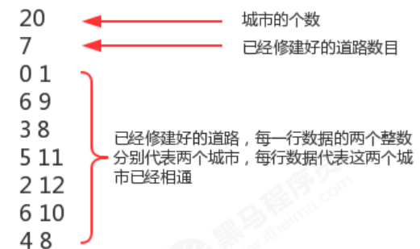

总共有20个城市，目前已经修改好了7条道路，问9号城市和10号城市是否相通？9号城市和8号城市是否相通？

**解题思路：**

1.创建一个图Graph对象，表示城市；

2.分别调用addEdge(0,1),addEdge(6,9),addEdge(3,8),addEdge(5,11),addEdge(2,12),addEdge(6,10),addEdge(4,8)，表示已经修建好的道路把对应的城市连接起来；

3.通过Graph对象和顶点9，构建DepthFirstSearch对象或BreadthFirstSearch对象；

4.调用搜索对象的marked(10)方法和marked(8)方法，即可得到9和城市与10号城市以及9号城市与8号城市是否相通。

**代码**：

```java
import java.io.BufferedReader; 
import java.io.InputStreamReader;

public class Traffic_Project2 { 
    public static void main(String[] args) throws Exception { 
        //创建输入流 
        BufferedReader reader = new BufferedReader(new InputStreamReader(Traffic_Project2.class.getClassLoader().getResourceAsStream("traffic_proje ct.txt")));
        //读取城市数目，初始化Graph图 
        int number = Integer.parseInt(reader.readLine()); 
        Graph G = new Graph(number);
        //读取已经修建好的道路数目 
        int roadNumber = Integer.parseInt(reader.readLine());
        
        //循环读取已经修建好的道路，并调用addEdge方法 
        for (int i = 0; i < roadNumber; i++) { 
            String line = reader.readLine(); 
            int p = Integer.parseInt(line.split(" ")[0]);
            int q = Integer.parseInt(line.split(" ")[1]);
            G.addEdge(p, q);
        }
        //根据图G和顶点9构建图的搜索对象
        //BreadthFirstSearch search = new BreadthFirstSearch(G,9);
        DepthFirstSearch search = new DepthFirstSearch(G, 9); 
        //调用搜索对象的marked(10)方法和marked(8)方法 
        boolean flag1 = search.marked(10); 
        boolean flag2 = search.marked(8); 
        
        System.out.println("9号城市和10号城市是否已相通：" + flag1);
        System.out.println("9号城市和8号城市是否已相通：" + flag2);
    } 
}
```


### 12.6.路径查找

​	在实际生活中，地图是我们经常使用的一种工具，通常我们会用它进行导航，输入一个出发城市，输入一个目的地城市，就可以把路线规划好，而在规划好的这个路线上，会路过很多中间的城市。这类问题翻译成专业问题就是：从s顶点到v顶点是否存在一条路径？如果存在，请找出这条路径。

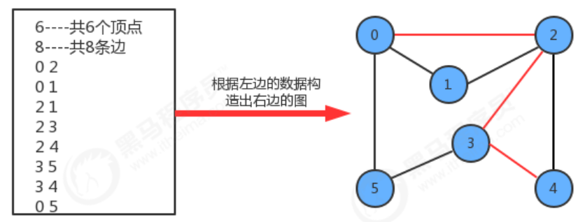

例如在上图上查找顶点0到顶点4的路径用红色标识出来,那么我们可以把该路径表示为 0-2-3-4。

- **路径查找API**

| 类名     | DepthFirstPaths                                              |
| -------- | ------------------------------------------------------------ |
| 构造方法 | DepthFirstPaths(Graph G,int s)：构造深度优先搜索对象，使用深度优先搜索找出G图中起点为s的所有路径 |
| 成员方法 | 1.private void dfs(Graph G, int v)：使用深度优先搜索找出G图中v顶点的所有相邻顶点；2.public boolean hasPathTo(int v):判断v顶点与s顶点是否存在路径；3.public Stack pathTo(int v):找出从起点s到顶点v的路径(就是该路径经过的顶点) |
| 成员变量 | 1.private boolean[] marked: 索引代表顶点，值表示当前顶点是否已经被搜索；2.private int s:起点；3.private int[] edgeTo:索引代表顶点，值代表从起点s到当前顶点路径上的最后一个顶点 |

- **路径查找实现**

  我们实现路径查找，最基本的操作还是得遍历并搜索图，所以，我们的实现暂且基于深度优先搜索来完成。其搜索的过程是比较简单的。我们添加了edgeTo[]整型数组，这个整型数组会记录从每个顶点回到起点s的路径。

  如果我们把顶点设定为0，那么它的搜索可以表示为下图：

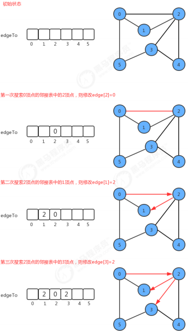

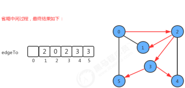

根据最终edgeTo的结果，我们很容易能够找到从起点0到任意顶点的路径。

- **代码**

```java
public class DepthFirstPaths { 
    
    //索引代表顶点，值表示当前顶点是否已经被搜索 
    private boolean[] marked; 
    //起点 
    private int s; 
    //索引代表顶点，值代表从起点s到当前顶点路径上的最后一个顶点 
    private int[] edgeTo; 
    
    //构造深度优先搜索对象，使用深度优先搜索找出G图中起点为s的所有路径 
    public DepthFirstPaths(Graph G, int s){
        //创建一个和图的顶点数一样大小的布尔数组
        marked = new boolean[G.V()]; 
        //创建一个和图顶点数一样大小的整型数组 
        edgeTo = new int[G.V()];
        //初始化顶点 
        this.s=s;
        //搜索G图中起点为s的所有路径 
        dfs(G,s); 
    }
    
    //使用深度优先搜索找出G图中v顶点的所有相邻顶点 
    private void dfs(Graph G, int v){ 
        
        //把当前顶点标记为已搜索 
        marked[v]=true; 
        //遍历v顶点的邻接表，得到每一个顶点w 
        for (Integer w : G.adj(v)){ 
            //如果当前顶点w没有被搜索过，则将edgeTo[w]设置为v,表示w的前一个顶点为v，并递归搜索与w顶 点相通的其他顶点
            if (!marked[w]){ 
                edgeTo[w]=v; dfs(G,w); 
            } 
        }
    }
    
    //判断w顶点与s顶点是否存在路径
    public boolean hasPathTo(int v){ 
        return marked[v];
    }
    
    //找出从起点s到顶点v的路径(就是该路径经过的顶点) 
    public Stack<Integer> pathTo(int v){
        
        //当前v顶点与s顶点不连通，所以直接返回null，没有路径
        if (!hasPathTo(v)){
            return null;
        }
        
        //创建路劲中经过的顶点的容器 
        Stack<Integer> path = new Stack<Integer>();
        //第一次把当前顶点存进去，然后将x变换为到达当前顶点的前一个顶点edgeTo[x],在把前一个顶点存进 去，继续将x变化为到达前一个顶点的前一个顶点，继续存，一直到x的值为s为止，相当于逆推法，最后把s放进去
        
        for (int x = v;x!=s;x=edgeTo[x]){
            //把当前顶点放入容器
            path.push(x);
        }
        
        //把起点s放入容器 
        path.push(s); 
        return path; 
    } 
}


//测试代码 
public class DepthFirstPathsTest { 
    public static void main(String[] args) throws Exception { 
        //创建输入流 
        BufferedReader reader = new BufferedReader(new InputStreamReader(DepthFirstPathsTest.class.getClassLoader().getResourceAsStream("road_find. txt")));
        //读取城市数目，初始化Graph图 
        int number = Integer.parseInt(reader.readLine()); 
        Graph G = new Graph(number);
        //读取城市的连通道路 
        int roadNumber = Integer.parseInt(reader.readLine()); 
        //循环读取道路，并调用addEdge方法 
        for (int i = 0; i < roadNumber; i++) { 
            String line = reader.readLine(); 
            int p = Integer.parseInt(line.split(" ")[0]);
            int q = Integer.parseInt(line.split(" ")[1]); 
            G.addEdge(p, q);
        }
        
        //根据图G和顶点0路径查找对象 
        DepthFirstPaths paths = new DepthFirstPaths(G, 0); 
        //调用查找对象的pathTo(4)方法得到路径
        Stack<Integer> path = paths.pathTo(4);
        
        //遍历打印 
        StringBuilder sb = new StringBuilder(); 
        for (Integer v : path) {
            sb.append(v+"-"); 
        }
        
        sb.deleteCharAt(sb.length()-1); 
        System.out.println(sb);
    }
}
```


## 13.图的进阶


### 13.1.有向图

​	在实际生活中，很多应用相关的图都是有方向性的，最直观的就是网络，可以从A页面通过链接跳转到B页面，那么a和b连接的方向是a->b,但不能说是b->a,此时我们就需要使用有向图来解决这一类问题，它和我们之前学习的无向图，最大的区别就在于连接是具有方向的，在代码的处理上也会有很大的不同。


- **有向图的定义及相关术语**

**定义：**

有向图是一副具有方向性的图，是由一组顶点和一组有方向的边组成的，每条方向的边都连着一对有序的顶点。

**出度：**由某个顶点指出的边的个数称为该顶点的出度。

**入度：**指向某个顶点的边的个数称为该顶点的入度。

**有向路径：**由一系列顶点组成，对于其中的每个顶点都存在一条有向边，从它指向序列中的下一个顶点。

**有向环：**一条至少含有一条边，且起点和终点相同的有向路径。


**一副有向图中两个顶点v和w可能存在以下四种关系：**

1. 没有边相连；

2. 存在从v到w的边v—>w;

3. 存在从w到v的边w—>v;

4. 既存在w到v的边，也存在v到w的边，即双向连接；

理解有向图是一件比较简单的，但如果要通过眼睛看出复杂有向图中的路径就不是那么容易了。

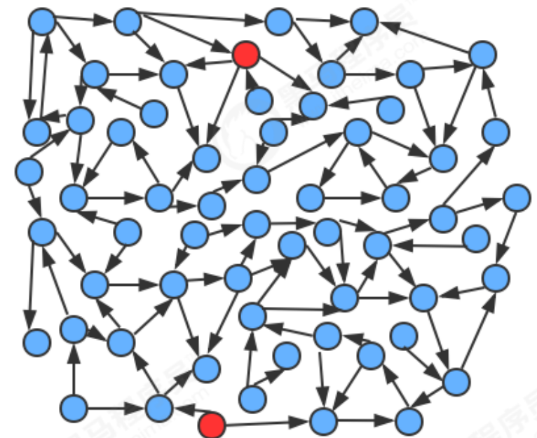

- **有向图API设计**

| 类名     | Digraph                                                      |
| -------- | ------------------------------------------------------------ |
| 构造方法 | Digraph(int V)：创建一个包含V个顶点但不包含边的有向图        |
| 成员方法 | 1.public int V():获取图中顶点的数量；2.public int E():获取图中边的数量；3.public void addEdge(int v,int w):向有向图中添加一条边 v->w；4.public Queue adj(int v)：获取由v指出的边所连接的所有顶点；5.private Digraph reverse():该图的反向图 |
| 成员变量 | 1.private fifinal int V: 记录顶点数量；2.private int E: 记录边数量；3.private Queue[] adj: 邻接表 |

​	在api中设计了一个反向图，其因为有向图的实现中，用adj方法获取出来的是由当前顶点v指向的其他顶点，如果能得到其反向图，就可以很容易得到指向v的其他顶点。

- **有向图实现**

```java
public class Digraph {
    
    //顶点数目 
    private final int V;
    //边的数目 
    private int E; 
    //邻接表 
    private Queue<Integer>[] adj;
    
    public Digraph(int V){ 
        //初始化顶点数量
        this.V = V; 
        //初始化边的数量
        this.E=0; 
        //初始化邻接表
        this.adj = new Queue[V]; 
        //初始化邻接表中的空队列 
        for (int i = 0; i < adj.length; i++) { 
            adj[i] = new Queue<Integer>();
        } 
    }
    
    //获取顶点数目 
    public int V(){ 
        return V; 
    }
    
    //获取边的数目 
    public int E(){
        return E; 
    }
    
    //向有向图中添加一条边 v->w 
    public void addEdge(int v, int w) { 
        //由于有向图中边是有向的，v->w 边，只需要让w出现在v的邻接表中，而不需要让v出现在w的邻接表中 
        adj[v].enqueue(w);
        //边的数目自增1
        E++; 
    }
    
    //获取由v指出的边所连接的所有顶点
    public Queue<Integer> adj(int v){ 
        return adj[v];
    }
    
    //该图的反向图 
    private Digraph reverse(){ 
        //创建新的有向图对象
        Digraph r = new Digraph(V);
        //遍历0~V-1所有顶点,拿到每一个顶点v 
        for (int v=0;v<V;v++){
            //得到原图中的v顶点对应的邻接表,原图中的边为 v->w,则反向图中边为w->v; 
            for (Integer w : adj(v)) {
                r.addEdge(w,v); 
            }
        }
        return r; 
    }
}
```


### 13.2.拓扑排序

​	在现实生活中，我们经常会同一时间接到很多任务去完成，但是这些任务的完成是有先后次序的。以我们学习java学科为例，我们需要学习很多知识，但是这些知识在学习的过程中是需要按照先后次序来完成的。从java基础，到jsp/servlet，到ssm，到springboot等是个循序渐进且有依赖的过程。在学习jsp前要首先掌握java基础和html基础，学习ssm框架前要掌握jsp/servlet之类才行。

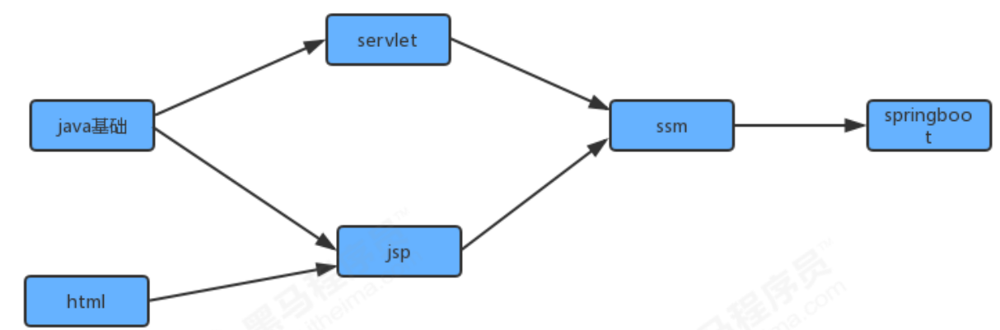

为了简化问题，我们使用整数为顶点编号的标准模型来表示这个案例：

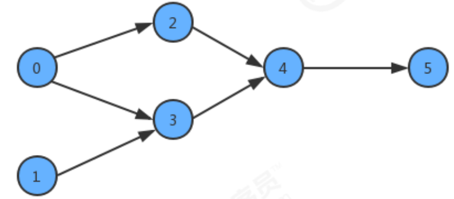

​	此时如果某个同学要学习这些课程，就需要指定出一个学习的方案，我们只需要对图中的顶点进行排序，让它转换为一个线性序列，就可以解决问题，这时就需要用到一种叫**拓扑排序**的算法。

**拓扑排序：**

​	给定一副有向图，将所有的顶点排序，使得所有的有向边均从排在前面的元素指向排在后面的元素，此时就可以明确的表示出每个顶点的优先级。下列是一副拓扑排序后的示意图：

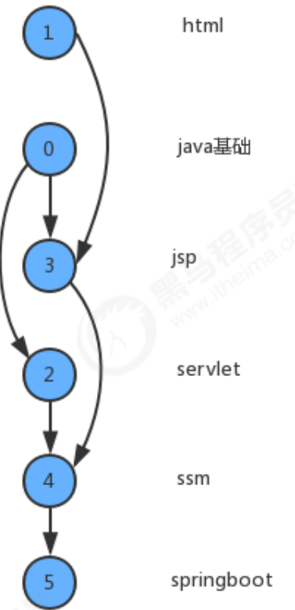

- **检测有向图中的环**

  如果学习x课程前必须先学习y课程，学习y课程前必须先学习z课程，学习z课程前必须先学习x课程，那么一定是有问题了，我们就没有办法学习了，因为这三个条件没有办法同时满足。其实这三门课程x、y、z的条件组成了一个环：

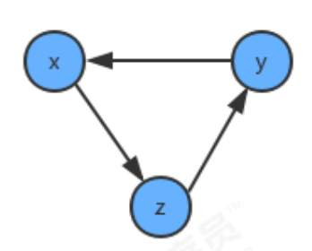

因此，如果我们要使用拓扑排序解决优先级问题，首先得保证图中没有环的存在。

- **检测有向环的API**

| 类名     | DirectedCycle                                                |
| -------- | ------------------------------------------------------------ |
| 构造方法 | DirectedCycle(Digraph G)：创建一个检测环对象，检测图G中是否有环 |
| 成员方法 | 1.private void dfs(Digraph G,int v)：基于深度优先搜索，检测图G中是否有环；2.public boolean hasCycle():判断图中是否有环 |
| 成员变量 | 1.private boolean[] marked: 索引代表顶点，值表示当前顶点是否已经被搜索；2.private boolean hasCycle: 记录图中是否有环；3.private boolean[] onStack:索引代表顶点，使用栈的思想，记录当前顶点有没有已经处于正在搜索的有向路径上 |


- **检测有向环的实现**

在API中添加了onStack[] 布尔数组，索引为图的顶点，当我们深度搜索时：

1. 在如果当前顶点正在搜索，则把对应的onStack数组中的值改为true，标识进栈；

2. 如果当前顶点搜索完毕，则把对应的onStack数组中的值改为false，标识出栈；

3. 如果即将要搜索某个顶点，但该顶点已经在栈中，则图中有环：

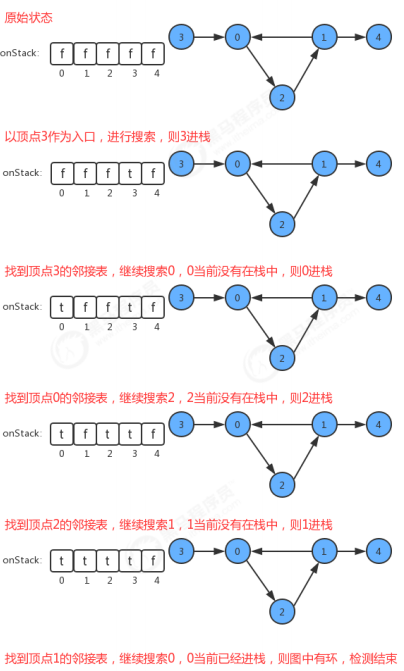

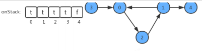

- **代码**

```java
public class DirectedCycle { 
    
    //索引代表顶点，值表示当前顶点是否已经被搜索 
    private boolean[] marked; 
    //记录图中是否有环 
    private boolean hasCycle; 
    //索引代表顶点，使用栈的思想，记录当前顶点有没有已经处于正在搜索的有向路径上 
    private boolean[] onStack; 
    
    //创建一个检测环对象，检测图G中是否有环
    public DirectedCycle(Digraph G){ 
        //创建一个和图的顶点数一样大小的marked数组 
        marked = new boolean[G.V()]; 
        //创建一个和图的顶点数一样大小的onStack数组 
        onStack = new boolean[G.V()]; 
        //默认没有环
        this.hasCycle=false; 
        
        //遍历搜索图中的每一个顶点 
        for (int v = 0; v <G.V(); v++) { 
            //如果当前顶点没有搜索过，则搜索 
            if (!marked[v]){ 
                dfs(G,v);
            } 
        } 
    }
    
    //基于深度优先搜索，检测图G中是否有环 
    private void dfs(Digraph G, int v){ 
        //把当前顶点标记为已搜索 
        marked[v]=true;
        //让当前顶点进栈 
        onStack[v]=true;
        
        //遍历v顶点的邻接表，得到每一个顶点w 
        for (Integer w : G.adj(v)){ 
            
            //如果当前顶点w没有被搜索过，则递归搜索与w顶点相通的其他顶点 
            if (!marked[w]){ 
                dfs(G,w); 
            }
            //如果顶点w已经被搜索过，则查看顶点w是否在栈中，如果在，则证明图中有环，修改hasCycle标 记，结束循环 
            if (onStack[w]){
                hasCycle=true; return; 
            }
        }
        
        //当前顶点已经搜索完毕，让当前顶点出栈 
        onStack[v]=false; 
    }
    
    //判断w顶点与s顶点是否相通 
    public boolean hasCycle(){
        return hasCycle;
    } 
}


//测试代码 
public class DirectedCycleTest { 
    public static void main(String[] args) throws Exception { 
        //创建输入流 
        BufferedReader reader = new BufferedReader(new InputStreamReader(DirectedCycleTest.class.getClassLoader().getResourceAsStream("cycle_test.t xt"))); 
        //读取顶点个数，初始化Graph图 
        int number = Integer.parseInt(reader.readLine());
        Digraph G = new Digraph(number); 
        //读取边的个数 
        int roadNumber = Integer.parseInt(reader.readLine()); 
        
        //读取边，并调用addEdge方法
        for (int i = 0; i < roadNumber; i++) { 
            String line = reader.readLine(); 
            int p = Integer.parseInt(line.split(" ")[0]);
            int q = Integer.parseInt(line.split(" ")[1]);
            G.addEdge(p, q); 
        }
        
        //创建测试检测环对象 
        DirectedCycle cycle = new DirectedCycle(G);
        
        //输出图中是否有环
        System.out.println(cycle.hasCycle());
    } 
}
```


### 13.3.基于深度优先的顶点排序

​	如果要把图中的顶点生成线性序列其实是一件非常简单的事，之前我们学习并使用了多次深度优先搜索，我们会发现其实深度优先搜索有一个特点，那就是在一个连通子图上，每个顶点只会被搜索一次，如果我们能在深度优先搜索的基础上，添加一行代码，只需要将搜索的顶点放入到线性序列的数据结构中，我们就能完成这件事。


- **顶点排序API设计**

| 类名     | DepthFirstOrder                                              |
| -------- | ------------------------------------------------------------ |
| 构造方法 | DepthFirstOrder(Digraph G)：创建一个顶点排序对象，生成顶点线性序列； |
| 成员方法 | 1.private void dfs(Digraph G,int v)：基于深度优先搜索，生成顶点线性序列；2.public Stack reversePost():获取顶点线性序列 |
| 成员变量 | 1.private boolean[] marked: 索引代表顶点，值表示当前顶点是否已经被搜索；2.private Stack reversePost: 使用栈，存储顶点序列 |


- **顶点排序实现**

  在API的设计中，我们添加了一个栈reversePost用来存储顶点，当我们深度搜索图时，每搜索完毕一个顶点，把该顶点放入到reversePost中，这样就可以实现顶点排序。

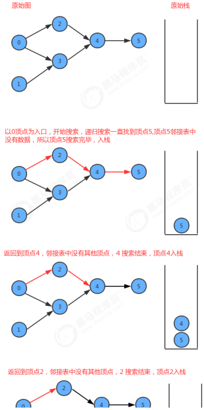

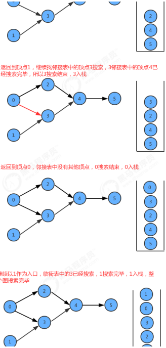

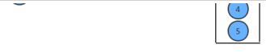

- **代码**

```java
public class DepthFirstOrder { 
    
    //索引代表顶点，值表示当前顶点是否已经被搜索 
    private boolean[] marked;
    //使用栈，存储顶点序列 
    private Stack<Integer> reversePost;
    
    //创建一个检测环对象，检测图G中是否有环 
    public DepthFirstOrder(Digraph G){ 
        //创建一个和图的顶点数一样大小的marked数组 
        marked = new boolean[G.V()]; 
        reversePost = new Stack<Integer>(); 
        
        //遍历搜索图中的每一个顶点 
        for (int v = 0; v <G.V(); v++) {
            //如果当前顶点没有搜索过，则搜索 
            if (!marked[v]){ 
                dfs(G,v); 
            }
        }
    }
    
    //基于深度优先搜索，检测图G中是否有环 
    private void dfs(Digraph G, int v){ 
        
        //把当前顶点标记为已搜索 
        marked[v]=true; 
        //遍历v顶点的邻接表，得到每一个顶点w 
        for (Integer w : G.adj(v)){
            //如果当前顶点w没有被搜索过，则递归搜索与w顶点相通的其他顶点
            if (!marked[w]){ 
                dfs(G,w);
            }
        }
        
        //当前顶点已经搜索完毕，让当前顶点入栈 
        reversePost.push(v); 
    }
    
    //获取顶点线性序列
    public Stack<Integer> reversePost(){ 
        return reversePost; 
    }
}
```


### 13.4.拓扑排序实现

​	前面已经实现了环的检测以及顶点排序，那么拓扑排序就很简单了，基于一幅图，先检测有没有环，如果没有环，则调用顶点排序即可。

- **API设计**

| 类名     | TopoLogical                                                  |
| -------- | ------------------------------------------------------------ |
| 构造方法 | TopoLogical(Digraph G)：构造拓扑排序对象                     |
| 成员方法 | 1.public boolean isCycle()：判断图G是否有环；2.public Stack order():获取拓扑排序的所有顶点 |
| 成员变量 | 1.private Stack order: 顶点的拓扑排序                        |

- **代码**

```java
public class TopoLogical { 
    
    //顶点的拓扑排序 
    private Stack<Integer> order; 
    
    //构造拓扑排序对象 
    public TopoLogical(Digraph G) { 
        //创建检测环对象，检测图G中是否有环 
        DirectedCycle dCycle = new DirectedCycle(G);
        if (!dCycle.hasCycle()){
            //如果没有环，创建顶点排序对象，进行顶点排序 
            DepthFirstOrder depthFirstOrder = new DepthFirstOrder(G);
            order = depthFirstOrder.reversePost();
        } 
    }
    
    //判断图G是否有环 
    private boolean isCycle(){ 
        return order==null;
    }
    
    //获取拓扑排序的所有顶点 
    public Stack<Integer> order(){ 
        return order; 
    }
}


//测试代码 
public class TopoLogicalTest {
    public static void main(String[] args) throws Exception {
        //创建输入流 
        BufferedReader reader = new BufferedReader(new InputStreamReader(TopoLogicalTest.class.getClassLoader().getResourceAsStream("topological_te st.txt"))); 
        //读取顶点个数，初始化Graph图
        int number = Integer.parseInt(reader.readLine());
        Digraph G = new Digraph(number);
        //读取边的个数 
        int roadNumber = Integer.parseInt(reader.readLine());
        //读取边，并调用addEdge方法 
        for (int i = 0; i < roadNumber; i++) { 
            String line = reader.readLine(); 
            int p = Integer.parseInt(line.split(" ")[0]);
            int q = Integer.parseInt(line.split(" ")[1]);
            G.addEdge(p, q);
        }
        
        //创建拓扑排序对象对象 
        TopoLogical topo = new TopoLogical(G); 
        Stack<Integer> order = topo.order();
        
        //遍历打印 
        StringBuilder sb = new StringBuilder(); 
        for (Integer v : order) { 
            sb.append(v+"->"); 
                               }
        
        sb.deleteCharAt(sb.length()-1);
        sb.deleteCharAt(sb.length()-1); 
        System.out.println(sb); 
    } 
}
```


### 13.5.加权无向图

​	加权无向图是一种为每条边关联一个权重值或是成本的图模型。这种图能够自然地表示许多应用。在一副航空图中，边表示航线，权值则可以表示距离或是费用。在一副电路图中，边表示导线，权值则可能表示导线的长度即成本，或是信号通过这条先所需的时间。此时我们很容易就能想到，最小成本的问题，例如，从西安飞纽约，怎样飞才能使时间成本最低或者是金钱成本最低？

​	在下图中，从顶点0到顶点4有三条路径，分别为0-2-3-4,0-2-4,0-5-3-4,那我们如果要通过那条路径到达4顶点最好呢？此时就要考虑，那条路径的成本最低。

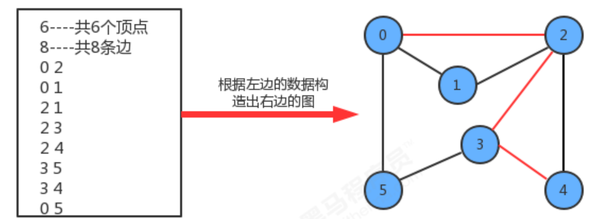


#### 13.5.1.加权无向图边的表示

​	加权无向图中的边我们就不能简单的使用v-w两个顶点表示了，而必须要给边关联一个权重值，因此我们可以使用对象来描述一条边。

- **API设计**

| 类名     | Edge implements Comparable                                   |
| -------- | ------------------------------------------------------------ |
| 构造方法 | Edge(int v,int w,double weight)：通过顶点v和w，以及权重weight值构造一个边对象 |
| 成员方法 | 1.public double weight():获取边的权重值；2.public int either():获取边上的一个点；3.public int other(int vertex)):获取边上除了顶点vertex外的另外一个顶点；4.public int compareTo(Edge that)：比较当前边和参数that边的权重，如果当前边权重大，返回1，如果一样大，返回0，如果当前权重小，返回-1 |
| 成员变量 | 1.private fifinal int v：顶点一；2.private fifinal int w：顶点二；3.private fifinal double weight：当前边的权重 |

- **代码**

```java
public class Edge implements Comparable<Edge> { 
    
    private final int v;//顶点一
    private final int w;//顶点二 
    private final double weight;//当前边的权重 
    
    //通过顶点v和w，以及权重weight值构造一个边对象
    public Edge(int v, int w, double weight) { 
        this.v = v; 
        this.w = w;
        this.weight = weight; 
    }
    
    
    //获取边的权重值
    public double weight(){ 
        return weight; 
    }
    
    //获取边上的一个点 
    public int either(){ 
        return v;
    }
    
    //获取边上除了顶点vertex外的另外一个顶点 
    public int other(int vertex){ 
        if (vertex==v){
            //如果传入的顶点vertext是v，则返回另外一个顶点w 
            return w;
        }else{
            //如果传入的顶点vertext不是v，则返回v即可
            return v; 
        } 
    }
    
    @Override 
    public int compareTo(Edge that) { 
        int cmp; 
        if (this.weight()>that.weight()){ 
            //如果当前边的权重大于参数边that的权重，返回1 
            cmp=1; 
        }else if(this.weight()<that.weight()){
            //如果当前边的权重小于参数边that的权重，返回-1 
            cmp=-1;
        }else{
            //如果当前边的权重等于参数边that的权重，返回0 
            cmp=0; 
        }
        return cmp;
    } 
}
```


#### 13.5.2.加权无向图的实现

之前我们已经完成了无向图，在无向图的基础上，我们只需要把边的表示切换成Edge对象即可。

- **API设计**

| 类名     | EdgeWeightedGraph                                            |
| -------- | ------------------------------------------------------------ |
| 构造方法 | EdgeWeightedGraph(int V)：创建一个含有V个顶点的空加权无向图  |
| 成员方法 | 1.public int V():获取图中顶点的数量；2.public int E():获取图中边的数量；3.public void addEdge(Edge e):向加权无向图中添加一条边e；4.public Queue adj(int v)：获取和顶点v关联的所有边；5.public Queue edges()：获取加权无向图的所有边 |
| 成员变量 | 1.private fifinal int V: 记录顶点数量；2.private int E: 记录边数量；3.private Queue[] adj: 邻接表 |

- **代码**

```java
public class EdgeWeightedGraph { 
    
    //顶点总数 
    private final int V;
    //边的总数
    private int E; 
    //邻接表
    private Queue<Edge>[] adj;
    
    
    //创建一个含有V个顶点的空加权无向图 
    public EdgeWeightedGraph(int V) {
        //初始化顶点数量 
        this.V = V; 
        //初始化边的数量
        this.E = 0; 
        //初始化邻接表 
        this.adj = new Queue[V];
        
        //初始化邻接表中的空队列
        for (int i = 0; i < adj.length; i++) { 
            adj[i] = new Queue<Edge>(); 
        } 
    }
    
    //获取图中顶点的数量 
    public int V() {
        return V;
    }
    
    //获取图中边的数量
    public int E() { 
        return E;
    }
    
    //向加权无向图中添加一条边e 
    public void addEdge(Edge e) { 
        //获取边中的一个顶点v 
        int v = e.either();
        //获取边中的另一个顶点w 
        int w = e.other(v); 
        //因为是无向图，所以边e需要同时出现在两个顶点的邻接表中 
        adj[v].enqueue(e); 
        adj[w].enqueue(e); 
        //边的数量+1 
        E++; 
    }
    
    
    //获取和顶点v关联的所有边 
    public Queue<Edge> adj(int v) {
        return adj[v];
    }
    
    //获取加权无向图的所有边 
    public Queue<Edge> edges() { 
        //创建一个队列，存储所有的边 
        Queue<Edge> allEdge = new Queue<>(); 
        //遍历顶点，拿到每个顶点的邻接表 
        for (int v = 0; v < this.V; v++) {
            //遍历邻接表，拿到邻接表中的每条边 
            for (Edge e : adj(v)) {
                /*因为无向图中，每条边对象Edge都会在两个顶点的邻接表中各出现一次，
                为了不重复获取，暂定 一条规则： 除了当前顶点v，
                再获取边e中的另外一个顶点w，如果v<w则添加，这样可以保证同一条边 只会被统计一次
                */ 
                if (e.other(v) < v) { 
                    allEdge.enqueue(e);
                }
            }
        }
        return allEdge; 
    } 
}
```


### 13.6.最小生成树

​	之前学习的加权图，我们发现它的边关联了一个权重，那么我们就可以根据这个权重解决最小成本问题，但如何才能找到最小成本对应的顶点和边呢？最小生成树相关算法可以解决。


#### 13.6.1.最小生成树的定义及相关约定

**定义：**

​	图的生成树是它的一棵含有其所有顶点的无环连通子图，一副加权无向图的最小生成树它的一棵权值(树中所有边的权重之和)最小的生成树。

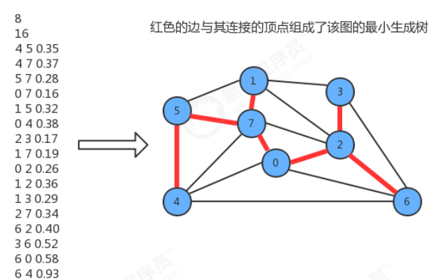

**约定：**

​	只考虑连通图。最小生成树的定义说明它只能存在于连通图中，如果图不是连通的，那么分别计算每个连通图子图的最小生成树，合并到一起称为最小生成森林。

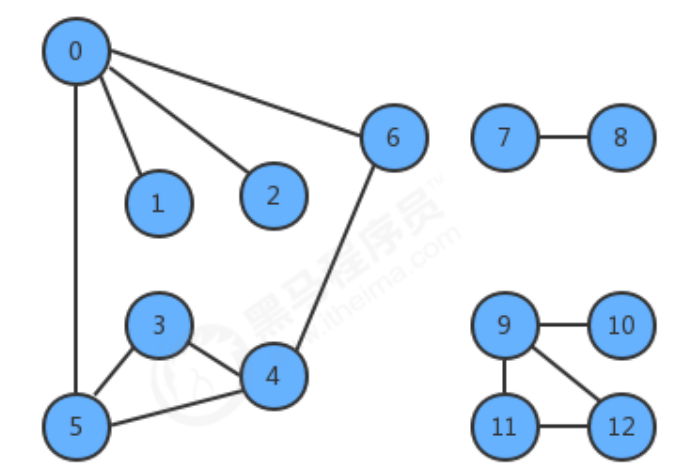

​	所有边的权重都各不相同。如果不同的边权重可以相同，那么一副图的最小生成树就可能不唯一了，虽然我们的算法可以处理这种情况，但为了好理解，我们约定所有边的权重都各不相同。


#### 13.6.2.最小生成树原理

- **树的性质**

1. 一条边接树中的任意两个顶点都会产生一个新的环；

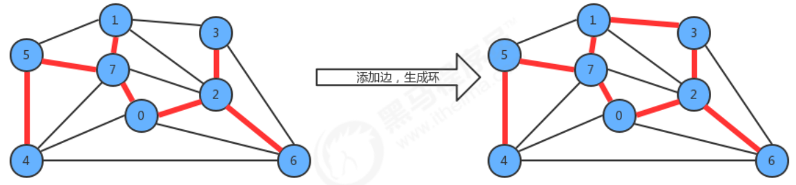

2. 从树中删除任意一条边，将会得到两棵独立的树；

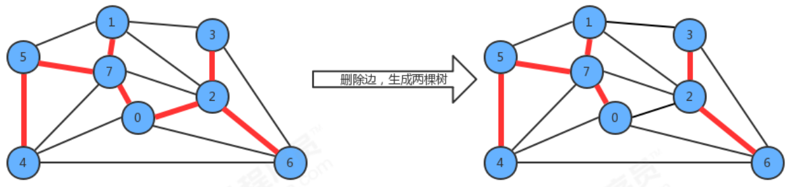


- **切分定理**

要从一副连通图中找出该图的最小生成树，需要通过切分定理完成。

**切分：**

将图的所有顶点按照某些规则分为两个非空且没有交集的集合。

**横切边：**

连接两个属于不同集合的顶点的边称之为横切边。

例如我们将图中的顶点切分为两个集合，灰色顶点属于一个集合，白色顶点属于另外一个集合，那么效果如下：

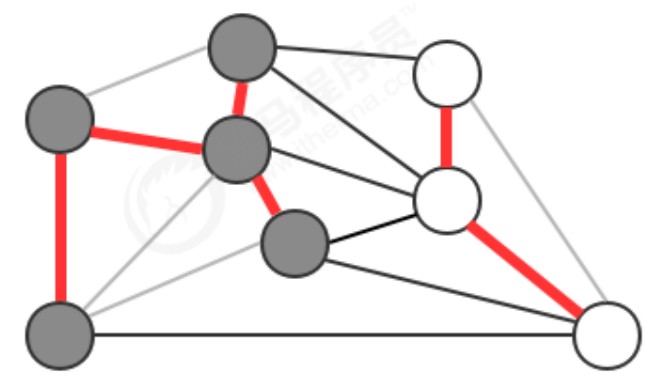

**切分定理：**在一副加权图中，给定任意的切分，它的横切边中的权重最小者必然属于图中的最小生成树。

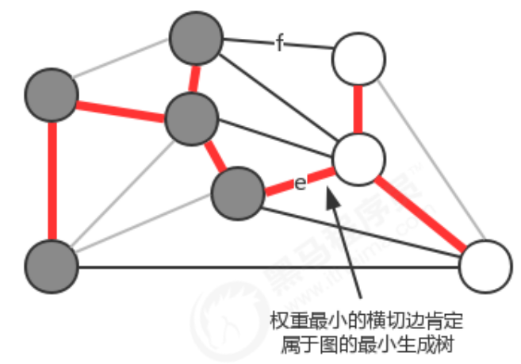

**注意****:一次切分产生的多个横切边中，权重最小的边不一定是所有横切边中唯一属于图的最小生成树的边。

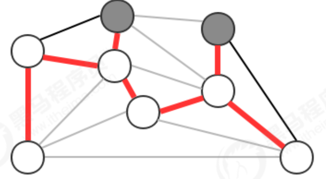


### 13.7.贪心算法

​	贪心算法是计算图的最小生成树的基础算法，它的基本原理就是切分定理，**使用切分定理找到最小生成树的一条边，不断的重复直到找到最小生成树的所有边**。如果图有V个顶点，那么需要找到V-1条边，就可以表示该图的最小生成树。

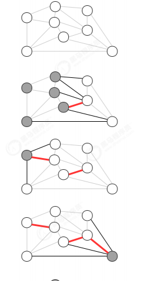

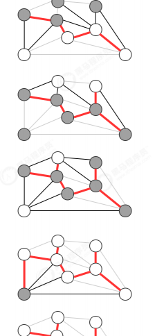

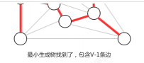

​	计算图的最小生成树的算法有很多种，但这些算法都可以看做是贪心算法的一种特殊情况，这些算法的不同之处在于保存切分和判定权重最小的横切边的方式。


### 13.8.Prim算法

​	我们学习第一种计算最小生成树的方法叫Prim算法，它的每一步都会为一棵生成中的树添加一条边。一开始这棵树只有一个顶点，然后会向它添加V-1条边，每次总是将下一条连接树中的顶点与不在树中的顶点且权重最小的边加入到树中。

**Prim算法的切分规则：**

把最小生成树中的顶点看做是一个集合，把不在最小生成树中的顶点看做是另外一个集合。

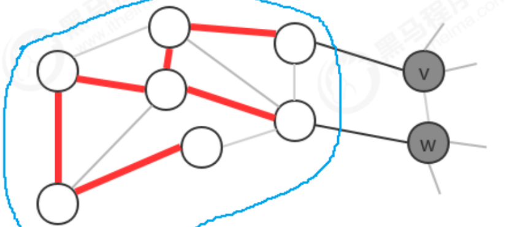


- **Prim算法API设计**

| 类名     | PrimMST                                                      |
| -------- | ------------------------------------------------------------ |
| 构造方法 | PrimMST(EdgeWeightedGraph G)：根据一副加权无向图，创建最小生成树计算对象 |
| 成员方法 | 1.private void visit(EdgeWeightedGraph G, int v)：将顶点v添加到最小生成树中，并且更新数；2.public Queue edges():获取最小生成树的所有边 |
| 成员变量 | 1.private Edge[] edgeTo: 索引代表顶点，值表示当前顶点和最小生成树之间的最短边；2.private double[] distTo: 索引代表顶点，值表示当前顶点和最小生成树之间的最短边的权重；3.private boolean[] marked:索引代表顶点，如果当前顶点已经在树中，则值为true，否则为false；4.private IndexMinPriorityQueue pq:存放树中顶点与非树中顶点之间的有效横切边 |


- **Prim算法实现原理**

  Prim算法始终将图中的顶点切分成两个集合，最小生成树顶点和非最小生成树顶点，通过不断的重复做某些操作，可以逐渐将非最小生成树中的顶点加入到最小生成树中，直到所有的顶点都加入到最小生成树中。

  我们在设计API的时候，使用最小索引优先队列存放树中顶点与非树中顶点的有效横切边，那么它是如何表示的呢？我们可以让最小索引优先队列的索引值表示图的顶点，让最小索引优先队列中的值表示从其他某个顶点到当前顶点的边权重。

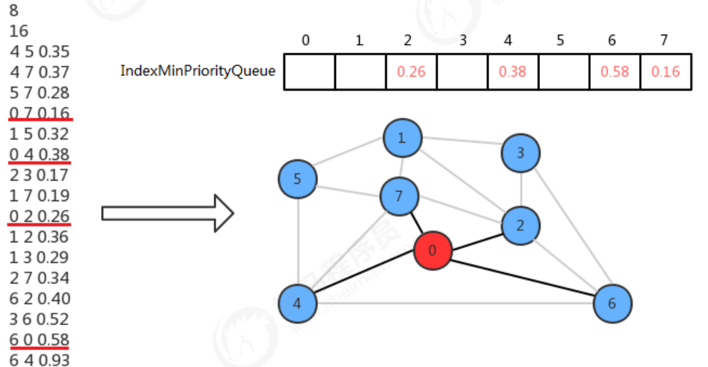


​	初始化状态，先默认0是最小生成树中的唯一顶点，其他的顶点都不在最小生成树中，此时横切边就是顶点0的邻接表中0-2,0-4,0-6,0-7这四条边，我们只需要将索引优先队列的2、4、6、7索引处分别存储这些边的权重值就可以表示了。

​	现在只需要从这四条横切边中找出权重最小的边，然后把对应的顶点加进来即可。所以找到0-7这条横切边的权重最小，因此把0-7这条边添加进来，此时0和7属于最小生成树的顶点，其他的不属于，现在顶点7的邻接表中的边也成为了横切边，这时需要做两个操作：

 1、0-7这条边已经不是横切边了，需要让它失效：

只需要调用最小索引优先队列的delMin()方法即可完成；

 2、2和4顶点各有两条连接指向最小生成树，需要只保留一条：

4-7的权重小于0-4的权重，所以保留4-7，调用索引优先队列的change(4,0.37)即可，

0-2的权重小于2-7的权重，所以保留0-2，不需要做额外操作。

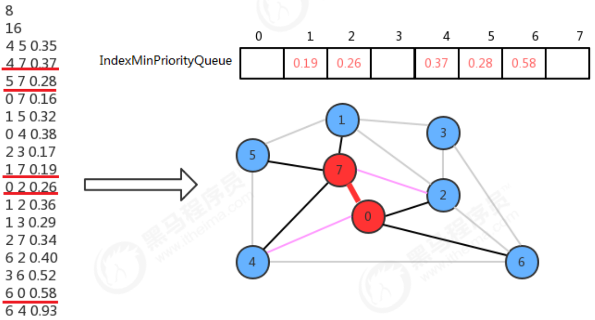

我们不断重复上面的动作，就可以把所有的顶点添加到最小生成树中。

- **代码**

```java
public class PrimMST { 
    
    //索引代表顶点，值表示当前顶点和最小生成树之间的最短边 
    private Edge[] edgeTo;
    //索引代表顶点，值表示当前顶点和最小生成树之间的最短边的权重
    private double[] distTo; 
    //索引代表顶点，如果当前顶点已经在树中，则值为true，否则为false 
    private boolean[] marked; 
    //存放树中顶点与非树中顶点之间的有效横切边 
    private IndexMinPriorityQueue<Double> pq; 
    
    //根据一副加权无向图，创建最小生成树计算对象 
    public PrimMST(EdgeWeightedGraph G) { 
        //创建一个和图的顶点数一样大小的Edge数组，表示边
        this.edgeTo = new Edge[G.V()];
        //创建一个和图的顶点数一样大小的double数组，表示权重，并且初始化数组中的内容为无穷大，无穷 大即表示不存在这样的边 
        this.distTo = new double[G.V()]; 
        
        for (int i = 0; i < distTo.length; i++) { 
            distTo[i] = Double.POSITIVE_INFINITY;
        }
        
        //创建一个和图的顶点数一样大小的boolean数组，表示当前顶点是否已经在树中
        this.marked = new boolean[G.V()];
        //创建一个和图的顶点数一样大小的索引优先队列，存储有效横切边 
        this.pq = new IndexMinPriorityQueue<>(G.V());
        //默认让顶点0进入树中，但0顶点目前没有与树中其他的顶点相连接，因此初始化distTo[0]=0.0 
        distTo[0] = 0.0; 
        //使用顶点0和权重0初始化pq 
        pq.insert(0, 0.0); 
        
        //遍历有效边队列
        while (!pq.isEmpty()) { 
            //找到权重最小的横切边对应的顶点，加入到最小生成树中 
            visit(G, pq.delMin());
        }
    }
    
    //将顶点v添加到最小生成树中，并且更新数据 
    private void visit(EdgeWeightedGraph G, int v) {
        //把顶点v添加到树中
        marked[v] = true; 
        //遍历顶点v的邻接表,得到每一条边Edge e, 
        for (Edge e : G.adj(v)) {
            //边e的一个顶点是v，找到另外一个顶点w； 
            int w = e.other(v); 
            //检测是否已经在树中，如果在，则继续下一次循环，如果不在，则需要修正当前顶点w距离最小生 成树的最小边edgeTo[w]以及它的权重distTo[w]，还有有效横切边也需要修正 
            if (marked[w]) {
                continue; 
            }
            
            //如果v-w边e的权重比目前distTo[w]权重小，则需要修正数据 
            if (e.weight() < distTo[w]) {
                //把顶点w距离最小生成树的边修改为e 
                edgeTo[w] = e;
                //把顶点w距离最小生成树的边的权重修改为e.weight()
                distTo[w] = e.weight(); 
                //如果pq中存储的有效横切边已经包含了w顶点，则需要修正最小索引优先队列w索引关联的权 重值 
                if (pq.contains(w)) { 
                    pq.changeItem(w, e.weight());
                } else { 
                    //如果pq中存储的有效横切边不包含w顶点，则需要向最小索引优先队列中添加v-w和其 权重值 
                    pq.insert(w, e.weight()); 
                } 
            }
        }
    }
    
    //获取最小生成树的所有边 
    public Queue<Edge> edges() {
        //创建队列 
        Queue<Edge> edges = new Queue<>();
        //遍历edgeTo数组，找到每一条边，添加到队列中 
        for (int i = 0; i < marked.length; i++) { 
            if (edgeTo[i]!=null){ 
                edges.enqueue(edgeTo[i]);
            } 
        }
        
        return edges;
    } 
}


//测试代码 
public class PrimTest { 
    public static void main(String[] args) throws Exception { 
        //创建输入流 
        BufferedReader reader = new BufferedReader(new InputStreamReader(PrimTest.class.getClassLoader().getResourceAsStream("min_create_tree_test .txt")));
        
        //读取顶点数目，初始化EdgeWeightedGraph图 
        int number = Integer.parseInt(reader.readLine());
        EdgeWeightedGraph G = new EdgeWeightedGraph(number); 
        //读取边的数目
        int edgeNumber = Integer.parseInt(reader.readLine());
        //循环读取每一条边，并调用addEdge方法 
        for (int i = 0; i < edgeNumber; i++) {
            String line = reader.readLine();
            int v = Integer.parseInt(line.split(" ")[0]); 
            int w = Integer.parseInt(line.split(" ")[1]); 
            double weight = Double.parseDouble(line.split(" ")[2]); 
            G.addEdge(new Edge(v, w, weight)); 
        }
        
        //构建PrimMST对象 
        PrimMST mst = new PrimMST(G); 
        //获取最小生成树的边 
        Queue<Edge> edges = mst.edges();
        //打印输出 
        for (Edge edge : edges) { 
            if (edge!=null){
                
                System.out.println(edge.either() + "-" + edge.other(edge.either()) + "::" + edge.weight());
            } 
        }
    } 
}
```


### 13.9.Kruskal算法

​	kruskal算法是计算一副加权无向图的最小生成树的另外一种算法，它的主要思想是按照边的权重(从小到大)处理它们，将边加入最小生成树中，加入的边不会与已经加入最小生成树的边构成环，直到树中含有V-1条边为止。

**kruskal算法和prim算法的区别：**

​	Prim算法是一条边一条边的构造最小生成树，每一步都为一棵树添加一条边。kruskal算法构造最小生成树的时候也是一条边一条边地构造，但它的切分规则是不一样的。它每一次寻找的边会连接一片森林中的两棵树。如果一副加权无向图由V个顶点组成，初始化情况下每个顶点都构成一棵独立的树，则V个顶点对应V棵树，组成一片森林，kruskal算法每一次处理都会将两棵树合并为一棵树，直到整个森林中只剩一棵树为止。

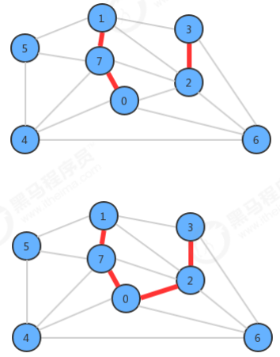


- **Kruskal算法的API设计**

| 类名     | KruskalMST                                                   |
| -------- | ------------------------------------------------------------ |
| 构造方法 | KruskalMST(EdgeWeightedGraph G)：根据一副加权无向图，创建最小生成树计算对象 |
| 成员方法 | 1.public Queue edges():获取最小生成树的所有边                |
| 成员变量 | 1.private Queue mst：保存最小生成树的所有边；2.private UF_Tree_Weighted uf: 索引代表顶点，使用uf.connect(v,w)可以判断顶点v和顶点w是否在同一颗树中，使用uf.union(v,w)可以把顶点v所在的树和顶点w所在的树合并；3.private MinPriorityQueue pq: 存储图中所有的边，使用最小优先队列，对边按照权重进行排序 |


-  **kruskal算法的实现原理**

  在设计API的时候，使用了一个MinPriorityQueue pq存储图中所有的边，每次使用pq.delMin()取出权重最小的边，并得到该边关联的两个顶点v和w，通过uf.connect(v,w)判断v和w是否已经连通，如果连通，则证明这两个顶点在同一棵树中，那么就不能再把这条边添加到最小生成树中，因为在一棵树的任意两个顶点上添加一条边，都会形成环，而最小生成树不能有环的存在，如果不连通，则通过uf.connect(v,w)把顶点v所在的树和顶点w所在的树合并成一棵树，并把这条边加入到mst队列中，这样如果把所有的边处理完，最终mst中存储的就是最小生树的所有边。

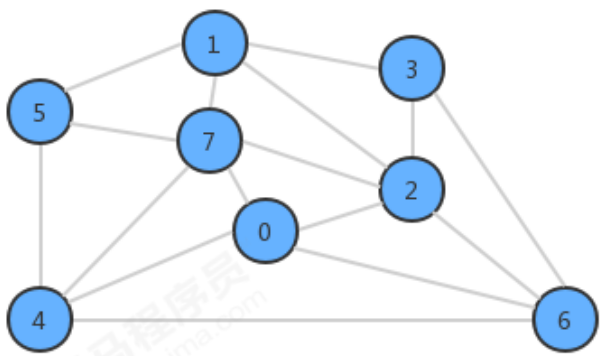

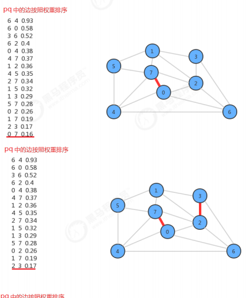

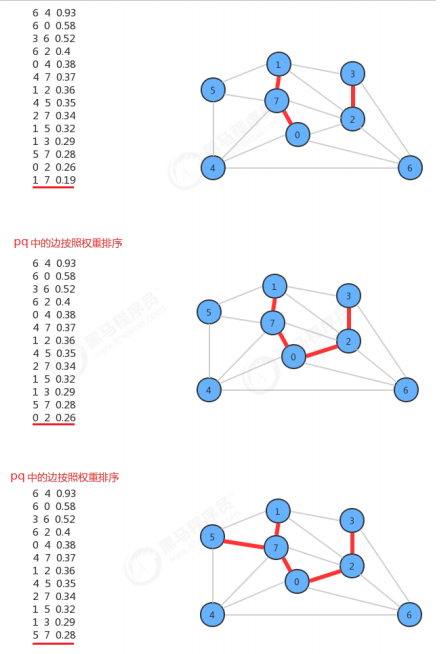

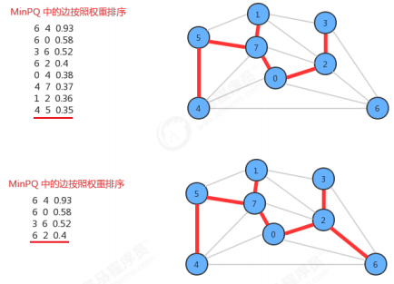

- **代码**

```java
public class KruskalMST {
    
    //保存最小生成树的所有边 
    private Queue<Edge> mst; 
    //索引代表顶点，使用uf.connect(v,w)可以判断顶点v和顶点w是否在同一颗树中，使用uf.union(v,w)可以 把顶点v所在的树和顶点w所在的树合并 
    private UF_Tree_Weighted uf; 
    //存储图中所有的边，使用最小优先队列，对边按照权重进行排序 
    private MinPriorityQueue<Edge> pq;
    
    //根据一副加权无向图，创建最小生成树计算对象 
    public KruskalMST(EdgeWeightedGraph G) {
        //初始化mst队列 
        this.mst = new Queue<Edge>(); 
        //初始化并查集对象uf,容量和图的顶点数相同 
        this.uf = new UF_Tree_Weighted(G.V());
        //初始化最小优先队列pq，容量比图的边的数量大1，并把图中所有的边放入pq中 
        this.pq = new MinPriorityQueue<>(G.E()+1);
        for (Edge edge : G.edges()) { 
            pq.insert(edge);
        }
        
        //如果优先队列pq不为空，也就是还有边未处理，并且mst中的边还不到V-1条，继续遍历
        while (!pq.isEmpty() && mst.size() < G.V() - 1) { 
            //取出pq中权重最小的边e 
            Edge e = pq.delMin(); 
            //获取边e的两个顶点v和w 
            int v = e.either();
            int w = e.other(v); 
            
            /*
            通过uf.connect(v,w)判断v和w是否已经连通， 如果连通: 
            则证明这两个顶点在同一棵树中，那么就不能再把这条边添加到最小生成树中，因为在一棵 树的任意两个顶点上添加一条边，都会形成环，
            而最小生成树不能有环的存在; 如果不连通: 则通过uf.connect(v,w)把顶点v所在的树和顶点w所在的树合并成一棵树,并把这条边加入 到mst队列中 
            */
            
            if (uf.connected(v,w)){
                continue; 
            }
            uf.union(v,w); 
            mst.enqueue(e); 
        } 
    }
    
    //获取最小生成树的所有边 
    public Queue<Edge> edges() { 
        return mst; 
    }
}


//测试代码 
public class KruskalTest { 
    public static void main(String[] args) throws Exception { 
        //创建输入流 
        BufferedReader reader = new BufferedReader(new InputStreamReader(KruskalTest.class.getClassLoader().getResourceAsStream("min_create_tree_te st.txt"))); 
        //读取顶点数目，初始化EdgeWeightedGraph图 
        int number = Integer.parseInt(reader.readLine()); 
        EdgeWeightedGraph G = new EdgeWeightedGraph(number); 
        //读取边的数目
        int edgeNumber = Integer.parseInt(reader.readLine());
        //循环读取每一条边，并调用addEdge方法 
        for (int i = 0; i < edgeNumber; i++) { 
            String line = reader.readLine(); 
            int v = Integer.parseInt(line.split(" ")[0]); 
            int w = Integer.parseInt(line.split(" ")[1]);
            double weight = Double.parseDouble(line.split(" ")[2]); 
            G.addEdge(new Edge(v, w, weight)); 
        }
        
        //构建PrimMST对象
        KruskalMST mst = new KruskalMST(G); 
        //获取最小生成树的边
        Queue<Edge> edges = mst.edges(); 
        //打印输出 
        for (Edge edge : edges) { 
            if (edge!=null){ 
                System.out.println(edge.either() + "-" + edge.other(edge.either()) + "::" + edge.weight());
            } 
        }
    } 
}
```


### 13.10.加权有向图

​	之前学习的加权无向图中，边是没有方向的，并且同一条边会同时出现在该边的两个顶点的邻接表中，为了能够处理含有方向性的图的问题，我们需要实现以下加权有向图。


#### 13.10.1.加权有向图边的表示

- **API设计**

| 类名     | DirectedEdge                                                 |
| -------- | ------------------------------------------------------------ |
| 构造方法 | DirectedEdge(int v,int w,double weight)：通过顶点v和w，以及权重weight值构造一个边对象 |
| 成员方法 | 1.public double weight():获取边的权重值；2.public int from():获取有向边的起点；3.public int to():获取有向边的终点 |
| 成员变量 | 1.private fifinal int v：起点；2.private fifinal int w：终点；3.private fifinal double weight：当前边的权重 |

- **代码**

```java
public class DirectedEdge { 
    private final int v;//起点 
    private final int w;//终点 
    private final double weight;//当前边的权重 
    
    //通过顶点v和w，以及权重weight值构造一个边对象 
    public DirectedEdge(int v, int w, double weight) {
        this.v = v; 
        this.w = w;
        this.weight = weight; 
    }
    
    //获取边的权重值
    public double weight(){ 
        return weight;
    }
    
    //获取有向边的起点
    public int from(){
        return v; 
    }
    
    //获取有向边的终点
    public int to(){ 
        return w;
    }
}
```


#### 13.10.2.加权有向图的实现

之前我们已经完成了有向图，在有向图的基础上，我们只需要把边的表示切换成DirectedEdge对象即可。

- **API设计**

| 类名     | EdgeWeightedDigraph                                          |
| -------- | ------------------------------------------------------------ |
| 构造方法 | EdgeWeightedDigraph(int V)：创建一个含有V个顶点的空加权有向图 |
| 成员方法 | 1.public int V():获取图中顶点的数量；2.public int E():获取图中边的数量；3.public void addEdge(DirectedEdge e):向加权有向图中添加一条边e；4.public Queue adj(int v)：获取由顶点v指出的所有的边；5.public Queue edges()：获取加权有向图的所有边 |
| 成员变量 | 1.private fifinal int V: 记录顶点数量；2.private int E: 记录边数量；3.private Queue[] adj: 邻接表 |


- **代码**

```java
public class EdgeWeightedDigraph { 
    //顶点总数 
    private final int V;
    //边的总数
    private int E;
    //邻接表 
    private Queue<DirectedEdge>[] adj; 
    
    //创建一个含有V个顶点的空加权有向图
    public EdgeWeightedDigraph(int V) { 
        //初始化顶点数量 
        this.V = V;
        //初始化边的数量 
        this.E = 0; 
        //初始化邻接表 
        this.adj = new Queue[V]; 
        
        //初始化邻接表中的空队列
        for (int i = 0; i < adj.length; i++) {
            adj[i] = new Queue<DirectedEdge>();
        } 
    }
    
    //获取图中顶点的数量 
    public int V() { 
        return V;
    }
    
    //获取图中边的数量 
    public int E() { 
        return E; 
    }
    
    //向加权有向图中添加一条边e 
    public void addEdge(DirectedEdge e) {
        //获取有向边的起点 
        int v = e.from(); 
        //因为是有向图，所以边e只需要出现在起点v的邻接表中 
        adj[v].enqueue(e); 
        //边的数量+1 
        E++; 
    }
    
    //获取由顶点v指出的所有的边 
    public Queue<DirectedEdge> adj(int v) { 
        return adj[v]; 
    }
    
    //获取加权有向图的所有边 
    public Queue<DirectedEdge> edges() { 
        //创建一个队列，存储所有的边
        Queue<DirectedEdge> allEdge = new Queue<>(); 
        //遍历顶点，拿到每个顶点的邻接表 
        for (int v = 0; v < this.V; v++) { 
            //遍历邻接表，拿到邻接表中的每条边存储到队列中 
            for (DirectedEdge e : adj(v)) {
                allEdge.enqueue(e);
            } 
        }
        return allEdge; 
    } 
}
```


### 13.11.最短路径

​	有了加权有向图之后，我们立刻就能联想到实际生活中的使用场景，例如在一副地图中，找到顶点a与地点b之间的路径，这条路径可以是距离最短，也可以是时间最短，也可以是费用最小等，如果我们把 距离/时间/费用 看做是成本，那么就需要找到地点a和地点b之间成本最小的路径，也就是我们接下来要解决的最短路径问题。


#### 13.11.1.最短路径定义及性质

**定义：**

在一副加权有向图中，从顶点s到顶点t的最短路径是所有从顶点s到顶点t的路径中总权重最小的那条路径。

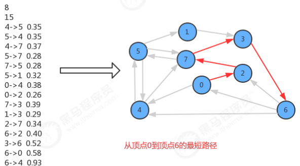

**性质：**

1.路径具有方向性；

2.权重不一定等价于距离。权重可以是距离、时间、花费等内容，权重最小指的是成本最低

3.只考虑连通图。一副图中并不是所有的顶点都是可达的，如果s和t不可达，那么它们之间也就不存在最短路径，

为了简化问题，这里只考虑连通图。

4.最短路径不一定是唯一的。从一个顶点到达另外一个顶点的权重最小的路径可能会有很多条，这里只需要找出一

条即可。

**最短路径树：**

​	给定一副加权有向图和一个顶点s，以s为起点的一棵最短路径树是图的一副子图，它包含顶点s以及从s可达的所有顶点。这棵有向树的根结点为s，树的每条路径都是有向图中的一条最短路径。


#### 13.11.2.最短路径API设计

| 类名     | DijkstraSP                                                   |
| -------- | ------------------------------------------------------------ |
| 构造方法 | public DijkstraSP(EdgeWeightedDigraph G, int s)：根据一副加权有向图G和顶点s，创建一个计算顶点为s的最短路径树对象 |
| 成员方法 | 1.private void relax(EdgeWeightedDigraph G, int v)：松弛图G中的顶点v；2.public double distTo(int v):获取从顶点s到顶点v的最短路径的总权重；3.public boolean hasPathTo(int v):判断从顶点s到顶点v是否可达；4.public Queue pathTo(int v):查询从起点s到顶点v的最短路径中所有的边 |
| 成员变量 | 1.private DirectedEdge[] edgeTo: 索引代表顶点，值表示从顶点s到当前顶点的最短路径上的最后一条边；2.private double[] distTo: 索引代表顶点，值从顶点s到当前顶点的最短路径的总权重；3.private IndexMinPriorityQueue pq:存放树中顶点与非树中顶点之间的有效横切边 |


#### 13.11.3.松弛技术

​	松弛这个词来源于生活：一条橡皮筋沿着两个顶点的某条路径紧紧展开，如果这两个顶点之间的路径不止一条，还有存在更短的路径，那么把皮筋转移到更短的路径上，皮筋就可以放松了。


松弛这种简单的原理刚好可以用来计算最短路径树。

​	在我们的API中，需要用到两个成员变量edgeTo和distTo，分别存储边和权重。一开始给定一幅图G和顶点s，我们只知道图的边以及这些边的权重，其他的一无所知，此时初始化顶点s到顶点s的最短路径的总权重disto[s]=0；顶点s到其他顶点的总权重默认为无穷大，随着算法的执行，不断的使用松弛技术处理图的边和顶点，并按一定的条件更新edgeTo和distTo中的数据，最终就可以得到最短路劲树。

**边的松弛：**

​	放松边v->w意味着检查从s到w的最短路径是否先从s到v，然后再从v到w？

​	如果是，则v-w这条边需要加入到最短路径树中，更新edgeTo和distTo中的内容：edgeTo[w]=表示v->w这条边的DirectedEdge对象，distTo[w]=distTo[v]+v->w这条边的权重；

​	如果不是，则忽略v->w这条边。

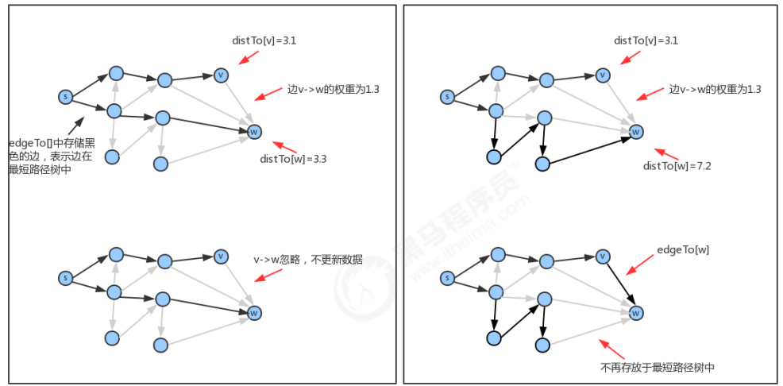

**顶点的松弛：**

​	顶点的松弛是基于边的松弛完成的，只需要把某个顶点指出的所有边松弛，那么该顶点就松弛完毕。例如要松弛顶点v，只需要遍历v的邻接表，把每一条边都松弛，那么顶点v就松弛了。

如果把起点设置为顶点0，那么找出起点0到顶点6的最短路径0->2->7>3->6的过程如下:

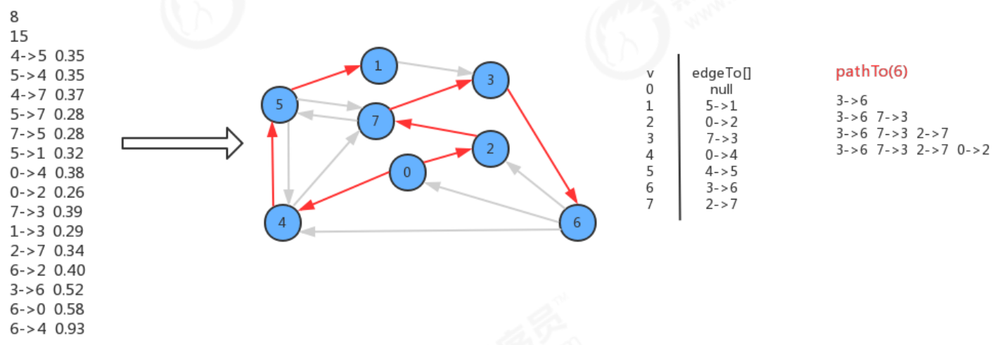


#### 13.11.4.Dijstra算法实现

​	Disjstra算法的实现和Prim算法很类似，构造最短路径树的每一步都是向这棵树中添加一条新的边，而这条新的边是有效横切边pq队列中的权重最小的边。

```java
public class DijkstraSP { 
    //索引代表顶点，值表示从顶点s到当前顶点的最短路径上的最后一条边 
    private DirectedEdge[] edgeTo; 
    //索引代表顶点，值从顶点s到当前顶点的最短路径的总权重 
    private double[] distTo
        
    //存放树中顶点与非树中顶点之间的有效横切边 
    private IndexMinPriorityQueue<Double> pq; 
    
    //根据一副加权有向图G和顶点s，创建一个计算顶点为s的最短路径树对象
    public DijkstraSP(EdgeWeightedDigraph G, int s){ 
        //创建一个和图的顶点数一样大小的DirectedEdge数组，表示边 
        this.edgeTo = new DirectedEdge[G.V()]; 
        //创建一个和图的顶点数一样大小的double数组，表示权重，并且初始化数组中的内容为无穷大，无穷 大即表示不存在这样的边 
        this.distTo = new double[G.V()];
        for (int i = 0; i < distTo.length; i++) { 
            distTo[i] = Double.POSITIVE_INFINITY;
        }
        
        //创建一个和图的顶点数一样大小的索引优先队列，存储有效横切边
        this.pq = new IndexMinPriorityQueue<>(G.V()); 
        //默认让顶点s进入树中，但s顶点目前没有与树中其他的顶点相连接，因此初始化distTo[s]=0.0 
        distTo[s] = 0.0; 
        
        //使用顶点s和权重0.0初始化pq 
        pq.insert(s, 0.0); 
        //遍历有效边队列 
        while (!pq.isEmpty()) { 
            //松弛图G中的顶点 
            relax(G, pq.delMin());
        }
    }
    
    //松弛图G中的顶点v 
    private void relax(EdgeWeightedDigraph G, int v){ 
        //松弛顶点v就是松弛顶点v邻接表中的每一条边，遍历邻接表 
        for (DirectedEdge e : G.adj(v)) { 
            //获取边e的终点 
            int w = e.to(); 
            
            //起点s到顶点w的权重是否大于起点s到顶点v的权重+边e的权重,如果大于，则修改s->w的路径： edgeTo[w]=e,并修改distTo[v] = distTo[v]+e.weitht(),如果不大于，则忽略 
            if (distTo(w)>distTo(v)+e.weight()){ 
                distTo[w]=distTo[v]+e.weight(); 
                edgeTo[w]=e;
                
                //如果顶点w已经存在于优先队列pq中，则重置顶点w的权重 
                if (pq.contains(w)){ 
                    pq.changeItem(w,distTo(w));
                }else{
                    //如果顶点w没有出现在优先队列pq中，则把顶点w及其权重加入到pq中 
                    pq.insert(w,distTo(w));
                }
            }
        } 
    }
    
    //获取从顶点s到顶点v的最短路径的总权重 
    public double distTo(int v){
        return distTo[v];
    }
    
    //判断从顶点s到顶点v是否可达 
    public boolean hasPathTo(int v){
        return distTo[v]<Double.POSITIVE_INFINITY; 
    }
    
    //查询从起点s到顶点v的最短路径中所有的边 
    public Queue<DirectedEdge> pathTo(int v){ 
        //如果顶点s到v不可达，则返回null 
        if (!hasPathTo(v)){
            return null;
        }
        
        //创建队列Queue保存最短路径的边 
        Queue<DirectedEdge> edges = new Queue<>(); 
        //从顶点v开始，逆向寻找，一直找到顶点s为止，而起点s为最短路劲树的根结点，所以 
        edgeTo[s]=null; 
        DirectedEdge e=null;
        while(true){ 
            e = edgeTo[v]; 
            if (e==null){
                break; 
            }
            edges.enqueue(e);
            v = e.from();
        }
        return edges; 
    } 
}


//测试代码 
public class DijkstraSpTest { 
    public static void main(String[] args) throws Exception { 
        //创建输入流 
        BufferedReader reader = new BufferedReader(new InputStreamReader(DijkstraSpTest.class.getClassLoader().getResourceAsStream("min_route_test .txt")));
        //读取顶点数目，初始化EdgeWeightedDigraph图 
        int number = Integer.parseInt(reader.readLine());
        EdgeWeightedDigraph G = new EdgeWeightedDigraph(number);
        //读取边的数目 
        int edgeNumber = Integer.parseInt(reader.readLine());
        //循环读取每一条边，并调用addEdge方法 
        for (int i = 0; i < edgeNumber; i++) {
            String line = reader.readLine(); 
            int v = Integer.parseInt(line.split(" ")[0]); 
            int w = Integer.parseInt(line.split(" ")[1]);
            double weight = Double.parseDouble(line.split(" ")[2]);
            G.addEdge(new DirectedEdge(v, w, weight));
        }
        
        //根据图G和顶点0，构建DijkstraSP对象
        DijkstraSP dsp = new DijkstraSP(G, 0); 
        //获取起点0到顶点6的最短路径 
        Queue<DirectedEdge> edges = dsp.pathTo(6); 
        
        //打印输出 
        for (DirectedEdge edge : edges) {
            System.out.println(edge.from() + "->" + edge.to() + "::" + edge.weight()); 
        }
    }
}
```

