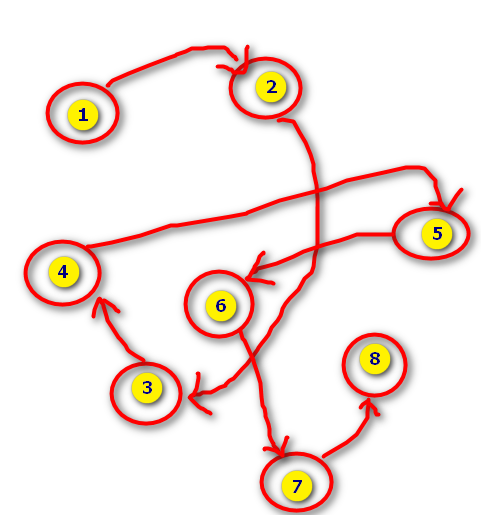
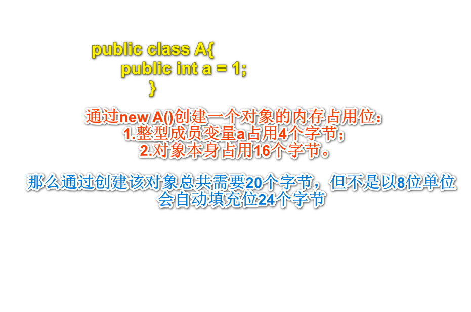
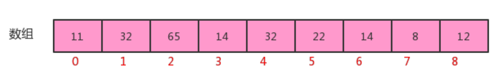

# 数据结构和算法

数据结构和算法是每一个学习计算机专业的同学必须掌握的课程，是编程必备的基础。但这是一门不太好学的课程，非常枯燥乏味。但一旦掌握，会让你的编程能力有质的飞跃，因为程序设计的基础=数据结构+算法。

数据结构演示网站：

https://www.cs.usfca.edu/~galles/visualization/Algorithms.html

## 1.数据结构和算法概述

数据结构是一门研究非数值计算的程序设计问题中的操作对象，以及它们的关系和操作等相关问题的学科。简而言之，就是把数据元素按照一定的关系组织起来的集合，用来组织和存储数据。

算法是指解题方案的准确而完整的描述，是一系列解决问题的清晰指令，算法代表着用系统的方法解决问题的策略机制。也就是说，能够对一定规范的输出，在有限时间内获得所要求的输出，得到想要的结果。


### 1.1.数据结构的分类

数据结构可分为**逻辑结构**和**物理结构**两大类。

- **逻辑结构：**逻辑结构是从具体问题中抽象出来的模型，是抽象意义上的结构，按照对象中的数据元素之间的相互关系分类，可以分为如下类别：

  - **集合结构：**集合结构中数据元素除了属于同一个集合外，它们之间没有任何的关系。就如下图各个数字之间的关系-它们在一个集合中，但相互之间没有练习。

  
  - **线性结构：**线性结构中数据元素之间存在一对一的关系。

  
  - **树形结构：**树形结构中数据元素之间存在一对多的层次关系。

  
  - **图形结构：**图形结构数据元素之间存在多对多的关系。

  

- **物理结构：**逻辑结构在计算机中真正的表现方式（映像）称为物理结构（存储结构）。常见的物理结构有如下几种：

  - **顺序存储结构：**把数据元素放在地址连续的存储单元里面，其数据间的逻辑关系和物理关系是一致的。数组就是常见的顺序存储结构。

  
  顺序结构存在一定的弊端，就如生活中排队有人插队也有人突然离开，这个时候结构在不断变化，就需要该表结构为链式存储结构-排队打饭变为语音叫号。

  - **链式存储结构：**把数据元素存储在任意存储单元中，这组单元可以是连续的也可以是不连续的。此时，数据元素之间并不能反应元素间的逻辑关系，因此在链式存储结构中引进了一个指针存放数据元素的地址，这样通过地址就可以查找出对应元素的位置。链式结构插入数据是先连接后断开，如在3和4之间插入数字20，先将20和4连接，再断开3和4，最后连接3和20，后面我们会从代码出发进行演示。

  备注：Java没有指针，指针概念来源于C，你可以理解成Java的地址引用。

  


### 1.2.算法体验

​	在生活中，如果我们遇到某一问题，常常解决方案不是唯一的。例如从成都到重庆，我们可以坐动车，可以坐轮船或开车，甚至可以走路，不同的解决方案所带来的时间成本和金钱成本是不一样的，比如坐动车时间最少，费用最高，步行费用最低，但时间花费更大。在程序中，我们也可以用不同的算法解决相同的问题，而不同算法的成本也是不相同的。总体上来说，一个优秀的算法追求以下两个目标：

1. 花最少的时间完成需求；
2. 占用最少的内存空间完成需求。

下面我们通过案例来了解以下算法：

**需求1：**计算1-100整数的和。

第一种：

```java
public static void main(String[] args) { 
    int sum = 0; 
    int n=100; 
    for (int i = 1; i <= n; i++) { 
        sum += i; 
    }
    System.out.println("sum=" + sum); 
}
```

第二种：

```java
public static void main(String[] args) { 
    int sum = 0; 
    int n=100; 
    sum = (n+1)*n/2; 
    System.out.println("sum="+sum); 
}
```

分析：

第一种解法要完成需求需要以下几个步骤：

1. 定义两个整型变量；
2. 执行100次加法运算；
3. 打印结果到控制台。

第二种解法要完成需求需要以下几个步骤：

1. 定义两个整型变量；
2. 执行1次加法运算，1次乘法运算，1次出发运算，总共3次运算；
3. 打印结果到控制台。

很明显，第二种算法完成需求花费的时间更少。


**需求2：**计算10的阶乘。

第一种：

```java
public class Test { 
    public static void main(String[] args) { 
        //测试，计算10的阶乘 
        long result = fun1(10); 
        System.out.println(result); 
    }
    //计算n的阶乘 
    public static long fun1(long n){ 
        if (n==1){ 
            return 1; 
        }
        return n*fun1(n-1); 
    } 
}
```

第二种：

```java
public class Test { 
    public static void main(String[] args) { 
        //测试，计算10的阶乘 
        long result = fun2(10); 
        System.out.println(result); 
    }
    //计算n的阶乘 
    public static long fun2(long n){ 
        int result=1; 
        for (long i = 1; i <= n; i++) { 
            result*=i; 
        }
        return result; 
    } 
}
```

分析：

​	第一种解法使用递归完成需求，fun1方法会执行10次，并且第一次执行未完毕，调用第二次执行，第二次执行未完毕，调用第三次执行。。。最终，最多的时候，需要在占内存中同时开辟10块内存分别执行10个fun1方法。

​	第二种解法使用for循环完成需求，fun2方法只会执行一次，最终，只需要在占内存空间执行fun2方法即可。

​	明显第二种算法完成需求，占用内存空间更少。


## 2.算法分析

​	前面我们已经介绍了，研究算法的最终目的就是如何花更少的时间，如何占用更少的内存去完成相同的需求，并且也通过案例演示了不同算法之间时间耗费和空间耗费上的差异，但我们并不能将时间占用和空间占用量化，因此，接下来我们要学习有关算法时间耗费和算法空间耗费的描述和分析。有关算法时间耗费分析，我们称之为算法的**时间复杂度分析**，有关算法的空间耗费分析，我们称之为算法的**空间复杂度分析**。


### 2.1.算法的时间复杂度分析

​	我们要计算算法时间耗费情况，首先我们得度量算法的执行时间，那么如何度量呢？

- **事后分析估算方法：**

​	比较容易想到的方法就是我们把算法执行若干次，然后拿个计时器在旁边计时，这种事后统计的方法看上去的确不错，并且也并非要我们真的拿个计算器在旁边计算，因为计算机都提供了计时的功能。这种统计方法主要是通过设计好的测试程序和测试数据，利用计算机计时器对不同的算法编制的程序的运行时间进行比较，从而确定算法效率的高低，但是这种方法有很大的缺陷：必须依据算法实现编制好的测试程序，通常要花费大量时间和精力，测试完了如果发现测试的是非常糟糕的算法，那么之前所做的事情就全部白费了，并且不同的测试环境(硬件环境)的差别导致测试的结果差异也很大。

测试计算0-100之间整数和所需时间属于时候分析时间：

```java
public static void main(String[] args) { 
    long start = System.currentTimeMillis(); 
    int sum = 0; 
    int n=100; 
    for (int i = 1; i <= n; i++) { 
        sum += i; 
    }
    System.out.println("sum=" + sum); 
    
    long end = System.currentTimeMillis(); 
    System.out.println(end-start); 
}
```

以上分析执行时间有一定的弊端，必须在Windows10和Windows7所执行的时间有可能是不一样的。

- **事后分析估算法：**

  在计算机程序编写前，依据统计方法对算法进行估算，经过总结，我们发现一个高级语言编写的程序程序在计算机上运行所消耗的时间取决于下列因素：

  1. 算法采用的策略和方案；
  2. 编译产生的代码质量；
  3. 问题的输入规模(所谓的问题输入规模就是输入量的多少)；
  4. 机器执行指令的速度。

由此可见，抛开这些与计算机硬件、软件有关的因素，一个程序的运行时间依赖于算法的好坏和问题的输入规模。如果算法固定，那么该算法的执行时间就只和问题的输入规模有关系了。

我们再次以之前的求1-100和案例为例，进行分析：

第一种解法：

```java
// 如果输入量为n为1，则需要计算1次
// 如果输入量n为1亿，则需要计算1亿次
public static void main(String[] args) { 
    int sum = 0;
    //执行1次 
    int n=100;
    //执行1次 
    for (int i = 1; i <= n; i++) {
        //执行了n+1次 
        sum += i;
        //执行了n次 
    }
    System.out.println("sum=" + sum); 
}
```


第二种解法：

```java
// 如果输入量为n为1，则需要计算1次
// 如果输入量n为1亿，则需要计算1次
public static void main(String[] args) { 
    int sum = 0;
    //执行1次 
    int n=100;
    //执行1次 
    sum = (n+1)*n/2;
    //执行1次 
    System.out.println("sum="+sum); 
}
```

因此，当输入规模为n时，第一种算法执行了1+1+(n+1)+n=2n+3次；第二种算法执行了1+1+1=3次。如果我们把

第一种算法的循环体看做是一个整体，忽略结束条件的判断，那么其实这两个算法运行时间的差距就是n和1的差

距。为什么循环判断在算法1里执行了n+1次，看起来是个不小的数量，但是却可以忽略呢？我们来看下一个例子：

**需求：**计算100个1+100个2+100个3+...100个100的结果

```java
public static void main(String[] args) { 
    int sum=0; 
    int n=100; 
    for (int i = 1; i <=n ; i++) { 
        for (int j = 1; j <=n ; j++) { 
            sum+=i; 
        } 
    }
    System.out.println("sum="+sum); 
}
```

​	上面这个例子中，如果我们要精确的研究循环的条件执行了多少次，是一件很麻烦的事情，并且，由于真正计算和的代码是内循环的循环体，所以，在研究算法的效率时，我们只考虑核心代码的执行次数，这样可以简化分析。

​	我们研究算法复杂度，侧重的是当输入规模不断增大时，算法的增长量的一个抽象(规律)，而不是精确地定位需要执行多少次，因为如果是这样的话，我们又得考虑回编译期优化等问题，容易主次跌倒。

​	我们不关心编写程序所用的语言是什么，也不关心这些程序将跑在什么样的计算机上，我们只关心它所实现的算法。这样，不计那些循环索引的递增和循环终止的条件、变量声明、打印结果等操作，最终在分析程序的运行时间时，最重要的是把程序看做是独立于程序设计语言的算法或一系列步骤。我们分析一个算法的运行时间，最重要的就是把核心操作的次数和输入规模关联起来。


### 2.2.函数渐进增长

​	给定两个函数f(n)和g(n),如果存在一个整数N，使得对于所有的n>N,f(n)总是比g(n)大，那么我们说f(n)的增长渐近快于g(n)。

概念似乎有点艰涩难懂，那接下来我们做几个测试。

**测试一：**假设四个算法的输入规模都是n：

 1.算法A1要做2n+3次操作，可以这么理解：先执行n次循环，执行完毕后，再有一个n次循环，最后有3次运算；

 2.算法A2要做2n次操作；

 3.算法B1要做3n+1次操作，可以这个理解：先执行n次循环，再执行一个n次循环，再执行一个n次循环，最后有1次运算。

 4.算法B2要做3n次操作；

那么，上述算法，哪一个更快一些呢？

| 输入规模 | 算法A1(2n+3)执行次数 | 算法A2(2n)执行次数 | 算法B1(3n+1)执行次数 | 算法B2(3n)执行次数 |
| -------- | -------------------- | ------------------ | -------------------- | ------------------ |
| n=1      | 5                    | 2                  | 4                    | 3                  |
| n=2      | 7                    | 4                  | 7                    | 6                  |
| n=3      | 9                    | 6                  | 10                   | 9                  |
| n=10     | 23                   | 20                 | 31                   | 30                 |
| n=100    | 203                  | 100                | 301                  | 300                |


通过数据表格，比较算法A1和算法B1：

当输入规模n=1时，A1需要执行5次，B1需要执行4次，所以A1的效率比B1的效率低；

当输入规模n=2时，A1需要执行7次，B1需要执行7次，所以A1的效率和B1的效率一样；

当输入规模n>2时，A1需要的执行次数一直比B1需要执行的次数少，所以A1的效率比B1的效率高；

所以我们可以得出结论：

**当输入规模n>2时，算法A1的渐近增长小于算法B1的渐近增长**。

​	通过观察折线图，我们发现，随着输入规模的增大，算法A1和算法A2逐渐重叠到一块，算法B1和算法B2逐渐重叠到一块，所以我们得出结论：

**随着输入规模的增大，算法的常数操作可以忽略不计**。

**测试二：**假设四个算法的输入规模都是n：

 1.算法C1需要做4n+8次操作

 2.算法C2需要做n次操作

 3.算法D1需要做2n^2次操作

 4.算法D2需要做n^2次操作

那么上述算法，哪个更快一些？


通过数据表格，对比算法C1和算法D1：

当输入规模n<=3时，算法C1执行次数多于算法D1，因此算法C1效率低一些；

当输入规模n>3时，算法C1执行次数少于算法D1，因此，算法D2效率低一些，

所以，总体上，算法C1要优于算法D1.

通过折线图，对比对比算法C1和C2：

随着输入规模的增大，算法C1和算法C2几乎重叠

通过折线图，对比算法C系列和算法D系列：

随着输入规模的增大，即使去除n^2前面的常数因子，D系列的次数要远远高于C系列。

因此，可以得出结论：**随着输入规模的增大，与最高次项相乘的常数可以忽略**。

**测试三：**假设四个算法的输入规模都是n：

算法E1:

2n^2+3n+1;

算法E2：

n^2

算法F1：

2n^3+3n+1

算法F2：

n^3

那么上述算法，哪个更快一些？


通过数据表格，对比算法E1和算法F1： 

当n=1时，算法E1和算法F1的执行次数一样；

当n>1时，算法E1的执行次数远远小于算法F1的执行次数；

所以算法E1总体上是由于算法F1的。

通过折线图我们会看到，算法F系列随着n的增长会变得特块，算法E系列随着n的增长相比较算法F来说，变得比较

慢，所以可以得出结论：**最高次项的指数大的，随着n的增长，结果也会变得增长特别快**。

**测试四：**假设五个算法的输入规模都是n：

算法G：

n^3;

算法H:

n^2;

算法I：

n:

算法J：

logn

算法K:

1

那么上述算法，哪个效率更高呢？


通过观察数据表格和折线图，很容易可以得出结论：**算法函数中n最高次幂越小，算法效率越高**。

综上所述，在我们比较算法随着输入规模的增长量时，可以有以下规则：

**1.算法函数中的常数可以忽略；**

**2.算法函数中最高次幂的常数因子可以忽略；**

**3.算法函数中最高次幂越小，算法效率越高。**


### 3.3.算法时间复杂度


#### 3.3.1.大O记法

**概念**：在进行算法分析时，语句总的执行次数T(n)是关于问题规模n的函数，进而分析T(n)随着n的变化情况并确定T(n)的量级。算法的时间复杂度，就是算法的时间量度，记作:T(n)=O(f(n))。它表示随着问题规模n的增大，算法执行时间的增长率和f(n)的增长率相同，称作算法的渐近时间复杂度，简称时间复杂度，其中f(n)是问题规模n的某个函数。

在这里，我们需要明确一个事情：**执行次数=执行时间**

用大写O()来体现算法时间复杂度的记法，我们称之为大O记法。一般情况下，随着输入规模n的增大，T(n)增长最慢的算法为最优算法。

下面我们使用大O表示法来表示一些求和算法的时间复杂度：

**算法一：**

```java
public static void main(String[] args) { 
    int sum = 0;//执行1次 
    int n=100;//执行1次 
    sum = (n+1)*n/2;//执行1次 
    System.out.println("sum="+sum); 
}
```

**算法二：**

```java
public static void main(String[] args) { 
    int sum = 0;//执行1次 
    int n=100;//执行1次 
    for (int i = 1; i <= n; i++) { 
        sum += i;//执行了n次 
    }
    System.out.println("sum=" + sum); 
}
```

**算法三：**

```java
public static void main(String[] args) { 
    int sum=0;//执行1次 
    int n=100;//执行1次 
    for (int i = 1; i <=n ; i++) { 
        for (int j = 1; j <=n ; j++) { 
            sum+=i;//执行n^2次 
        } 
    }
    System.out.println("sum="+sum); 
}
```

如果忽略判断条件的执行次数和输出语句的执行次数，那么当输入规模为n时，以上算法执行的次数分别为：

**算法一：3次**

**算法二：n+3次**

**算法三：n^2+2次**

如果用大O记法表示上述每个算法的时间复杂度，应该如何表示呢？基于我们对函数渐近增长的分析，推导大O阶

的表示法有以下几个规则可以使用：

​	**1.用常数1取代运行时间中的所有加法常数；**

​	**2.在修改后的运行次数中，只保留高阶项；**

​	**3.如果最高阶项存在，且常数因子不为1，则去除与这个项相乘的常数；**

所以，上述算法的大O记法分别为：

算法一：O(1)

算法二：O(n)

算法三：O(n^2)

#### 3.3.2.常见的大O阶

- **线性阶**：一般含有非嵌套循环涉及线性阶，线性阶就是随着输入规模的扩大，对应计算次数呈直线增长，例如：

```java
public static void main(String[] args) { 
    int sum = 0; 
    int n=100; 
    for (int i = 1; i <= n; i++) { 
        sum += i; 
    }
    System.out.println("sum=" + sum); 
}
```

上面这段代码，它的循环的时间复杂度为O(n),因为循环体中的代码需要执行n次。

- **平方阶**：一般嵌套循环属于这种时间复杂度。

```java
public static void main(String[] args) { 
    int sum=0,n=100; 
    for (int i = 1; i <=n ; i++) { 
        for (int j = 1; j <=n ; j++) { 
            sum+=i; 
        } 
    }
    System.out.println(sum); 
}
```

​	上面这段代码，n=100，也就是说，外层循环每执行一次，内层循环就执行100次，那总共程序想要从这两个循环中出来，就需要执行100*100次，也就是n的平方次，所以这段代码的时间复杂度是O(n^2)。

- **立方阶**：一般三层嵌套循环属于这种时间复杂度。

```java
public static void main(String[] args) { 
    int x=0,n=100; 
    for (int i = 1; i <=n ; i++) { 
        for (int j = i; j <=n ; j++) { 
            for (int j = i; j <=n ; j++) { 
                x++; 
            } 
        } 
    }
    System.out.println(x); 
}
```

​	上面这段代码，n=100，也就是说，外层循环每执行一次，中间循环循环就执行100次，中间循环每执行一次，最内层循环需要执行100次，那总共程序想要从这三个循环中出来，就需要执行100*100*100次，也就是n的立方，所以这段代码的时间复杂度是O(n^3)。

- **对数阶**：对数，属于高中数学的内容，我们分析程序以程序为主，数学为辅，所以不用过分担心。

```java
int i=1,n=100; 
while(i<n){ 
    i = i*2; 
}
```

​	由于每次i*2之后，就距离n更近一步，假设有x个2相乘后大于n，则会退出循环。由于是2^x=n,得到x=log(2)n,所以这个循环的时间复杂度为O(logn);

对于对数阶，由于随着输入规模n的增大，不管底数为多少，他们的增长趋势是一样的，所以我们会忽略底数。


- **常数阶：**一般不涉及循环操作的都是常数阶，因为它不会随着n的增长而增加操作次数。例如：

```java
public static void main(String[] args) { 
    int n=100; 
    int i=n+2; 
    System.out.println(i); 
}
```

​	上述代码，不管输入规模n是多少，都执行2次，根据大O推导法则，常数用1来替换，所以上述代码的时间复杂度为O(1)。

下面是对常见时间复杂度的一个总结：

| 描述       | 增长的数量级 | 说明     | 举例           |
| ---------- | ------------ | -------- | -------------- |
| 常数级     | 1            | 普通语句 | 将两个数相加   |
| 对数级     | logN         | 二分策略 | 二分查找       |
| 线性级     | N            | 循环     | 找出最大元素   |
| 线性对数级 | NlogN        | 分治思想 | 归并排序       |
| 平方级     | N^2          | 双层循环 | 检查所有元素对 |
| 立方级     | N^3          | 三层循环 | 检查所有三元组 |
| 指数级     | 2^N          | 穷举查找 | 检查所有子集   |

他们的复杂程度从低到高依次为：**O(1)<O(logn)<O(n)<O(nlogn)<O(n^2)<O(n^3)**

​	根据前面的折线图分析，我们会发现，从平方阶开始，随着输入规模的增大，时间成本会急剧增大，所以，我们的算法，尽可能的追求的是O(1),O(logn),O(n),O(nlogn)这几种时间复杂度，而如果发现算法的时间复杂度为平方阶、立方阶或者更复杂的，那我们可以分为这种算法是不可取的，需要优化。


#### 3.3.3.函数调用时间复杂度分析

之前，我们分析的都是单个函数内，算法代码的时间复杂度，接下来我们分析函数调用过程中时间复杂度。

**案例一：**

```java
public static void main(String[] args) { 
    int n=100; 
    for (int i = 0; i < n; i++) { 
        show(i); 
    } 
}
private static void show(int i) { S
    ystem.out.println(i); 
}
```

​	在main方法中，有一个for循环，循环体调用了show方法，由于show方法内部只执行了一行代码，所以show方法的时间复杂度为O(1),那main方法的时间复杂度就是O(n)。

**案例二：**

```java
public static void main(String[] args) { 
    int n=100; 
    for (int i = 0; i < n; i++) { 
        show(i); 
    } 
}
private static void show(int i) { 
    for (int j = 0; j < i; i++) { 
        System.out.println(i); 
    } 
}
```

​	在main方法中，有一个for循环，循环体调用了show方法，由于show方法内部也有一个for循环，所以show方法的时间复杂度为O(n),那main方法的时间复杂度为O(n^2)。

**案例三：**

```java
public static void main(String[] args) { 
    int n=100; show(n); 
    for (int i = 0; i < n; i++) { 
        show(i); 
    }
    for (int i = 0; i < n; i++) { 
        for (int j = 0; j < n; j++) { 
            System.out.println(j); 
        } 
    } 
}
private static void show(int i) { 
    for (int j = 0; j < i; i++) { 
        System.out.println(i); 
    } 
}
```

​	在show方法中，有一个for循环，所以show方法的时间复杂度为O(n),在main方法中，show(n)这行代码内部执行的次数为n，第一个for循环内调用了show方法，所以其执行次数为n^2,第二个嵌套for循环内只执行了一行代码，所以其执行次数为n^2,那么main方法总执行次数为n+n^2+n^2=2n^2+n。根据大O推导规则，去掉n保留最高阶项，并去掉最高阶项的常数因子2，所以最终main方法的时间复杂度为O(n^2)。


#### 3.3.4.最坏情况

​	从心理学角度讲，每个人对发生的事情都会有一个预期，比如看到半杯水，有人会说：哇哦，还有半杯水哦！但也有人会说：天哪，只有半杯水了。一般人处于一种对未来失败的担忧，而在预期的时候趋向做最坏的打算，这样即使最糟糕的结果出现，当事人也有了心理准备，比较容易接受结果。假如最糟糕的结果并没有出现，当事人会很快乐。

算法分析也是类似，假如有一个需求：有一个存储了n个随机数字的数组，请从中查找出指定的数字。

```java
public int search(int num){ 
    int[] arr={11,10,8,9,7,22,23,0}; 
    for (int i = 0; i < arr.length; i++) { 
        if (num==arr[i]){ 
            return i; 
        } 
    }
    return -1; 
}
```

- 最好情况：查找的第一个数字就是期望的数字，那么算法的时间复杂度为O(1)；
- 最坏情况：查找的最后一个数字，才是期望的数字，那么算法的时间复杂度为O(n)；
- 平均情况：任何数字查找的平均成本是O(n/2)。

最坏情况是一种保证，在应用中，这是一种最基本的保障，即使在最坏情况下，也能够正常提供服务，所以，除非特别指定，我们提到的运行时间都指的是最坏情况下的运行时间。

### 3.4.算法空间复杂度

​	计算机的软硬件都经历了一个比较漫长的演变史，作为为运算提供环境的内存，更是如此，从早些时候的512k,经历了1M，2M，4M...等，发展到现在的8G，甚至16G和32G，所以早期，算法在运行过程中对内存的占用情况也是一个经常需要考虑的问题。我么可以用算法的空间复杂度来描述算法对内存的占用。


##### 3.4.1.Java中常见的内存占用

1.基本数据类型内存占用情况：

| 数据类型 | 内存占用字节数 |
| -------- | -------------- |
| byte     | 1              |
| short    | 2              |
| int      | 4              |
| long     | 8              |
| float    | 4              |
| double   | 8              |
| boolean  | 1              |
| char     | 2              |

2.计算机访问内存的方式都是一次一个字节


3.一个引用（机器地址）需要8个字节表示：

例如： Date date = new Date(),则date这个变量需要占用8个字节来表示


4.创建一个对象，比如new Date()，除了Date对象内部存储的数据(例如年月日等信息)占用的内存，该对象本身也

有内存开销，每个对象的自身开销是16个字节，用来保存对象的头信息。


5.一般内存的使用，如果不够8个字节，都会被自动填充为8字节：



6.java中数组被被限定为对象，他们一般都会因为记录长度而需要额外的内存，一个原始数据类型的数组一般需要

24字节的头信息(16个自己的对象开销，4字节用于保存长度以及4个填充字节)再加上保存值所需的内存。


##### 3.4.2.算法的空间复杂度

了解了java的内存最基本的机制，就能够有效帮助我们估计大量程序的内存使用情况。

算法的空间复杂度计算公式记作：S(n)=O(f(n)),其中n为输入规模，f(n)为语句关于n所占存储空间的函数。

**案例：**对指定的数组元素进行反转，并返回反转的内容。

解法一：

```java
public static int[] reverse1(int[] arr){ 
    int n=arr.length;//申请4个字节 
    int temp;//申请4个字节 
    for(int start=0,end=n-1;start<=end;start++,end--){ 
        temp=arr[start]; 
        arr[start]=arr[end]; 
        arr[end]=temp; 
    }
    return arr; 
}
```

解法二：

```java
public static int[] reverse2(int[] arr){ 
    int n=arr.length;//申请4个字节 
    int[] temp=new int[n];//申请n*4个字节+数组自身头信息开销24个字节 
    for (int i = n-1; i >=0; i--) { 
        temp[n-1-i]=arr[i]; 
    }
    return temp; 
}
```

忽略判断条件占用的内存，我们得出的内存占用情况如下：

算法一：

不管传入的数组大小为多少，始终额外申请4+4=8个字节；

算法二：

4+4n+24=4n+28;

​	根据大O推导法则，算法一的空间复杂度为O(1),算法二的空间复杂度为O(n),所以从空间占用的角度讲，算法一要优于算法二。

​	由于java中有内存垃圾回收机制，并且jvm对程序的内存占用也有优化（例如即时编译），我们无法精确的评估一个java程序的内存占用情况，但是了解了java的基本内存占用，使我们可以对java程序的内存占用情况进行估算。由于现在的计算机设备内存一般都比较大，基本上个人计算机都是4G起步，大的可以达到32G，所以内存占用一般情况下并不是我们算法的瓶颈，普通情况下直接说复杂度，默认为算法的时间复杂度。

​	但是，如果你做的程序是嵌入式开发，尤其是一些传感器设备上的内置程序，由于这些设备的内存很小，一般为几kb，这个时候对算法的空间复杂度就有要求了，但是一般做java开发的，基本上都是服务器开发，一般不存在这样的问题。


## 3.排序

### 3.1.简单排序

​	在我们的程序中，排序是非常常见的一种需求，提供一些数据元素，把这些数据元素按照一定的规则进行排序。比如查询一些订单，按照订单的日期进行排序；再比如查询一些商品，按照商品的价格进行排序等等。所以，接下来我们要学习一些常见的排序算法。

​	在java的开发工具包jdk中，已经给我们提供了很多数据结构与算法的实现，比如List，Set，Map，Math等等，都是以API的方式提供，这种方式的好处在于一次编写，多处使用。我们借鉴jdk的方式，也把算法封装到某个类中，那如果是这样，在我们写java代码之前，就需要先进行API的设计，设计好之后，再对这些API进行实现。

就比如我们先设计一套API如下：

| 类名     | ArrayList                                                    |
| -------- | ------------------------------------------------------------ |
| 构造方法 | ArrayList()：创建ArrayList对象                               |
| 成员方法 | 1.boolean add(E e)：向集合中添加元素；2.E remove(int index)：从集合中删除指定元素 |

然后再使用java代码去实现它。以后我们讲任何数据结构与算法都是以这种方式讲解。


### 3.2.Compaarable接口介绍

​	由于我们这里要讲排序，所以肯定会在元素之间进行比较，而Java提供了一个接口Comparable就是用来定义排序规则的，在这里我们以案例的形式对Comparable接口做一个简单的回顾。

**需求：**

 1.定义一个学生类Student，具有年龄age和姓名username两个属性，并通过Comparable接口提供比较规则；

 2.定义测试类Test，在测试类Test中定义测试方法Comparable getMax(Comparable c1,Comparable c2)完成测试。

```java
//学生类 
public class Student implements Comparable<Student>{ 
    private String username; 
    private int age; 
    
    public String getUsername() { 
        return username; 
    }
    
    public void setUsername(String username) { 
        this.username = username; 
    }
    
    public int getAge() { 
        return age; 
    }
    
	public void setAge(int age) { 
        this.age = age; 
    }
    
    @Override 
    public String toString() { 
        return "Student{" + 
            "username='" + username + '\'' + 
            ", age=" + age + 
            '}'; 
    }
	//定义比较规则 
    @Override 
    public int compareTo(Student o) { 
        return this.getAge()-o.getAge(); 
    } 
}
//测试类 
public class Test { 
    public static void main(String[] args) { 
        Student stu1 = new Student(); 
        stu1.setUsername("zhangsan"); 
        stu1.setAge(17); 
        Student stu2 = new Student(); 
        stu2.setUsername("lisi"); 
        stu2.setAge(19); 
        Comparable max = getMax(stu1, stu2); 
        System.out.println(max); 
    }
    //测试方法，获取两个元素中的较大值 
    public static Comparable getMax(Comparable c1,Comparable c2){ 
        int cmp = c1.compareTo(c2); 
        if (cmp>=0){ 
            return c1; 
        }else{
            return c2; 
        } 
    } 
}
```


### 3.3.冒泡排序

冒泡排序（Bubble Sort），是一种计算机科学领域的较简单的排序算法。

**需求：**

排序前：{4,5,6,3,2,1}										排序后：{1,2,3,4,5,6}

**排序原理：**

1. 比较相邻的元素。如果前一个元素比后一个元素大，就交换这两个元素的位置。

2. 对每一对相邻元素做同样的工作，从开始第一对元素到结尾的最后一对元素。最终最后位置的元素就是最大

值。


**冒泡排序API设计：**

| 类名     | Bubble                                                       |
| -------- | ------------------------------------------------------------ |
| 构造方法 | Bubble()：创建Bubble对象                                     |
| 成员方法 | 1.public static void sort(Comparable[] a)：对数组内的元素进行排序 ；2.private static boolean greater(Comparable v,Comparable w):判断v是否大于w；3.private static void exch(Comparable[] a,int i,int j)：交换a数组中，索引i和索引j处的值 |

冒泡排序代码实现：

```java
//排序代码 
public class Bubble { 
    /* 对数组a中的元素进行排序 */ 
    public static void sort(Comparable[] a){
        for(int i=a.length-1;i>0;i--){ 
            for (int j = 0; j <i; j++) { 
                if (greater(a[j],a[j+1])){ 
                    exch(a,j,j+1); 
                } 
            } 
        } 
    }
    /* 比较v元素是否大于w元素 */ 
    private static boolean greater(Comparable v,Comparable w){ 
        return v.compareTo(w)>0; 
    }
    /*数组元素i和j交换位置 */ 
    private static void exch(Comparable[] a,int i,int j){ 
        Comparable t = a[i]; a[i]=a[j]; a[j]=t; 
    } 
}

//测试代码 
public class Test { 
    public static void main(String[] args) { 
        Integer[] a = {4, 5, 6, 3, 2, 1};
        Bubble.sort(a); 
        System.out.println(Arrays.toString(a)); 
    } 
}
```

​	**冒泡排序的时间复杂度分析** 冒泡排序使用了双层for循环，其中内层循环的循环体是真正完成排序的代码，所以，我们分析冒泡排序的时间复杂度，主要分析一下内层循环体的执行次数即可。

在最坏情况下，也就是假如要排序的元素为{6,5,4,3,2,1}逆序，那么：

元素比较的次数为：

 (N-1)+(N-2)+(N-3)+...+2+1=((N-1)+1)*(N-1)/2=N^2/2-N/2;

元素交换的次数为：

 (N-1)+(N-2)+(N-3)+...+2+1=((N-1)+1)*(N-1)/2=N^2/2-N/2;

总执行次数为：

 (N^2/2-N/2)+(N^2/2-N/2)=N^2-N;

按照大O推导法则，保留函数中的最高阶项那么最终冒泡排序的时间复杂度为O(N^2)。

### 3.4.选择排序

选择排序是一种更加简单直观的排序方法。

**需求：**

排序前：{4,6,8,7,9,2,10,1}											排序后：{1,2,4,5,7,8,9,10}

**排序原理：**

 1.每一次遍历的过程中，都假定第一个索引处的元素是最小值，和其他索引处的值依次进行比较，如果当前索引处的值大于其他某个索引处的值，则假定其他某个索引出的值为最小值，最后可以找到最小值所在的索引

 2.交换第一个索引处和最小值所在的索引处的值


**选择排序API设计：**

| 类名     | Selection                                                    |
| -------- | ------------------------------------------------------------ |
| 构造方法 | Selection()：创建Selection对象                               |
| 成员方法 | 1.public static void sort(Comparable[] a)：对数组内的元素进行排序;2.private static boolean greater(Comparable v,Comparable w):判断v是否大于w;3.private static void exch(Comparable[] a,int i,int j)：交换a数组中，索引i和索引j处的值。 |

**选择排序的代码实现：**

```java
// 排序代码
public class Selection { 
    /* 对数组a中的元素进行排序 */ 
    public static void sort(Comparable[] a){ 
        for (int i=0;i<=a.length-2;i++){ 
            //假定本次遍历，最小值所在的索引是i 
            int minIndex=i; 
            for (int j=i+1;j<a.length;j++){ 
                if (greater(a[minIndex],a[j])){ 
                    //跟换最小值所在的索引 
                    minIndex=j; 
                } 
            }
            //交换i索引处和minIndex索引处的值 
            exch(a,i,minIndex); 
        } 
    }
    
    /* 比较v元素是否大于w元素 */ 
    private static boolean greater(Comparable v,Comparable w){ 
        return v.compareTo(w)>0; 
    }
    
    /*数组元素i和j交换位置 */ 
    private static void exch(Comparable[] a,int i,int j){ 
        Comparable t = a[i]; 
        a[i]=a[j]; 
        a[j]=t; 
    } 
}

//测试代码 
public class Test { 
    public static void main(String[] args) { 
        Integer[] a = {4,6,8,7,9,2,10,1}; 
        Selection.sort(a); 
        System.out.println(Arrays.toString(a)); 
    } 
}
```

**选择排序的时间复杂度分析：**

​	选择排序使用了双层for循环，其中外层循环完成了数据交换，内层循环完成了数据比较，所以我们分别统计数据交换次数和数据比较次数：

数据比较次数：

 (N-1)+(N-2)+(N-3)+...+2+1=((N-1)+1)*(N-1)/2=N^2/2-N/2;

数据交换次数：

 N-1

时间复杂度：N^2/2-N/2+（N-1）=N^2/2+N/2-1;

根据大O推导法则，保留最高阶项，去除常数因子，时间复杂度为O(N^2)。


### 3.5.插入排序

插入排序（Insertion sort）是一种简单直观且稳定的排序算法。插入排序的工作方式非常像人们排序一手扑克牌一样。开始时，我们的左手为空并且桌子上的牌面朝下。然后，我们每次从桌子上拿走一张牌并将它插入左手中正确的位置。为了找到一张牌的正确位置，我们从右到左将它与已在手中的每张牌进行比较，如下图所示：


**需求：**

排序前：{4,3,2,10,12,1,5,6}

排序后：{1,2,3,4,5,6,10,12}

**排序原理：**

1.把所有的元素分为两组，已经排序的和未排序的；

2.找到未排序的组中的第一个元素，向已经排序的组中进行插入；

3.倒叙遍历已经排序的元素，依次和待插入的元素进行比较，直到找到一个元素小于等于待插入元素，那么就把待

插入元素放到这个位置，其他的元素向后移动一位。


**插入排序API设计：**

| 类名     | Insertion                                                    |
| -------- | ------------------------------------------------------------ |
| 构造方法 | Insertion()：创建Insertion对象                               |
| 成员方法 | 1.public static void sort(Comparable[] a)：对数组内的元素进行排序；2.private static boolean greater(Comparable v,Comparable w):判断v是否大于w；3.private static void exch(Comparable[] a,int i,int j)：交换a数组中，索引i和索引j处的值 |

**插入排序代码实现：**

```java
public class Insertion { 
    /* 对数组a中的元素进行排序 */ 
    public static void sort(Comparable[] a){ 
        for (int i=1;i<a.length;i++){ 
            //当前元素为a[i],依次和i前面的元素比较，找到一个小于等于a[i]的元素 
            for (int j=i;j>0;j--){ 
                if (greater(a[j-1],a[j])){ 
                    //交换元素 
                    exch(a,j-1,j); 
                }else { 
                    //找到了该元素，结束 
                    break; 
                } 
            }
        }
    }
    /* 比较v元素是否大于w元素 */ 
    private static boolean greater(Comparable v,Comparable w){ 
        return v.compareTo(w)>0; 
    }
    /*数组元素i和j交换位置 */ 
    private static void exch(Comparable[] a,int i,int j){ 
        Comparable t = a[i]; 
        a[i]=a[j]; 
        a[j]=t; 
    } 
}
```

**插入排序的时间复杂度分析**:

插入排序使用了双层for循环，其中内层循环的循环体是真正完成排序的代码，所以，我们分析插入排序的时间复

杂度，主要分析一下内层循环体的执行次数即可。

最坏情况，也就是待排序的数组元素为{12,10,6,5,4,3,2,1}，那么：

比较的次数为：

(N-1)+(N-2)+(N-3)+...+2+1=((N-1)+1)*(N-1)/2=N^2/2-N/2;

交换的次数为：

(N-1)+(N-2)+(N-3)+...+2+1=((N-1)+1)*(N-1)/2=N^2/2-N/2;

总执行次数为：

(N^2/2-N/2)+(N^2/2-N/2)=N^2-N;

按照大O推导法则，保留函数中的最高阶项那么最终插入排序的时间复杂度为O(N^2)。


## 4.高级排序

​	之前我们学习过基础排序，包括冒泡排序，选择排序还有插入排序，并且对他们在最坏情况下的时间复杂度做了分析，发现都是O(N^2)，而平方阶通过我们之前学习算法分析我们知道，随着输入规模的增大，时间成本将急剧上升，所以这些基本排序方法不能处理更大规模的问题，接下来我们学习一些高级的排序算法，争取降低算法的时间复杂度最高阶次幂。


### 4.1.希尔排序

​	希尔排序是插入排序的一种，又称“缩小增量排序”，是插入排序算法的一种更高效的改进版本。

​	前面学习插入排序的时候，我们会发现一个很不友好的事儿，如果已排序的分组元素为{2,5,7,9,10}，未排序的分组元素为{1,8}，那么下一个待插入元素为1，我们需要拿着1从后往前，依次和10,9,7,5,2进行交换位置，才能完成真正的插入，每次交换只能和相邻的元素交换位置。那如果我们要提高效率，直观的想法就是一次交换，能把1放到更前面的位置，比如一次交换就能把1插到2和5之间，这样一次交换1就向前走了5个位置，可以减少交换的次数，这样的需求如何实现呢？接下来我们来看看希尔排序的原理。

**需求：**

排序前：{9,1,2,5,7,4,8,6,3,5}

排序后：{1,2,3,4,5,5,6,7,8,9}

**排序原理：**

 1.选定一个增长量h，按照增长量h作为数据分组的依据，对数据进行分组；

 2.对分好组的每一组数据完成插入排序；

 3.减小增长量，最小减为1，重复第二步操作。


增长量h的确定：增长量h的值每一固定的规则，我们这里采用以下规则：

```java
int h=1;
while(h<5){ 
    h=2h+1；//3,7 
}
//循环结束后我们就可以确定h的最大值； 
h的减小规则为： h=h/2
```

**希尔排序的API设计：**

| 类名     | shell                                                        |
| -------- | ------------------------------------------------------------ |
| 构造方法 | Shell()：创建Shell对象                                       |
| 成员方法 | 1.public static void sort(Comparable[] a)：对数组内的元素进行排序;2.private static boolean greater(Comparable v,Comparable w):判断v是否大于w;3.private static void exch(Comparable[] a,int i,int j)：交换a数组中，索引i和索引j处的值 |

**希尔排序的代码实现：**

```java
//排序代码 
public class Shell { 
    /* 对数组a中的元素进行排序 */ 
    public static void sort(Comparable[] a){ 
        int N = a.length; 
        //确定增长量h的最大值 
        int h=1; 
        while(h<N/2){ 
            h=h*2+1; 
        }
        
        
        //当增长量h小于1，排序结束 
        while(h>=1){ 
            //找到待插入的元素 
            for (int i=h;i<N;i++){ 
                //a[i]就是待插入的元素 
                //把a[i]插入到a[i-h],a[i-2h],a[i-3h]...序列中 
                for (int j=i;j>=h;j-=h){ 
                    //a[j]就是待插入元素，依次和a[j-h],a[j-2h],a[j-3h]进行比较，如果a[j]小，那么 交换位置，如果不小于，a[j]大，则插入完成。 
                    if (greater(a[j-h],a[j])){ 
                        exch(a,j,j-h); 
                    }else{
                        break; 
                    } 
                } 
            }
            h/=2; 
        } 
    }
    
    
    /* 比较v元素是否大于w元素 */ 
    private static boolean greater(Comparable v,Comparable w){ 
        return v.compareTo(w)>0; 
    }
    
    
    /*数组元素i和j交换位置 */ 
    private static void exch(Comparable[] a,int i,int j){ 
        Comparable t = a[i]; a[i]=a[j]; a[j]=t; 
    } 
}

//测试代码 
public class Test { 
    public static void main(String[] args) { 
        Integer[] a = {9,1,2,5,7,4,8,6,3,5} ; 
        Shell.sort(a); 
        System.out.println(Arrays.toString(a)); 
    } 
}
```

**希尔排序的时间复杂度分析**

​	在希尔排序中，增长量h并没有固定的规则，有很多论文研究了各种不同的递增序列，但都无法证明某个序列是最好的，对于希尔排序的时间复杂度分析，已经超出了我们课程设计的范畴，所以在这里就不做分析了。

​	我们可以使用事后分析法对希尔排序和插入排序做性能比较。在资料的测试数据文件夹下有一reverse_shell_insertion.txt文件，里面存放的是从100000到1的逆向数据，我们可以根据这个批量数据完成测试。测试的思想：在执行排序前前记录一个时间，在排序完成后记录一个时间，两个时间的时间差就是排序的耗时。

**希尔排序和插入排序性能比较测试代码：**

```java
public class SortCompare { 
    public static void main(String[] args) throws Exception{ 
        ArrayList<Integer> list = new ArrayList<>(); 
        //读取reverse_arr.txt文件 
        BufferedReader reader = new BufferedReader(new InputStreamReader(new FileInputStream("reverse_shell_insertion.txt"))); 
        String line=null; 
        while((line=reader.readLine())!=null){ 
            //把每一个数字存入到集合中
            list.add(Integer.valueOf(line)); 
        }
        reader.close(); 
        //把集合转换成数组 
        Integer[] arr = new Integer[list.size()]; 
        list.toArray(arr); 
        
        testInsertion(arr);//使用插入排序耗时：20859 
        // testShell(arr);//使用希尔排序耗时：31 
    }
    
    public static void testInsertion(Integer[] arr){ 
        //使用插入排序完成测试 
        long start = System.currentTimeMillis(); 
        Insertion.sort(arr); 
        long end= System.currentTimeMillis(); 
        System.out.println("使用插入排序耗时："+(end-start)); 
    }
    
    public static void testShell(Integer[] arr){ 
        //使用希尔排序完成测试 
        long start = System.currentTimeMillis(); 
        Shell.sort(arr); 
        long end = System.currentTimeMillis(); 
        System.out.println("使用希尔排序耗时："+(end-start)); 
    } 
}
```

通过测试发现，在处理大批量数据时，希尔排序的性能确实高于插入排序。


### 4.2.归并排序

#### 4.2.1.递归

**定义：**

定义方法时，在方法内部调用方法本身，称之为递归。

```java
public void show(){ 
    System.out.println("aaaa"); 
    show(); 
}
```

**作用：**

它通常把一个大型复杂的问题，层层转换为一个与原问题相似的，规模较小的问题来求解。递归策略只需要少量的

程序就可以描述出解题过程所需要的多次重复计算，大大地减少了程序的代码量。

**注意事项：**

​	在递归中，不能无限制的调用自己，必须要有边界条件，能够让递归结束，因为每一次递归调用都会在栈内存开辟新的空间，重新执行方法，如果递归的层级太深，很容易造成栈内存溢出。


**需求：**请定义一个方法，使用递归完成求N的阶乘:

```java
分析： 
    1!: 1 
    2!: 2*1=2*1! 
    3!: 3*2*1=3*2! 
    4!: 4*3*2*1=4*3!
        ... 
    n!: n*(n-1)*(n-2)...*2*1=n*(n-1)! 
所以，假设有一个方法factorial(n)用来求n的阶乘，那么n的阶乘还可以表示为n*factorial(n-1)
```

**代码实现：**

```java
public class Test { 
    public static void main(String[] args) throws Exception { 
        int result = factorial(5); 
        System.out.println(result); 
    }
    
    public static int factorial(int n){ 
        if (n==1){ 
            return 1; 
        }
        return n*factorial(n-1); 
    } 
}
```


#### 4.2.2.归并排序

​	归并排序是建立在归并操作上的一种有效的排序算法，该算法是采用分治法的一个非常典型的应用。将已有序的子序列合并，得到完全有序的序列；即先使每个子序列有序，再使子序列段间有序。若将两个有序表合并成一个有序表，称为二路归并。

**需求：**

排序前：{8,4,5,7,1,3,6,2}

排序后：{1,2,3,4,5,6,7,8}

**排序原理：**

 1.尽可能的一组数据拆分成两个元素相等的子组，并对每一个子组继续拆分，直到拆分后的每个子组的元素个数是1为止。

 2.将相邻的两个子组进行合并成一个有序的大组；

 3.不断的重复步骤2，直到最终只有一个组为止。


**归并排序API设计：**

| 类名     | Merge                                                        |
| -------- | ------------------------------------------------------------ |
| 构造方法 | Merge()：创建Merge对象                                       |
| 成员方法 | 1.public static void sort(Comparable[] a)：对数组内的元素进行排序；2.private static void sort(Comparable[] a, int lo, int hi)：对数组a中从索引lo到索引hi之间的元素进；3.private static void merge(Comparable[] a, int lo, int mid, int hi):从索引lo到所以mid为一个子；4.private static boolean less(Comparable v,Comparable w):判断v是否小于w；5.private static void exch(Comparable[] a,int i,int j)：交换a数组中，索引i和索引j处的值 |
| 成员变量 | 1.private static Comparable[] assist：完成归并操作需要的辅助数组 |

**归并排序代码实现：**

```java
//排序代码 
public class Merge { 
    private static Comparable[] assist;//归并所需要的辅助数组 
    /* 对数组a中的元素进行排序 */ 
    public static void sort(Comparable[] a) { 
        assist = new Comparable[a.length]; 
        int lo = 0; 
        int hi = a.length-1; 
        sort(a, lo, hi); 
    }
    
    /*对数组a中从lo到hi的元素进行排序 */ 
    private static void sort(Comparable[] a, int lo, int hi) { 
        if (hi <= lo) { 
            return; 
        }
        
        int mid = lo + (hi - lo) / 2; 
        //对lo到mid之间的元素进行排序； 
        sort(a, lo, mid); 
        //对mid+1到hi之间的元素进行排序； 
        sort(a, mid+1, hi); 
        //对lo到mid这组数据和mid到hi这组数据进行归并 
        merge(a, lo, mid, hi); 
    }
    
    /*对数组中，从lo到mid为一组，从mid+1到hi为一组，对这两组数据进行归并 */ 
    private static void merge(Comparable[] a, int lo, int mid, int hi) { 
        //lo到mid这组数据和mid+1到hi这组数据归并到辅助数组assist对应的索引处 
        int i = lo;//定义一个指针，指向assist数组中开始填充数据的索引 
        int p1 = lo;//定义一个指针，指向第一组数据的第一个元素 
        int p2 = mid + 1;//定义一个指针，指向第二组数据的第一个元素
        
        //比较左边小组和右边小组中的元素大小，哪个小，就把哪个数据填充到assist数组中 
        while (p1 <= mid && p2 <= hi) { 
            if (less(a[p1], a[p2])) { 
                assist[i++] = a[p1++]; 
            } else { 
                assist[i++] = a[p2++]; 
            } 
        }
        
        //上面的循环结束后，如果退出循环的条件是p1<=mid，则证明左边小组中的数据已经归并完毕，如果退 出循环的条件是p2<=hi,则证明右边小组的数据已经填充完毕； 
        //所以需要把未填充完毕的数据继续填充到assist中,
        //下面两个循环，只会执行其中的一个 
        while(p1<=mid){ 
            assist[i++]=a[p1++]; 
        }
        while(p2<=hi){ 
            assist[i++]=a[p2++]; 
        }
        
        //到现在为止，assist数组中，从lo到hi的元素是有序的，再把数据拷贝到a数组中对应的索引处 
        for (int index=lo;index<=hi;index++){ 
            a[index]=assist[index]; 
        } 
    }
    
    /* 比较v元素是否小于w元素 */ 
    private static boolean less(Comparable v, Comparable w) { 
        return v.compareTo(w) < 0; 
    }
    
    /*数组元素i和j交换位置 */ 
    private static void exch(Comparable[] a, int i, int j) { 
        Comparable t = a[i]; 
        a[i] = a[j]; 
        a[j] = t; 
    } 
}

//测试代码 
public class Test { 
    public static void main(String[] args) throws Exception { 
        Integer[] arr = {8, 4, 5, 7, 1, 3, 6, 2}; 
        Merge.sort(arr); 
        System.out.println(Arrays.toString(arr)); 
    }
}
```

**归并排序时间复杂度分析：**

​	归并排序是分治思想的最典型的例子，上面的算法中，对a[lo...hi]进行排序，先将它分为a[lo...mid]和a[mid+1...hi]两部分，分别通过递归调用将他们单独排序，最后将有序的子数组归并为最终的排序结果。该递归的出口在于如果一个数组不能再被分为两个子数组，那么就会执行merge进行归并，在归并的时候判断元素的大小进行排序。


​	用树状图来描述归并，如果一个数组有8个元素，那么它将每次除以2找最小的子数组，共拆log8次，值为3，所以树共有3层,那么自顶向下第k层有2^k个子数组，每个数组的长度为2^(3-k)，归并最多需要2^(3-k)次比较。因此每层的比较次数为 2^k * 2^(3-k)=2^3,那么3层总共为 3*2^3。*

​	假设元素的个数为n，那么使用归并排序拆分的次数为log2(n),所以共log2(n)层，那么使用log2(n)替换上面3*2^3中 的3这个层数，最终得出的归并排序的时间复杂度为：log2(n)* 2^(log2(n))=log2(n)*n,根据大O推导法则，忽略底数，最终归并排序的时间复杂度为O(nlogn);

**归并排序的缺点：**

需要申请额外的数组空间，导致空间复杂度提升，是典型的以空间换时间的操作。

**归并排序与希尔排序性能测试：**

​	之前我们通过测试可以知道希尔排序的性能是由于插入排序的，那现在学习了归并排序后，归并排序的效率与希尔排序的效率哪个高呢？我们使用同样的测试方式来完成一样这两个排序算法之间的性能比较。在资料的测试数据文件夹下有一个reverse_arr.txt文件，里面存放的是从1000000到1的逆向数据，我们可以根据这个批量数据完成测试。测试的思想：在执行排序前前记录一个时间，在排序完成后记录一个时间，两个时间的时间差就是排序的耗时。

**希尔排序和插入排序性能比较测试代码：**

```java
public class SortCompare { 
    public static void main(String[] args) throws Exception{ 
        ArrayList<Integer> list = new ArrayList<>(); 
        //读取a.txt文件 
        BufferedReader reader = new BufferedReader(new InputStreamReader(new FileInputStream("reverse_merge_shell.txt"))); 
        String line=null; 
        while((line=reader.readLine())!=null){ 
            //把每一个数字存入到集合中 
            list.add(Integer.valueOf(line)); 
        }
        
        reader.close(); 
        //把集合转换成数组 
        Integer[] arr = new Integer[list.size()]; 
        list.toArray(arr); 
        // testMerge(arr);//使用归并排序耗时：1200 
        testShell(arr);//使用希尔排序耗时：1277 
    }
    
    public static void testMerge(Integer[] arr){ 
        //使用插入排序完成测试 
        long start = System.currentTimeMillis(); 
        Merge.sort(arr); 
        long end= System.currentTimeMillis(); 
        System.out.println("使用归并排序耗时："+(end-start)); 
    }
    
    public static void testShell(Integer[] arr){ 
        //使用希尔排序完成测试 
        long start = System.currentTimeMillis(); 
        Shell.sort(arr); 
        long end = System.currentTimeMillis(); 
        System.out.println("使用希尔排序耗时："+(end-start)); 
    } 
}
```

通过测试，发现希尔排序和归并排序在处理大批量数据时差别不是很大。

### 4.3.快速排序

​	快速排序是对冒泡排序的一种改进。它的基本思想是：通过一趟排序将要排序的数据分割成独立的两部分，其中一部分的所有数据都比另外一部分的所有数据都要小，然后再按此方法对这两部分数据分别进行快速排序，整个排序过程可以递归进行，以此达到整个数据变成有序序列。

**需求：**

排序前:{6, 1, 2, 7, 9, 3, 4, 5, 8}

排序后:{1, 2, 3, 4, 5, 6, 7, 8, 9}

**排序原理：**

1.首先设定一个分界值，通过该分界值将数组分成左右两部分；

2.将大于或等于分界值的数据放到到数组右边，小于分界值的数据放到数组的左边。此时左边部分中各元素都小于

或等于分界值，而右边部分中各元素都大于或等于分界值；

3.然后，左边和右边的数据可以独立排序。对于左侧的数组数据，又可以取一个分界值，将该部分数据分成左右两

部分，同样在左边放置较小值，右边放置较大值。右侧的数组数据也可以做类似处理。

4.重复上述过程，可以看出，这是一个递归定义。通过递归将左侧部分排好序后，再递归排好右侧部分的顺序。当

左侧和右侧两个部分的数据排完序后，整个数组的排序也就完成了。


**快速排序API设计:**

| 类名     | Quick                                                        |
| -------- | ------------------------------------------------------------ |
| 构造方法 | Quick()：创建Quick对象                                       |
| 成员方法 | 1.public static void sort(Comparable[] a)：对数组内的元素进行排序；2.private static void sort(Comparable[] a, int lo, int hi)：对数组a中从索引lo到索引hi之间的元素；3.public static int partition(Comparable[] a,int lo,int hi):对数组a中，从索引 lo到索引 hi之间的元；4.private static boolean less(Comparable v,Comparable w):判断v是否小于w；5.private static void exch(Comparable[] a,int i,int j)：交换a数组中，索引i和索引j处的值 |

**切分原理：**

把一个数组切分成两个子数组的基本思想：

1.找一个基准值，用两个指针分别指向数组的头部和尾部；

2.先从尾部向头部开始搜索一个比基准值小的元素，搜索到即停止，并记录指针的位置；

3.再从头部向尾部开始搜索一个比基准值大的元素，搜索到即停止，并记录指针的位置；

4.交换当前左边指针位置和右边指针位置的元素；

5.重复2,3,4步骤，直到左边指针的值大于右边指针的值停止。

**快速排序代码实现：**

```java
//排序代码 
public class Quick { 
    public static void sort(Comparable[] a) { 
        int lo = 0; 
        int hi = a.length - 1; 
        sort(a, lo,hi); 
    }
    
    private static void sort(Comparable[] a, int lo, int hi) { 
        if (hi<=lo){ 
            return; 
        }
        
        //对a数组中，从lo到hi的元素进行切分 
        int partition = partition(a, lo, hi); 
        //对左边分组中的元素进行排序 
        //对右边分组中的元素进行排序
        sort(a,lo,partition-1); 
        sort(a,partition+1,hi); 
    }
    
    public static int partition(Comparable[] a, int lo, int hi) { 
        Comparable key=a[lo];//把最左边的元素当做基准值 
        int left=lo;//定义一个左侧指针，初始指向最左边的元素 
        int right=hi+1;//定义一个右侧指针，初始指向左右侧的元素下一个位置 
        //进行切分 
        while(true){ 
            //先从右往左扫描，找到一个比基准值小的元素 
            while(less(key,a[--right])){//循环停止，证明找到了一个比基准值小的元素 
                if (right==lo){ 
                    break;//已经扫描到最左边了，无需继续扫描 
                } 
            }
            
            //再从左往右扫描，找一个比基准值大的元素 
            while(less(a[++left],key)){//循环停止，证明找到了一个比基准值大的元素 
                if (left==hi){ 
                    break;//已经扫描到了最右边了，无需继续扫描 
                } 
            }
            if (left>=right){ 
                //扫描完了所有元素，结束循环 
                break; 
            }else{
                //交换left和right索引处的元素 
                exch(a,left,right); 
            } 
        }
        
        //交换最后rigth索引处和基准值所在的索引处的值 
        exch(a,lo,right); 
        return right;//right就是切分的界限 
    }
    
    /*数组元素i和j交换位置 */ 
    private static void exch(Comparable[] a, int i, int j) { 
        Comparable t = a[i]; 
        a[i] = a[j]; 
        a[j] = t; 
    }
    
    /* 比较v元素是否小于w元素 */
    private static boolean less(Comparable v, Comparable w) { 
        return v.compareTo(w) < 0; 
    }
}

//测试代码 
public class Test { 
    public static void main(String[] args) throws Exception { 
        Integer[] arr = {6, 1, 2, 7, 9, 3, 4, 5, 8}; 
        Quick.sort(arr); 
        System.out.println(Arrays.toString(arr)); 
    } 
}
```

**快速排序和归并排序的区别：**

​	快速排序是另外一种分治的排序算法，它将一个数组分成两个子数组，将两部分独立的排序。快速排序和归并排序是互补的：归并排序将数组分成两个子数组分别排序，并将有序的子数组归并从而将整个数组排序，而快速排序的方式则是当两个数组都有序时，整个数组自然就有序了。在归并排序中，一个数组被等分为两半，归并调用发生在处理整个数组之前，在快速排序中，切分数组的位置取决于数组的内容，递归调用发生在处理整个数组之后。

**快速排序时间复杂度分析：**

​	快速排序的一次切分从两头开始交替搜索，直到left和right重合，因此，一次切分算法的时间复杂度为O(n),但整个快速排序的时间复杂度和切分的次数相关。最优情况：每一次切分选择的基准数字刚好将当前序列等分。


​	如果我们把数组的切分看做是一个树，那么上图就是它的最优情况的图示，共切分了logn次，所以，最优情况下快速排序的时间复杂度为O(nlogn);

最坏情况：每一次切分选择的基准数字是当前序列中最大数或者最小数，这使得每次切分都会有一个子组，那么总

共就得切分n次，所以，最坏情况下，快速排序的时间复杂度为O(n^2)。


​	平均情况：每一次切分选择的基准数字不是最大值和最小值，也不是中值，这种情况我们也可以用数学归纳法证明，快速排序的时间复杂度为O(nlogn),由于数学归纳法有很多数学相关的知识，容易使我们混乱，所以这里就不对平均情况的时间复杂度做证明了。


### 4.4.排序的稳定性

**稳定性的定义：**

​	数组arr中有若干元素，其中A元素和B元素相等，并且A元素在B元素前面，如果使用某种排序算法排序后，能够保证A元素依然在B元素的前面，可以说这个该算法是稳定的。


**稳定性的意义：**

​	如果一组数据只需要一次排序，则稳定性一般是没有意义的，如果一组数据需要多次排序，稳定性是有意义的。例如要排序的内容是一组商品对象，第一次排序按照价格由低到高排序，第二次排序按照销量由高到低排序，如果第二次排序使用稳定性算法，就可以使得相同销量的对象依旧保持着价格高低的顺序展现，只有销量不同的对象才需要重新排序。这样既可以保持第一次排序的原有意义，而且可以减少系统开销。

第一次按照价格从低到高排序：

| 商品名     | 价格 | 销量 |
| ---------- | ---- | ---- |
| 三星Note9  | 3999 | 21   |
| 华为mate30 | 4999 | 65   |
| 华为p30    | 5999 | 65   |
| Iphone 11  | 6899 | 32   |

第二次按照销量进行从高到低排序：

| 商品名     | 价格 | 销量 |
| ---------- | ---- | ---- |
| 华为mate30 | 4999 | 65   |
| 华为p30    | 5999 | 65   |
| Iphone 11  | 6899 | 32   |
| 三星Note9  | 3999 | 21   |

**常见排序算法的稳定性：**

**冒泡排序：**

​	只有当arr[i]>arr[i+1]的时候，才会交换元素的位置，而相等的时候并不交换位置，所以冒泡排序是一种稳定排序算法。

**选择排序:**

​	选择排序是给每个位置选择当前元素最小的,例如有数据{5(1)，8 ，5(2)， 2， 9 },第一遍选择到的最小元素为2，所以5(1)会和2进行交换位置，此时5(1)到了5(2)后面，破坏了稳定性，所以选择排序是一种不稳定的排序算法。

**插入排序：**

​	比较是从有序序列的末尾开始，也就是想要插入的元素和已经有序的最大者开始比起，如果比它大则直接插入在其后面，否则一直往前找直到找到它该插入的位置。如果碰见一个和插入元素相等的，那么把要插入的元素放在相等元素的后面。所以，相等元素的前后顺序没有改变，从原无序序列出去的顺序就是排好序后的顺序，所以插入排序是稳定的。

**希尔排序：**

​	希尔排序是按照不同步长对元素进行插入排序 ,虽然一次插入排序是稳定的，不会改变相同元素的相对顺序，但在不同的插入排序过程中，相同的元素可能在各自的插入排序中移动，最后其稳定性就会被打乱，所以希尔排序是不稳定的。

**归并排序：**

​	归并排序在归并的过程中，只有arr[i]<arr[i+1]的时候才会交换位置，如果两个元素相等则不会交换位置，所以它并不会破坏稳定性，归并排序是稳定的。

**快速排序：**

​	快速排序需要一个基准值，在基准值的右侧找一个比基准值小的元素，在基准值的左侧找一个比基准值大的元素，然后交换这两个元素，此时会破坏稳定性，所以快速排序是一种不稳定的算法。


## 5.线性表

线性表是最基本、最简单、也是最常用的一种数据结构。一个线性表是n个具有相同特性的数据元素的有限序列。


前驱元素：

若A元素在B元素的前面，则称A为B的前驱元素

后继元素：

若B元素在A元素的后面，则称B为A的后继元素

**线性表的特征：**数据元素之间具有一种“一对一”的逻辑关系。

1. 第一个数据元素没有前驱，这个数据元素被称为头结点；

2. 最后一个数据元素没有后继，这个数据元素被称为尾结点；

3. 除了第一个和最后一个数据元素外，其他数据元素有且仅有一个前驱和一个后继。

如果把线性表用数学语言来定义，则可以表示为(a1,...ai-1,ai,ai+1,...an)，ai-1领先于ai,ai领先于ai+1，称ai-1是ai的

前驱元素，ai+1是ai的后继元素


**线性表的分类：**

线性表中数据存储的方式可以是顺序存储，也可以是链式存储，按照数据的存储方式不同，可以把线性表分为顺序

表和链表。


### 5.1.顺序表

​	顺序表是在计算机内存中以数组的形式保存的线性表，线性表的顺序存储是指用一组地址连续的存储单元，依次存储线性表中的各个元素、使得线性表中再逻辑结构上响铃的数据元素存储在相邻的物理存储单元中，即通过数据元素物理存储的相邻关系来反映数据元素之间逻辑上的相邻关系。




#### 5.1.1.顺序表的实现

**顺序表API设计：**

| 类名     | SequenceList                                                 |
| -------- | ------------------------------------------------------------ |
| 构造方法 | SequenceList(int capacity)：创建容量为capacity的SequenceList对象 |
| 成员方法 | 1.public void clear()：空置线性表；2.publicboolean isEmpty()：判断线性表是否为空，是返回true，否返回false；3.public int length():获取线性表中元素的个数；4.public T get(int i):读取并返回线性表中的第i个元素的值；5.public void insert(int i,T t)：在线性表的第i个元素之前插入一个值为t的数据元素；6.public void insert(T t):向线性表中添加一个元素t；7.public T remove(int i):删除并返回线性表中第i个数据元素；8.public int indexOf(T t):返回线性表中首次出现的指定的数据元素的位序号，若不存在，则返回-1。 |
| 成员变量 | 1.private T[] eles：存储元素的数组；2.private int N:当前线性表的长度 |

**顺序表的代码实现：**

```java
//顺序表代码 
public class SequenceList<T> { 
    //存储元素的数组 
    private T[] eles; 
    //记录当前顺序表中的元素个数 
    private int N; 
    
    //构造方法 
    public SequenceList(int capacity){ 
        eles = (T[])new Object[capacity]; 
        N=0; 
    }
    
    //将一个线性表置为空表 
    public void clear(){ 
        N=0; 
    }
    
    //判断当前线性表是否为空表 
    public boolean isEmpty(){
        return N==0; 
    }
    
    //获取线性表的长度 
    public int length(){ 
        return N; 
    }
    
    //获取指定位置的元素 
    public T get(int i){ 
        if (i<0 || i>=N){ 
            throw new RuntimeException("当前元素不存在！"); 
        }
        return eles[i]; 
    }
    
    //向线型表中添加元素t 
    public void insert(T t){ 
        if (N==eles.length){ 
            throw new RuntimeException("当前表已满"); 
        }
        eles[N++] = t; 
    }
    
    //在i元素处插入元素t 
    public void insert(int i,T t){ 
        if (i==eles.length){ 
            throw new RuntimeException("当前表已满"); 
        }
        
        if (i<0 || i>N){ 
            throw new RuntimeException("插入的位置不合法"); 
        }
        
        //把i位置空出来，i位置及其后面的元素依次向后移动一位 
        for (int index=N;index>i;index--){ 
            eles[index]=eles[index-1]; 
        }
        
        //把t放到i位置处 
        eles[i]=t; 
        //元素数量+1 
        N++; 
    }
    
    //删除指定位置i处的元素，并返回该元素 
    public T remove(int i){ 
        if (i<0 || i>N-1){ 
            throw new RuntimeException("当前要删除的元素不存在"); 
        }
        
        //记录i位置处的元素 
        T result = eles[i]; 
        
        //把i位置后面的元素都向前移动一位
        for (int index=i;index<N-1;index++){ 
            eles[index]=eles[index+1]; 
        }
        
        //当前元素数量-1 
        N--; 
        return result; 
    }
    
    //查找t元素第一次出现的位置 
    public int indexOf(T t){ 
        if(t==null){ 
            throw new RuntimeException("查找的元素不合法"); 
        }
        
        for (int i = 0; i < N; i++) { 
            if (eles[i].equals(t)){ 
                return i; 
            } 
        }
        return -1; 
    } 
}


//测试代码 
public class SequenceListTest { 
    public static void main(String[] args) { 
        //创建顺序表对象 
        SequenceList<String> sl = new SequenceList<>(10); 
        //测试插入 
        sl.insert("姚明"); 
        sl.insert("科比"); 
        sl.insert("麦迪"); 
        sl.insert(1,"詹姆斯"); 
        //测试获取 
        String getResult = sl.get(1); 
        System.out.println("获取索引1处的结果为："+getResult); 
        //测试删除 
        String removeResult = sl.remove(0); 
        System.out.println("删除的元素是："+removeResult);
        //测试清空 
        sl.clear(); 
        System.out.println("清空后的线性表中的元素个数为:"+sl.length()); 
    } 
}
```


#### 5.1.2.顺序表的遍历

一般作为容器存储数据，都需要向外部提供遍历的方式，因此我们需要给顺序表提供遍历方式。

在java中，遍历集合的方式一般都是用的是foreach循环，如果想让我们的SequenceList也能支持foreach循环，则需要做如下操作：

 1.让SequenceList实现Iterable接口，重写iterator方法；

 2.在SequenceList内部提供一个内部类SIterator,实现Iterator接口，重写hasNext方法和next方法；

代码：

```java
//顺序表代码 
import java.util.Iterator; 
public class SequenceList<T> implements Iterable<T>{ 
    //存储元素的数组 
    private T[] eles; 
    //记录当前顺序表中的元素个数 
    private int N; 
    
    //构造方法 
    public SequenceList(int capacity){ 
        eles = (T[])new Object[capacity]; 
        N=0; 
    }
    //将一个线性表置为空表 
    public void clear(){ 
        N=0; 
    }
    
    //判断当前线性表是否为空表 
    public boolean isEmpty(){ 
        return N==0; 
    }
    
    //获取线性表的长度 
    public int length(){ 
        return N; 
    }
    
    //获取指定位置的元素 
    public T get(int i){ 
        if (i<0 || i>=N){ 
            throw new RuntimeException("当前元素不存在！"); 
        }
        return eles[i]; 
    }
    
    //向线型表中添加元素t 
    public void insert(T t){ 
        if (N==eles.length){ 
            throw new RuntimeException("当前表已满"); 
        }
        eles[N++] = t; 
    }
    
    //在i元素处插入元素t 
    public void insert(int i,T t){ 
        if (i==eles.length){ 
            throw new RuntimeException("当前表已满"); 
        }
        if (i<0 || i>N){ 
            throw new RuntimeException("插入的位置不合法"); 
        }
        
        //把i位置空出来，i位置及其后面的元素依次向后移动一位 
        for (int index=N;index>i;index--){ 
            eles[index]=eles[index-1]; 
        }
        //把t放到i位置处 
        eles[i]=t; 
        //元素数量+1 
        N++; 
    }
    
    //删除指定位置i处的元素，并返回该元素 
    public T remove(int i){ 
        if (i<0 || i>N-1){ 
            throw new RuntimeException("当前要删除的元素不存在"); 
        }
        
        //记录i位置处的元素 
        T result = eles[i]; 
        //把i位置后面的元素都向前移动一位 
        for (int index=i;index<N-1;index++){ 
            eles[index]=eles[index+1]; 
        }
        
        //当前元素数量-1 
        N--; 
        return result; 
    }
    
    //查找t元素第一次出现的位置 
    public int indexOf(T t){ 
        if(t==null){ 
            throw new RuntimeException("查找的元素不合法"); 
        }
        for (int i = 0; i < N; i++) { 
            if (eles[i].equals(t)){ 
                return i; 
            } 
        }
        return -1; 
    }
    
    //打印当前线性表的元素
    public void showEles(){ 
        for (int i = 0; i < N; i++) { 
            System.out.print(eles[i]+" "); 
        }
        System.out.println(); 
    }
    
    @Override 
    public Iterator iterator() { 
        return new SIterator(); 
    }
    
    private class SIterator implements Iterator{ 
        private int cur; 
        public SIterator(){ 
            this.cur=0; 
        }
        
        @Override 
        public boolean hasNext() { 
            return cur<N; 
        }
        
        @Override 
        public T next() { 
            return eles[cur++]; 
        } 
    } 
}

//测试代码 
public class Test { 
    public static void main(String[] args) throws Exception { 
        SequenceList<String> squence = new SequenceList<>(5); 
        //测试遍历 
        squence.insert(0, "姚明"); 
        squence.insert(1, "科比"); 
        squence.insert(2, "麦迪"); 
        squence.insert(3, "艾佛森"); 
        squence.insert(4, "卡特"); 
        for (String s : squence) { 
            System.out.println(s); 
        } 
    } 
} 
```


#### 5.1.3.顺序表的容量可变

​	在之前的实现中，当我们使用SequenceList时，先new SequenceList(5)创建一个对象，创建对象时就需要指定容器的大小，初始化指定大小的数组来存储元素，当我们插入元素时，如果已经插入了5个元素，还要继续插入数据，则会报错，就不能插入了。这种设计不符合容器的设计理念，因此我们在设计顺序表时，应该考虑它的容量的伸缩性。考虑容器的容量伸缩性，其实就是改变存储数据元素的数组的大小，那我们需要考虑什么时候需要改变数组的大小？

1.添加元素时：

​	添加元素时，应该检查当前数组的大小是否能容纳新的元素，如果不能容纳，则需要创建新的容量更大的数组，我们这里创建一个是原数组两倍容量的新数组存储元素。


2.移除元素时：

​	移除元素时，应该检查当前数组的大小是否太大，比如正在用100个容量的数组存储10个元素，这样就会造成内存空间的浪费，应该创建一个容量更小的数组存储元素。如果我们发现数据元素的数量不足数组容量的1/4，则创建一个是原数组容量的1/2的新数组存储元素。


**顺序表的容量可变代码：**

```java
//顺序表代码 
public class SequenceList<T> implements Iterable<T>{ 
    //存储元素的数组
    private T[] eles; 
    //记录当前顺序表中的元素个数 
    private int N; 
    
    //构造方法 
    public SequenceList(int capacity){ 
        eles = (T[])new Object[capacity]; 
        N=0; 
    }
    
    //将一个线性表置为空表 
    public void clear(){ 
        N=0; 
    }
    
    //判断当前线性表是否为空表 
    public boolean isEmpty(){ 
        return N==0; 
    }
    
    //获取线性表的长度 
    public int length(){ 
        return N; 
    }
    
    //获取指定位置的元素 
    public T get(int i){ 
        if (i<0 || i>=N){ 
            throw new RuntimeException("当前元素不存在！"); 
        }
        return eles[i]; 
    }
    
    //向线型表中添加元素t 
    public void insert(T t){ 
        if (N==eles.length){ 
            resize(eles.length*2); 
        }
        eles[N++] = t; 
    }
    
    //在i元素处插入元素t 
    public void insert(int i,T t){ 
        if (i<0 || i>N){ 
            throw new RuntimeException("插入的位置不合法"); 
        }
        
        //元素已经放满了数组，需要扩容 
        if (N==eles.length){ 
            resize(eles.length*2); 
        }
        
        //把i位置空出来，i位置及其后面的元素依次向后移动一位
        for (int index=N-1;index>i;index--){ 
            eles[index]=eles[index-1]; 
        }
        
        //把t放到i位置处 
        eles[i]=t; 
        //元素数量+1 
        N++; 
    }
    
    //删除指定位置i处的元素，并返回该元素 
    public T remove(int i){ 
        if (i<0 || i>N-1){ 
            throw new RuntimeException("当前要删除的元素不存在"); 
        }
        
        //记录i位置处的元素 
        T result = eles[i]; 
        //把i位置后面的元素都向前移动一位 
        for (int index=i;index<N-1;index++){ 
            eles[index]=eles[index+1]; 
        }
        
        //当前元素数量-1
        N--; 
        
        //当元素已经不足数组大小的1/4,则重置数组的大小 
        if (N>0 && N<eles.length/4){ 
            resize(eles.length/2); 
        }
        return result; 
    }
    
    //查找t元素第一次出现的位置 
    public int indexOf(T t){ 
        if(t==null){ 
            throw new RuntimeException("查找的元素不合法"); 
        }
        for (int i = 0; i < N; i++) { 
            if (eles[i].equals(t)){ 
                return i; 
            } 
        }
        return -1; 
    }
    
    //打印当前线性表的元素 
    public void showEles(){ 
        for (int i = 0; i < N; i++) { 
            System.out.print(eles[i]+" "); 
        }
        System.out.println();
    }
    
    @Override public Iterator iterator() { 
        return new SIterator(); 
    }
    
    private class SIterator implements Iterator{ 
        private int cur; public SIterator(){
            this.cur=0; 
        }
        
        @Override 
        public boolean hasNext() { 
            return cur<N; 
        }
        
        @Override 
        public T next() { 
            return eles[cur++]; 
        } 
    }
    
    //改变容量 
    private void resize(int newSize){ 
        //记录旧数组 
        T[] temp = eles; 
        //创建新数组 
        eles = (T[]) new Object[newSize]; 
        //把旧数组中的元素拷贝到新数组 
        for (int i = 0; i < N; i++) { 
            eles[i] = temp[i]; 
        } 
    }
    
    public int capacity(){ 
        return eles.length; 
    } 
}


//测试代码 
public class Test { 
    public static void main(String[] args) throws Exception { 
        SequenceList<String> squence = new SequenceList<>(5); 
        //测试遍历 
        squence.insert(0, "姚明"); 
        squence.insert(1, "科比"); 
        squence.insert(2, "麦迪"); 
        squence.insert(3, "艾佛森"); 
        squence.insert(4, "卡特"); 
        System.out.println(squence.capacity()); 
        
        squence.insert(5,"aa");
        System.out.println(squence.capacity()); 
        squence.insert(5,"aa"); 
        squence.insert(5,"aa"); 
        squence.insert(5,"aa"); 
        squence.insert(5,"aa"); 
        squence.insert(5,"aa"); 
        System.out.println(squence.capacity()); 
        squence.remove(1); 
        squence.remove(1); 
        squence.remove(1); 
        squence.remove(1); 
        squence.remove(1); 
        squence.remove(1); 
        squence.remove(1); 
        System.out.println(squence.capacity()); 
    } 
}
```


#### 5.1.4.顺序表的时间复杂度

get(i):不难看出，不论数据元素量N有多大，只需要一次eles[i]就可以获取到对应的元素，所以时间复杂度为O(1);

insert(int i,T t):每一次插入，都需要把i位置后面的元素移动一次，随着元素数量N的增大，移动的元素也越多，时

间复杂为O(n);

remove(int i):每一次删除，都需要把i位置后面的元素移动一次，随着数据量N的增大,移动的元素也越多，时间复

杂度为O(n);

由于顺序表的底层由数组实现，数组的长度是固定的，所以在操作的过程中涉及到了容器扩容操作。这样会导致顺

序表在使用过程中的时间复杂度不是线性的，在某些需要扩容的结点处，耗时会突增，尤其是元素越多，这个问题

越明显


#### 5.1.5.Java中ArrayList实现

java中ArrayList集合的底层也是一种顺序表，使用数组实现，同样提供了增删改查以及扩容等功能。

1.是否用数组实现；

2.有没有扩容操作；

3.有没有提供遍历方式；


### 5.2.链表

​	之前我们已经使用顺序存储结构实现了线性表，我们会发现虽然顺序表的查询很快，时间复杂度为O(1),但是增删的效率是比较低的，因为每一次增删操作都伴随着大量的数据元素移动。这个问题有没有解决方案呢？有，我们可以使用另外一种存储结构实现线性表，链式存储结构。

​	链表是一种物理存储单元上非连续、非顺序的存储结构，其物理结构不能只管的表示数据元素的逻辑顺序，数据元素的逻辑顺序是通过链表中的指针链接次序实现的。链表由一系列的结点（链表中的每一个元素称为结点）组成，结点可以在运行时动态生成。


​	那我们如何使用链表呢？按照面向对象的思想，我们可以设计一个类，来描述结点这个事物，用一个属性描述这个结点存储的元素，用来另外一个属性描述这个结点的下一个结点。

**结点API设计：**

| 类名     | Node                                        |
| -------- | ------------------------------------------- |
| 构造方法 | Node(T t,Node next)：创建Node对象           |
| 成员变量 | T item:存储数据； Node next：指向下一个结点 |

**结点类实现：**

```java
public class Node<T> { 
    //存储元素 
    public T item; 
    
    //指向下一个结点 
    public Node next; 
    
    public Node(T item, Node next) { 
        this.item = item; 
        this.next = next; 
    } 
}
```

**生成链表：**

```java
public static void main(String[] args) throws Exception { 
    //构建结点 
    Node<Integer> first = new Node<Integer>(11, null); 
    Node<Integer> second = new Node<Integer>(13, null); 
    Node<Integer> third = new Node<Integer>(12, null); 
    Node<Integer> fourth = new Node<Integer>(8, null); 
    Node<Integer> fifth = new Node<Integer>(9, null); 
    
    //生成链表 
    first.next = second; 
    second.next = third; 
    third.next = fourth; 
    fourth.next = fifth; 
}
```


#### 5.1.单向链表

​	单向链表是链表的一种，它由多个结点组成，每个结点都由一个数据域和一个指针域组成，数据域用来存储数据，指针域用来指向其后继结点。链表的头结点的数据域不存储数据，指针域指向第一个真正存储数据的结点。


- **单向链表API设计**

| 类名       | LinkList                                                     |
| ---------- | ------------------------------------------------------------ |
| 构造方法   | LinkList()：创建LinkList对象                                 |
| 成员方法   | 1.public void clear()：空置线性表； 2.publicboolean isEmpty()：判断线性表是否为空，是返回true，否返回false； 3.public int length():获取线性表中元素的个数； 4.public T get(int i):读取并返回线性表中的第i个元素的值；5.public void insert(T t)：往线性表中添加一个元素；6.public void insert(int i,T t)：在线性表的第i个元素之前插入一个值为t的数据元素；7.public T remove(int i):删除并返回线性表中第i个数据元素；8.public int indexOf(T t):返回线性表中首次出现的指定的数据元素的位序号，若不存在，则返回-1。 |
| 成员内部类 | private class Node:结点类                                    |
| 成员变量   | 1.private Node head:记录首结点； 2.private int N:记录链表的长度 |


- **单项链表代码实现：**

```java
//单向列表代码 
import java.util.Iterator; 
public class LinkList<T> implements Iterable<T> { 
    //记录头结点 
    private Node head; 
    //记录链表的长度 
    private int N; 
    public LinkList(){ 
        //初始化头结点 
        head = new Node(null,null); 
        N=0; 
    }
    
    //清空链表 
    public void clear(){ 
        head.next=null;
        head.item=null; 
        N=0; 
    }
    
    //获取链表的长度 
    public int length(){ 
        return N; 
    }
    
    //判断链表是否为空 
    public boolean isEmpty(){ 
        return N==0; 
    }
    
    //获取指定位置i出的元素 
    public T get(int i){ 
        if (i<0||i>=N){ 
            throw new RuntimeException("位置不合法！"); 
        }
        Node n = head.next; 
        for (int index = 0; index < i; index++) { 
            n = n.next; 
        }
        return n.item; 
    }
    
    //向链表中添加元素t 
    public void insert(T t){ 
        //找到最后一个节点 
        Node n = head; 
        while(n.next!=null){ 
            n = n.next; 
        }
        Node newNode = new Node(t, null); 
        n.next = newNode; 
        //链表长度+1 N++; 
    }
    
    //向指定位置i处，添加元素t 
    public void insert(int i,T t){ 
        if (i<0||i>=N){ 
            throw new RuntimeException("位置不合法！"); 
        }
        
        //寻找位置i之前的结点 
        Node pre = head; 
        for (int index = 0; index <=i-1; index++) { 
            pre = pre.next; 
        }
        
        //位置i的结点 
        Node curr = pre.next; 
        //构建新的结点，让新结点指向位置i的结点
        Node newNode = new Node(t, curr); 
        
        //让之前的结点指向新结点 
        pre.next = newNode; 
        
        //长度+1
        N++; 
    }
    
    //删除指定位置i处的元素，并返回被删除的元素 
    public T remove(int i){ 
        if (i<0 || i>=N){ 
            throw new RuntimeException("位置不合法"); 
        }
        
        //寻找i之前的元素 
        Node pre = head; 
        for (int index = 0; index <=i-1; index++) { 
            pre = pre.next; 
        }
        
        //当前i位置的结点 
        Node curr = pre.next; 
        //前一个结点指向下一个结点，删除当前结点 
        pre.next = curr.next; 
        //长度-1 
        N--; 
        return curr.item; 
    }
    
    //查找元素t在链表中第一次出现的位置 
    public int indexOf(T t){ 
        Node n = head; 
        for (int i = 0;n.next!=null;i++){ 
            n = n.next; 
            if (n.item.equals(t)){ 
                return i; 
            } 
        }
        return -1; 
    }
    
    //结点类
    private class Node{ 
        //存储数据 
        T item;
        //下一个结点
        Node next; 
        
        public Node(T item, Node next) { 
            this.item = item; 
            this.next = next; 
        }
    }
    
    @Override public Iterator iterator() { 
        return new LIterator(); 
    }
    
    private class LIterator implements Iterator<T>{ 
        private Node n; 
        public LIterator() { 
            this.n = head; 
        }
        
        @Override 
        public boolean hasNext() { 
            return n.next!=null; 
        }
        
        @Override 
        public T next() { 
            n = n.next; 
            return n.item; 
        } 
    } 
}

//测试代码 
public class Test { 
    public static void main(String[] args) throws Exception { 
        LinkList<String> list = new LinkList<>(); 
        list.insert(0,"张三"); 
        list.insert(1,"李四"); 
        list.insert(2,"王五"); 
        list.insert(3,"赵六");
        
        //测试length方法 
        for (String s : list) { 
            System.out.println(s); 
        }
        
        System.out.println(list.length()); 
        System.out.println("-------------------"); 
        
        //测试get方法 
        System.out.println(list.get(2)); 
        System.out.println("------------------------"); 
        
        //测试remove方法 
        String remove = list.remove(1); 
        System.out.println(remove); 
        System.out.println(list.length()); 
        System.out.println("----------------");; 
        
        for (String s : list) { 
            System.out.println(s); 
        }
    }
}
```


#### 5.2.双向链表

​	双向链表也叫双向表，是链表的一种，它由多个结点组成，每个结点都由一个数据域和两个指针域组成，数据域用来存储数据，其中一个指针域用来指向其后继结点，另一个指针域用来指向前驱结点。链表的头结点的数据域不存储数据，指向前驱结点的指针域值为null，指向后继结点的指针域指向第一个真正存储数据的结点。


​	按照面向对象的思想，我们需要设计一个类，来描述结点这个事物。由于结点是属于链表的，所以我们把结点类作为链表类的一个内部类来实现

- **节点API设计：**

| 类名     | Node                                                         |
| -------- | ------------------------------------------------------------ |
| 构造方法 | Node(T t,Node pre,Node next)：创建Node对象                   |
| 成员变量 | T item:存储数据；Node next：指向下一个结点；Node pre:指向上一个结点 |

- **双向链表API设计：**


