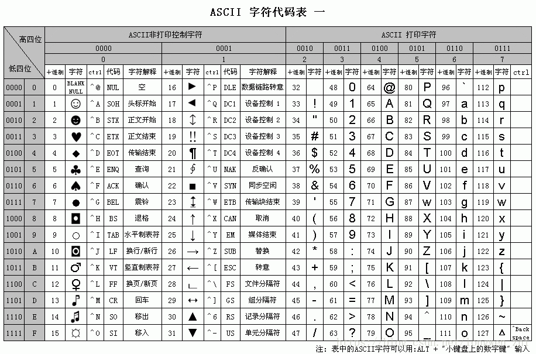
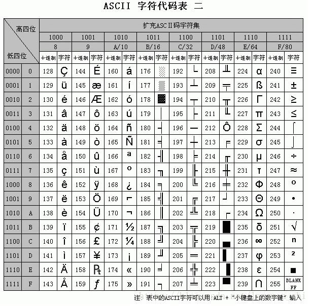

# ASCII、Unicode、GBK、UTF-8之间的关系


## 一、ASCII编码

 ASCII(American Standard Code for Information Interchange，美国标准信息交换代码)是基于拉丁字母的一套电脑编码系统，主要用于显示现代英语和其他西欧语言。它是现今最通用的单字节编码系统，并等同于国际标准ISO/IEC 646。

    ASCII 码使用指定的7 位或8 位二进制数组合来表示128 或256 种可能的字符。标准ASCII 码也叫基础ASCII码，使用7 位二进制数（剩下的1位二进制为0）来表示所有的大写和小写字母，数字0 到9、标点符号， 以及在美式英语中使用的特殊控制字符。

其中：

    0～31及127(共33个)是控制字符或通信专用字符（其余为可显示字符），如控制符：LF（换行）、CR（回车）、FF（换页）、DEL（删除）、BS（退格)、BEL（响铃）等；通信专用字符：SOH（文头）、EOT（文尾）、ACK（确认）等；ASCII值为8、9、10 和13 分别转换为退格、制表、换行和回车字符。它们并没有特定的图形显示，但会依不同的应用程序，而对文本显示有不同的影响。
    
    32～126(共95个)是字符(32是空格），其中48～57为0到9十个阿拉伯数字。
    
    65～90为26个大写英文字母，97～122号为26个小写英文字母，其余为一些标点符号、运算符号等。
    
    后128个称为扩展ASCII码。许多基于x86的系统都支持使用扩展（或“高”）ASCII。扩展ASCII 码允许将每个字符的第8 位用于确定附加的128 个特殊符号字符、外来语字母和图形符号

下面为ASCII码表：






## 二、GBK编码

 由于ASCII编码不支持中文，因此，当中国人用到计算机时，就需要寻求一种编码方式来支持中文。
于是，国人就定义了一套编码规则：当字符小于127位时，与ASCII的字符相同，但当两个大于127的字符连接在一起时，就代表一个汉字，第一个字节称为高字节（从0xA1-0xF7）,第二个字节为低字节（从0xA1-0xFE）,这样大约可以组合7000多个简体汉字。这个规则叫做GB2312。
    但是由于中国汉字很多，有些字无法表示，于是重新定义了规则：不在要求低字节一定是127之后的编码，只要第一个字节是大于127，就固定表示这是一个汉字的开始，不管后面跟的是不是扩展字符集里的内容。这种扩展之后的编码方案称之为GBK标，包括了GB2312的所有内容，同时新增了近20000个新的汉字（包括繁体字）和符号。
    但是，中国有56个民族，所以，我们再次对编码规则进行了扩展，又加了近几千个少数民族的字符，于是再次扩展后得编码叫做GB18030。中国的程序员觉得这一系列编码的标准是非常的好，于是统统称他们叫做"DBCS"（Double Byte Charecter Set 双字节字符集）。


## 三、Unicode字符集

 	因为世界国家很多，每个国家都定义一套自己的编码标准，结果相互之间谁也不懂谁的编码，就无法进行很好的沟通交流，所以及时的出现了一个组织ISO（国际标准化组织）决定定义一套编码方案来解决所有国家的编码问题，这个新的编码方案就叫做Unicode。注意Unicode不是一个新的编码规则，而是一套字符集（为每一个「字符」分配一个唯一的 ID（学名为码位 / 码点 / Code Point）），可以将Unicode理解为一本世界编码的字典。
    ISO规定：每个字符必须使用俩个字节，即用16位二进制来表示所有的字符，对于ASCII编码表里的字符，保持其编码不变，只是将长度扩展到了16位，其他国家的字符全部统一重新编码。由于传输ASCII表里的字符时，实际上可以只用一个字节就可以表示，所以，这种编码方案在传输数据比较浪费带宽，存储数据比较浪费硬盘。


## 四、UTF-8编码

​	由于Unicode比较浪费网络带宽和硬盘，因此为了解决这个问题，就在Unicode的基础上，定义了一套编码规则（将「码位」转换为字节序列的规则（编码/解码 可以理解为 加密/解密 的过程）），这个新的编码规则就是UTF-8，采用1-4个字符进行传输和存储数据。

编码规则：使用下面的模板进行转换

```java
Unicode符号范围（十六进制）      |     UTF-8编码方式(二进制)
------------------------------------------------------------------------
0000 0000-0000 007F            |     0xxxxxxx
0000 0080-0000 07FF            |     110xxxxx 10xxxxxx
0000 0800-0000 FFFF            |     1110xxxx 10xxxxxx 10xxxxxx
0001 0000-0010 FFFF            |     11110xxx 10xxxxxx 10xxxxxx 10xxxxxx
```


## **五、UTF-8和Unicode转换** 

​	utf-8区分每个字符的开始是根据字符的高位字节来区分的，比如用一个字节表示的字符，第一个字节高位以“0”开头；用两个字节表示的字符，第一个字节的高位为以“110”开头，后面一个字节以“10开头”；用三个字节表示的字符，第一个字节以“1110”开头，后面俩字节以“10”开头；用四个字节表示的字符，第一个字节以“11110”开头，后面的三个字节以“10”开头。

​	比如汉字“智”，utf-8编码是“\xe6\x99\xba”对应的二进制为：“111001101001100110111010”，由于utf-8中一个汉字是3个字节，所以对应的模板为“0000 0800-0000 FFFF |  1110xxxx 10xxxxxx 10xxxxxx”。

```java
11100110   10011001     10111010
1110xxxx   10xxxxxx     10xxxxxx
	0110     011001       111010
```

​	0110011001111010代表十六进制667A，因此根据规则转换得出“智”Unicode的位置为为“667A”。

同样，根据Unicode中字符的编码位置，也能找到对应的utf-8编码。


## 六、Unicode与GBK编码的转换

​	比如汉字“路”，在gbk中的编码为“\xc2\xb7”,对应的二进制为：“1100 0010 1011 0111”。同时“路”在Unicode字符集中的位置是“\u8def”(python中的Unicode类型)，因此可以通过“\u8def”在Unicode字符集中找到“路”对应的编码为“4237”，对应的二进制为：“0100 0010 0011 0111”，由于gbk的俩个字节的高字节是为了区分中文和ASCII，所以将“1100 0010 1011 0111”高字节的“1”去掉后，就对应Unicode字符集中的0100 0010 0011 0111”


## 七、UTF-8和Unicode与GBK的关系

utf-8--------decode(解码)----->Unicode类型<-------decode(解码)-----gbk

utf-8<--------encode(编码)-----Unicode类型-------encode(编码)----->gbk


转载自：CSDN-longwen_zhi

