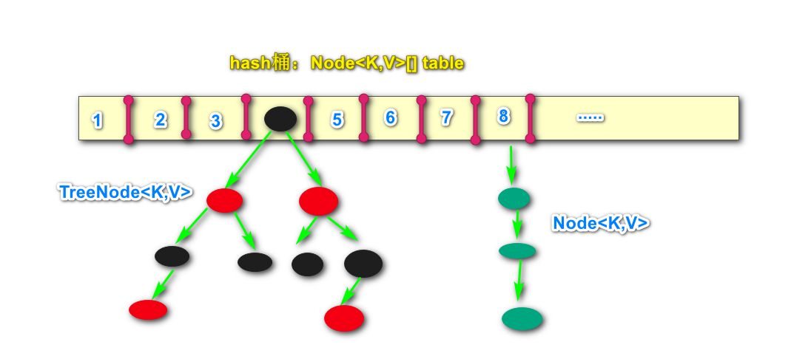
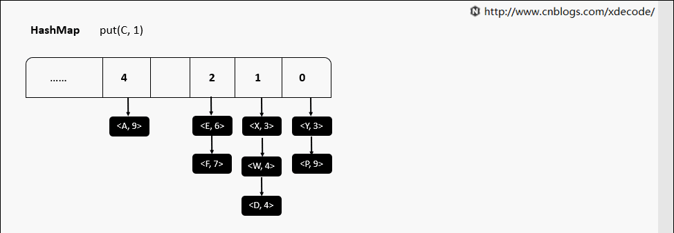
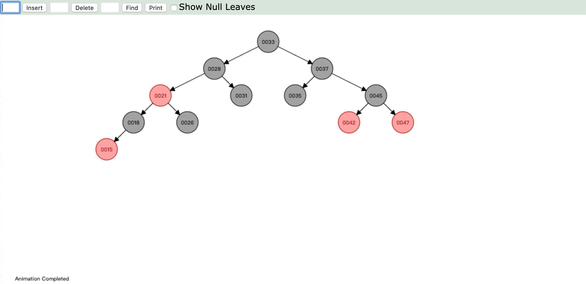
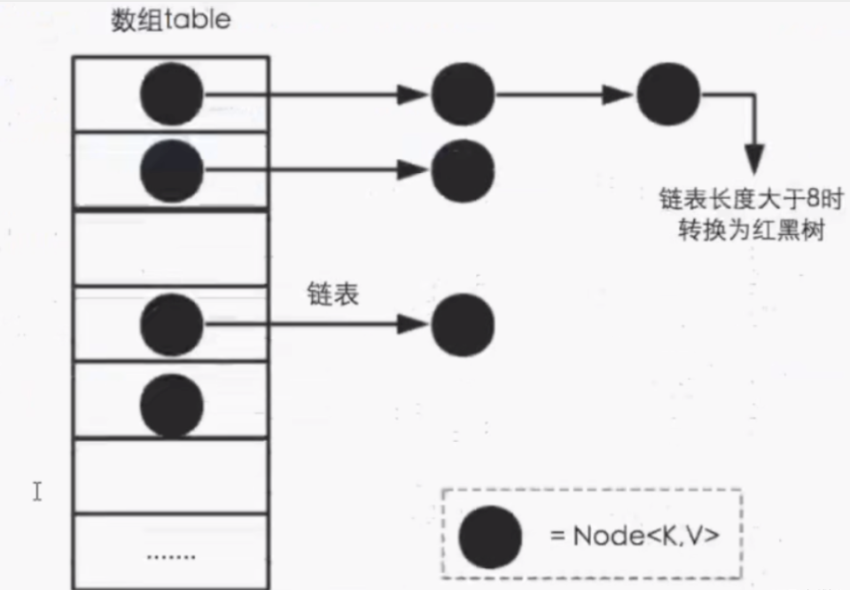
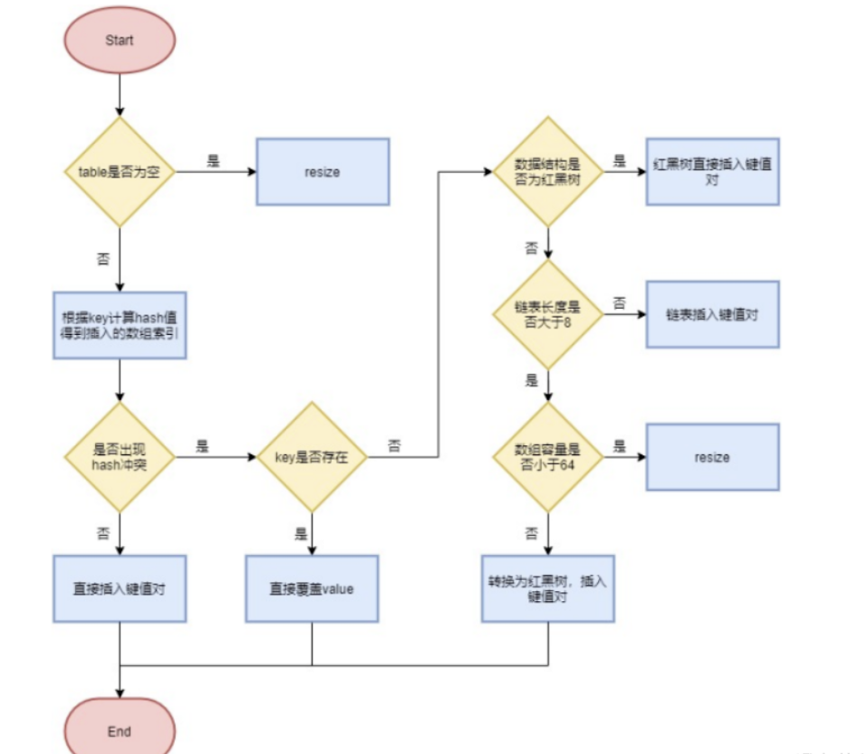
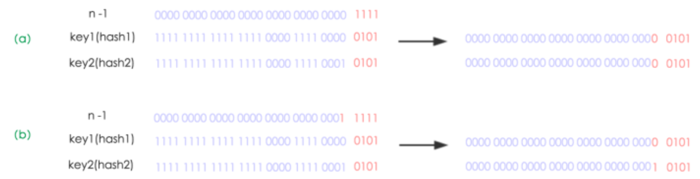
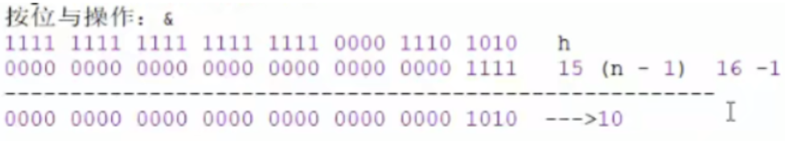
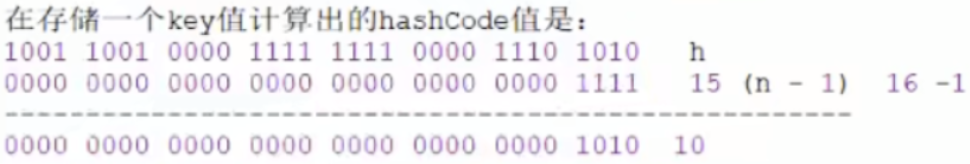

# Java面试-HashMap


HashMap作为项目开发中最常使用的容器之一，也自然而然成为面试的常问技术点之一，我们来梳理下关于HashMap面试中常问到的几个问题：


## 1.HashMap在jdk1.7和1.8中有什么区别？

- 在jdk1.7中，HashMap由**数组+链表**组成，数组是HashMap的主体，而链表主要是为了解决哈希冲突而存在的；

- 在jdk1.8中，HashMap由**数组+链表+红黑树**组成。当链表过长，则会严重影响HashMap的性能，红黑树的时间复杂度为O(logn)，而链表是O(n)。因此jdk1.8对数据结构进行了进一步的优化，引入了红黑树，链表和红黑树在达到一定条件时就会进行转换：

  拓展：时间复杂度O(1)<O(log2n)<O(n)<O(nlog2n)<O(n2)<O(n3)<O(2n)

  - 当链表超过8且数组长度（数据总量）超过64才会转为红黑树；
  - 将链表转换为红黑树前会判断如果当前数组长度小于64，那么会选择先进行数组扩容，而不是转为红黑树，以节约搜索时间。

  

HashMap存放过程：




HashMap中红黑树的结构：



## 2.HashMap有哪些关键属性？它们的值有什么含义？

以下源码可以看出：

```java
transient Entry[] table;//存储元素的实体数组
  
transient int size;//存放元素的个数
  
int threshold; //临界值   当实际大小超过临界值时，会进行扩容threshold = 加载因子*容量
 
final float loadFactor; //加载因子，表示Hsah表中元素的填满的程度
  
transient int modCount;//被修改的次数

```

加载因子越大,填满的元素越多,好处是,空间利用率高了,但:冲突的机会加大了.链表长度会越来越长,查找效率降低。

反之,加载因子越小,填满的元素越少,好处是:冲突的机会减小了,但:空间浪费多了.表中的数据将过于稀疏（很多空间还没用，就开始扩容了）

冲突的机会越大,则查找的成本越高.

因此,必须在 "冲突的机会"与"空间利用率"之间寻找一种平衡与折衷. 这种平衡与折衷本质上是数据结构中有名的"时-空"矛盾的平衡与折衷.

**默认初始化值：**采用无参构造实例化HashMap时，默认采用16作为初始化容量，**在第一次put时使用16来创建数组**。

```java
/**
 * The default initial capacity - MUST be a power of two.
 * 默认初始化容量，必须是2的次方
 */
static final int DEFAULT_INITIAL_CAPACITY = 1 << 4; // aka 16
```


**最大容量：**2的30次方。

```java
/**
 * The maximum capacity, used if a higher value is implicitly specified
 * by either of the constructors with arguments.
 * MUST be a power of two <= 1<<30.
 * 最大容量。即HashMap的数组容量必须小于等于 1 << 30
 */
static final int MAXIMUM_CAPACITY = 1 << 30;
```

在指定容量进行初始化时，会先判断这个初始化容量是否大于最大容量，超过则使用最大容量来进行初始化。

```java
public HashMap(int initialCapacity, float loadFactor) {
    if (initialCapacity < 0)
        throw new IllegalArgumentException("Illegal initial capacity: " +
                                           initialCapacity);
    if (initialCapacity > MAXIMUM_CAPACITY)
        //如果初始化容量大于最大容量，则仅初始化为最大容量。
        initialCapacity = MAXIMUM_CAPACITY;
    if (loadFactor <= 0 || Float.isNaN(loadFactor))
        throw new IllegalArgumentException("Illegal load factor: " +
                                           loadFactor);
    this.loadFactor = loadFactor;
    this.threshold = tableSizeFor(initialCapacity);
}
```


**默认负载因子：**默认值为0.75，但可通过构造参数来指定，一般不建议修改。

```java
/**
 * The load factor used when none specified in constructor.
 * 默认的负载因子
 */
static final float DEFAULT_LOAD_FACTOR = 0.75f;
```


**树形化阈值：**当链表的长度大于8的时候，会将链表转为红黑树，优化查询效率。

```java
/**
 * The bin count threshold for using a tree rather than list for a
 * bin.  Bins are converted to trees when adding an element to a
 * bin with at least this many nodes. The value must be greater
 * than 2 and should be at least 8 to mesh with assumptions in
 * tree removal about conversion back to plain bins upon
 * shrinkage.
 */
static final int TREEIFY_THRESHOLD = 8;
```


**解树形化阈值：**当红黑树的节点个数小于等于6时，会将红黑树的结构转为链表。

```java
/**
 * The bin count threshold for untreeifying a (split) bin during a
 * resize operation. Should be less than TREEIFY_THRESHOLD, and at
 * most 6 to mesh with shrinkage detection under removal.
 */
static final int UNTREEIFY_THRESHOLD = 6;
```


**树形化最小容量：**转为红黑树的两个条件：链表长度大于8；数组容量大于等于64。当这两个条件都满足时链表才能转换为红黑树。

```java
/**
 * The smallest table capacity for which bins may be treeified.
 * (Otherwise the table is resized if too many nodes in a bin.)
 * Should be at least 4 * TREEIFY_THRESHOLD to avoid conflicts
 * between resizing and treeification thresholds.
 */
static final int MIN_TREEIFY_CAPACITY = 64;
```


## 3.HashMap有哪些特点？

1. HashMap存取是无序的；
2. 键和值的位置都可以是null，但键的位置只能是一个null；
3. 底层的数据结构是由键来控制的，键是唯一的；
4. jdk1.8之前的数据结构是数组+链表，jdk1.8后引入了红黑树的数据结构；
5. 阈值大于8且数组长度大于64时才会转为红黑树，转为红黑树的目得是提高搜索。


## 4.什么是哈希冲突？

​	通过哈希函数产生的哈希值是有限的，而数据可能比较多，导致经过哈希函数处理后仍然有不同的数据对应相同的哈希值。这时候就产生了哈希冲突。


## 5.怎么解决哈希冲突？

​	解决哈希冲突的方法有：开放地址法、再哈希法、链地址法（HashMap常见）、建立公共溢出区。

- **开放地址法：**也称为再散列法。如果p=H(key)出现冲突时，则以p为基础，再次哈希，p1=H(p)，如果p1再次出现冲突，则以p1为基础再次哈希，依次类推，直到找到一个不冲突的哈希地址p(i)。因此开放地址法所需要的哈希表的长度等于所需存放的元素，而且因为存在再次哈希，所以只能在删除的节点上做标记，而不能真正删除节点；
- **再哈希法：**也称为双重散列、多重散列。提供多个不同的hash函数，r1=H1(key)发生冲突时，再计算r2=H2(key1)，直到没有冲突为止，这样做虽然不会产生堆积，但增加了计算的时间；
- **链地址法：**也称为拉链法。将哈希值相同的元素构成一个同义词的单链表，并将单链表的头指针存放在哈希表的第i个单元中，查找、插入和删除主要在同义词链表中进行，链表法适用于经常进行插入和删除的情况；
- **建立公共溢出区：**将哈希表分为公共表和溢出表，当溢出发生时，将所有溢出数据统一存放在溢出区。

开放地址法和再哈希法的区别是：开放地址法只能使用同一种hash函数进行再次哈希，再哈希法调用多个不同的hash函数进行再次hash。


## 6.为什么数组长度大于64时才会转为红黑树？

在数组比较小时如果出现红黑树结构，反而会降低效率，而红黑树需要进行左旋右旋，变色，这些操作来保持平衡，同时数组长度小于64时，搜索时间相对要快些，总之是为了加快搜索速度，提高性能。

JDK1.8以前HashMap的实现是数组+链表，即使哈希函数取得再好，也很难达到元素百分百均匀分布。当HashMap中有大量的元素都存放在同一个桶中时，这个桶下有一条长长的链表，此时HashMap就相当于单链表，假如单链表有n个元素，遍历的时间复杂度就从O（1）退化成O（n），完全失去了它的优势，为了解决此种情况，JDK1.8中引入了红黑树（查找的时间复杂度为O（logn））来优化这种问题。


## 7.为什么加载因子是0.75？初始化临界值是12？

HashMap中的threshold是HashMap所能容纳键值对的最大值。计算公式为length*LoadFactory。也就是说，在数组定义好长度之后，负载因子越大，所能容纳的键值对个数也越大

loadFactory越趋近于1，那么数组中存放的数据（entry也就越来越多），数据也就越密集，也就会有更多的链表长度处于更长的数值，我们的查询效率就会越低，当我们添加数据，产生hash冲突的概率也会更高

默认的loadFactory是0.75，loadFactory越小，越趋近于0，数组中个存放的数据(entry)也就越少，表现得更加稀疏




0.75是对空间和时间效率的一种平衡选择

如果负载因子小一些比如是0.4，那么初始长度16*0.4=6，数组占满6个空间就进行扩容，很多空间可能元素很少甚至没有元素，会造成大量的空间被浪费

如果负载因子大一些比如是0.9，这样会导致扩容之前查找元素的效率非常低

loadfactory设置为0.75是经过多重计算检验得到的可靠值，可以最大程度的减少rehash的次数，避免过多的性能消耗


## 8.哈希表底层采用何种算法计算hash值？还有哪些算法可以计算出hash值？

hashCode方法是Object中的方法，所有的类都可以对其进行使用，首先底层通过调用hashCode方法生成初始hash值h1，然后将h1无符号右移16位得到h2，之后将h1与h2进行按位异或（^）运算得到最终hash值h3，之后将h3与(length-1)进行按位与（&）运算得到hash表索引。

其他可以计算出hash值的算法有

- 平方取中法
- 取余数
- 伪随机数法


## 9.当两个对象的hashCode相等时会怎样？

hashCode相等产生hash碰撞，hashCode相等会调用equals方法比较内容是否相等，内容如果相等则会进行覆盖，内容如果不等则会连接到链表后方，链表长度超过8且数组长度超过64，会转变成红黑树节点。


## 10.何时发生哈希碰撞和什么是哈希碰撞，如何解决哈希碰撞？

只要两个元素的key计算的hash码值相同就会发生hash碰撞，jdk8之前使用链表解决哈希碰撞，jdk8之后使用链表+红黑树解决哈希碰撞。


## 11.HashMap的put方法流程

以jdk8为例，简要流程如下：

- 首先根据key的值计算hash值，找到该元素在数组中存储的下标
- 如果数组是空的，则调用resize进行初始化；
- 如果没有哈希冲突直接放在对应的数组下标里
- 如果冲突了，且key已经存在，就覆盖掉value
- 如果冲突后是链表结构，就判断该链表是否大于8，如果大于8并且数组容量小于64，就进行扩容；如果链表节点数量大于8并且数组的容量大于64，则将这个结构转换成红黑树；否则，链表插入键值对，若key存在，就覆盖掉value
- 如果冲突后，发现该节点是红黑树，就将这个节点挂在树上




## 12.HashMap的扩容原理

​	JDK7的时候先通过resize()方法对entry数组扩容，然后通过transfer()方法重新计算每个元素在新数组中的位置，对于JDK7的具体实现不再赘述。下面我们讲解下JDK1.8做了哪些优化。经过观测可以发现，我们使用的是2次幂的扩展(指长度扩为原来2倍)，所以，元素的位置要么是在原位置，要么是在原位置再移动2次幂的位置。看下图可以明白这句话的意思，n为table的长度，图（a）表示扩容前的key1和key2两种key确定索引位置的示例，图（b）表示扩容后key1和key2两种key确定索引位置的示例，其中hash1是key1对应的哈希与高位运算结果。



​	以n-1的二进制表示1111，所以对于key1(0 0101)和key2(1 0101)来说，key & (n-1)计算出的结果是一样的，即(0101)，当扩容后，n等于32，n-1的二进制表示(1 1111)，此时key1(0 0101)和key2(1 0101)通过key & (n-1)计算出的结果就会不一样了，但会发现只是key2的计算结果比之前多了(1 0000)，即为16，正好是扩容前数组的长度，由此发现数组扩容后，之前数组的元素在新数组中的索引，要么是原位置，要么时原索引加上扩容前的数组长度，JDK8的resize()方法即利用了这一点，不用一个一个元素的计算其在新数组中的位置，而只用将老的数组中的元素分组，一组是原索引，一组是原索引加上老的数组长度，从而提升了效率。


**源码解析：**

```java

final Node<K,V>[] resize() {
        //oldTab：引用扩容前的哈希表
        Node<K,V>[] oldTab = table;
        //oldCap：表示扩容前的table数组的长度
        int oldCap = (oldTab == null) ? 0 : oldTab.length;
        //获得旧哈希表的扩容阈值
        int oldThr = threshold;
        //newCap:扩容之后table数组大小
        //newThr:扩容之后下次触发扩容的条件
        int newCap, newThr = 0;
        //条件成立说明hashMap中的散列表已经初始化过了，是一次正常扩容
        if (oldCap > 0) {
            //判断旧的容量是否大于等于最大容量，如果是，则无法扩容，并且设置扩容条件为int最大值，
            //这种情况属于非常少数的情况
            if (oldCap >= MAXIMUM_CAPACITY) {
                threshold = Integer.MAX_VALUE;
                return oldTab;
            }//设置newCap新容量为oldCap旧容量的二倍（<<1）,并且<最大容量，而且>=16，则新阈值等于旧阈值的两倍
            else if ((newCap = oldCap << 1) < MAXIMUM_CAPACITY &&
                     oldCap >= DEFAULT_INITIAL_CAPACITY)
                newThr = oldThr << 1; // double threshold
        }
        //如果oldCap=0并且边界值大于0，说明散列表是null，但此时oldThr>0
        //说明此时hashMap的创建是通过指定的构造方法创建的,新容量直接等于阈值
        //1.new HashMap(intitCap,loadFactor)
        //2.new HashMap(initCap)
        //3.new HashMap(map)
        else if (oldThr > 0) // initial capacity was placed in threshold
            newCap = oldThr;
        //这种情况下oldThr=0;oldCap=0，说明没经过初始化，创建hashMap
        //的时候是通过new HashMap()的方式创建的
        else {               // zero initial threshold signifies using defaults
            newCap = DEFAULT_INITIAL_CAPACITY;
            newThr = (int)(DEFAULT_LOAD_FACTOR * DEFAULT_INITIAL_CAPACITY);
        }
        //newThr为0时，通过newCap和loadFactor计算出一个newThr
        if (newThr == 0) {
            //容量*0.75
            float ft = (float)newCap * loadFactor;
            newThr = (newCap < MAXIMUM_CAPACITY && ft < (float)MAXIMUM_CAPACITY ?
                      (int)ft : Integer.MAX_VALUE);
        }
        threshold = newThr;
        @SuppressWarnings({"rawtypes","unchecked"})
                //根据上面计算出的结果创建一个更长更大的数组
            Node<K,V>[] newTab = (Node<K,V>[])new Node[newCap];
        //将table指向新创建的数组
        table = newTab;
        //本次扩容之前table不为null
        if (oldTab != null) {
            //对数组中的元素进行遍历
            for (int j = 0; j < oldCap; ++j) {
                //设置e为当前node节点
                Node<K,V> e;
                //当前桶位数据不为空，但不能知道里面是单个元素，还是链表或红黑树，
                //e = oldTab[j]，先用e记录下当前元素
                if ((e = oldTab[j]) != null) {
                    //将老数组j桶位置为空，方便回收
                    oldTab[j] = null;
                    //如果e节点不存在下一个节点，说明e是单个元素，则直接放置在新数组的桶位
                    if (e.next == null)
                        newTab[e.hash & (newCap - 1)] = e;
                    //如果e是树节点，证明该节点处于红黑树中
                    else if (e instanceof TreeNode)
                        ((TreeNode<K,V>)e).split(this, newTab, j, oldCap);
                    //e为链表节点，则对链表进行遍历
                    else { // preserve order
                        //低位链表：存放在扩容之后的数组的下标位置，与当前数组下标位置一致
                        //loHead：低位链表头节点
                        //loTail低位链表尾节点
                        Node<K,V> loHead = null, loTail = null;
                        //高位链表，存放扩容之后的数组的下标位置，=原索引+扩容之前数组容量
                        //hiHead:高位链表头节点
                        //hiTail:高位链表尾节点
                        Node<K,V> hiHead = null, hiTail = null;
                        Node<K,V> next;
                        do {
                            next = e.next;
                            //oldCap为16:10000，与e.hsah做&运算可以得到高位为1还是0
                            //高位为0，放在低位链表
                            if ((e.hash & oldCap) == 0) {
                                if (loTail == null)
                                    //loHead指向e
                                    loHead = e;
                                else
                                    loTail.next = e;
                                loTail = e;
                            }
                            //高位为1，放在高位链表
                            else {
                                if (hiTail == null)
                                    hiHead = e;
                                else
                                    hiTail.next = e;
                                hiTail = e;
                            }
                        } while ((e = next) != null);
                        //低位链表已成，将头节点loHead指向在原位
                        if (loTail != null) {
                            loTail.next = null;
                            newTab[j] = loHead;
                        }
                        //高位链表已成，将头节点指向新索引
                        if (hiTail != null) {
                            hiTail.next = null;
                            newTab[j + oldCap] = hiHead;
                        }
                    }
                }
            }
        }
        return newTab;
    }
```

**resize时的链表拆分:**

```java
//这里定义了四个Node的引用，从变量命名上，我们初步猜测，这里定义了两个链表，我们把它称为
//lo链表和hi链表，loHead和loTail分别指向lo链表的头节点和尾节点，hiHead和hiTail以此类推
Node<K,V> loHead = null, loTail = null;
Node<K,V> hiHead = null, hiTail = null;
Node<K,V> next;
//整个do...while循环就是循环数组元素上的链表
do {
    //先获取链表当前节点的下一个节点
    next = e.next;
    //这里就是判断元素在新数组中的索引是原索引还是原索引+1
    //例如上面的key1的hash值(0 0101)，key2的hash值(1 0101)
    //老数组长度n为16时，key&(n-1)的值key1和key2一样
    //但如果直接key&n，则一个为0，一个为16，这里就是以这个作为判断条件
    if ((e.hash & oldCap) == 0) {
        //这里和下面一个道理，第一次进来链表头节点指向e1，同时尾节点同样指向e1
        //第二次进来，尾节点的next指向e2同时再把尾节点指向e2，此时头节点loHead
        //还是指向e1，而尾节点loTail指向了e2，第三次同理，最后就是loHead永远指向e1，
        //而loTail指向en，n为链表长度
        if (loTail == null)
            loHead = e;
        else
            loTail.next = e;
        loTail = e;
    }
    else {
        if (hiTail == null)
            hiHead = e;
        else
            hiTail.next = e;
        hiTail = e;
    }
} while ((e = next) != null);
//下面两个直接把不为空的链表放置于各自位置
if (loTail != null) {
    loTail.next = null;
    newTab[j] = loHead;
}
if (hiTail != null) {
    hiTail.next = null;
    newTab[j + oldCap] = hiHead;
}
```


## 13.HashMap的remove()原理

```java
 public V remove(Object key) {
        Node<K,V> e;
        return (e = removeNode(hash(key), key, null, false, true)) == null ?
            null : e.value;
    }
```

将 remove 删除工作交给内部函数 removeNode() 来实现:

```java
final Node<K,V> removeNode(int hash, Object key, Object value,
                               boolean matchValue, boolean movable) {
        Node<K,V>[] tab; Node<K,V> p; int n, index;
        if ((tab = table) != null && (n = tab.length) > 0 &&
            (p = tab[index = (n - 1) & hash]) != null) {  // 获取索引，
            Node<K,V> node = null, e; K k; V v;
            if (p.hash == hash &&
                ((k = p.key) == key || (key != null && key.equals(k)))) // 判断索引处的值是不是想要的结果
                node = p;
            else if ((e = p.next) != null) { // 交给树的查找算法
                if (p instanceof TreeNode)
                    node = ((TreeNode<K,V>)p).getTreeNode(hash, key);
                else {
                    do { // 遍历查找
                        if (e.hash == hash &&
                            ((k = e.key) == key ||
                             (key != null && key.equals(k)))) {
                            node = e;
                            break;
                        }
                        p = e;
                    } while ((e = e.next) != null);
                }
            }
            if (node != null && (!matchValue || (v = node.value) == value ||
                                 (value != null && value.equals(v)))) {
                if (node instanceof TreeNode)  //树的删除
                    ((TreeNode<K,V>)node).removeTreeNode(this, tab, movable);
                else if (node == p) // 修复链表，链表的删除操作
                    tab[index] = node.next;
                else
                    p.next = node.next;
                ++modCount;
                --size;
                afterNodeRemoval(node);
                return node;
            }
        }
        return null;
    }
```


## 14.HashMap为什么线程不安全？

- 多线程下扩容死循环。JDK1.7中的HashMap使用头插法插入元素，在多线程的环境下，扩容的时候有可能导致环形链表的出现，形成死循环。因此JDK1.8使用尾插法插入元素，在扩容时会保持链表元素原本的顺序，不会出现环形链表的问题；
- 多线程的put可能导致元素的丢失。多线程同时执行put操作，如果计算出来的索引位置是相同的，那会造成前一个key被后一个key覆盖，从而导致元素的丢失。此问题在JDK1.7和JDK1.8中都存在；
- put和get并发时，可能导致get为null。线程1执行put时，因为元素个数超出threshold而导致rehash，线程2此时执行get，有可能导致这个问题，此问题在JDK1.7和JDK1.8中都存在。


## 15.计算hash值时为什么要让低16bit和高16bit进行异或处理？

- 我们计算索引需要将hashCode值与length-1进行按位与运算，如果数组长度很小，比如16，这样的值和hashCode做异或实际上只有hashCode值的后4位在进行运算，hash值是一个随机值，而如果产生的hashCode值高位变化很大，而低位变化很小，那么有很大概率造成哈希冲突，所以我们为了使元素更好的散列，将hash值的高位也利用起来。

举个例子：

如果我们不对hashCode进行按位异或，直接将hash和length-1进行按位与运算就有可能出现以下的情况：



如果下一次生成的hashCode值高位起伏很大，而低位几乎没有变化时，高位无法参与运算



可以看到，两次计算出的hash相等，产生了hash冲突。所以无符号右移16位的目的是使高混乱度地区与地混乱度地区做一个中和，提高低位的随机性，减少哈希冲突。


参考：https://www.xiaohongshu.com/discovery/item/61487e1700000000010038e7

​			https://www.bilibili.com/video/av208169082?vd_source=decee64fc347c1311c077fecf31444c8

​			https://www.csdn.net/tags/Mtjacg2sOTM3NjItYmxvZwO0O0OO0O0O.html

​			公众号：Java学习者社区

​			

